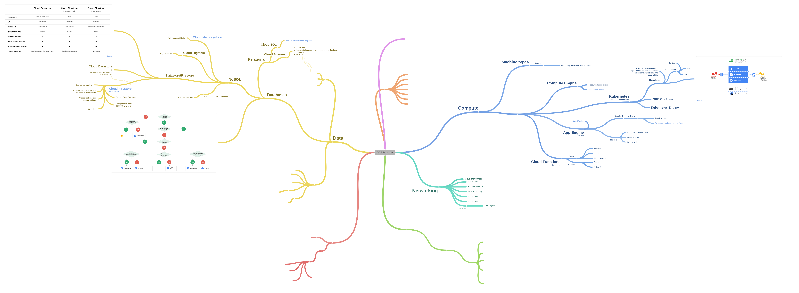

# Google Cloud Platform Cheatsheets

* [General overview of GCP](#general-overview-of-gcp)
* [Tools](#tools)
   * [<code>gcloud</code> &amp; <code>gsutil</code>](#gcloud--gsutil)
   * [<code>kubectl</code>](#kubectl)
* [Storage](#storage)
* [Colaboratory](#colaboratory)
   * [Colab's history and inheritance](#colabs-history-and-inheritance)
* [GCP Products](#gcp-products)
   * [Dataproc](#dataproc)

## General overview of GCP

An interactive [map](https://coggle.it/diagram/W1hzfKfTAj0VEwcM/t/gcp-products) of GCP products

The Google Cloud Developer Cheat [GSheet](https://drive.google.com/open?id=1OkFbizpnc_iyzcApqRrqsNtUVazKJDtCyH5vw3352xM) ([Post on Medium](https://medium.com/google-cloud/the-google-cloud-developer-cheat-sheet-429775bd6d11))

GCP products described in 4 words or less ([Post on Medium](https://medium.com/google-cloud/gcp-products-described-in-4-words-or-less-f3056550e595))

## Tools

### <code>gcloud</code> &amp; <code>gsutil</code>

* [dennyzhang/cheatsheet-gcp-A4](https://github.com/dennyzhang/cheatsheet-gcp-A4)
* quickstart by Google: https://cloud.google.com/storage/docs/quickstart-gsutil

### <code>kubectl</code>

* [dennyzhang/cheatsheet-kubernetes-A4](https://github.com/dennyzhang/cheatsheet-kubernetes-A4)
* [Official cheatsheet](https://kubernetes.io/docs/reference/kubectl/cheatsheet/)

## Storage

Choosing a storage option: https://cloud.google.com/storage-options/ (same decisions trees as below and a video with details)

|                  | Cloud Storage                  | Cloud Datastore               | Bigtable                           | Cloud SQL (1stGen)                 | BigQuery                           |
|------------------|--------------------------------|-------------------------------|------------------------------------|------------------------------------|------------------------------------|
| Storage type     | BLOB store                     | NoSQL, document               | wide column NoSQL                  | Relational SQL                     | Relational SQL                     |
| DB type          | Operational DB within an app   | Operational DB within an app  | Analytical DB in app or standalone | Operational DB within an app       | Analytical DB in app or standalone |
| Overall capacity | Petabytes+  (~1015) | Terabytes+ (~1012) | Petabytes+  (~1015)     | Up to 500 GB   (~0.512) |                                    |
| Unit size        | 5 TB object                    | 1 MB entity                   | 10 MB cell                         | standard                           |                                    |
| Transactions     | No                             | Yes                           | No                                 | Yes                                |                                    |
| Complex queries  | No                             | No                            | No                                 | Yes                                |                                    |
| Billing          |                                |                               |                                    |                                    | NoOps, pay by operations, cheap storage |
| Strength         | *unstructured* data stores as *bytes* with a name within a place (.zip, .jpeg, .csv ) | NoSQL, no Schema & pay by the operation DB | DB storing +TBytes data, with millisec latency, high volume of writes, but expensive cluster, for apps that needs to scale | hosted MySQL service + Ops tasks.  | SQL query engine processing TBytes in seconds. Great for realtime analysis of large datasets |

References:

* https://stackoverflow.com/questions/tagged/google-cloud-storage
* https://wilsonmar.github.io/gcp/ 

## Compute

* fully managed > **App Engine** (language specific: Ruby, PHP, .NET, Go, Java, Python, Node.js or any custom container with another language)
* Cluster management > **Kubernetes Engine**
* Moe control on HW > **Compute Engine**

## Colaboratory

### 

### Colab's history and inheritance

## GCP Products

### Dataproc

