# Preparing for the Professional Cloud Architect Examination

~ 1 day / Expert

https://www.coursera.org/learn/preparing-cloud-professional-cloud-architect-exam/

## Content

## Audience

Cloud professionals who intend to take the Professional Cloud Architect certification exam Must have attended Architecting with GCP: Infrastructure course or equivalent on demand courses. Knowledge and experience with GCP, equivalent to GCP Architecting Infrastructure Knowledge of cloud solutions, equivalent to GCP Design and Process Industry experience with cloud computing

## Course Outline

The course includes presentations, demonstrations, and hands-on labs.

    * Module 1: Understanding the Professional Cloud Architect Certification
        * Position the Professional Cloud Architect certification among the offerings
        * Distinguish between Associate and Professional
        * Provide guidance between Professional Cloud Architect and Associate Cloud Engineer
        * Describe how the exam is administered and the exam rules
        * Provide general advice about taking the exam

    * Module 2: Sample Case Studies
        * MountKirk Games
        * Dress4Win
        * TerramEarth

    * Module 3: Designing and Implementing
        * Review the layered model from Design and Process
        * Provide exam tips focused on business and technical design
        * Designing a solution infrastructure that meets business requirements
        * Designing a solution infrastructure that meets technical requirements
        * Design network, storage, and compute resources
        * Creating a migration plan
        * Envisioning future solution improvements
        * Resources for learning more about designing and planning
        * Configuring network topologies
        * Configuring individual storage systems
        * Configuring compute systems
        * Resources for learning more about managing and provisioning
        * Designing for security
        * Designing for legal compliance
        * Resources for learning more about security and compliance

    * Module 4: Optimizing and Operating
        * Analyzing and defining technical processes
        * Analyzing and defining business processes
        * Resources for learning more about analyzing and optimizing processes
        * Designing for security
        * Designing for legal compliance
        * Resources for learning more about security and compliance
        * Advising development/operation teams to ensure successful deployment of the solution
        * Resources for learning more about managing implementation
        * Easy buttons
        * Playbooks
        * Developing a resilient culture
        * Resources for learning more about ensuring reliability

    * Module 5: Next Steps
        * Present Qwiklabs Challenge Quest for the Professional CA
        * Identify Instructor Led Training courses and what they cover that will be helpful based on skills that might be on the exam
        * Connect candidates to individual Qwiklabs, and to Coursera individual courses and specializations.
        * Review/feedback of course

## Introduction

[video](https://www.coursera.org/learn/preparing-cloud-professional-cloud-architect-exam/lecture/qMLHZ/introduction)

Details of the exam/certification is available [in English](https://cloud.google.com/certification/guides/professional-cloud-architect) or [in French](https://cloud.google.com/certification/guides/professional-cloud-architect/?hl=fr): 

## Examinaton guide

Use the Exam Guide outline to help identify what to study.

> **Guide de l'examen de certification**
> 
> **Section 1 : Concevoir et planifier l'architecture d'une solution cloud**
> 
> 1.1 Concevoir l'infrastructure d'une solution qui répond aux exigences commerciales. Points à prendre en compte :
> 
> * Cas d'utilisation commerciale et stratégie produits
> * Optimisation des coûts
> * Compatibilité avec la conception de l'application
> * Intégration
> * Mouvement des données
> * Compromis
> * Création, achat ou modification
> * Mesures de la réussite (par exemple : indicateurs clés de performance (KPI), retour sur investissement (ROI), métriques)
> * Conformité et observabilité
> 
> 1.2 Concevoir l'infrastructure d'une solution qui répond aux exigences techniques. Points à prendre en compte :
> 
> * Conception à haute disponibilité et basculement
> * Élasticité des ressources cloud
> * Évolutivité pour répondre aux exigences de croissance
> 
> 1.3 Concevoir des ressources réseau, de stockage et de calcul. Points à prendre en compte :
> 
> * Intégration à des environnements sur site/multicloud
> * Mise en réseau cloud native (VPC, appairage, pare-feu, mise en réseau de conteneurs)
> * Identification du pipeline de traitement des données
> * Adaptation des caractéristiques de données aux systèmes de stockage
> * Schémas des flux de données
> * Structure du système de stockage (par exemple : objet, fichier, RDBMS, NoSQL, NewSQL)
> * Mise en correspondance des besoins en calcul et des produits de plate-forme
> 
> 1.4 Créer une planification de la migration (c'est-à-dire des documents et des schémas architecturaux). Points à prendre en compte :
> 
> * Intégration de la solution aux systèmes existants
> * Migration des systèmes et des données permettant d'assurer la compatibilité avec la solution
> * Mappage de licences
> * Planification des réseaux et de la gestion
> * Tests et démonstration de faisabilité
> 
> 1.5 Envisager des améliorations futures pour la solution. Points à prendre en compte :
> 
> * Améliorations au niveau du cloud et technologiques
> * Évolution des besoins de l'entreprise
> * Promotion
> 
> **Section 2 : Gérer et provisionner l'infrastructure d'une solution**
> 
> 2.1 Configurer des topologies de réseaux. Points à prendre en compte :
> 
> * Extension à un environnement sur site (mise en réseau hybride)
> * Extension à un environnement multicloud, qui peut inclure la communication de GCP à GCP
> * Sécurité
> * Protection des données
> 
> 2.2 Configurer des systèmes de stockage individuels. Points à prendre en compte :
> 
> * Attribution du stockage des données
> * Traitement des données/provisionnement du calcul
> * Gestion de la sécurité et des accès
> * Configuration réseau pour le transfert des données et la latence
> * Conservation des données et gestion du cycle de vie des données
> * Gestion de la croissance des données
> 
> 2.3 Configurer des systèmes de calcul. Points à prendre en compte :
> 
> * Provisionnement du système de calcul
> * Configuration des fluctuations de calcul (préemptif et standard)
> * Configuration réseau pour les nœuds de calcul
> * Configuration de la technologie de provisionnement de l'infrastructure (par exemple : Chef/Puppet/Ansible/Terraform)
> * Orchestration des conteneurs (par exemple : Kubernetes)
> 
> **Section 3 : Concevoir des solutions sécurisées et conformes**
> 
> 3.1 Concevoir des solutions sécurisées. Points à prendre en compte :
> 
> * Gestion de l'authentification et des accès (IAM)
> * Hiérarchie des ressources (organisations, dossiers, projets)
> * Sécurité des données (gestion des clés, chiffrement)
> * Tests d'intrusion
> * Séparation des tâches
> * Contrôles de sécurité
> * Gestion des clés de chiffrement fournies par le client avec Cloud KMS
> 
> 3.2 Concevoir des solutions conformes aux exigences légales. Points à prendre en compte :
> 
> * Législation (par exemple, Health Insurance Portability and Accountability Act (HIPAA), Children's Online Privacy Protection Act (COPPA), etc.)
> * Audits (y compris les journaux)
> * Certification (par exemple : framework ITIL)
> 
> **Section 4 : Analyser et optimiser les processus techniques et métier**
> 
> 4.1 Analyser et définir les processus techniques. Points à prendre en compte :
> 
> * Plan de cycle de développement logiciel (SDLC)
> * Intégration continue/développement continu
> * Culture de résolution des problèmes/d'analyse post-mortem
> * Tests et validation
> * Processus d'entreprise informatique (par exemple, ITIL)
> * Continuité des activités et reprise après sinistre
> 
> 4.2 Analyser et définir les processus métier. Points à prendre en compte :
> 
> * Gestion des parties prenantes (par exemple, influence et facilitation)
> * Gestion du changement
> * Évaluation des équipes/Vérification des compétences
> * Processus décisionnel
> * Gestion de la réussite des clients
> * Optimisation des coûts/ressources (Capex/Opex)
> 
> 4.3 Développer des procédures pour tester la résilience d'une solution en production (par exemple, DiRT et Simian Army)
> 
> **Section 5 : Gérer la mise en œuvre**
> 
> 5.1 Conseiller les équipes de développement et d'opérations pour s'assurer que la solution est déployée correctement. Points à prendre en compte :
> 
> * Développement d'applications
> * Bonnes pratiques relatives aux API
> * Cadres de test (chargement/unité/intégration)
> * Outils de migration des systèmes et des données
> 
> 5.2 Interagir avec Google Cloud à l'aide du SDK GCP (gcloud, gsutil et bq). Points à prendre en compte :
> 
> * Installation locale
> * Google Cloud Shell
> 
> **Section 6 : Garantir la fiabilité de la solution et des opérations**
> 
> 6.1 Surveiller la solution, journaliser les événements et gérer les alertes
> 
> 6.2 Gérer le déploiement et les releases
> 
> 6.3 Prendre en charge la résolution des problèmes opérationnels
> 
> 6.4 Évaluer les mesures de contrôle qualité
> 
> **Exemples d'études de cas**
> 
> Certaines questions de l'examen de certification Cloud Architect peuvent porter sur une étude de cas qui décrit une entreprise fictive et un concept de solution. Ces études de cas sont destinées à vous fournir davantage de contexte pour vous aider à choisir la ou les bonnes réponses. Passez en revue quelques exemples d'études de cas qui pourraient vous être proposées.
> 
> * Mountkirk Games
> * Dress4Win
> * TerramEarth

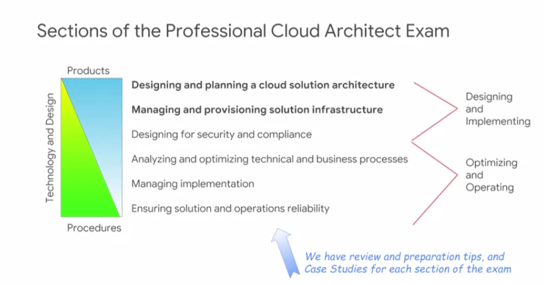

* **Design and implement** (make something function... more about **products**)
* **optimize and operate** (make something secure and cost effective)
* **manage implementation and operate reliability** (make something continue reliably and adapt over time... more about **procedures**)

Have you heard of the the four P's? That's **product**, **people**, **policy**, and **process**.

## Meaning of  the Professional Cloud Architect Certification

([video](https://www.coursera.org/learn/preparing-cloud-professional-cloud-architect-exam/lecture/NbDJr/understanding-the-professional-cloud-architect-certification))

### Different roles & certifications

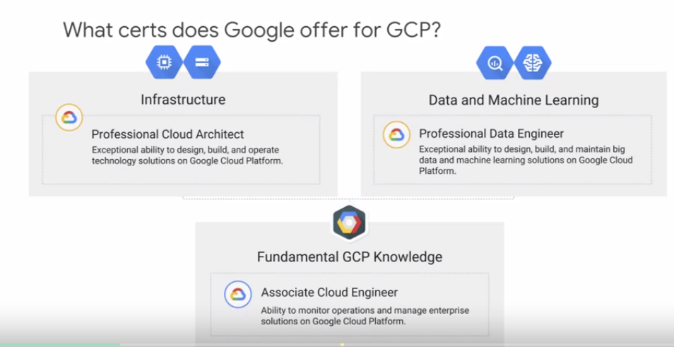

 I just want to caution you that the associate cloud engineer is not a simpler and easier cloud architect exam. All of these certifications are based on real-world practical job skills required and used by practitioners in the industry.
 
 A cloud engineer uses the same technology as the cloud architect. However, their job focuses different and so the skills are different. For example:
 
 * a **cloud architect** might consider how to design a Kubernetes cluster to meet customer requirements.
 * A **cloud engineer** might run jobs on the cluster and be more focused on monitoring the cluster and measuring and maintaining its performance.
 * A **cloud architect** designs the solution and implements it.
 * A **cloud engineer** operates a solution, monitors it maintains it, and evolves it as business circumstances change.
 
 So, which certification or certifications you might want depends on your job role, the job you have or the job you want to have. 

### Difference between "associate" vs "professional" level of certifications

= difference on "designing" and "business requirements"

**Professional**:

* designing
* planning
* PoC
* Identifying the business needs

**Associate**:

* implementing
* operating & technical requirements

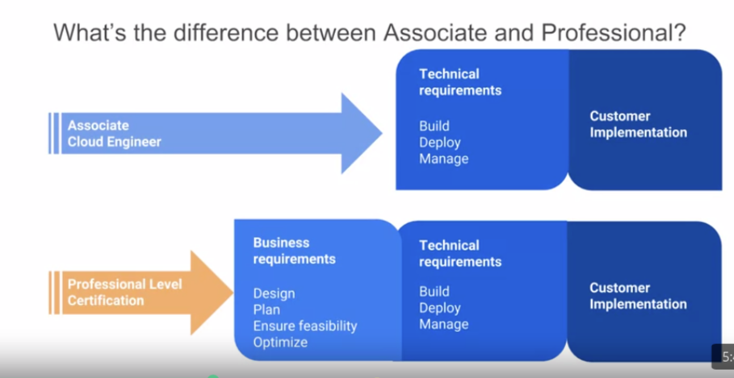

### Tips for methods of study

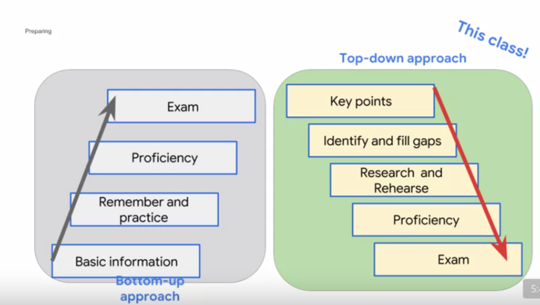

### Tips for the day of the exam

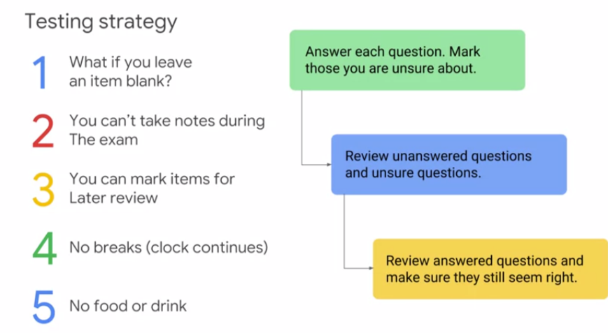

### Product and technology knowledge

ou need to know the basic information about each product that might be covered on the exam.

#### You need to know...

* What it does, why it exists.
* What is special about its design, for what purpose or purposes was it optimized?
* When do you use it, and what are the limits or bounds when it is time to consider an alternative?
* What are the key features of this product or technology?
* Is there an Open Source alternative? If so, what are the key benefits of the cloud-based service over the Open Source software?

#### Which products and technologies

Training and Certification meet at the JTA -- the Job Task Analysis -- the skills required of the job.

The scope of the exam matches the learning track and specialization in training. So a great place to derive a list of the technologies and products that might be on the exam is to look at all the products and technologies that are covered in the related training. The training might not cover everything. But it is a good place to start.

#### Study methods

Training is great. Digging into the online documentation can be very instructive and covers more detail than can be covered in a class, so documentation tends to have more equal coverage of features, whereas training has to prioritize its time. Getting hands on experience can help you understand a product or technology much better than reading and is the kind of experience a professional in the job would have. So labs can be a great way to prepare.

### Build your own case study summaries

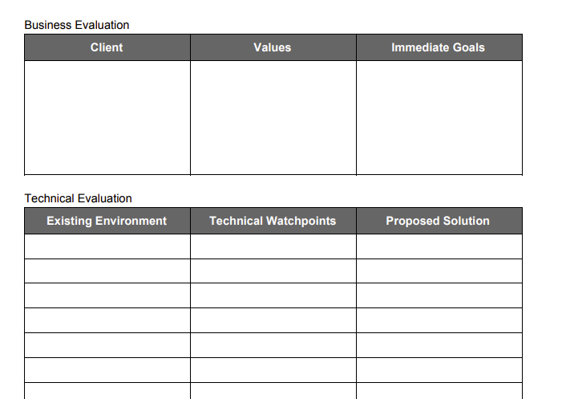

####  Mountkirk Games Case Study: a game app

[Mountkirk Games Case Study](https://cloud.google.com/certification/guides/cloud-architect/casestudy-mountkirkgames-rev2) [[video](https://www.coursera.org/learn/preparing-cloud-professional-cloud-architect-exam/lecture/UKteT/mountkirk-games-case-study-analysis)]

##### Key business points

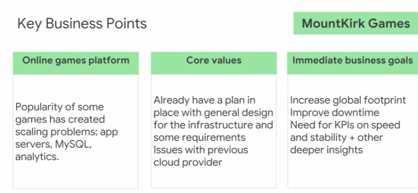

##### Technical evaluation

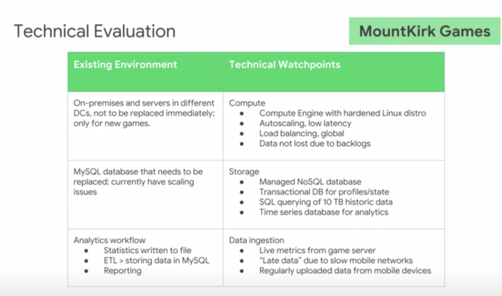

##### Sample solution

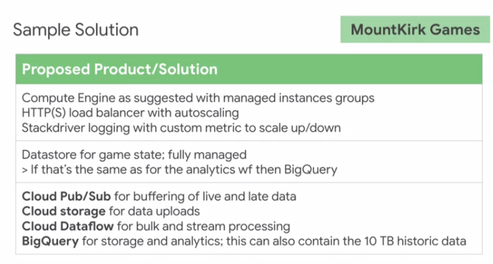

#### Dress4Win Case Study: social network app around garderobe

[Dress4Win Case Study](https://cloud.google.com/certification/guides/cloud-architect/casestudy-dress4win-rev2) [[video](https://www.coursera.org/learn/preparing-cloud-professional-cloud-architect-exam/lecture/JfG2y/dress4win-case-study-analysis)]

##### Key business points

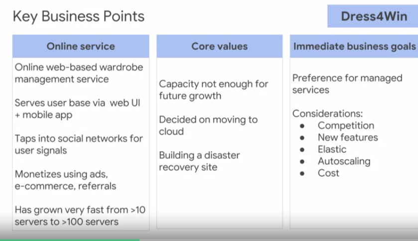

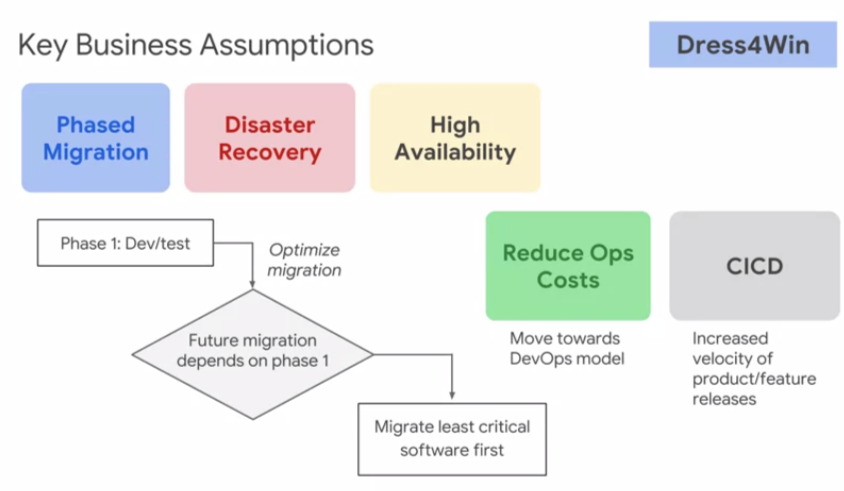

##### Technical evaluation

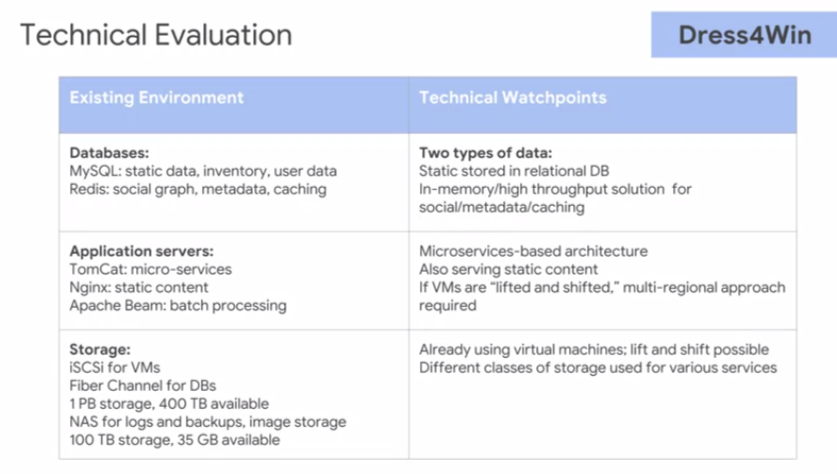

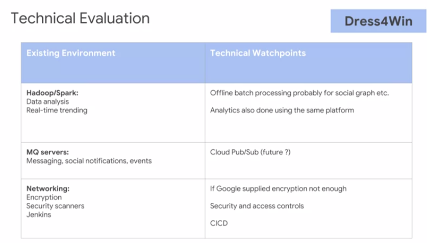

##### Sample solution

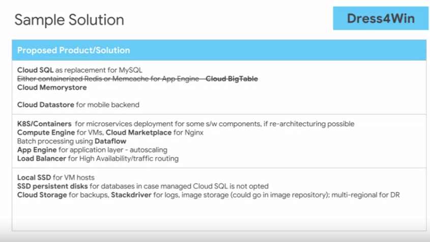

#### TerramEarth Case Study: IoT  sensors for agriculture & mining 

[TerramEarth Case Study](https://cloud.google.com/certification/guides/cloud-architect/casestudy-terramearth-rev2) [[video](https://www.coursera.org/learn/preparing-cloud-professional-cloud-architect-exam/lecture/3z8sv/terramearth-case-study-analysis)]

##### Key business points

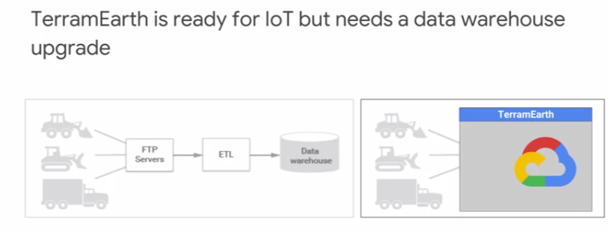

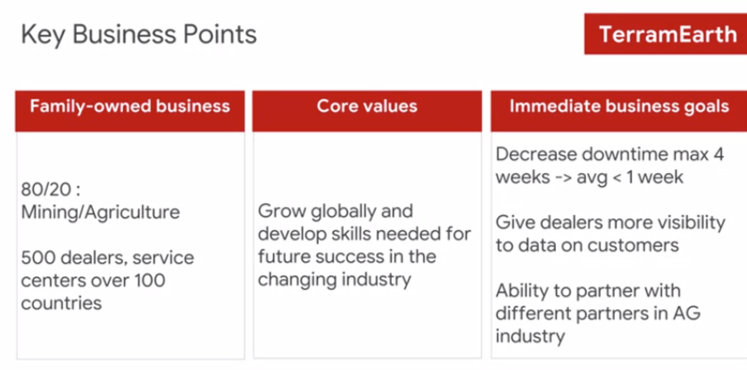

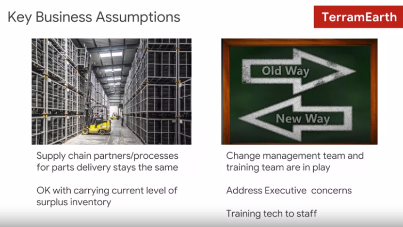

##### Technical evaluation

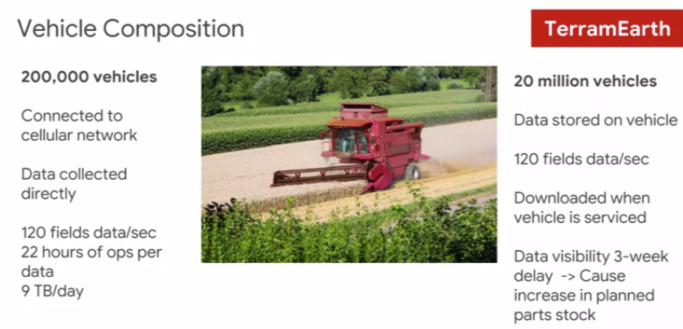

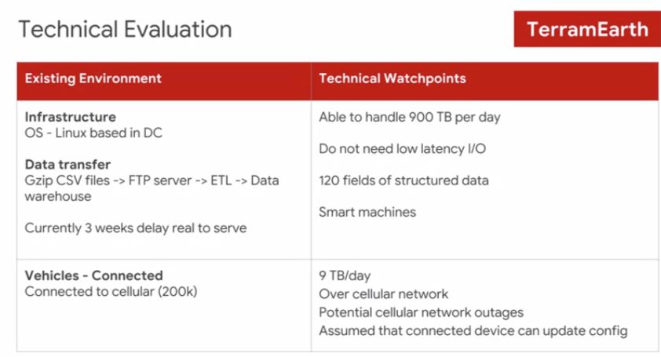

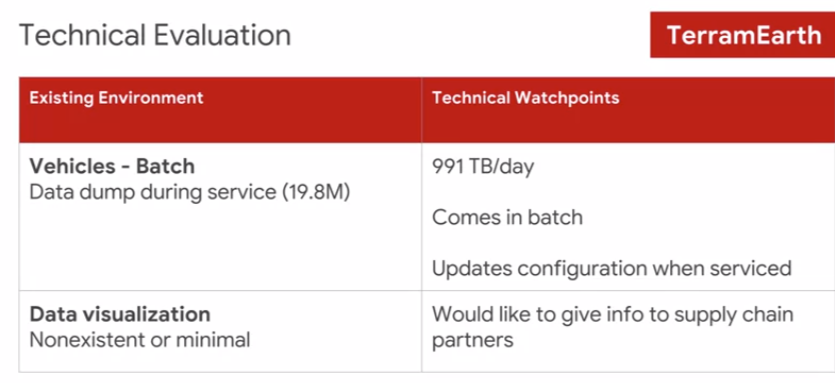

##### Sample solution

### Touchstone concepts

**A touchstone concept is a complex or key idea** -- something that you would learn in a class AFTER you have learned all the basic dependent concepts. They are used in this course because they are a very efficient way for you to learn where you have confidence and where more preparation might be needed.

This approach is based on the **Deeper Learning method** of **adult** learning.

#### Example

People seem to be able to relate well to this example.

**Touchstone**: "Unlike other vendor clouds, a subnet spans zones, enabling VMs with adjacent IPs to exist in separate zones, making design for availability easier to accomplish since the VMs can share tagged firewall rules."

To understand the above statement, the basic dependent knowledge that must already be understood includes, Regions, Zones, Subnets, IP Addresses, and Firewall Rules.

These basic concepts are not taught or reviewed in this course. They are taught in the training courses in this specialization and in the corresponding learning track in instructor led training.

#### Advice: Evaluate the dependent basic concepts

> Assess your confidence with each touchstone concept as it is presented. Don't expect to be taught the basic concept. If you don't understand the touchstone at all, or if you don't feel confident in your knowledge of it, or if you feel there are specific elements of it that you don't understand or are not confident about -- take note!

This is an area where more preparation can be of benefit for you.

Also -- note where you are confident, know the material, and the dependent concepts on which the touchstone is based. These areas require less preparation for you. So noting what you know well can help make your preparation activities more efficient.

### Designing and Implementing

[video](https://www.coursera.org/learn/preparing-cloud-professional-cloud-architect-exam/lecture/7zmPi/designing-and-implementing)

This module covers designing and implementing infrastructure solutions. Design can get complicated. Do you have an approach to design? It's easy to confuse elements if you don't use an organized method. Do you have favorite design elements? For example, do you find most of your designs start with VMs? You'll want to overcome these biases by understanding the infrastructure services available and when to select them.

Today you'll be learning about and preparing for the Professional Cloud Architect exam. 

A lot of that has to do with design. Before you can design a solution, you need to understand the building blocks, the underlying services, and technologies that make up solutions in Google Cloud. Here's a tip, use a layered model like this one. It'll help you organize your thinking about each exam question, so that you'll more easily recognize and focus on what's important. Professional Cloud Architects often use layered models to organize or separate solution designs. It makes it much easier to deal with the complexity and to make sure there are no dropouts in the design. This model comes from our design and process class.

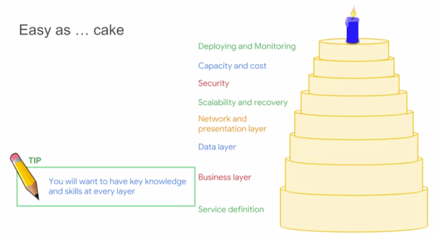

#### Designing a solution infrastructure that meets business requirements

This class follows the exam guide. So whenever you see a slide like this, a blue column contains items directly from the exam guide.and the white column contains tips and advice directly relevant to each outlined item. You can read through these yourself.

I'm going to highlight and discuss one or two of these per slide. When we speak about business requirements, we're asking the question, "What are the customer's needs and expectations?" Questions on the exam are realistic, so on a job, these discussions would likely be with a business stakeholder, and you'd need to be prepared to answer these questions and their concerns.

You'll notice that the first and last items in the list have to do with determining the criteria for success and deciding how to measure that. It's very important to be explicit about exactly what you're trying to achieve. **These items are often stated qualitatively at the beginning and are measurable and quantitative at the end**.

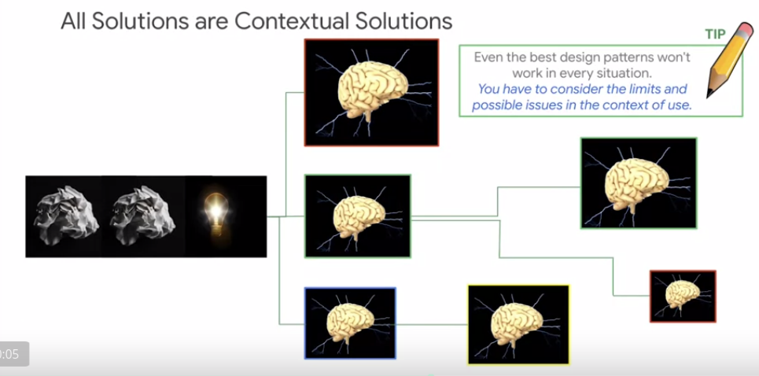

#### Context are often tradeoffs solutions: Good vs Fast vs Cost

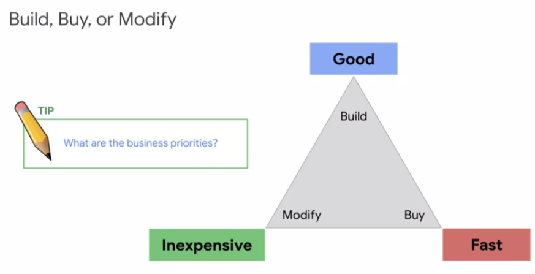

## Practice Case Study analysis

### Case Study #1

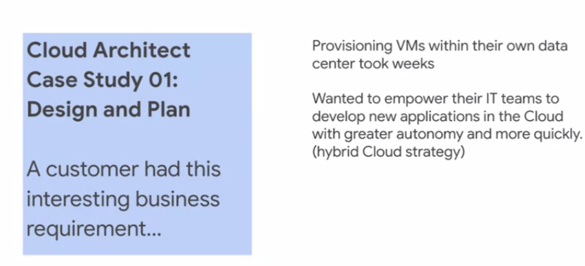

Context = need to gain in speed and ease of use thanks to cloud solutions

#### Identify technical watchpoints

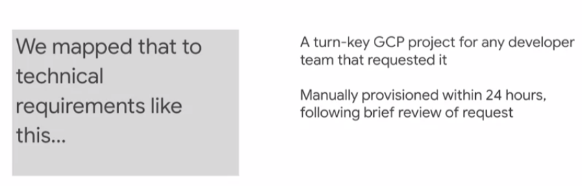

