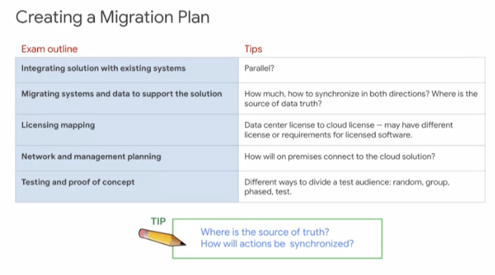
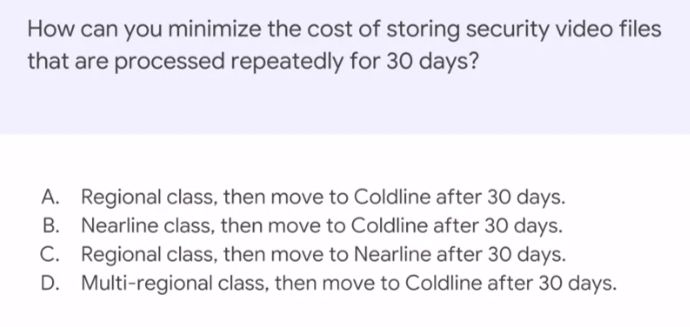

# Preparing for the Professional Cloud Architect Examination

~ 1 day / Expert

https://www.coursera.org/learn/preparing-cloud-professional-cloud-architect-exam/

## Content

## Audience

Cloud professionals who intend to take the Professional Cloud Architect certification exam Must have attended Architecting with GCP: Infrastructure course or equivalent on demand courses. Knowledge and experience with GCP, equivalent to GCP Architecting Infrastructure Knowledge of cloud solutions, equivalent to GCP Design and Process Industry experience with cloud computing

## Course Outline

The course includes presentations, demonstrations, and hands-on labs.

    * Module 1: Understanding the Professional Cloud Architect Certification
        * Position the Professional Cloud Architect certification among the offerings
        * Distinguish between Associate and Professional
        * Provide guidance between Professional Cloud Architect and Associate Cloud Engineer
        * Describe how the exam is administered and the exam rules
        * Provide general advice about taking the exam

    * Module 2: Sample Case Studies
        * MountKirk Games
        * Dress4Win
        * TerramEarth

    * Module 3: Designing and Implementing
        * Review the layered model from Design and Process
        * Provide exam tips focused on business and technical design
        * Designing a solution infrastructure that meets business requirements
        * Designing a solution infrastructure that meets technical requirements
        * Design network, storage, and compute resources
        * Creating a migration plan
        * Envisioning future solution improvements
        * Resources for learning more about designing and planning
        * Configuring network topologies
        * Configuring individual storage systems
        * Configuring compute systems
        * Resources for learning more about managing and provisioning
        * Designing for security
        * Designing for legal compliance
        * Resources for learning more about security and compliance

    * Module 4: Optimizing and Operating
        * Analyzing and defining technical processes
        * Analyzing and defining business processes
        * Resources for learning more about analyzing and optimizing processes
        * Designing for security
        * Designing for legal compliance
        * Resources for learning more about security and compliance
        * Advising development/operation teams to ensure successful deployment of the solution
        * Resources for learning more about managing implementation
        * Easy buttons
        * Playbooks
        * Developing a resilient culture
        * Resources for learning more about ensuring reliability

    * Module 5: Next Steps
        * Present Qwiklabs Challenge Quest for the Professional CA
        * Identify Instructor Led Training courses and what they cover that will be helpful based on skills that might be on the exam
        * Connect candidates to individual Qwiklabs, and to Coursera individual courses and specializations.
        * Review/feedback of course

## Introduction

[video](https://www.coursera.org/learn/preparing-cloud-professional-cloud-architect-exam/lecture/qMLHZ/introduction)

Details of the exam/certification is available [in English](https://cloud.google.com/certification/guides/professional-cloud-architect) or [in French](https://cloud.google.com/certification/guides/professional-cloud-architect/?hl=fr): 

## Examinaton guide

Use the Exam Guide outline to help identify what to study.

> **Guide de l'examen de certification**
> 
> **Section 1 : Concevoir et planifier l'architecture d'une solution cloud**
> 
> 1.1 Concevoir l'infrastructure d'une solution qui répond aux exigences commerciales. Points à prendre en compte :
> 
> * Cas d'utilisation commerciale et stratégie produits
> * Optimisation des coûts
> * Compatibilité avec la conception de l'application
> * Intégration
> * Mouvement des données
> * Compromis
> * Création, achat ou modification
> * Mesures de la réussite (par exemple : indicateurs clés de performance (KPI), retour sur investissement (ROI), métriques)
> * Conformité et observabilité
> 
> 1.2 Concevoir l'infrastructure d'une solution qui répond aux exigences techniques. Points à prendre en compte :
> 
> * Conception à haute disponibilité et basculement
> * Élasticité des ressources cloud
> * Évolutivité pour répondre aux exigences de croissance
> 
> 1.3 Concevoir des ressources réseau, de stockage et de calcul. Points à prendre en compte :
> 
> * Intégration à des environnements sur site/multicloud
> * Mise en réseau cloud native (VPC, appairage, pare-feu, mise en réseau de conteneurs)
> * Identification du pipeline de traitement des données
> * Adaptation des caractéristiques de données aux systèmes de stockage
> * Schémas des flux de données
> * Structure du système de stockage (par exemple : objet, fichier, RDBMS, NoSQL, NewSQL)
> * Mise en correspondance des besoins en calcul et des produits de plate-forme
> 
> 1.4 Créer une planification de la migration (c'est-à-dire des documents et des schémas architecturaux). Points à prendre en compte :
> 
> * Intégration de la solution aux systèmes existants
> * Migration des systèmes et des données permettant d'assurer la compatibilité avec la solution
> * Mappage de licences
> * Planification des réseaux et de la gestion
> * Tests et démonstration de faisabilité
> 
> 1.5 Envisager des améliorations futures pour la solution. Points à prendre en compte :
> 
> * Améliorations au niveau du cloud et technologiques
> * Évolution des besoins de l'entreprise
> * Promotion
> 
> **Section 2 : Gérer et provisionner l'infrastructure d'une solution**
> 
> 2.1 Configurer des topologies de réseaux. Points à prendre en compte :
> 
> * Extension à un environnement sur site (mise en réseau hybride)
> * Extension à un environnement multicloud, qui peut inclure la communication de GCP à GCP
> * Sécurité
> * Protection des données
> 
> 2.2 Configurer des systèmes de stockage individuels. Points à prendre en compte :
> 
> * Attribution du stockage des données
> * Traitement des données/provisionnement du calcul
> * Gestion de la sécurité et des accès
> * Configuration réseau pour le transfert des données et la latence
> * Conservation des données et gestion du cycle de vie des données
> * Gestion de la croissance des données
> 
> 2.3 Configurer des systèmes de calcul. Points à prendre en compte :
> 
> * Provisionnement du système de calcul
> * Configuration des fluctuations de calcul (préemptif et standard)
> * Configuration réseau pour les nœuds de calcul
> * Configuration de la technologie de provisionnement de l'infrastructure (par exemple : Chef/Puppet/Ansible/Terraform)
> * Orchestration des conteneurs (par exemple : Kubernetes)
> 
> **Section 3 : Concevoir des solutions sécurisées et conformes**
> 
> 3.1 Concevoir des solutions sécurisées. Points à prendre en compte :
> 
> * Gestion de l'authentification et des accès (IAM)
> * Hiérarchie des ressources (organisations, dossiers, projets)
> * Sécurité des données (gestion des clés, chiffrement)
> * Tests d'intrusion
> * Séparation des tâches
> * Contrôles de sécurité
> * Gestion des clés de chiffrement fournies par le client avec Cloud KMS
> 
> 3.2 Concevoir des solutions conformes aux exigences légales. Points à prendre en compte :
> 
> * Législation (par exemple, Health Insurance Portability and Accountability Act (HIPAA), Children's Online Privacy Protection Act (COPPA), etc.)
> * Audits (y compris les journaux)
> * Certification (par exemple : framework ITIL)
> 
> **Section 4 : Analyser et optimiser les processus techniques et métier**
> 
> 4.1 Analyser et définir les processus techniques. Points à prendre en compte :
> 
> * Plan de cycle de développement logiciel (SDLC)
> * Intégration continue/développement continu
> * Culture de résolution des problèmes/d'analyse post-mortem
> * Tests et validation
> * Processus d'entreprise informatique (par exemple, ITIL)
> * Continuité des activités et reprise après sinistre
> 
> 4.2 Analyser et définir les processus métier. Points à prendre en compte :
> 
> * Gestion des parties prenantes (par exemple, influence et facilitation)
> * Gestion du changement
> * Évaluation des équipes/Vérification des compétences
> * Processus décisionnel
> * Gestion de la réussite des clients
> * Optimisation des coûts/ressources (Capex/Opex)
> 
> 4.3 Développer des procédures pour tester la résilience d'une solution en production (par exemple, DiRT et Simian Army)
> 
> **Section 5 : Gérer la mise en œuvre**
> 
> 5.1 Conseiller les équipes de développement et d'opérations pour s'assurer que la solution est déployée correctement. Points à prendre en compte :
> 
> * Développement d'applications
> * Bonnes pratiques relatives aux API
> * Cadres de test (chargement/unité/intégration)
> * Outils de migration des systèmes et des données
> 
> 5.2 Interagir avec Google Cloud à l'aide du SDK GCP (gcloud, gsutil et bq). Points à prendre en compte :
> 
> * Installation locale
> * Google Cloud Shell
> 
> **Section 6 : Garantir la fiabilité de la solution et des opérations**
> 
> 6.1 Surveiller la solution, journaliser les événements et gérer les alertes
> 
> 6.2 Gérer le déploiement et les releases
> 
> 6.3 Prendre en charge la résolution des problèmes opérationnels
> 
> 6.4 Évaluer les mesures de contrôle qualité
> 
> **Exemples d'études de cas**
> 
> Certaines questions de l'examen de certification Cloud Architect peuvent porter sur une étude de cas qui décrit une entreprise fictive et un concept de solution. Ces études de cas sont destinées à vous fournir davantage de contexte pour vous aider à choisir la ou les bonnes réponses. Passez en revue quelques exemples d'études de cas qui pourraient vous être proposées.
> 
> * Mountkirk Games
> * Dress4Win
> * TerramEarth

* **Design and implement** (make something function... more about **products**)
* **optimize and operate** (make something secure and cost effective)
* **manage implementation and operate reliability** (make something continue reliably and adapt over time... more about **procedures**)

Have you heard of the the four P's? That's **product**, **people**, **policy**, and **process**.

## Meaning of the Professional Cloud Architect Certification

([video](https://www.coursera.org/learn/preparing-cloud-professional-cloud-architect-exam/lecture/NbDJr/understanding-the-professional-cloud-architect-certification))

### Different roles & certifications

 I just want to caution you that the associate cloud engineer is not a simpler and easier cloud architect exam. All of these certifications are based on real-world practical job skills required and used by practitioners in the industry.
 
 A cloud engineer uses the same technology as the cloud architect. However, their job focuses different and so the skills are different. For example:
 
 * a **cloud architect** might consider how to design a Kubernetes cluster to meet customer requirements.
 * A **cloud engineer** might run jobs on the cluster and be more focused on monitoring the cluster and measuring and maintaining its performance.
 * A **cloud architect** designs the solution and implements it.
 * A **cloud engineer** operates a solution, monitors it maintains it, and evolves it as business circumstances change.
 
 So, which certification or certifications you might want depends on your job role, the job you have or the job you want to have. 

### Difference between "associate" vs "professional" level of certifications

= difference on "designing" and "business requirements"

**Professional**:

* designing
* planning
* PoC
* Identifying the business needs

**Associate**:

* implementing
* operating & technical requirements

### Tips for methods of study

### Tips for the day of the exam

### Product and technology knowledge

ou need to know the basic information about each product that might be covered on the exam.

#### You need to know...

* What it does, why it exists.
* What is special about its design, for what purpose or purposes was it optimized?
* When do you use it, and what are the limits or bounds when it is time to consider an alternative?
* What are the key features of this product or technology?
* Is there an Open Source alternative? If so, what are the key benefits of the cloud-based service over the Open Source software?

#### Which products and technologies

Training and Certification meet at the JTA -- the Job Task Analysis -- the skills required of the job.

The scope of the exam matches the learning track and specialization in training. So a great place to derive a list of the technologies and products that might be on the exam is to look at all the products and technologies that are covered in the related training. The training might not cover everything. But it is a good place to start.

#### Study methods

Training is great. Digging into the online documentation can be very instructive and covers more detail than can be covered in a class, so documentation tends to have more equal coverage of features, whereas training has to prioritize its time. Getting hands on experience can help you understand a product or technology much better than reading and is the kind of experience a professional in the job would have. So labs can be a great way to prepare.

### Build your own case study summaries

####  Mountkirk Games Case Study: a game app

[Mountkirk Games Case Study](https://cloud.google.com/certification/guides/cloud-architect/casestudy-mountkirkgames-rev2) [[video](https://www.coursera.org/learn/preparing-cloud-professional-cloud-architect-exam/lecture/UKteT/mountkirk-games-case-study-analysis)]

##### Key business points

##### Technical evaluation

##### Sample solution

#### Dress4Win Case Study: social network app around garderobe

[Dress4Win Case Study](https://cloud.google.com/certification/guides/cloud-architect/casestudy-dress4win-rev2) [[video](https://www.coursera.org/learn/preparing-cloud-professional-cloud-architect-exam/lecture/JfG2y/dress4win-case-study-analysis)]

##### Key business points

##### Technical evaluation

##### Sample solution

#### TerramEarth Case Study: IoT  sensors for agriculture & mining 

[TerramEarth Case Study](https://cloud.google.com/certification/guides/cloud-architect/casestudy-terramearth-rev2) [[video](https://www.coursera.org/learn/preparing-cloud-professional-cloud-architect-exam/lecture/3z8sv/terramearth-case-study-analysis)]

##### Key business points

##### Technical evaluation

##### Sample solution

### Touchstone concepts

**A touchstone concept is a complex or key idea** -- something that you would learn in a class AFTER you have learned all the basic dependent concepts. They are used in this course because they are a very efficient way for you to learn where you have confidence and where more preparation might be needed.

This approach is based on the **Deeper Learning method** of **adult** learning.

#### Example

People seem to be able to relate well to this example.

**Touchstone**: "Unlike other vendor clouds, a subnet spans zones, enabling VMs with adjacent IPs to exist in separate zones, making design for availability easier to accomplish since the VMs can share tagged firewall rules."

To understand the above statement, the basic dependent knowledge that must already be understood includes, Regions, Zones, Subnets, IP Addresses, and Firewall Rules.

These basic concepts are not taught or reviewed in this course. They are taught in the training courses in this specialization and in the corresponding learning track in instructor led training.

#### Advice: Evaluate the dependent basic concepts

> Assess your confidence with each touchstone concept as it is presented. Don't expect to be taught the basic concept. If you don't understand the touchstone at all, or if you don't feel confident in your knowledge of it, or if you feel there are specific elements of it that you don't understand or are not confident about -- take note!

This is an area where more preparation can be of benefit for you.

Also -- note where you are confident, know the material, and the dependent concepts on which the touchstone is based. These areas require less preparation for you. So noting what you know well can help make your preparation activities more efficient.

### Designing and Implementing

[video](https://www.coursera.org/learn/preparing-cloud-professional-cloud-architect-exam/lecture/7zmPi/designing-and-implementing)

This module covers designing and implementing infrastructure solutions. Design can get complicated. Do you have an approach to design? It's easy to confuse elements if you don't use an organized method. Do you have favorite design elements? For example, do you find most of your designs start with VMs? You'll want to overcome these biases by understanding the infrastructure services available and when to select them.

Today you'll be learning about and preparing for the Professional Cloud Architect exam. 

A lot of that has to do with design. Before you can design a solution, you need to understand the building blocks, the underlying services, and technologies that make up solutions in Google Cloud. Here's a tip, use a layered model like this one. It'll help you organize your thinking about each exam question, so that you'll more easily recognize and focus on what's important. Professional Cloud Architects often use layered models to organize or separate solution designs. It makes it much easier to deal with the complexity and to make sure there are no dropouts in the design. This model comes from our design and process class.

#### Designing a solution infrastructure that meets business requirements

This class follows the exam guide. So whenever you see a slide like this, a blue column contains items directly from the exam guide.and the white column contains tips and advice directly relevant to each outlined item. You can read through these yourself.

I'm going to highlight and discuss one or two of these per slide. When we speak about business requirements, we're asking the question, "What are the customer's needs and expectations?" Questions on the exam are realistic, so on a job, these discussions would likely be with a business stakeholder, and you'd need to be prepared to answer these questions and their concerns.

You'll notice that the first and last items in the list have to do with determining the criteria for success and deciding how to measure that. It's very important to be explicit about exactly what you're trying to achieve. **These items are often stated qualitatively at the beginning and are measurable and quantitative at the end**.

#### Context are often tradeoffs solutions: Good vs Fast vs Cost

#### Practice Case Study analysis

###### Case Study #1

Context = need to gain in speed and ease of use thanks to cloud solutions

##### Identify technical watchpoints

[video](https://www.coursera.org/learn/preparing-cloud-professional-cloud-architect-exam/lecture/VQtJ1/designing-a-solution-infrastructure-that-meets-technical-requirements)

#### Designing a solution infrastructure that meets technical requirements

##### Common design patterns

Common design patterns: https://cloud.google.com/apis/design/design_patterns

##### Narrow down technology 

Narrow down technology to what could work, then what would work best given a particular context:

##### Identifying bottlenecks

Identifying bottlenecks is especially useful for questions involving building out from existing solutions. For example, the current system can support X number of users, and the goal is to support Y number of users. What's the bottleneck in the current design? Is it bandwidths, gigabytes, queries per second? Where will the application hit its limits? This is often the factor that determines which solution is best in the circumstance. 

##### Read/Build dataflow diagrams

##### ACID (consistency) vs BASE (availability)

significance of **atomicity**, **consistency**, **isolation**, and **durability**.

* **Atomicity**: Transactions are often composed of multiple statements. Atomicity guarantees that each transaction is treated as a single **"unit", which either succeeds completely, or fails completely**: if any of the statements constituting a transaction fails to complete, the entire transaction fails and the database is left unchanged. 
* **Consistency**: Consistency ensures that **a transaction can only bring the database from one valid state to another**, maintaining database invariants: any data written to the database must be valid according to all defined rules, including constraints, cascades, triggers, and any combination thereof.
* **Isolation**: Transactions are often executed concurrently (e.g., multiple transactions reading and writing to a table at the same time). **Isolation ensures that concurrent execution of transactions** leaves the database in the same state that would have been obtained **if the transactions were executed sequentially**. 
* **Durability**: Durability guarantees that once a **transaction** has been committed, it will **remain committed even in the case of a system failure** (e.g., power outage or crash)

#### Creating a Migration Plan

[video](https://www.coursera.org/learn/preparing-cloud-professional-cloud-architect-exam/lecture/wZINm/creating-a-migration-plan)

## Preparing for Managing

[video](https://www.coursera.org/learn/preparing-cloud-professional-cloud-architect-exam/lecture/95oml/managing-and-provisioning-solution-infrastructure)

Managing and provisioning solution infrastructure. If you think about it, managing and provisioning are both about capacity and demand and choosing the right infrastructure components to support and adapt to the demand. External connections, know your options. Internet, VPN, Cloud Router and the various flavors of direct interconnects. 

**Example: **

Google Cloud Networking is not like other vendor networks. Not like traditional IP networks and not like other SDA networks. That's networking in the cloud and you need to know how you might handle migrating an existing data center network into a GCP network. 

Google Cloud Networking is not like other vendor networks. Not like traditional IP networks and not like other SDA networks. That's networking in the cloud and you need to know how you might handle migrating an existing data center network into a GCP network. 

 Subnetworks can extend across zones in the same region. One VM and an alternate VM can be on the same subnet but in different zones. A single firewall rule can apply to both VM's even though they're in different zones. This makes it much easier to design and implement resilient or high-availability solutions. 

Know your options:

**Security**

###### Case Study #2

####### Identify Technical Watchpoints

####### Implementation meeting technical requirements

## Configuring individual Storage Systems

[video](https://www.coursera.org/learn/preparing-cloud-professional-cloud-architect-exam/lecture/SW1Xq/configuring-individual-storage-systems)

Know your different Storage solutions:

## Preparing for DAta processing

### Data transfer

[video](https://www.coursera.org/learn/preparing-cloud-professional-cloud-architect-exam/lecture/KEOeP/data-transfer)

### Lazy deletion design

The left side of the table are closer to physical speeds, and the right side of the table is closer to online speeds. Therefore, it's much faster to accumulate data online and work with it and transfer it online, than to collect the data physically and then transfer it.

## Cloud Storage

[video](https://www.coursera.org/learn/preparing-cloud-professional-cloud-architect-exam/lecture/yQyNc/cloud-storage)

4 storage classes:

## BigTable

<a href="../images/Reading-2---Cloud-Bigtable.pdf">BigTable in a nutshell :)</a>:

* How does BigTable works? (Colossus: Google File System **GFS** ~**HDFS**)
   * manipulate "tablets"
   * manipulate the data
   * manipulate the metadata
* BigTable is **a learning system, detecting "hotspots" where activity is highest**, splitting a tablets into several, and automatically rebalance the compute resources.
* best use case is with big data -- **above 300 GB**
* Cloud Bigtable design idea is "simplify for speed"
   * data in tables, **only one index, the "Row Key"** > "Speed through simplification". Forget SQL, build up from a mnimal set of opeations.
* Optimize the name of you Row Key according to the application.

## Data processing to Machine Learning

[video](https://www.coursera.org/learn/preparing-cloud-professional-cloud-architect-exam/lecture/cWQSq/data-processing-to-machine-learning)

* **BigQuery** provides a front-end for analysis and a back-end that can read from several sources including BigQuery tables, but also CSV files in Cloud Storage. 
* **Cloud Dataproc** is a managed service for **Hadoop clusters**, useful for processing data and returning it to Cloud Storage or BigQuery.

1. The first step is **migration from Data Center processing to Cloud Data processing**.
   * **BigQuery** replaces many tools and custom applications in data center,
   * while **Cloud Dataproc** replaces Hadoop.
   * **Cloud Bigtable** is a drop in replacement for **Hbase**.
2. Machine learning is available from Cloud Dataproc using APIs, such as natural language processing or NLP. When ready, the business can move from cluster-based managed service to a serverless service, and access the full benefits of machine learning. Machine learning provides value through tagging of unstructured data, which makes it useful for specific purposes. Machine learning can also be used to recognize items and for prediction. Machine learning is more of a focus of the data engineering track rather than the cloud architect track. But it's still part of the infrastructure of a cloud architect, and it might be used for finding solutions.

<a href="../images/Reading-3---Cloud-AI.pdf">Cloud AI on GCP :D</a>:

* cloud AutoML:
    * pre-built AI models (Vision, NLP, Translation, ....)
    * add custom models
    * create new models
* ML with BigQuery

## Preparing for Compute

[video](https://www.coursera.org/learn/preparing-cloud-professional-cloud-architect-exam/lecture/7tTrD/configuring-compute-systems)

### Configuring Compute Systems

One thing to consider in the design is whether you can create an application that's tolerant of some amount of lost data or state and part of the system can simply drop some data or can store data externally and recover from drops. Then if that part is isolated, you can consider using Preemptible VMs for lower cost.

Development environments and disaster recovery are often good applications for creating infrastructure through automation technologies such as Deployment Manager or Terraform. In the development environment case, you can generate a clone of the production infrastructure solution or use by the development team. So the test team needs an environment, deploy another copy. Quality control needs and environment, another copy. Auditing and compliance test backup and recovery, create more deployments on demand. 

### Selecting Compute Options

- Compute Engine (**Processing flexibility**)
- Kubernetes Engine (**platform independence**)
- App Engine standard/flex (**Code first**)
- Cloud Functions (**Microservices**

Options in a table to know forward and backward:

### Choosing a load balancer for Compute Engine

**No load balancers _per se_** (load balancing servers), but load balancing is managed by the network (software).

> there's no such thing as a load balancer in Google Cloud. Allow me to explain. In Google Cloud, there is no load balancer because the function of distributing traffic is handled by the software defined network. So there are several kinds of load balancing. But these are just features that are part of the network, not physical devices. Load balancing services are distinguished by the kind of traffic they direct. By whether they're intended to balance traffic from one server to another inside the Google Cloud or if they're intended to direct data arriving from the Internet. Also load balancing can be global or applied to a specific region. Make sure you understand the basics of how geo-distributed and load balancing works.

### Choosing instance groups for Compute Engine

* **Unmanaged instance groups** collect different kinds of instances. Usually, this is done for management of lift and shift existing designs and _it's not recommended because it does not make the best use of the features available in cloud_.
* **Managed instance groups** are _all the same kinds of instances meaning that the type can be defined by an instance template and auto-scaling is available_.

**Zonal managed instance groups** keep all the instances in the same zone which is useful to provide consistent network location when the instances must communicate with similar latency and avoid zone to zone transfer.

**Regional managed instance groups** distribute the instance and multiple zones within the region increasing reliability. Instance groups should be managed instance groups to make effective use of the cloud.

## Microservices, Containers, Data Processing, and IoT

[video](https://www.coursera.org/learn/preparing-cloud-professional-cloud-architect-exam/lecture/7CEQH/microservices-containers-data-processing-and-iot)

### Microservices

Microservices is not a panacea, it doesn't fit all cases. You can implement a microservices solution in App Engine cloud functions and using Node.js and Kubernetes. The platforms have overlapping coverage. Do you know when you might choose one platform over another for microservices solution? Coordinating a transaction across stateless microservices is tricky. You have to store the state externally and retrieve and use it in each function. Microservices architectures are commonly used and implemented in Cloud Functions or in App Engine.

### Containers

> What you want to do is blend the approaches where it makes sense to the business. This is another case where what the client wants is what's most important to the design and on an exam it means being sensitive to and looking out for those trade-offs.

### Managed Services vs Serverless services

### IoT

Look for it at [cloud.google.com/solutions](https://cloud.google.com/solutions/)

The core assembly here is

* **IoT Core**: Google Cloud IoT Core provides a fully managed service for device registration, authentication, authorization, metadata and configuration. 
* **Cloud Functions**: IoT events and data can be sent to the cloud at a high rate and need to be processed quickly. Cloud functions allow you to write custom logic that can be applied to each event as it arrives. This can be used to trigger alerts, filter invalid data, or invoke other APIs. Cloud Functions can operate on each published event individually.
* **Cloud Pub Sub**: Cloud Pub Sub. Google Cloud Pub Sub provides a globally durable message ingestion service. Cloud Pub Sub can act like a shock absorber and rate level or for incoming data. Cloud Pub Sub scales to handle data spikes that can occur when swarms of devices respond to events in the physical world. It buffers these spikes to help isolate them from applications monitoring their data.
* **Cloud Dataflow**: Google Cloud Dataflow provides the open Apache beam programming model as a managed service for processing data in multiple ways including batch, extract transform load ETL patterns, and continuous streaming patterns. Cloud Dataflow performs well with high volume data processing.

### Cloud Functions

<a href="../images/Reading-4-.---Cloud-Functions.pdf">Cloud Functions</a>:

### Containers & GKE

[video](https://www.coursera.org/learn/preparing-cloud-professional-cloud-architect-exam/lecture/xEp9n/experiment-containers-and-gke-video-like-dislike)

<a href="../images/Reading----Containers-and-GKE.pdf">Google Kubernetes Engine</a>:

Between 2017 and 2018, the number of organizations using containers for software development had to deploy their services doubled. The trend shows no signs of slowing. For this reason, container knowledge and skill with Kubernetes is increasing the importance for the job of a Cloud architect. Of course, if you need more of these skills for the job, you will also need them to prepare for the exam. Docker is software that builds containers. User apply application code and instructions called a Docker file, and Docker follows the instructions and assembles the code and dependencies into the container. Containers can be run much as an application can run. However, it is a self-contained environment that can run on many platforms. Google Cloud offers a service called **Cloud Build** which functions similarly to Docker. It accepts code and configuration and builds containers. Cloud Build offers many features and services that are geared towards professional development. It is designed to fit into a continuous development, continuous deployment workflow. It is designed to scale and to handle many application developers working on, and continuously updating a live global service. If you had 100 developers sharing source files, you would need a system for managing them, for tracking them, versioning them, and enforcing a checking review and approval process. Cloud Source Repositories is a cloud-based solution. If you were deploying hundreds of containers, you would not be in keeping it to yourself. One of the reasons to use containers is to share them with others. So you need a way to manage and share them. This is the purpose of container registry. **Container registry** has various integrations with continuous integration, continuous deployment services.

A Docker container is an image built-in layers. Each layer is created by an instruction in the Docker file. All the layers except for the top one are air locked. The thin read-write layer at the top is where you can make changes to a running container. For example, if you needed to change a file, those changes would be written here. The layer designed inside of a container isolates functions. This is what makes the container stable and portable. Here are a few of the common Docker commands. The `docker build` command creates the container image. The `docker run` command runs the container. There are other Docker commands that can help you list images, check the status of a running container, work with logs or stop a running container.

You can run a container in Docker itself, as you saw with the `docker run` command. You can also run containers using Compute Engine. Compute Engine gives you the alternative to start up a virtual machine from a container, rather than from an OS Image Boot Disk. You also have this option when creating an instance template, which means you can create managed instance groups from containers. App Engine supports containers as custom runtimes. The main difference between the **App Engine standard** environment and the **App Engine flexible** environment is that flexible hosts applications in Docker containers. It creates Docker containers and persists them in Container Registry. A Container Orchestrator is a full service for managing, running and monitoring containers. _Both App Engine flexible environment and Google Kubernetes engine are container orchestrators_. Kubernetes is an open standard software. So you can run a Kubernetes cluster in your data center. Google Kubernetes engine provides Kubernetes as a managed service.

A Kubernetes cluster is composed of nodes, which are a unit of hardware resources. Nodes in GKA are implemented as VMs in Compute Engine. Each node has pods. Pods are resource management units. A pod is how Kubernetes controls and manages resources needed by applications and how it executes code. Pods also give the system fine grain control over scaling. Each pod host, manages, and runs one or more containers. The containers in a pod share networking and storage. So typically, there is one container per pod, unless the containers hold closely related applications. For example, a second container might contain a logging system for the application in the first container. A pod can be moved from one node to another without reconfiguring or rebuilding anything. This design enables advanced controls and operations that gives systems built on Kubernetes unique qualities.

Each cluster has a master node that determines what happens on the cluster. There are usually at least three of them for availability, and they can be located across zones. A Kubernetes job makes changes to the cluster. For example, a pod YAML file provides the information to start up and run a pod on a node. If for some reason a pod stops running or a node is lost, the pod will not automatically be replaced. The deployment YAML tells Kubernetes how many pods you want running. So the Kubernetes deployment is what keeps a number of pods running. The deployment YAML also defines a replica set, which has how many copies of a container you want running. The Kubernetes scheduler determines on which node and in which pod the replica containers are to be run.

One of the advanced things that Kubernetes deployments allow you to do is roll out software to some pods and not others. So you can actually keep version in production on most of the pods and try out version B with a sample group and other pods. This is called A/B testing, and it is great because you can test the new software in a real production environment without risking the integrity of the entire service. Another thing you can do with deployments is a rolling update. Basically, you load up the new software in a replacement pod, switch the load to the new pod, and turn down the old one. This allows you to perform a controlled and gradual roll out of the new software across the service. If something goes wrong, you can detect the problem and roll back to the previous software. Really, if you are going to run an enterprise production service you will need these kinds of operations. That is one major reason to adopt Kubernetes. There are a number of subjects that were not covered in this brief overview. For example, how containers running in the same pod can share resources, how containers running in different pods can communicate, and how networking is handled between a node's IP and the applications. These subjects and more are covered in the course, getting started with Google Kubernetes engine or you can find more information in the online documentation.

### BigQuery

<a href="../images/Reading-6---BigQuery.pdf">BigQuery</a>:

## Practice

[video](https://www.coursera.org/learn/preparing-cloud-professional-cloud-architect-exam/lecture/iKLkP/practice-exam-questions-2)

### Practice: Network features

> Which network feature could help a company meet its goals to expand service to Asia while reducing latency?
> 
> * HTTP/TCP load balancing,
> * network TCP/UDP,
> * Cloud Router,
> * or Cloud Content Delivery Network (CDN).

**The answer is D, Cloud Content Delivery Network (CDN)**. CDN will enable a company to expand its online presence with a single IP address and global reach, leveraging Google's global network. While global load balancing is part of CDN, it won't help reduce latency to customers in Asia, whereas the cache service in CDN will do that. Network load balancing is designed to load balance from one GCP service to another to scale back end services, which is called east-west communications. North-south communications, where one part is in the GCP network and the other part is external, requires a different kind of load balancing. Cloud Router uses BGP to discover changes in network topology in a remote network, so it doesn't address latency. How can you minimize the cost of storing security video files that are processed repeatedly for 30 days? First, Regional class, then move to Coldline after 30 days; next, Nearline class, then move to Coldline after 30 days; Regional class, then move to Nearline after 30 days; or Multi-Regional class, and then move to Coldline after 30 days? The answer is A, Regional class, then move to Coldline after 30 days. The question here is answered by understanding the purpose of each of the storage classes and, in general, how they're priced. One thing to remember is that Coldline is really not intended to be read more than once a year. It's cheap to write data to it, but much more to read it back, compared to the other classes of storage. So the correct answer is A, local usage in a regional bucket for initial use during the month, then Coldline because it's unlikely to be read after that. This is often the case when data is used during the month and archived for compliance and record keeping after. The other options will not be cost effective.

### Practice Storage

> How can you minimize the cost of storing security video files that are processed repeatedly for 30 days?
> * First, Regional class, then move to Coldline after 30 days;
> * next, Nearline class, then move to Coldline after 30 days;
> * Regional class, then move to Nearline after 30 days;
> * or Multi-Regional class, and then move to Coldline after 30 days?

**The answer is A, Regional class, then move to Coldline after 30 days**. The question here is answered by understanding the purpose of each of the storage classes and, in general, how they're priced. One thing to remember is that Coldline is really not intended to be read more than once a year. It's cheap to write data to it, but much more to read it back, compared to the other classes of storage. So the correct answer is A, local usage in a regional bucket for initial use during the month, then Coldline because it's unlikely to be read after that. This is often the case when data is used during the month and archived for compliance and record keeping after. The other options will not be cost effective.

- [Lab notes](../../labs/lab_create_blog_with_Cloud_Storage_Cloud_SQL_and_Compute_Engine.md): **PCA Prep—Google Cloud Essential Skills**

## Problem solving is the key skill of the job.

During the exam you will be reading a question or a case and the problem it is describing should start to inform and define a solution in your mind. The faster and more clearly you can understand the requirements and identify elements that might be part of the solution, the better the chances are that you will understand the question correctly and be able to identify the correct answer. This is what we mean by the best preparation for the exam is to be prepared for the job.

### Practice problem solving

There are sample/practice exam-type questions throughout this course and a simulated exam quiz at the end. Don't just read through these or watch these for information. It is not there to teach you the right answer to a particular question. It is there to give you the opportunity to practice using your problem-solving skills, which you will need on the job and for the exam.

### Practice evaluating your own confidence about information, an answer, or a solution.

Another skill that will help you on the job and on the exam is being able to evaluate your own confidence about your knowledge. People often assume that they either know something or they don't know it, they either recall it or they don't. But in fact, recall is much less binary than that. What we don't often get the chance to practice is evaluating how well we know something or how certain we are of answers or solutions.

This is really important. Because if you know that you are not certain of something, then you can use that as a guide to help you decide what to study, how to prioritize your study time, and how much effort to apply.

This means that you learn more from missing a question and answering it incorrectly in this course than from answering it correctly. When you miss a question, it is an indicator to take note that this is something you might want to study to better prepare for the exam.

How much confidence do you want? I will often dig into the documentation and not only prove to myself exactly why the correct answer is correct. But I will also continue studying until I know with absolute certainty exactly why each incorrect answer is wrong. I want to be able to state the reason it is not correct. Because that is how I know that I have studied enough.

## Preparing for Optimizing and Operating

- [video](https://www.coursera.org/learn/preparing-cloud-professional-cloud-architect-exam/lecture/LTSbp/optimizing-and-operating)

This module covered the sections of the exams outline on optimizing and operating. You can optimize a solution for many things such as:

- reliability,
- efficiency,
- low cost,
- high performance,
- or security.

### Security and compliance

**Security** is a broad term. It includes privacy, authentication and authorization, and identity and access management. It could include intrusion detection, attack mitigation, resilience and recovery. So security really appears across the documentation and not in just one place. 

**Compliance** is about meeting some external guideline or standard

### Practice Case Study #3

[video](https://www.coursera.org/learn/preparing-cloud-professional-cloud-architect-exam/lecture/vy2g2/case-study-3)

#### Business problem

The following is a case study that involves a financial services company. This vertical often involves private information and transactions, so the security requirements are high. Also these kinds of companies often need a plan for audits to meet compliance requirements for certifications. This customer had a common FinServ requirement. The customer did not want any data to traverse the public Internet, for obvious reasons. So they had a security strategy that included a technical requirement to use private APIs to access Google Cloud resources. They saw this is a fundamental need to their security strategy. Additionally, they wanted to know how the cloud provider's security standard certifications, and what they did to stay current. So they were concerned that the provider might lose the certification that they were relying on for business. A large company wanted to improve their security posture, a common FinServ requirement.

- Security, business requirement, data cannot traverse the public Internet. Technical requirement, must have private API access to GCP services as a good security practice and to minimize data exfiltration.
- Compliance, business requirement, cloud provider must earn the trust of the business. How does Google Cloud maintain the latest standards around security, availability, process integrity, privacy, and confidentiality?

The first thing we did was make sure all access to GCP was through secure methods including SSL, VPN, Interconnect and private API. We decided to use a new feature that was in alpha called **VPC service control**. This enables the security perimeter. For example BigQuery could placed inside a security perimeter, and then could only be accessed at a private endpoint. And then there were standards and compliance such as ISO and SOC. We provided these to the customer and they needed to sign agreements to be covered by Google's guarantees about these standards.

#### Identify Technical Watchpoints

We mapped that technical requirement in Google's clouds, products and services. 
- Security, ensure all traffic to GCP is through secure methods, such as SSL, TLS, VPN, Interconnect, private APIs and endpoints.
- Compliance, Google Cloud has standards, regulations, and certifications that would meet their compliance requirements and help earn their trust in our platform.

#### Identify Technical solution/implementation

And this is how we implemented that technical requirement:

- **VPC service controls**,
**secure GCP API**.

We restricted access to user GCP resources based on the Google Cloud Virtual Network or IP range. We restricted the set of Google APIs and GCP resources accessible from user's Google Cloud Virtual Network.

Standards, regulations, and certifications. Products regularly undergo independent verification of security, privacy, compliance controls, certifications. And so ISO 27001, 27017, and 27018 and SOC 1, 2, and 3 certifications. An interesting point about both security and compliance is that it's a shared responsibility model. So although we provided secure access and layered protection, the customer needed to use IAM to manage access to its employees. And implement secure practices in its procedures. Also, the standard compliance covers the cloud resources, but not the customer's application. So they may need to take extra steps to ensure that the overall solution is compliant.

## Preparing Designing for Security and Compliance

### Preparing Designing for Security

[video](https://www.coursera.org/learn/preparing-cloud-professional-cloud-architect-exam/lecture/RIvYC/designing-for-security)

1. One key to securing access is to request and established groups that represent roles.
2. Then apply the permissions to the groups, and allow the people in the organization who manage identity to assign membership to the groups.

This creates a **clean interface between permission management on the cloud side, and group membership on the personnel IT side**.

Another key to security, is to **craft security permissions**. The standard roles are defined for the most common use cases, but you might want to derive more granular and restricted roles by customizing them. **Service accounts** are a great way to separate system components, and established secure communications between components. A **bastion host** is a way to leverage a service account. For risky and uncommon actions, **make the user admin startup and log into bastion host**. From there they can borrow the service account assigned to the host to perform restricted functions.

> One benefit is that the login process generates logs for accountability.

 A policy is set on a resorts, and each policy contains a set of rules enroll members. Resources inherit policies from parents. So, a policy can be set on a resource for example, a service, and another policy can be set on a parents such as a project that contains that service. The final policy is the union of the parent policy and the resource policy. What happens when these two policies are in conflict? What if the policy on the resource only gives access to a single cloud storage bucket, and restricts access to all other buckets? However, at the project level, a rule exists that grants access to all buckets in the project. Which rule wins? The more restrictive rule on the resource or the moral general role on the project? If the parent policy is less restrictive, it overrides a more restrictive resource policy. So, in this case, the project policy wins. Folders map well to organization structure. It's a way to isolate organizations or users or products while still having them share billing and corporate resources. Commit a security checklist to memory. Sometimes just running down a list will rapidly identify a solution.

