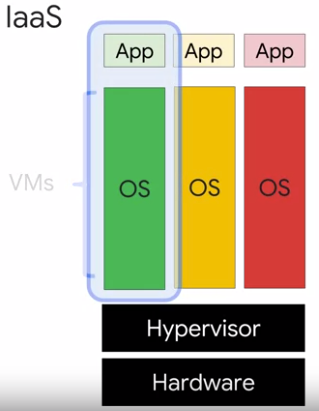
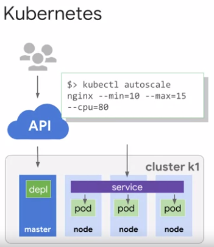
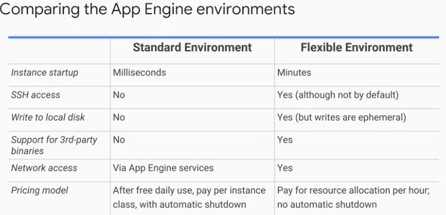

# GCP Fundamentals: Core Infrastructure

## Content

* [What is Cloud Computing](#what-is-cloud-computing)
* [IaaS vs PaaS vs SaaS](#iaas-vs-paas-vs-saas)
* [GCP Multi-regions, Regions & Zones](#gcp-multi-regions-regions--zones)
* [Pricing innovations](#pricing-innovations)
* [Multi-layered security approach](#multi-layered-security-approach)
* [Starting with Google Cloud](#starting-with-google-cloud)
    * [Projects](#projects)
    * [IAM](#iam)
* [GCP resource hierarchy](#gcp-resource-hierarchy)
* [Identity and Access Management (IAM)](#identity-and-access-management-iam)
    * [Who (Account/Identity)/Doing what (Roles)/On which resources?](#who-accountidentitydoing-what-roleson-which-resources)
    * [Services Accounts](#services-accounts)
* [Interacting with GCP](#interacting-with-gcp)
    * [Cloud Marketplace (formerly Cloud Launcher)](#cloud-marketplace-formerly-cloud-launcher)
* [Virtual Machines on GCP](#virtual-machines-on-gcp)
    * [Virtual Private Cloud (VPC) Network](#virtual-private-cloud-vpc-network)
    * [Compute Engine](#compute-engine)
    * [Important VPC capabilities](#important-vpc-capabilities)
    * [Create a VM from Console](#create-a-vm-from-console)
    * [Create a VM with gcloud in Cloud Shell](#create-a-vm-with-gcloud-in-cloud-shell)
    * [Lab about Compute Engine](#lab-about-compute-engine)
* [GCP Storage Options](#gcp-storage-options)
    * [Cloud Storage & Cloud Storage interactions](#cloud-storage--cloud-storage-interactions)
    * [Google Cloud Bigtable](#google-cloud-bigtable)
    * [Google Cloud Datastore](#google-cloud-datastore)
    * [Google Cloud SQL](#google-cloud-sql)
    * [Google Cloud Spanner](#google-cloud-spanner)
    * [Lab: Cloud Storage / Cloud SQL](#lab-cloud-storage--cloud-sql)
* [Containers, Kubernetes, and Kubernetes Engine](#containers-kubernetes-and-kubernetes-engine)
    * [Containers](#containers)
    * [Kubernetes](#kubernetes)
    * [Lab: Containers / Kubernetes / GKE](#lab-containers--kubernetes--gke)
* [Resources/Articles](#resourcesarticles)

## What is Cloud Computing

The US National Institute of Standards and Technology created a definition
It has 5 equally important traits:

1. **computing resources on-demand and self-service**. All you have to do is use a simple interface and you get the processing power, storage, and network you need, with no need for human intervention. 
1. **access these resources over the net from anywhere you want**. The provider of those resources has a big pool of them and allocates them to customers out of that pool. That allows the provider to get economies of scale by buying in bulk and pass the savings on to the customers. Customers don't have to know or care about the exact physical location of those resources.
1. **the resources are elastic**. If you need more resources you can get more, rapidly. If you need less, you can scale back.
1. the **customers pay only for what they use** or reserve as they go. If they stop using resources, they stop paying.

## IaaS vs PaaS vs SaaS

Virtualized data centers brought you Infrastructure as a Service, IaaS, and Platform as a Service, PaaS offerings.

- IaaS offerings provide raw compute, storage, and network organized in ways that are familiar from data centers.
- PaaS offerings, on the other hand, bind application code you write to libraries that give access to the infrastructure your application needs. That way, you can just focus on your application logic.

In the IaaS model, you pay for what you allocate.

In the PaaS model, you pay for what you use.

Both sure beat the old way where you bought everything in advance based on lots of risky forecasting. As Cloud Computing has evolved, the momentum has shifted towards managed infrastructure and managed services. GCP offers many services in which you need not worry about any resource provisioning at all. We'll discuss many in this course. They're easy to build into your applications and you pay per use.

What about SaaS? Of course, Google's popular applications like, Google Search, Gmail, Google Docs and Google Drive are Software as a Service applications in that they're consumed directly over the internet by end users (e.g. GSuite).

article: https://cloud.google.com/blog/products/gcp/time-to-hello-world-vms-vs-containers-vs-paas-vs-faas

## GCP Multi-regions, Regions & Zones

- in several zones of the same regions **for fault tolerance**,
- in several regions around the world **for better performance**.

## Pricing innovations

- **Per second billing**: Google was the first major Cloud provider to bill by the second rather than rounding up to bigger units of time for its virtual machines as a service offering.  This may not sound like a big deal, but charges for rounding can really add up for customers who are creating and running lots of virtual machines. 
Per second billing is offered for a virtual machine use through Compute Engine and for several other services too which we'll also look at in this course. Kubernetes engine which is Container Infrastructure as a Service, Cloud Dataproc which is the open source big data system Hadoop as a Service, and App Engine's Flexible Environment, which is a Platform as a Service.
- **Discounts for sustained use**: Compute Engine offers automatically applied sustained use discounts which are automatic discounts that you get for running a virtual machine for a significant portion of the billing month. When you run an instance for more than 25 percent of a month, Compute Engine automatically gives you a discount for every incremental minute you use it. Here's one more way Compute Engine saves money. Later in this course, you'll learn about how virtual machines are configured. Among other things, you specify how much memory and how many virtual CPUs they should have. 
- **Custom virtual machine types**: Normally, you pick a virtual machine type from a standard set of these values, but Compute Engine also offers custom virtual machine types, so that you can fine-tune the sizes of the virtual machines you use. That way, you can tailor your pricing for your workloads.

## Multi-layered security approach

[video](https://www.coursera.org/learn/gcp-fundamentals/lecture/2K73n/multi-layered-security-approach)

## Starting with Google Cloud

your **workloads in GCP**:
- you use **projects** to organize them.
- You use **Google Cloud Identity**, and **Access Management**, also called IM, or IAM to control who can do what.
- you use your choice of several interfaces to connect.

### Projects

Projects are the main way you organize the resources you use in GCP. Use them to group together related resources, usually because they have a common business objective.

### IAM

The principle of least privilege is very important in managing any kind of compute infrastructure, whether it's in the Cloud or on-premises. This principle says that each user should have only those privileges needed to do their jobs. In a least-privilege environment, people are protected from an entire class of errors.
GCP customers use IM to implement least privilege, and it makes everybody happier. There are four ways to interact with GCP's management layer:
- through the **web-based console**,
- through the **SDK** and its command-line tools,
- through the **APIs**,
- and through a **mobile app**.

When you build an application on your on-premises infrastructure, you're responsible for the entire stack security. From the physical security of the hardware, and the premises in which they're housed, through the encryption of the data on disk, the integrity of your network, all the way up to securing the content stored in those applications. When you move an application to Google Cloud Platform, Google handles many of the lower layers of security. Because of its scale, Google can deliver a higher level of security at these layers than most of its customers could afford to do on their own. The upper layers of the security stack remain the customers' responsibility. Google provides tools such as IAM to help customers implement the policies they choose at these layers.

## GCP resource hierarchy

[video #1](https://www.coursera.org/learn/gcp-fundamentals/lecture/K85Wf/the-google-cloud-platform-resource-hierarchy)

[video #2](https://www.coursera.org/learn/gcp-fundamentals/lecture/K85Wf/the-google-cloud-platform-resource-hierarchy)

<table >
	<tbody>
		<tr>
			<td>
            </td>
			<td>
            </td>
		</tr>
	</tbody>
</table>

     

Policies are inherated downwards in the hierarchy.

## Identity and Access Management (IAM)

[video](https://www.coursera.org/learn/gcp-fundamentals/lecture/1zsAc/identity-and-access-management-iam)

### Who (Account/Identity)/Doing what (Roles)/On which resources?

IAM lets administrators authorize who can take action on specific resources. An IAM policy has:
- a **"who" part**: The "who" part names the user or users you're talking about. The "who" part of an IAM policy can be defined either by:
  - a Google account,
  - a Google group,
  - a Service account,
  - an entire G Suite, 
  - or a Cloud Identity domain. 
- a **"can do what" part**: The "can do what" part is defined by an IAM role. An IAM role is a collection of permissions. Most of the time, to do any meaningful operations, you need more than one permission. For example, to manage instances in a project, you need to create, delete, start, stop, and change an instance. So the permissions are **grouped together into a role** that makes them easier to manage. 
- and an **"on which resource" part**: 

**3 kinds of roles in Cloud IAM**

- **Primitive roles** are broad. You apply them to a GCP project and they affect all resources in that project. These are the **owner**, **editor**, and **viewer roles**. If you're **a viewer on a given resource**, you can examine it but not change its state. If you're **an editor**, you can do everything a viewer can do, plus change its state. And if you are an owner, you can do everything an editor can do, plus manage rolls and permissions on the resource.
- **The owner role** on a project also lets you do one more thing: set up billing. - - Often, companies want someone to be able to control the billing for a project without the right to change the resources in the project. And that's why you can grant someone the **billing administrator role**.

**Predefined roles**
Be careful, if you have several people working together on a project that contains sensitive data, primitive roles are probably too coarse. 
Fortunately, GCP IAM provides a finer grained types of roles. GCP services offer their own sets of predefined roles and they define where those roles can be applied. For example, later in this course, we'll talk about Compute Engine, which offers virtual machines as a service. Compute Engine offers a set of predefined roles, and you can apply them to Compute Engine resources in a given project, a given folder, or in an entire organization. Another example. Consider Cloud Bigtable, which is a managed database service. Cloud Bigtable offers roles that can apply across an entire organization to a particular project or even to individual Bigtable database instances.

***IAM more fine-grained predefined roles** on particular services ([video](https://www.coursera.org/learn/gcp-fundamentals/lecture/CiocS/iam-roles)).

> A lot of companies have a least-privileged model in which each person in your organization has the minimum amount of privilege needed to do his or her job.

### Services Accounts

[mid of video](https://www.coursera.org/learn/gcp-fundamentals/lecture/CiocS/iam-roles)

What if you want to give permissions to a Compute Engine virtual machine, rather than to a person? Then you would use a service account.

## Interacting with GCP

[video](https://www.coursera.org/learn/gcp-fundamentals/lecture/hIpvL/interacting-with-google-cloud-platform)

[APIs Explorer](https://developers.google.com/apis-explorer)

### Cloud Marketplace (formerly Cloud Launcher)

[console.cloud.google.com/marketplace](https://console.cloud.google.com/marketplace)

[video](https://www.coursera.org/learn/gcp-fundamentals/lecture/AztZe/cloud-marketplace-formerly-cloud-launcher) 

A Quick way to get access to "solutions" with minimum effort.

e.g.:
- deploying a LAMP stack on GCP (LAMP stands for Linux, Apache, MySQL, PHP) > [video demo](https://www.coursera.org/learn/gcp-fundamentals/lecture/b8wYV/demonstration-getting-started-with-cloud-launcher).

## Virtual Machines on GCP

**Compute Engine** lets you run virtual machines on Google's global infrastructure.

### Virtual Private Cloud (VPC) Network

Your VPC networks connect your GCP resources to each other and to the internet:
- you can segment your networks,
- you can use firewall rules to restrict access to instances, and
- you can create static routes to forward traffic to specific destinations.

The way a lot of people get started with GCP is:

- to define their own Virtual Private Cloud inside their first GCP project,
- or they can simply choose the default VPC and get started with that.

 The Virtual Private Cloud networks that you define have **global scope**.
 
 > They can have subnets in any GCP region worldwide and **subnets can span the zones that make up a region**.
 > "In Google Cloud VPCs, subnets have regional scope."

 This architecture makes it easy for you to define your own network layout with global scope:
 - You can also have resources in different zones on the same subnet.
 - You can dynamically increase the size of a subnet in a custom network by expanding the range of IP addresses allocated to it. Doing that doesn't affect already configured VMs. In this example, your VPC has one network. So far, it has one subnet defined in GCP `us-east1` region. Notice that it has two Compute Engine VMs attached to it. They're neighbors on the same subnet even though they are in different zones. You can use this capability to build solutions that are resilient but still have simple network layouts.

### Compute Engine

[video](https://www.coursera.org/learn/gcp-fundamentals/lecture/tv56B/compute-engine)

- OS, type of disk storage, software pre-installed with startup scripts, ...
- snapshots of disks
- preemptible VMs for jobs that can be stopped and restarted.

### Important VPC capabilities

[video](https://www.coursera.org/learn/gcp-fundamentals/lecture/wyDK3/important-vpc-capabilities)

- provided **router**
- provided **Firewall instances** to control traffic going through
- **VPC Peering** to interconnect outside your project 2 VPCs on GCP. And **Shared VPC** would provide the IAM functionalities to specify Who can access What.
- **Cloud Load Balancing**: Google Cloud Load Balancing allows you to balance HTTP-based traffic across multiple Compute Engine regions.

- **Cloud DNS**: programmable with REST API
- **Cloud CDN**: CDN stands for Content Delivery Network, a global system of **ddge caches** to cache content close to your users: better user-experience, less requests. Just enable it with checkbox!

### Create a VM from Console 

### Create a VM with gcloud in Cloud Shell

Create the new VM in the same region, but in another zone, setting `us-central1-c` as the new default zone:

SSH the new VM:

Install a simple webserver and edit its homepage on the new VM:

Check that the running webserver serves the homepage locally on the new VM:

Check that the running webserver serves the homepage from the other VM on the same VPC:

### Lab about Compute Engine

[notes](../labs/lab_create_VMs_with_Compute_Engine.md) 

## GCP Storage Options

[video](https://www.coursera.org/learn/gcp-fundamentals/lecture/18wEV/introduction-to-google-cloud-platform-storage-options)

GCP has other storage options to meet your needs for:

- structured,
- unstructured,
- transactional
- and relational data.

Its core storage options:

- Cloud Storage
- Google Big Table (NoSQL)
- Cloud SQL, (RDBMS)
- Cloud Spanner (RDBMS),
- Cloud Data Store,

### Cloud Storage & Cloud Storage interactions

- [video 1](https://www.coursera.org/learn/gcp-fundamentals/lecture/HLKXf/cloud-storage)
- [video 2](https://www.coursera.org/learn/gcp-fundamentals/lecture/2uNqj/cloud-storage-interactions)

Cloud Storage objects are immutable

4 classes:

- "multi-regional" & "regional" are high-performance object classes
- "nearline" & "coldline" are backup/archivable storage

### Google Cloud Bigtable

[video](https://www.coursera.org/learn/gcp-fundamentals/lecture/8LIth/google-cloud-bigtable)

Definition: Google CLoud (fully-managed) NoSQL, BigData, database service for TeraBytes applications (up to PetaBytes of data).

### Google Cloud Datastore

[vidoe](https://www.coursera.org/learn/gcp-fundamentals/lecture/7sYyx/google-cloud-datastore)

Definition: Google CLoud Datastore is a managed horizontally scalable NoSQL database.

### Google Cloud SQL

[video](https://www.coursera.org/learn/gcp-fundamentals/lecture/fVTwB/google-cloud-sql-and-google-cloud-spanner)

a managed Relational Database Management System (RDBMS) database service. Either based on MySQL or PostgreSQLBeta.

It manages "database transactions".

### Google Cloud Spanner

[video, together with Cloud SQL](https://www.coursera.org/learn/gcp-fundamentals/lecture/fVTwB/google-cloud-sql-and-google-cloud-spanner)

Definition: Google Spanner is horizontally scalable Relational Database Management System (RDBMS).

### Lab: Cloud Storage / Cloud SQL

[video](https://www.coursera.org/learn/gcp-fundamentals/lecture/yboF1/demonstration-getting-started-with-cloud-storage-and-cloud-sql)

[notes](../labs/lab_create_blog_with_Cloud_Storage_Cloud_SQL_and_Compute_Engine.md) 

## Containers, Kubernetes, and Kubernetes Engine

[video](https://www.coursera.org/learn/gcp-fundamentals/lecture/XMTBL/containers-kubernetes-and-kubernetes-engine)

### Containers

It scales like PaaS, but gives you nearly the same flexibility as IaaS.

With this abstraction, your code is ultra portable, and you can treat the OS and the hardware as a blackbox. You can go from your laptop to the cloud without changing or rebuilding anything.

<table >
		<tr>
			<td>
            </td>
			<td>
            </td>
			<td>
            </td>
		</tr>
		<tr>
			<td>
            </td>
		</tr>
</table>

### Kubernetes

[video](https://www.coursera.org/learn/gcp-fundamentals/lecture/XMTBL/containers-kubernetes-and-kubernetes-engine)

Let's you orchestrate many containers on many hosts, scale them as microsrvices and deploy rollouts and rollbacks.

Kubernetes is a set of APIs that you can use to deploy containers on a set of nodes called a cluster

GKE is "hosted Kubernetes" by Google!!

GKE clusters:

- can be customised,
- can be deloyed in one gcloud command: `gcloud container clusters create k1`
- check status in the Admin Console
- Then, you deploy containers on nodes using a wrapper around one or more containers called a pod. A Pod is the smallest unit in Kubernetes that you create or deploy

<table >
		<tr>
			<td>
            </td>
			<td>
            </td>
			<td>
            </td>
		</tr>
</table>

One way to run a container in a POD in Kubernetes is to use `kubectl`:

<table >
		<tr>
			<td>
            </td>
			<td>
            </td>
			<td>
            </td>
		</tr>
</table>

To get the IP of the load balancer:

To scale the deployment:

<table >
		<tr>
			<td>
            </td>
			<td>
            </td>
		</tr>
</table>

the real strength of Kubernetes comes when you **work in a declarative way**. Instead of issuing commands, you provide a **configuration file** that tells Kubernetes what you want your desired state to look like, and Kubernetes figures out how to do it.

<table >
		<tr>
			<td>
            </td>
			<td>
            </td>
			<td>
            </td>
			<td>
            </td>
		</tr>
</table>

Watch the PODs come online:

Which ones are deployed?

Find out the external IP of the service(s):

And hit a public IP from a client:

What happens when you want to upload a new version of your app?

It might be too risky to **rollout** all of your services all at once!

Use `kubectl rollout ...` or change your **deployment configuration file** and apply the changes using `kubectl apply`:

New PODs will get created according to your update strategy:

> Here's an example configuration that will create a new version of your pods one-by-one, and wait for a new pod to be available before destroying one of the old pods.

### Lab: Containers / Kubernetes / GKE

[video: k8s on GKE is much more...](https://www.coursera.org/learn/gcp-fundamentals/lecture/1aWl8/demo-and-lab-introduction)

> _There are a lot of features in Kubernetes and GKE we haven't even touched on, such as configuring health checks, setting session affinity, managing different rollout strategies, and deploying pods across regions for high availability. But for now, that's enough. In this module, you've learned how to build a run containerized applications, orchestrate and scale them on a cluster, and deploy them using rollouts. Now you'll see how to do it in a demo and practice it in a lab exercise._

- [video: lab](https://www.coursera.org/learn/gcp-fundamentals/lecture/umRjO/demo-getting-started-with-kubernetes-engine)
- [notes lab](../labs/lab_create_a_webserver_deployed_on_kubernetes_cluster.md) 

## App Engine

- [video #1](https://www.coursera.org/learn/gcp-fundamentals/lecture/PrttY/google-app-engine-standard-environment)
- [video #2](https://www.coursera.org/learn/gcp-fundamentals/lecture/4ZurT/google-app-engine-flexible-environment)

- Compute infrastructure (IaaS): **Compute Engine** & **Kubernetes Engine**
- Platform-as-a-Service (PaaS) and "focus on your code": **App Engine**

App Engine:

- scales automatically
- you pay for what you use
- 2 environments: **Standard** & **Flexible**

### **Standard** Environment

- Simpler type: works in sandbox (why it can scales)
- Some environment at NO charge
- has contraints: "60 seconds time-out" (if not suitable, move to Flexible)
- Runtime for Java, Python, PHP and Go

### **Flexible** Environment

- runs on containers (running on VMs)
- Allows to configure your containers
- Use standard runtime

### Comparison Standard vs Flexible

### Comparison App Engine vs Kubernetes Engine

## Google Cloud Endpoints and Apigee Edge

[video](https://www.coursera.org/learn/gcp-fundamentals/lecture/tPtB0/google-cloud-endpoints-and-apigee-edge)

- What's an API? a clean, well-defined interface that abstract away needless details on the service's implementation

Google provides 2 APIs-related approach:

- **Cloud Endpoints**: managed API proxies
- **Apigee Edge**: also a managed API proxies, but business-oriented (rate limiting, quotas, analytics), providing a software service to OTHER companies.

<table >
	<tbody>
		<tr>
			<td>
            </td>
			<td>
            </td>
		</tr>
		<tr>
			<td>
            </td>
		</tr>
	</tbody>
</table>

Many users of Apigee Edge are providing a software service to other companies and those features come in handy.

> Because of the backend services for Apigee Edge need not be in GCP, engineers often use it when they are "taking apart" a legacy application. Instead of replacing a monolithic application in one risky move, they can instead use Apigee Edge to peel off its services one by one, standing up microservices to implement each in turn, until the legacy application can be finally retired.

### Lab: Getting Started with App Engine

- [video](https://www.coursera.org/learn/gcp-fundamentals/lecture/T1C9J/demonstration-getting-started-with-app-engine)
- [notes lab](../labs/lab_deploy_appengine_webapp.md)

## Development in the cloud

[video](https://www.coursera.org/learn/gcp-fundamentals/lecture/8Hfmz/development-in-the-cloud)

- Git: hosted git (private) provider > **Cloud Source Repositories**
- Managed applications which can be triggered (events in Cloud Storage, in Cloud Pub/Sub or an HTTP call): **Cloud Functions (beta)**

## Deployment: Infrastructure as code

[video](https://www.coursera.org/learn/gcp-fundamentals/lecture/0hYEJ/deployment-infrastructure-as-code)

It's often more efficient to **use a template** to set up your GCP environment.

That means a specification of what the environment should look like. It's **declarative** rather than **imperative**, using either:
- `yaml` markup language
- or `Python`

Then you give the template to [**Deployment Manager**](https://cloud.google.com/deployment-manager/docs/), and you allows you to version control your deployment templates in Git repositories (e.g. Cloud Source Repositories).

## Monitoring: Proactive instrumentation (Stackdriver & )

[video](https://www.coursera.org/learn/gcp-fundamentals/lecture/cHNEH/monitoring-proactive-instrumentation)

You can't run an application stably without monitoring. Monitoring lets you figure out whether the changes you made were good or bad. It lets you respond with information rather than with panic, when one of your end users complains that your application is down

Stackdriver is GCP's tool for monitoring, logging and diagnostics.

### lab: Getting Started with Deployment Manager and Stackdriver

- [video lab](https://www.coursera.org/learn/gcp-fundamentals/lecture/CJO1F/demonstration-getting-started-with-deployment-manager-and-stackdriver)
- notes lab 

## Big Data and Machine Learning

- [video #1](https://www.coursera.org/learn/gcp-fundamentals/lecture/6WqVr/introduction-to-big-data-and-machine-learning)
- [video #2](https://www.coursera.org/learn/gcp-fundamentals/lecture/gP7vk/google-cloud-big-data-platform)
- [video #3](https://www.coursera.org/learn/gcp-fundamentals/lecture/OK31U/cloud-dataflow)
- [video #4](https://www.coursera.org/learn/gcp-fundamentals/lecture/KM2ei/bigquery)
- [video #5](https://www.coursera.org/learn/gcp-fundamentals/lecture/LnOme/cloud-pub-sub-and-cloud-datalab)
- [video #6](https://www.coursera.org/learn/gcp-fundamentals/lecture/x2zsd/google-cloud-machine-learning-platform)

### Dataproc

- [video #2](https://www.coursera.org/learn/gcp-fundamentals/lecture/gP7vk/google-cloud-big-data-platform)

- Spark/SparkSQL for data mining
- MLlib (Spark ML libraries)

### Dataflow

- [video #3](https://www.coursera.org/learn/gcp-fundamentals/lecture/OK31U/cloud-dataflow)

<table >
	<tbody>
		<tr>
			<td>
            </td>
			<td>
            </td>
			<td>
            </td>
			<td>
            </td>
		</tr>
	</tbody>
</table>

### BigQuery

- [video #4](https://www.coursera.org/learn/gcp-fundamentals/lecture/KM2ei/bigquery)

<table >
	<tbody>
		<tr>
			<td>
            </td>
			<td>
            </td>
			<td>
            </td>
		</tr>
	</tbody>
</table>

### Cloud Pub/Sub and Cloud Datalab

- [video #5](https://www.coursera.org/learn/gcp-fundamentals/lecture/LnOme/cloud-pub-sub-and-cloud-datalab)

<table >
	<tbody>
		<tr>
			<td>
            </td>
			<td>
            </td>
		</tr>
	</tbody>
</table>

<table >
	<tbody>
		<tr>
			<td>
            </td>
			<td>
            </td>
		</tr>
	</tbody>
</table>

 
### Google Cloud Machine Learning Platform

- [video #6](https://www.coursera.org/learn/gcp-fundamentals/lecture/x2zsd/google-cloud-machine-learning-platform)

## Resources/Articles

- [GCP vs AWS platforms](https://cloud.google.com/docs/compare/aws/#resource_management_interfaces)
- Blog post on [Professional Cloud Architect Certification](https://medium.com/google-cloud/professional-cloud-architect-certification-6a6dfa5c6ff5) by a Googler
- [Cloud Run VS Cloud Functions: What’s the lowest cost?](https://medium.com/google-cloud/cloud-run-vs-cloud-functions-whats-the-lowest-cost-728d59345a2e)
- https://linuxacademy.com/
- [blog post comparing AWS, GCP and Azure](https://medium.com/globallogic-cloud-and-devops-blogs/clouds-compared-aws-vs-azure-vs-gcp-c59519b9d5e4)