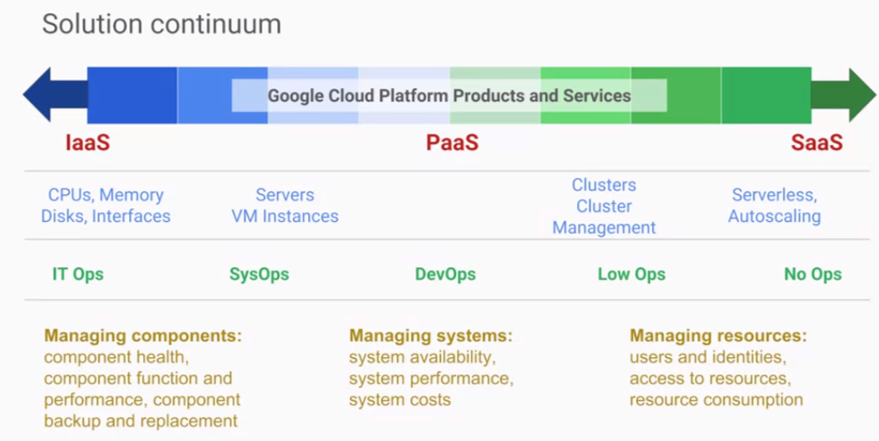
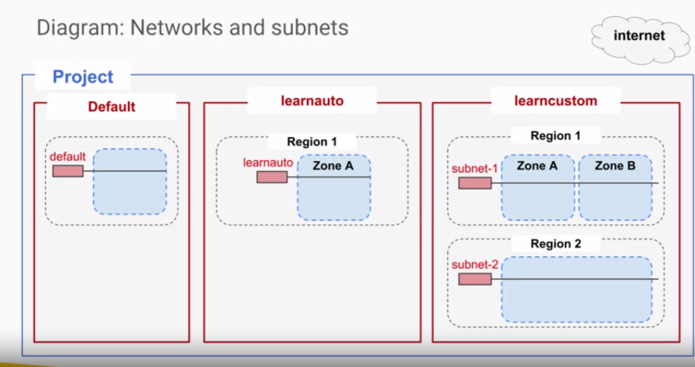
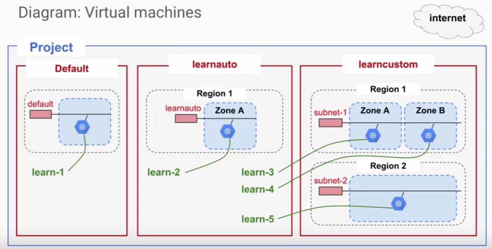
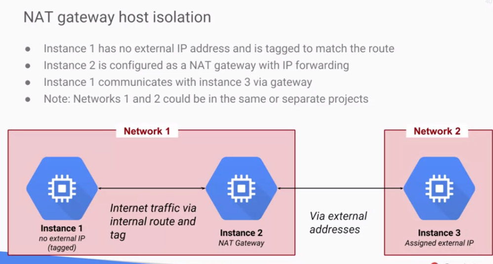

# Essential Cloud Infrastructure: Foundation

In this module we introduce the **Architecting with Google Compute Engine specialization**.

This specialization is defined for cloud solution architects, DevOps engineers, and anyone who's interested in using GCP, to create new solutions or to integrate existing systems, application environments, and infrastructure with a focus on Compute Engine.

## Content

* [Module 1: Introduction to GCP](#module-1-introduction-to-gcp)
    * [GCP infrastruture](#gcp-infrastruture)
    * [Using GCP](#using-gcp)
    * [Lab 1: Console and Cloud Shell](#lab-1-console-and-cloud-shell)
    * [Projects](#projects)
    * [Lab 2: Infrastructure Preview (Jenkins with Cloud Deployment Manager in no time)](#lab-2-infrastructure-preview-jenkins-with-cloud-deployment-manager-in-no-time)
* [Module 2: Virtual Networks](#module-2-virtual-networks)
    * [Projects, networks, and subnetworks](#projects-networks-and-subnetworks)
    * [IP addresses](#ip-addresses)
    * [Routes and Firewall Rules](#routes-and-firewall-rules)
    * [Network Billing](#network-billing)
    * [Lab 1: Virtual Networking](#lab-1-virtual-networking)
    * [Common network designs](#common-network-designs)
    * [Need of increased Availability](#need-of-increased-availability)
    * [Globalization: Need of increased isolation against software/hardware failures](#globalization-need-of-increased-isolation-against-softwarehardware-failures)
    * [Resources in differents regions/networks/projects &amp; VPC Network Peering](#resources-in-differents-regionsnetworksprojects--vpc-network-peering)
    * [Management Separation (different projects, within same zone)](#management-separation-different-projects-within-same-zone)
    * [Bastion host isolation](#bastion-host-isolation)
    * [NAT Gateway host isolation](#nat-gateway-host-isolation)
    * [Lab 2: Bastion Host](#lab-2-bastion-host)
* [Module 3: Virtual Machines](#module-3-virtual-machines)
    * [What's Compute Engine?](#whats-compute-engine)
    * [What are compute options (vCPY, Memory)?](#what-are-compute-options-vcpy-memory)
    * [Compute Engine images?](#compute-engine-images)
    * [common Compute Engine actions](#common-compute-engine-actions)
* [Resources/Articles](#resourcesarticles)

## Module 1: Introduction to GCP

- [video #1](https://www.coursera.org/learn/gcp-infrastructure-foundation/lecture/JrXPD/google-cloud-platform-gcp-infrastructure)
- [video #2](https://www.coursera.org/learn/gcp-infrastructure-foundation/lecture/5DIZY/using-gcp)

In this module, we will provide you with an introduction to GCP by building on what you learned about the GCP infrastructure from the course introduction.

### GCP infrastruture

Analogy of infrastructure and applications:

4 parts covering the Cloud infrastructure:

1. **Foundation of essential infrastructure**: the basic technologies.
2. **The Core Services**: the building blocks of the essential infrastructure.'
3. **The Augmented infrastruture**: the systems built on top of the essential infrastructure, for scaling and automation.
4. **The application infrastructure**: consisted of containers and services specifically provided to make application development easy.

### Using GCP

Ways to interact with GCP

1. The **GCloud console** (http:://console.cloud.google.com)
2. The **Google Cloud SDK** to use `gcloud` in a terminal window
3. **CloudShell**: a browser-based terminal environment for GCP, accessible from the GCP console.

Working with other client libraries:

### Lab 1: Console and Cloud Shell

- video lab
- [notes lab](../labs/lab_console_cloudshell.md)

### Projects

[video](https://www.coursera.org/learn/gcp-infrastructure-foundation/lecture/aqJJ9/demo-projects)

### Lab 2: Infrastructure Preview (Jenkins with Cloud Deployment Manager in no time)

[video](https://www.coursera.org/learn/gcp-infrastructure-foundation/lecture/xTlIl/lab-2-infrastructure-preview-overview-and-objectives)

## Module 2: Virtual Networks

In this module, we start by introducing **Virtual Private Cloud (VPC)** which is Google’s **_managed networking functionality_** for your Cloud Platform resources. Then we dissect networking into its fundamental components, which are:

- projects,
- networks,
- subnetworks,
- IP addresses,
- routes and firewall rules,
- along with network pricing.

- [video #1: Google Cloud Platform (GCP) VPC](https://www.coursera.org/learn/gcp-infrastructure-foundation/lecture/vJbfe/google-cloud-platform-gcp-vpc)
- [video #2: Projects, networks, and subnetworks](https://www.coursera.org/learn/gcp-infrastructure-foundation/lecture/FyKc4/projects-networks-and-subnetworks)

### Projects, networks, and subnetworks

[video](https://www.coursera.org/learn/gcp-infrastructure-foundation/lecture/FyKc4/projects-networks-and-subnetworks)

### IP addresses

[video](https://www.coursera.org/learn/gcp-infrastructure-foundation/lecture/VBh8c/ip-addresses)

In case of restart, the internal IP address may change, but the DNS system points to instances which keep the external IP address unchanged.

### Routes and Firewall Rules

[video](https://www.coursera.org/learn/gcp-infrastructure-foundation/lecture/WrQIK/routes-and-rules)

A route is  a mapping of an IP range to a destination.

### Network Billing

[video](https://www.coursera.org/learn/gcp-infrastructure-foundation/lecture/9uFtR/billing)

### Lab 1: Virtual Networking 

Compare and explore a complex GCP network structure.

- you build a complex network topology

- you will launch VMs in varius network/sub-networks

- you will ping VMs accross the networks

[lab. details](../labs/lab_complx_network_on_GCP.md)

### Common network designs

[video](https://www.coursera.org/learn/gcp-infrastructure-foundation/lecture/OeuYo/common-network-designs)

How these elements work together:

* projects
* networks
* subnetworks
* regions
* zones

 
In short, they provide a rich set of:

 * alternatives for managing groups of resources with varying availability
 * and access control requirements.

So you can work globally or work at a very granular level if you want/need to.

#### Need of increased Availability

#### Globalization: Need of increased isolation against software/hardware failures

#### Resources in differents regions/networks/projects & VPC Network Peering

- **Region/Network/Proect isolated services** >>> preventing compromised of one part from spreading to other parts.
- **VPC Network Peering** >>> Allows these services can still communicate over a private address space.

#### Management Separation (different projects, within same zone)

VMs isolated into separate projects, but within the same zone, useful for **Identity and Access Management**.

You can assign different people to different roles (for management separation) for each project, limiting the access to the network they need access to.

> This allows granular access management per sub-project for a better access control,
> 
> But remember than a network can NOT span Projects... so the projects NEED to communicate via the internet!

#### Bastion host isolation

#### NAT Gateway host isolation

Let's one network/project/"VM instance" to not access internet. Therefore this allows Instance 1 to communicate with another instance on a separate network via the gateway.

The two networks do not have to be in the same project for this design to work.

#### Lab 2: Bastion Host

- [video](https://www.coursera.org/learn/gcp-infrastructure-foundation/lecture/qfyZl/lab-2-bastion-host-overview-and-objectives)

Removing the connection to the internet of a webserver meant to deliver services only to a corporate audience.

[lab notes](../labs/lab_Networking_Bastion_host.md)

> There are other security alternatives to provide routine administration access to web server like using **Cloud VPN**, which is covered in a later course of this specialization.

## Module 3: Virtual Machines

[intro video](https://www.coursera.org/learn/gcp-infrastructure-foundation/lecture/zZPUh/module-overview-intro)

In this module, we cover **virtual machine instances**, or **VMs**.

First we'll start with:

- the **basics of Compute Engine**, followed by a quick little lab to get you more familiar with creating virtual machines.
- Then, we’ll look at the **different CPU and memory options** that enable you to create different configurations.
- Next, we will look at images and the **different disk options available with Compute Engine**.
- After that, we will discuss very **common Compute Engine actions** that you might encounter in your day-to-day job.

This will be followed by an in-depth lab that explores many of the features and services covered in this module.

### What's Compute Engine?

[video](https://www.coursera.org/learn/gcp-infrastructure-foundation/lecture/7Yk7C/compute-engine)

#### Compute options

#### Disk (Storage) options

#### Networking options

#### Demo Compute Engine options

- [video](https://www.coursera.org/learn/gcp-infrastructure-foundation/lecture/5NGzq/demo-compute-engine)

#### Pricing and discounts

[video](https://www.coursera.org/learn/gcp-infrastructure-foundation/lecture/2B8Tb/pricing-and-discounts) 

Example of cumulated usage for calculating **"sustained-use" discounts**: 

#### VM access and lifecycle

[video](https://www.coursera.org/learn/gcp-infrastructure-foundation/lecture/CGmcv/vm-access-and-lifecycle)

VM lifecycle:

Changing VM's state from "running": 

Stopped VM (No charge):

#### Lab 1 Creating Virtual Machines

[video](https://www.coursera.org/learn/gcp-infrastructure-foundation/lecture/vc4nH/lab-1-creating-virtual-machines-overview-and-objectives)

### What are compute options (vCPY, Memory)?

### Compute Engine images?

### common Compute Engine actions

## Resources/Articles

- IP Addresses: https://cloud.google.com/compute/docs/ip-addresses/
- Subnets and CIDR ranges: https://cloud.google.com/compute/docs/alias-ip/#subnets_and_cidr_ranges