# Essential Cloud Infrastructure: Core Services

The goal of these courses is:

* to remember and understand the **different GCP services** and **features** and also
* to be able to apply your knowledge, 
* to analyze requirements,
* to evaluate different options, and 
* to create your own services.

This course builds on the [Essential Cloud Infrastructure: Foundation](./cloud_architect/course_2_Essential_Cloud_Infrastructure__Foundation.md) course and enhances your study of architecting with Compute Engine. In this course, we start by talking about Cloud IAM, and you will administer Identity and Access Management for resources. Next, we’ll cover the different data storage services in GCP, and you will implement some of those services. Then, we’ll go over resource management, where you will manage and examine billing of GCP resources. Lastly, we’ll talk about resource monitoring, and you will monitor GCP resources using Stackdriver services. 

> "We want to welcome you to Architecting with Compute Engine".

## Content

[course intro video](https://www.coursera.org/learn/gcp-infrastructure-core-services/lecture/6Zi73/course-introduction)

* [Cloud Identity and Access Management (Cloud IAM)](#cloud-identity-and-access-management-cloud-iam)
    * [Organizations](#organizations)
    * [Folders: sub-organizations](#folders-sub-organizations)
    * [Roles](#roles)
    * [Demo: Create a Custom role in GCP](#demo-create-a-custom-role-in-gcp)
    * [Members](#members)
    * [Service Accounts](#service-accounts)
    * [Scopes](#scopes)
    * [Cloud IAM best practices](#cloud-iam-best-practices)
    * [Cloud IAP](#cloud-iap)
    * [Lab Intro: Cloud IAM](#lab-intro-cloud-iam)
* [Data Storage Services](#data-storage-services)
* [Resource Management](#resource-management)
* [Resource Monitoring](#resource-monitoring)
* [Resources/Articles](#resourcesarticles)

-  more than one solution for a task or application in GCP, a [solution continuum](https://github.com/Patechoc/GCP_memo/blob/master/cloud_architect/course_2_Essential_Cloud_Infrastructure__Foundation.md#gcp-infrastruture)
- Infrastructure, Users, Applications [analogy](https://github.com/Patechoc/GCP_memo/blob/master/cloud_architect/course_2_Essential_Cloud_Infrastructure__Foundation.md#gcp-infrastruture)

GCP offers a **range of Compute Services**

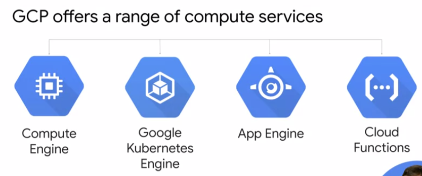

## Cloud Identity and Access Management (Cloud IAM)

- [Cloud IAM overview](https://www.coursera.org/learn/gcp-infrastructure-core-services/lecture/UbUc3/cloud-iam)

Cloud IAM is a sophisticated system built on top of.

- email-like address names,
- job type roles in granular permissions.

Components within Cloud IAM which are **organizations**, **roles**, **members** and **service accounts**

[video](https://www.coursera.org/learn/gcp-infrastructure-core-services/lecture/UbUc3/cloud-iam) 

Who can do What on Which resources:

Cloud IAM objects: 

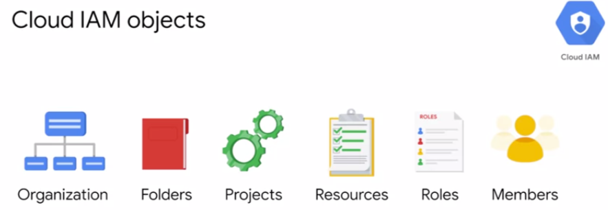

Cloud IAM resource hierarchy:

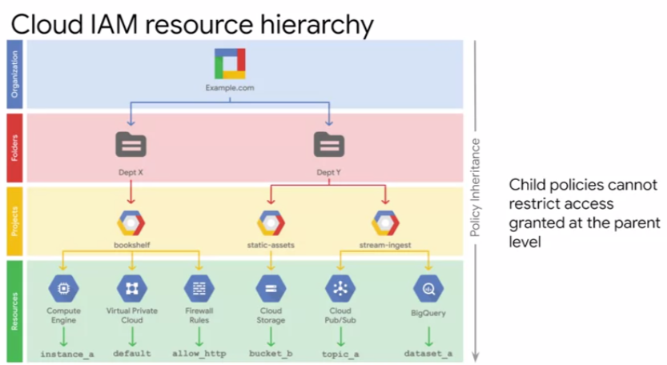

> Apply the **Principle of Least Priviledges**: Always select the smallest scope that's necessary for the task in order to reduce your exposure to risk!

### Organizations

[video](https://www.coursera.org/learn/gcp-infrastructure-core-services/lecture/M0m2G/organization)

- **"Organization Admin"**
- **"Project Creator"**

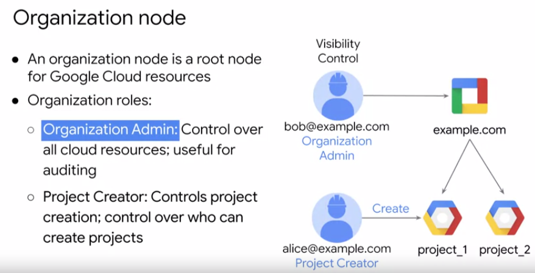

Responsabilities of:

- **"Cloud Identity account manager"**
- **"Organization Admin"**

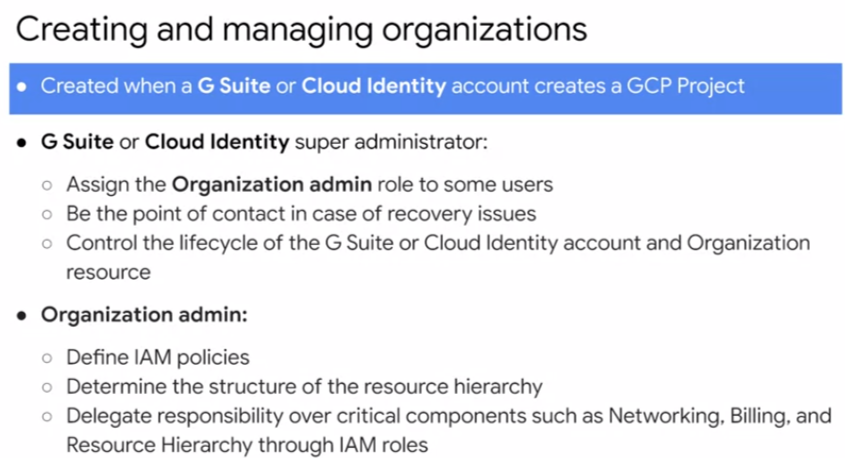

### Folders: sub-organizations

Folders can act as a sub-organization wihtin the organization.

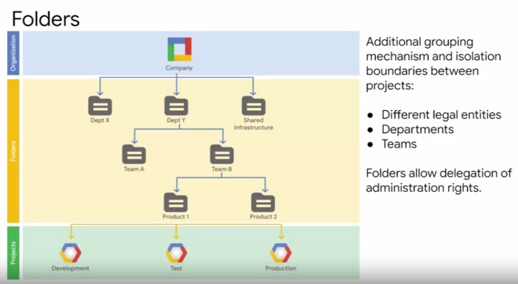

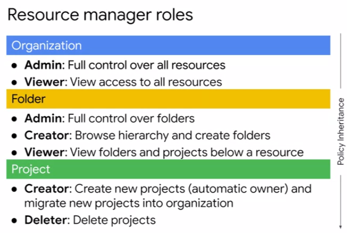

### Roles

[video](https://www.coursera.org/learn/gcp-infrastructure-core-services/lecture/rgNsR/roles)

= Roles define the can do what on which resource part of Cloud IAM

There are three types of roles in Cloud IAM; **Primitive roles**, **predefined roles**, and **custom roles**:

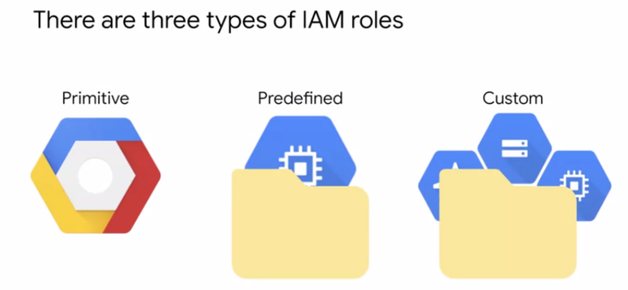

- **Primitive roles** are the original roles that were available in the GCP console, but they are broad. You apply them to a GCP project and they affect all resources in that project.

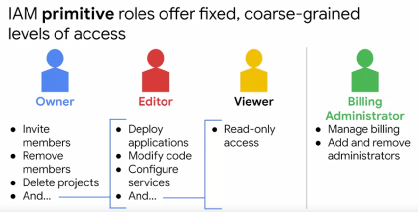

- **Predefined roles** define where those roles can be applied. This provides members with granular access to specific GCP resources and prevents unwanted access to other resources. These roles are collections of permissions because to do any meaningful operations, you usually need more than one permission.

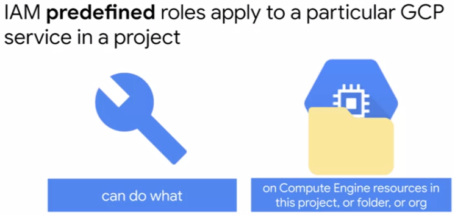

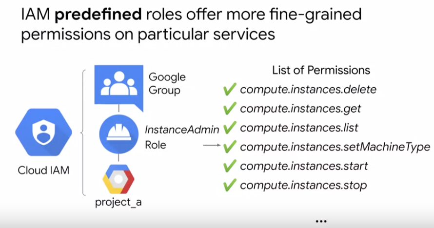

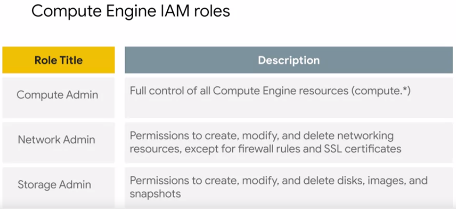

But what if one of those roles does not have enough permissions or you need something even finer-grained?

That's what **Custom Roles** permit: a lot of companies use the **least privileged model** in which each person in your organization is given the minimal amount of privilege needed to do their job.

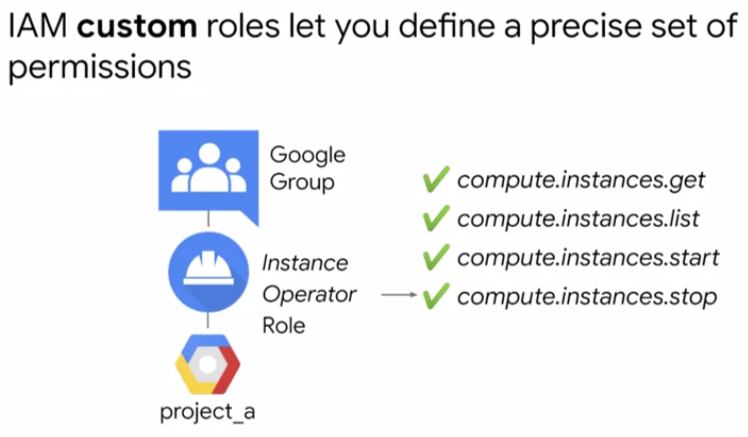

#### Demo: Create a Custom role in GCP

[video](https://www.coursera.org/learn/gcp-infrastructure-core-services/lecture/3bQES/demo-custom-roles)

### Members

[video](https://www.coursera.org/learn/gcp-infrastructure-core-services/lecture/4vrs0/members)

= **Members** define the who part, of who can do what, on which resource.

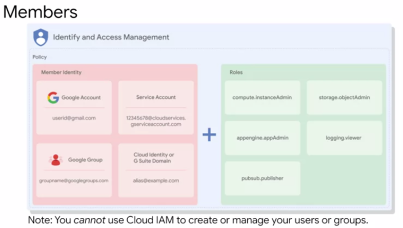

There are 5 different types of members:

- **Google Accounts**: a Google Account represents a developer, an administrator or any other person who interacts with GCP
- **Service Accounts**,
- **Google Groups**,
- **G Suite Domains**, and
- **Cloud Identity Domains**. 

 What if you already have a different corporate directory? How can you get your users and groups into GCP? 
 
Use **Google Cloud Directory Sync**!!

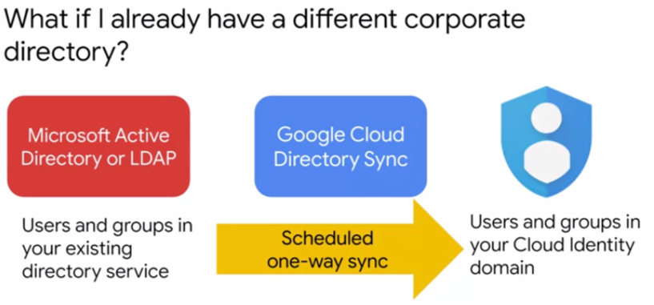

Many ways to sync your remote account:

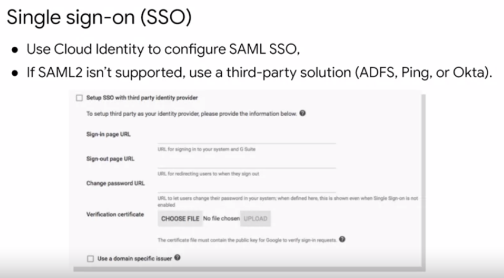

### Service Accounts

[video](https://www.coursera.org/learn/gcp-infrastructure-core-services/lecture/292ex/service-accounts)

 A service account is an account that belongs to your application instead of to an individual end user

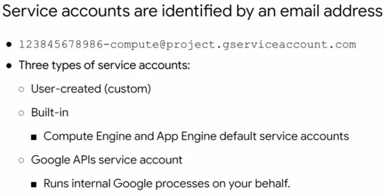

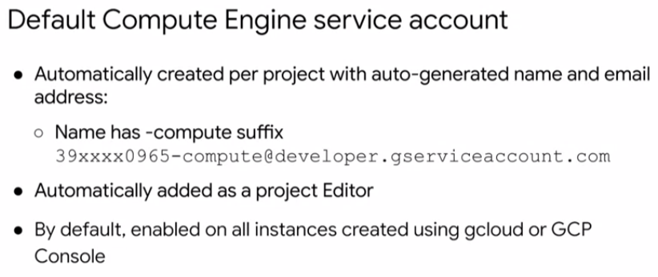

 
#### Scopes

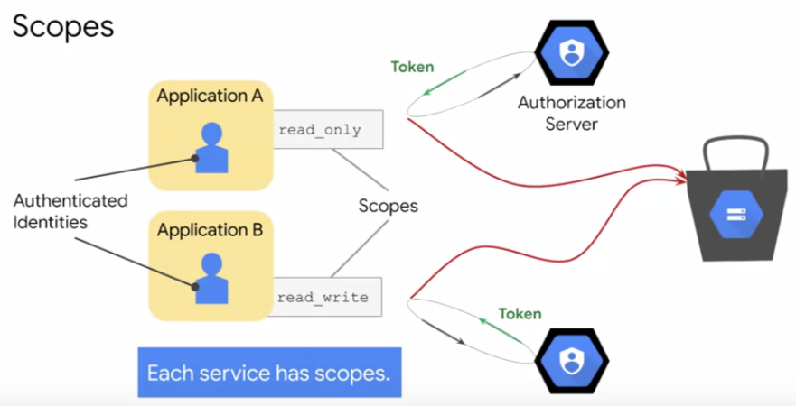

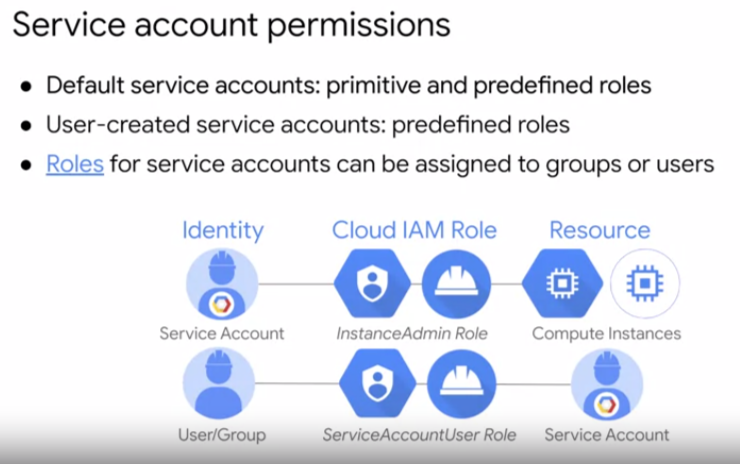

Services Accounts use keys:

### Cloud IAM best practices

- [Module intro video](https://www.coursera.org/learn/gcp-infrastructure-core-services/lecture/xghL2/cloud-iam-best-practices)
- [Module Review video](https://www.coursera.org/learn/gcp-infrastructure-core-services/lecture/u8ETv/module-review)

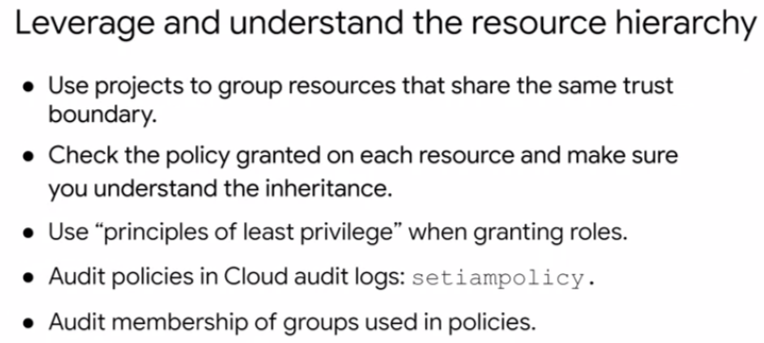

Grant roles to groups instead of individuals:

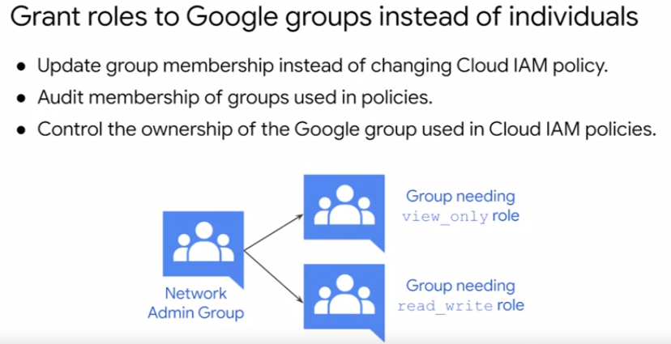

Example of best practices when using Service Accounts:

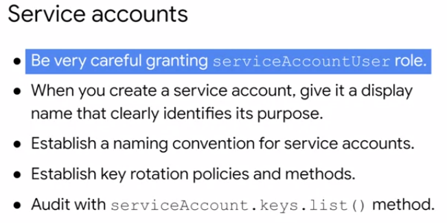

#### Cloud IAP

Cloud IAP lets you establish a central authorization layer for applications accessed by HTTPS.
So you can use an application level access control model instead of relying on network level firewalls. Applications and resources protected by Cloud IAP can only be accessed through the proxy by users and groups with the correct Cloud IAM role. 

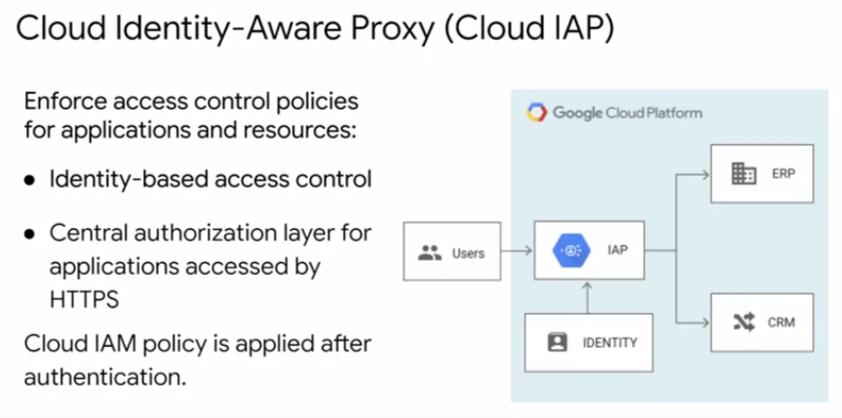

### Lab Intro: Cloud IAM

- [lab notes](../labs/lab_Cloud_IAM.md)
- [walkthrough video](https://www.coursera.org/learn/gcp-infrastructure-core-services/lecture/mpXBr/lab-review-cloud-iam)

## Data Storage Services

- [Module intro video](https://www.coursera.org/learn/gcp-infrastructure-core-services/lecture/HBW4r/module-overview)
- Module Review video

The purpose of this module is to explain which services are available and when to consider using them from an **infrastructure perspective**.

> "I want you to be able to set up and connect to a service without detailed knowledge of how to use a database system. If you want a deeper dive into the design, organizations, structures, schemas, and details on how data can be optimized,served, and stored properly within those different services, I recommend **Google Cloud's data engineering courses**"

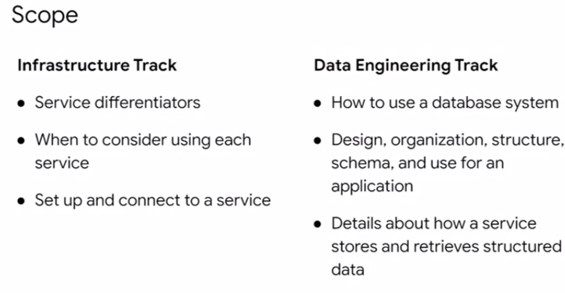

Google offers several storage services to choose from:

- Cloud Storage
- Cloud SQL
- Cloud Spanner
- Cloud Firestore
- and Cloud Bigtable.

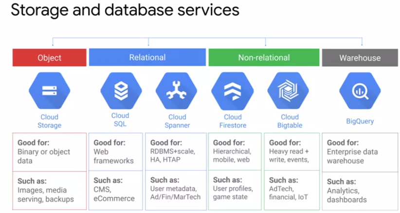

Choose using this decision tree:

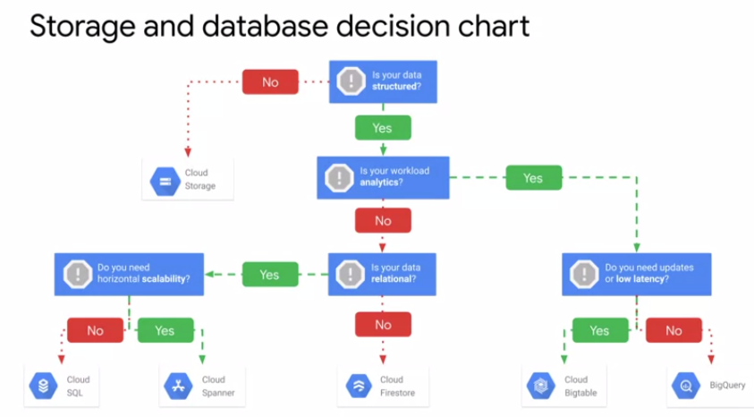

### Cloud Storage

[video](https://www.coursera.org/learn/gcp-infrastructure-core-services/lecture/MXyDu/cloud-storage)

Overview of storage classes:

- Regional
- Multi-regional
- Nearline
- Coldline

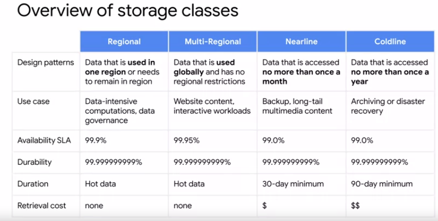

Cloud Storage entities:

- buckets
- objects
- access

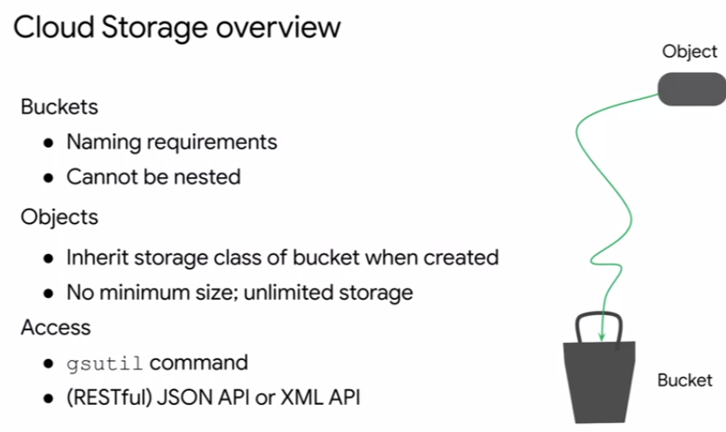

Changing default storage class:

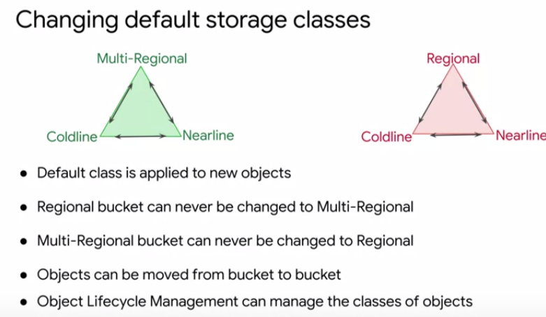

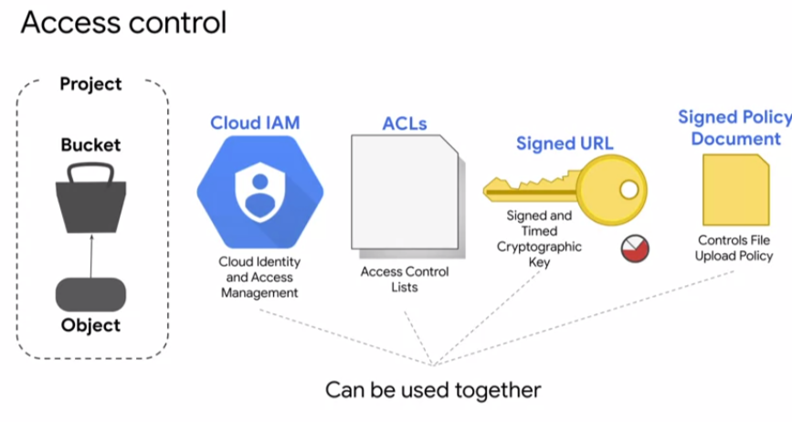

Zooming on ACL (Access Control Lists) = Who can access your bucket and what they can do (100 ACLs max). 

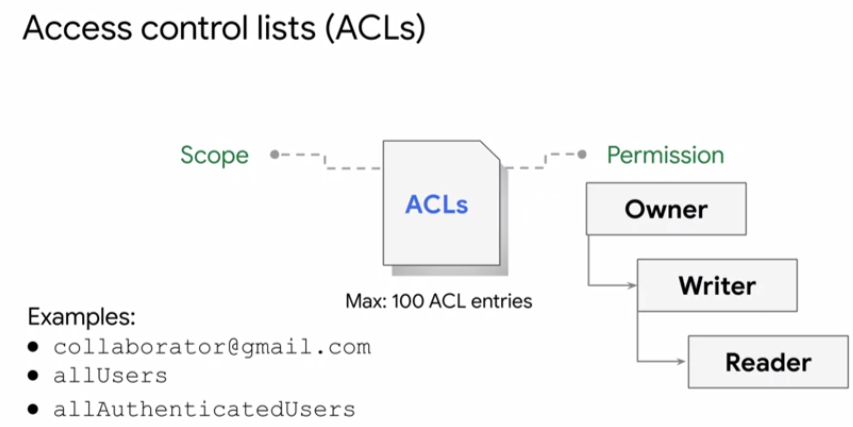

Limited-time access to a user:

`gsutil signurl -d 10m path/to/privatekey.p12 gs://bucket/object`

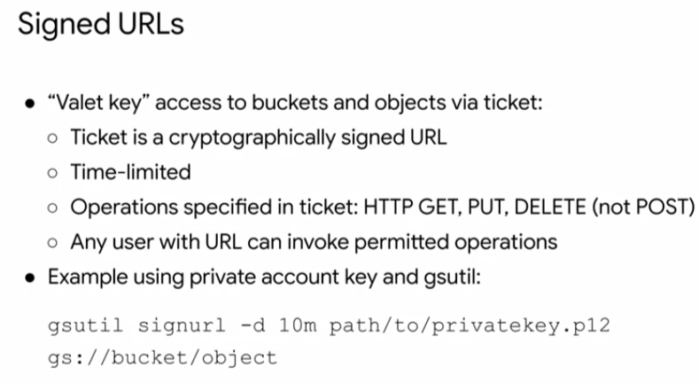

Cloud Storage Features

([video](https://www.coursera.org/learn/gcp-infrastructure-core-services/lecture/wKUHL/cloud-storage-features))

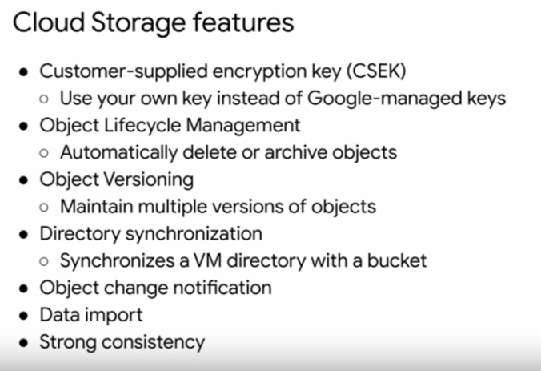

Object versioning (OFF by default)

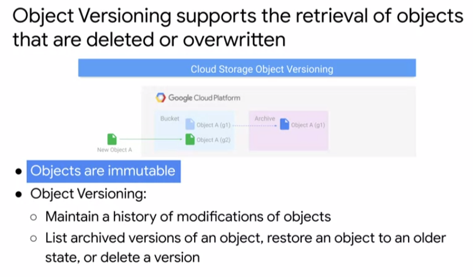

Object lifecycle management (rule-based actions: e.g. delete an object after a year, ...)

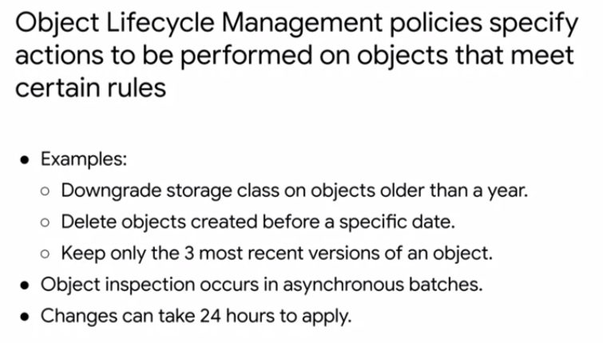

Object Notification with webhooks

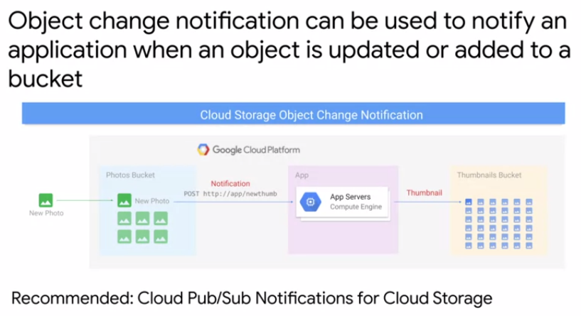

Data Import services (TeraBytes of data):

- **Transfer Appliance** (hardware appliance from 100TB to 1 PetaBytes)
- **Storage Transfer Service** (from online data, e.g. from AWS bucket)
- **Offline Media Import**: 3rd party provider uploads data from physical media 

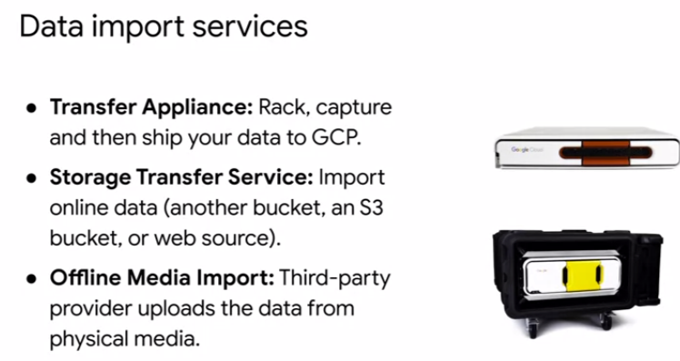

Decision tree to choose your storage class

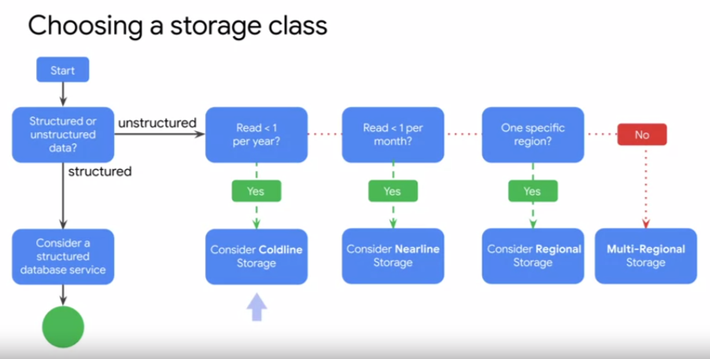

### Cloud Storage lab

- [lab tasks description](https://www.coursera.org/learn/gcp-infrastructure-core-services/lecture/bcncM/lab-intro-cloud-storage)
- [lab notes](../labs/lab_Cloud_Storage.md)
- [Lab Review: Cloud Storage](https://www.coursera.org/learn/gcp-infrastructure-core-services/lecture/6IAAh/lab-review-cloud-storage)

### Cloud SQL

- [module intro video](https://www.coursera.org/learn/gcp-infrastructure-core-services/lecture/cMja1/cloud-sql)

Cloud SQL is a **"managed service"** offering an _SQL database_ **service**.

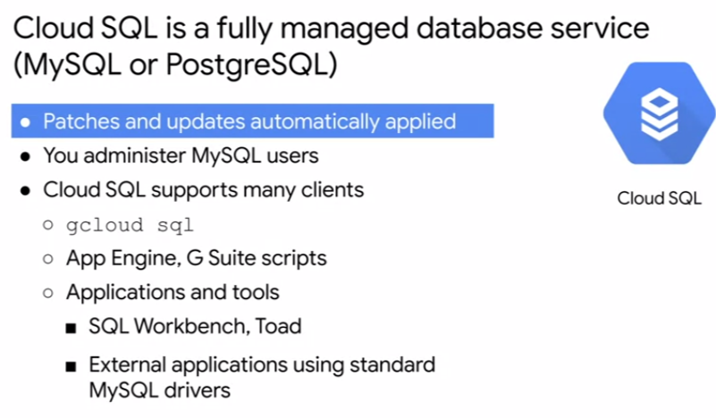

Performances
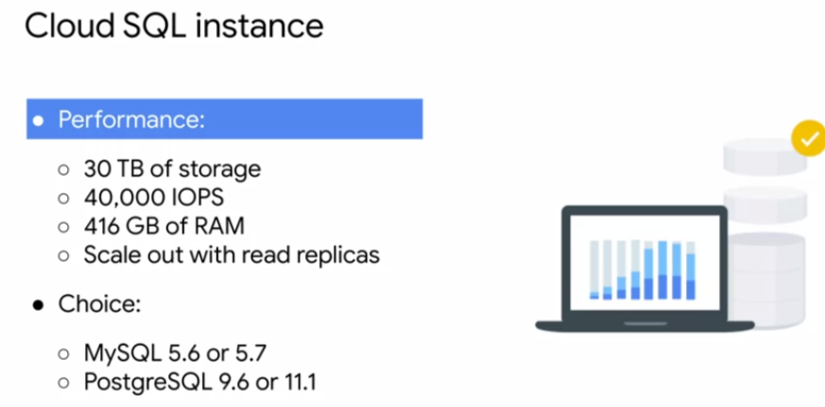

Optional features (backup, automatic failover, import/export and scaling)

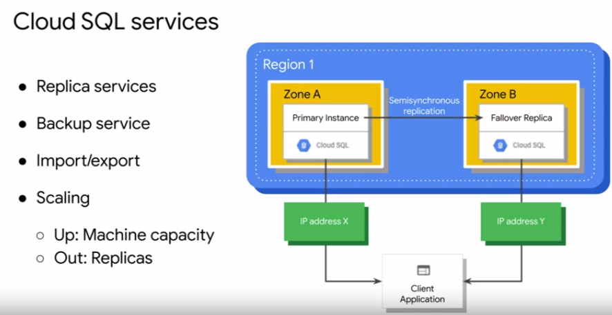

Connecting to a Cloud SQL instance (Summarized in a decision tree for Best Practices)

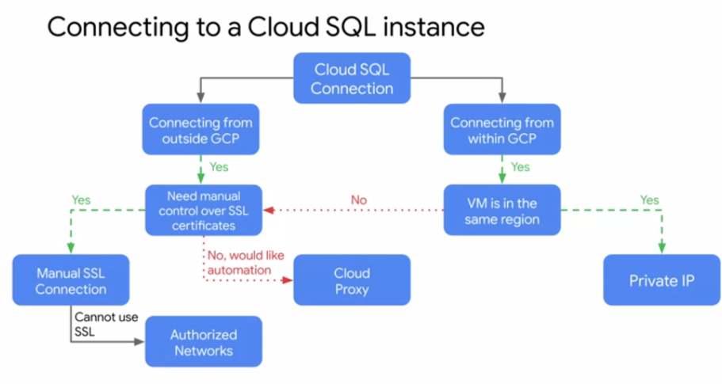

Decision tree for your SQL storage

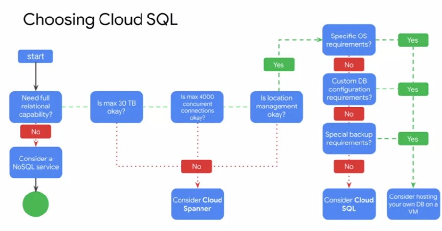

### Cloud SQL lab

- [lab tasks description](https://www.coursera.org/learn/gcp-infrastructure-core-services/lecture/caD6h/lab-intro-cloud-sql)
- [lab notes](../labs/lab_Cloud_SQL.md)
- [Lab Review: Cloud SQL (MySQL)](https://www.coursera.org/learn/gcp-infrastructure-core-services/lecture/1Il73/lab-review-cloud-sql)

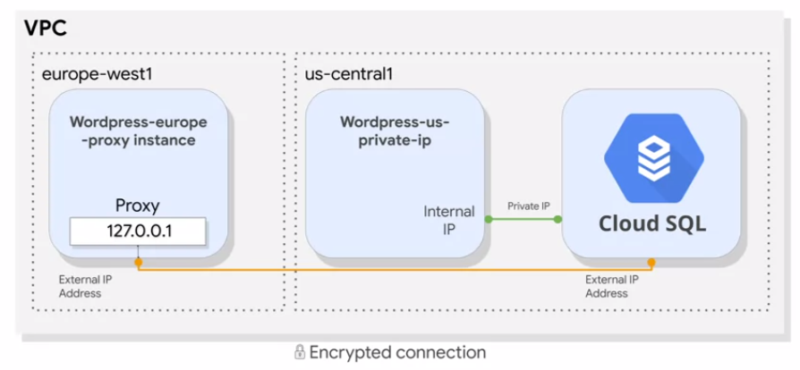

### Cloud Spanner

[video](https://www.coursera.org/learn/gcp-infrastructure-core-services/lecture/gu1Xc/cloud-spanner)

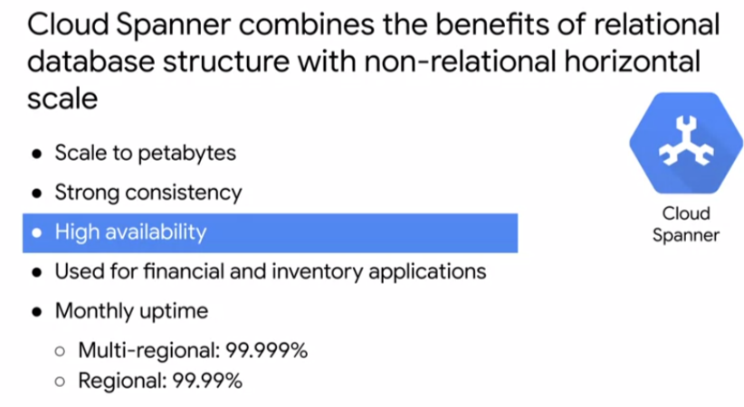

Best of Relational & non-relational DB world

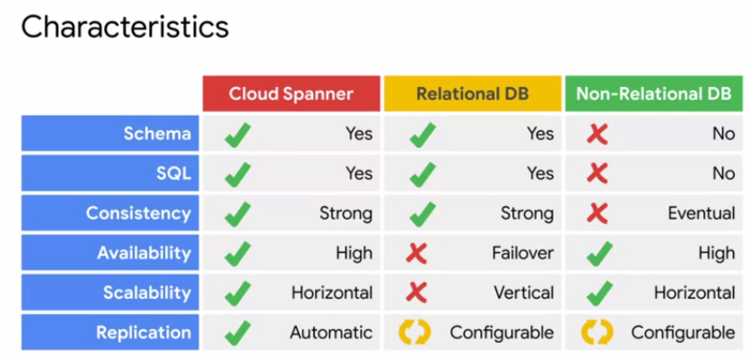

This architecture allows for high availability and global placement:

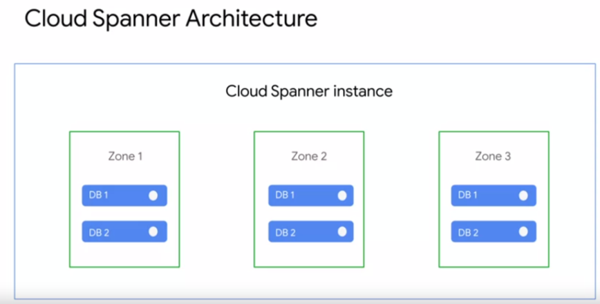

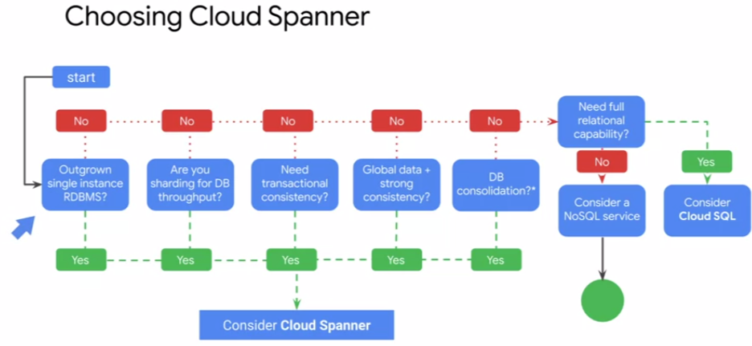

### Cloud Firestore

[video](https://www.coursera.org/learn/gcp-infrastructure-core-services/lecture/Z0QRZ/cloud-firestore)

Cloud Firestore is a:
- fast,
- fully managed,
- serverless Cloud native,
- NoSQL document database,
- that simplifies storing, sinking, and querying data for your mobile, web, and IoT apps at global scale

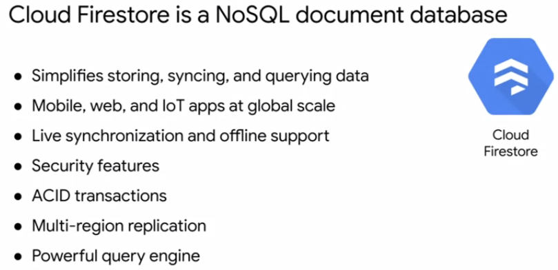

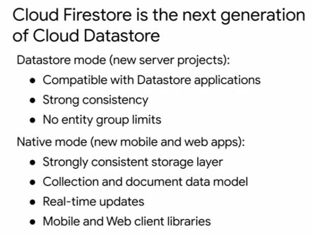

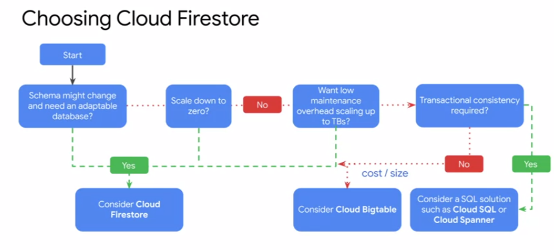

### Cloud Bigtable

### Cloud Memorystore

## Resource Management

= Manage and examine **Billing** of GCP resources

## Resource Monitoring

=  monitor GCP resources using **StackDriver**

## Resources/Articles
