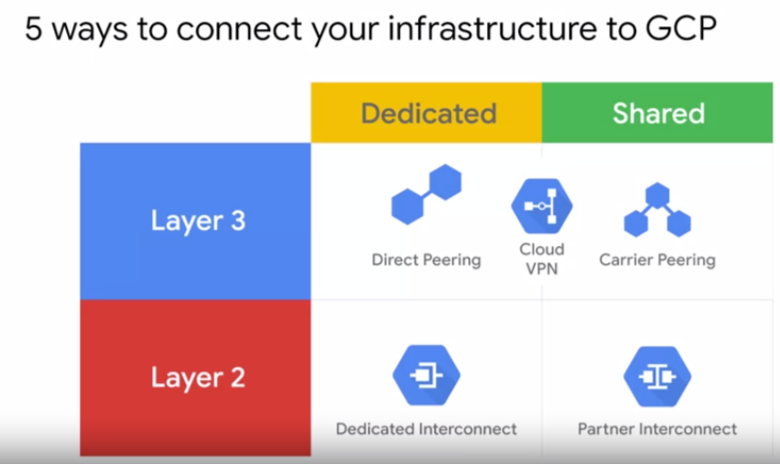

# Elastic Cloud Infrastructure: Scaling & Automation

## Content

[2-weeks course intro video](https://www.coursera.org/learn/gcp-infrastructure-scaling-automation/lecture/KHRmh/course-introduction)

* [**Interconnecting Networks**](#interconnecting-networks)
* [**Load Balancing & Autoscaling**](#load-balancing--autoscaling)
* [**Infrastructure Automation**](#infrastructure-automation)
* [**Managed Services**](#managed-services)
* [Resources/Articles](#resourcesarticles)

This course builds on the [Essential Cloud Infrastructure: Core Services](./course_3_Essential_Cloud_Infrastructure__Core_Services.md) course and enhances your study of architecting with Compute Engine.

In this course, we start by going over:

- the different options to interconnect networks to enable you to connect your infrastructure to GCP. 
- GCP’s load balancing and autoscaling services, which you will get to explore directly. 
- the infrastructure automation services like **Deployment Manager** and **Terraform**, so that you can automate the deployment of GCP infrastructure services.
- The other managed services that you might want to leverage in GCP. 

## Interconnecting Networks (Module 1)

- [Module Overview video: Interconnecting Networks](https://www.coursera.org/learn/gcp-infrastructure-scaling-automation/lecture/Hi6hM/module-overview)
- [Module Review video](https://www.coursera.org/learn/gcp-infrastructure-scaling-automation/lecture/BDnmM/module-review)  

= different options to interconnect to GCP

### Cloud VPN

[video](https://www.coursera.org/learn/gcp-infrastructure-scaling-automation/lecture/oEOJj/cloud-vpn)

Example:

Dynamic routes with **Cloud Router**

### lab: Cloud VPN

- [Lab Intro: Virtual Private Networks (VPN)](https://www.coursera.org/learn/gcp-infrastructure-scaling-automation/lecture/Z2dw4/lab-intro-virtual-private-networks-vpn)
- [Lab Review video: Virtual Private Networks (VPN)](https://www.coursera.org/learn/gcp-infrastructure-scaling-automation/lecture/nTXif/lab-review-virtual-private-networks-vpn)

### Cloud Interconnect & Peering

[video](https://www.coursera.org/learn/gcp-infrastructure-scaling-automation/lecture/lhPq3/cloud-interconnect-and-peering) 

There are different **Cloud Interconnect** and **Peering services** available to connect your infrastructure to Google's network.

These services can be split into:
- **dedicated connections** versus **shared connections**: Dedicated connections provide a direct connection to Google's network. But, shared connections provide a connection to Google's network through a partner.
- and **layer 2** verses **layer 3** connections: Layer 2 connections use a **VLAN that pipes directly into your GCP environment**, providing connectivity to internal IP addresses in the RFC 1918 address space. Layer 3 connections provide **access to G Suite services, YouTube and Google Cloud APIs using public IP addresses**. 

The services are:

* **Direct Peering**,
* **Carrier Peering**, 
* **Dedicated Interconnect**, 
* and **Partner Interconnect**.

 Now as I just explained earlier, Google also offers its own Virtual Private Network service called **Cloud VPN**. This service uses the public Internet but traffic is encrypted and provides access to internal IP addresses. That's why Cloud VPN is a useful addition to Direct Peering and Carrier Peering. 

#### Cloud Interconnect

[video](https://www.coursera.org/learn/gcp-infrastructure-scaling-automation/lecture/OeoTK/cloud-interconnect)

##### Dedicated Interconnect

[Documentation](https://cloud.google.com/interconnect/docs/concepts/dedicated-overview#redundancy)

Definition **SLA***: Service Level Agreement

"99.9% uptime SLA"

**Dedicated Interconnect** needs **Colocation Facility Locations**:

[Documentation on Colocation Facility Locations](https://cloud.google.com/interconnect/docs/concepts/colocation-facilities)

Google locations for physically interconnecting between Google's network and a private network:

#### Supported Service Providers

[Documentation & list of Service providers per country](https://cloud.google.com/interconnect/docs/concepts/service-providers)

#### Partner Interconnect 

If you are no-where near one of this "Colocation Facility Locations", consider **Partner Interconnect**.

[Documentation](https://cloud.google.com/interconnect/docs/concepts/partner-overview#redundancy)

#### Comparison of capacity/location's requirements

### Cloud Peering service

- [video](https://www.coursera.org/learn/gcp-infrastructure-scaling-automation/lecture/4QMn8/peering)
- [Documentation on Peering](https://peering.google.com/#/options/peering)
- [Google LLC PeeringDB](https://www.peeringdb.com/asn/15169)
- [Public Peering Exchange Points](https://www.peeringdb.com/net/4319)
- [Peering Service providers](https://cloud.google.com/interconnect/docs/how-to/carrier-peering#service_providers)

There is 2 kinds of Peering:

- Direct Peering 
- Carrier Peering

#### Direct Peering 

#### Carrier Peering

If you are no-where near these Google locations, you might consider "**Carrier Peering**".

#### Comparison of Peering options

#### Choosing a connection

The 5 different ways to connect your infrastructure to GCP:

Another way to organize these sources is by:

- **interconnect services**: Interconnect services provide direct access to RFC1918 IP addresses in your VPC with an SLA.
- and by **peering services**: Peering services in contrast offer access to Google public IP addresses only without an SLA. 

 

#### Flow diagram to decide which connection to choose

### Sharing VPC Networks: Shared VPC and VPC Peering

[video](https://www.coursera.org/learn/gcp-infrastructure-scaling-automation/lecture/d6NEM/shared-vpc-and-vpc-peering)

2 configurations for sharing VPC networks across GCP projects:

- **Shared VPC**: allows you to share a network across several projects in your GCP organization
- **VPC Network Peering**: allows you to configure private communication across projects in same or different organizations.

#### Shared VPC

#### VPC Network Peering

VPC Network Peering is a decentralized or distributed approach to multiproject networking. Because each VPC network, may remain under the control of separate administrator groups, and maintains its own global firewall, and routing tables.

#### Comparison Shared VPC vs VPC Peering

Differences in Network administration models:

## Load Balancing & Autoscaling  (Module 2)

- [Module overivew video](https://www.coursera.org/learn/gcp-infrastructure-scaling-automation/lecture/hYGrW/module-overview)

## Infrastructure Automation  (Module 3: Deployment Manager & Terraform)

= "Deployment Manager" or "Terraform" to automate the deployment of **GCP infrastructure Services**

Different types of load balancers that can be divided into two categories:

- **global**
- **regional**

### Global load balancers

The global load balancers are the HTTP, HTTPS, SSL proxy, and TCP proxy load balancers. 

These load balancers leverage the Google front ends which are software defined, distributed systems that sit in Google's Point-of-Presence and are distributed globally. Therefore, you want to use a global load balancer when your users and instances are globally distributed. Your users need access to the same application and content and you want to provide access using a single anycast IP address.

### Regional load balancers

The regional load balancers are the **internal and network load balancers** and they distribute traffic to instances that are in a single GCP region.

The internal load balancer uses Andromeda which is GCP's software defined network virtualization stack and the network load balancer uses Maglev which is a large distributed software system. There's also another internal load balancer for HTTP, HTTPS traffic, but it's in beta as of this recording

### Managed Instance Groups

[video](https://www.coursera.org/learn/gcp-infrastructure-scaling-automation/lecture/IbepU/managed-instance-groups)

**Definition**: A managed instance group is a **collection of identical virtual machine instances** that you control as a single entity using an **instance template**.

You will need to create/use Instance Templates: 

Define "rules" for your instance group:

In practice, you are just creating VMs but applying much more rules to that instance group.

#### Autoscaling & Health checks

[video](https://www.coursera.org/learn/gcp-infrastructure-scaling-automation/lecture/IylfJ/autoscaling-and-health-checks)

Based on utilization and your thresholds:

How to decide on a threshold?

Another tool: Health Check, similar to Uptime checks in Stackdriver:

### HTTP(S) Load Balancing

[overview video](https://www.coursera.org/learn/gcp-infrastructure-scaling-automation/lecture/suxVg/overview-of-http-s-load-balancing)

Architecture of an HTTP(S) load balancer

Backend services provided by a load balancer:

Example #1: HTTP load balancer on a single global IP ([video](https://www.coursera.org/learn/gcp-infrastructure-scaling-automation/lecture/RodYr/example-http-load-balancer))

Example #2: HTTP load balancer (Content-based load balancer)

- 2 backends service: WEB (`/<whatever>`) or VIDEO (`/video`) traffic
- traffic is split by the URL header, as specified by the URL map

HTTPS load balancer ([video](HTTP(S) load balancing))

- same structure as an HTTP load balancer
- SSL certificate
- QUIC transport layer protocol

SSL certificate:

### Lab: Configuring an HTTP Load Balancer with Autoscaling

- [intro video](https://www.coursera.org/learn/gcp-infrastructure-scaling-automation/lecture/WBXBJ/lab-intro-configuring-an-http-load-balancer-with-autoscaling)
- [lab notes](../labs/lab_Load_balancer_with_Autoscaling.md)
- [review video](https://www.coursera.org/learn/gcp-infrastructure-scaling-automation/lecture/cF54y/lab-review-configuring-an-http-load-balancer-with-autoscaling)

- 2 backends in different regions: us_central_1 & europe_west_1
- demonstrate load balancing
- demonstrate autoscaling

### SSL Proxy/TCP Proxy Load Balancing

### Network Load Balancing

### Internal Load Balancing

### Lab: ...

### Choosing a Load Balancer

## Managed Services  (Module 4)

Other managed services that you would like to leverage in GCP (e.g. MongoDB, Kafka, ...)

## Resources/Articles

- [Networking in Google Cloud Platform course](https://www.qwiklabs.com/courses/751)