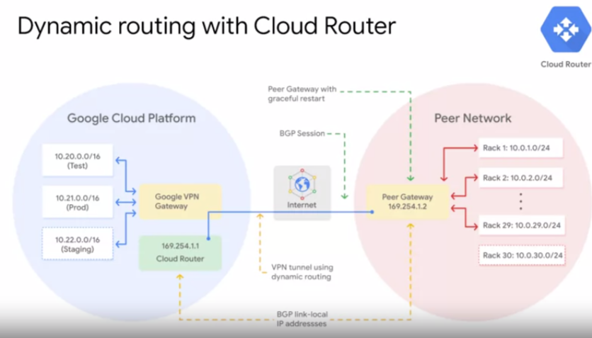

# Elastic Cloud Infrastructure: Scaling & Automation

## Content

[2-weeks course intro video](https://www.coursera.org/learn/gcp-infrastructure-scaling-automation/lecture/KHRmh/course-introduction)

* [**Interconnecting Networks**](#interconnecting-networks)
* [**Load Balancing & Autoscaling**](#load-balancing--autoscaling)
* [**Infrastructure Automation**](#infrastructure-automation)
* [**Managed Services**](#managed-services)
* [Resources/Articles](#resourcesarticles)

This course builds on the [Essential Cloud Infrastructure: Core Services](./course_3_Essential_Cloud_Infrastructure__Core_Services.md) course and enhances your study of architecting with Compute Engine.

In this course, we start by going over:

- the different options to interconnect networks to enable you to connect your infrastructure to GCP. 
- GCP’s load balancing and autoscaling services, which you will get to explore directly. 
- the infrastructure automation services like **Deployment Manager** and **Terraform**, so that you can automate the deployment of GCP infrastructure services.
- The other managed services that you might want to leverage in GCP. 

## Interconnecting Networks (Module 1)

- [Module Overview: Interconnecting Networks](https://www.coursera.org/learn/gcp-infrastructure-scaling-automation/lecture/Hi6hM/module-overview)   

= different options to interconnect to GCP

### Cloud VPN

[video](https://www.coursera.org/learn/gcp-infrastructure-scaling-automation/lecture/oEOJj/cloud-vpn)

Example:

Dynamic routes with **Cloud Router**

### lab: Cloud VPN

- [Lab Intro: Virtual Private Networks (VPN)](https://www.coursera.org/learn/gcp-infrastructure-scaling-automation/lecture/Z2dw4/lab-intro-virtual-private-networks-vpn)
- [Lab Review video: Virtual Private Networks (VPN)](https://www.coursera.org/learn/gcp-infrastructure-scaling-automation/lecture/nTXif/lab-review-virtual-private-networks-vpn)

### Cloud Interconnect & Peering

[video](https://www.coursera.org/learn/gcp-infrastructure-scaling-automation/lecture/lhPq3/cloud-interconnect-and-peering) 

There are different **Cloud Interconnect** and **Peering services** available to connect your infrastructure to Google's network.

These services can be split into:
- **dedicated connections** versus **shared connections**: Dedicated connections provide a direct connection to Google's network. But, shared connections provide a connection to Google's network through a partner.
- and **layer 2** verses **layer 3** connections: Layer 2 connections use a **VLAN that pipes directly into your GCP environment**, providing connectivity to internal IP addresses in the RFC 1918 address space. Layer 3 connections provide **access to G Suite services, YouTube and Google Cloud APIs using public IP addresses**. 

The services are:

* **Direct Peering**,
* **Carrier Peering**, 
* **Dedicated Interconnect**, 
* and **Partner Interconnect**.

 Now as I just explained earlier, Google also offers its own Virtual Private Network service called **Cloud VPN**. This service uses the public Internet but traffic is encrypted and provides access to internal IP addresses. That's why Cloud VPN is a useful addition to Direct Peering and Carrier Peering. 

#### Cloud Interconnect

[video](https://www.coursera.org/learn/gcp-infrastructure-scaling-automation/lecture/OeoTK/cloud-interconnect)

##### Dedicated Interconnect

[Documentation](https://cloud.google.com/interconnect/docs/concepts/dedicated-overview#redundancy)

Definition **SLA***: Service Level Agreement

"99.9% uptime SLA"

**Dedicated Interconnect** needs **Colocation Facility Locations**:

[Documentation on Colocation Facility Locations](https://cloud.google.com/interconnect/docs/concepts/colocation-facilities)

Google locations for physically interconnecting between Google's network and a private network:

#### Supported Service Providers

[Documentation & list of Service providers per country](https://cloud.google.com/interconnect/docs/concepts/service-providers)

#### Partner Interconnect 

If you are no-where near one of this "Colocation Facility Locations", consider **Partner Interconnect**.

[Documentation](https://cloud.google.com/interconnect/docs/concepts/partner-overview#redundancy)

#### Comparison of capacity/location's requirements

### Cloud Peering service

- [video](https://www.coursera.org/learn/gcp-infrastructure-scaling-automation/lecture/4QMn8/peering)
- [Documentation on Peering](https://peering.google.com/#/options/peering)
- [Google LLC PeeringDB](https://www.peeringdb.com/asn/15169)
- [Public Peering Exchange Points](https://www.peeringdb.com/net/4319)
- [Peering Service providers](https://cloud.google.com/interconnect/docs/how-to/carrier-peering#service_providers)

There is 2 kinds of Peering:

- Direct Peering 
- Carrier Peering

#### Direct Peering 

#### Carrier Peering

If you are no-where near these Google locations, you might consider "**Carrier Peering**".

#### Comparison of Peering options

### Sharing VPC Networks

## Load Balancing & Autoscaling  (Module 2)

## Infrastructure Automation  (Module 3: Deployment Manager & Terraform)

= "Deployment Manager" or "Terraform" to automate the deployment of **GCP infrastructure Services**

## Managed Services  (Module 4)

Other managed services that you would like to leverage in GCP (e.g. MongoDB, Kafka, ...)

## Resources/Articles
