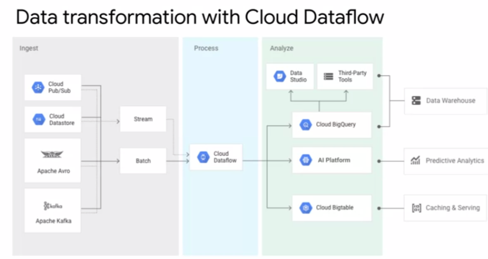

# Elastic Cloud Infrastructure: Scaling & Automation

## Content

[2-weeks course intro video](https://www.coursera.org/learn/gcp-infrastructure-scaling-automation/lecture/KHRmh/course-introduction)

* [Interconnecting Networks (Module 1)](#interconnecting-networks-module-1)
    * [Cloud VPN](#cloud-vpn)
    * [lab: Cloud VPN](#lab-cloud-vpn)
    * [Cloud Interconnect & Peering](#cloud-interconnect--peering)
    * [Cloud Interconnect](#cloud-interconnect)
        * [Dedicated Interconnect](#dedicated-interconnect)
    * [Supported Service Providers](#supported-service-providers)
    * [Partner Interconnect](#partner-interconnect)
    * [Comparison of capacity/location's requirements](#comparison-of-capacitylocations-requirements)
    * [Cloud Peering service](#cloud-peering-service)
    * [Direct Peering](#direct-peering)
    * [Carrier Peering](#carrier-peering)
    * [Comparison of Peering options](#comparison-of-peering-options)
    * [Choosing a connection](#choosing-a-connection)
    * [Flow diagram to decide which connection to choose](#flow-diagram-to-decide-which-connection-to-choose)
    * [Sharing VPC Networks: Shared VPC and VPC Peering](#sharing-vpc-networks-shared-vpc-and-vpc-peering)
    * [Shared VPC](#shared-vpc)
    * [VPC Network Peering](#vpc-network-peering)
    * [Comparison Shared VPC vs VPC Peering](#comparison-shared-vpc-vs-vpc-peering)
* [Load Balancing & Autoscaling  (Module 2)](#load-balancing--autoscaling--module-2)
    * [Global load balancers](#global-load-balancers)
    * [Regional load balancers](#regional-load-balancers)
    * [Managed Instance Groups](#managed-instance-groups)
    * [Autoscaling & Health checks](#autoscaling--health-checks)
    * [HTTP(S) Load Balancing](#https-load-balancing)
    * [Lab: Configuring an HTTP Load Balancer with Autoscaling](#lab-configuring-an-http-load-balancer-with-autoscaling)
    * [SSL Proxy/TCP Proxy Load Balancing](#ssl-proxytcp-proxy-load-balancing)
    * [SSL Proxy load balancing](#ssl-proxy-load-balancing)
    * [TCP Proxy load balancing](#tcp-proxy-load-balancing)
    * [Network Load Balancing](#network-load-balancing)
    * [What is a target pooled resource?](#what-is-a-target-pooled-resource)
    * [Internal Load Balancing](#internal-load-balancing)
    * [Lab: Configuring an Internal Load Balancer](#lab-configuring-an-internal-load-balancer)
    * [Choosing a Load Balancer](#choosing-a-load-balancer)
    * [Support for IPV6 is a differentiator](#support-for-ipv6-is-a-differentiator)
    * [Decision tree to help you find your load balancing service](#decision-tree-to-help-you-find-your-load-balancing-service)
* [Infrastructure Automation  (Module 3: Deployment Manager & Terraform)](#infrastructure-automation--module-3-deployment-manager--terraform)
* [Managed Services  (Module 4)](#managed-services--module-4)
* [Resources/Articles](#resourcesarticles)

This course builds on the [Essential Cloud Infrastructure: Core Services](./course_3_Essential_Cloud_Infrastructure__Core_Services.md) course and enhances your study of architecting with Compute Engine.

In this course, we start by going over:

- the different options to interconnect networks to enable you to connect your infrastructure to GCP. 
- GCP’s load balancing and autoscaling services, which you will get to explore directly. 
- the infrastructure automation services like **Deployment Manager** and **Terraform**, so that you can automate the deployment of GCP infrastructure services.
- The other managed services that you might want to leverage in GCP. 

## Interconnecting Networks (Module 1)

- [Module Overview video: Interconnecting Networks](https://www.coursera.org/learn/gcp-infrastructure-scaling-automation/lecture/Hi6hM/module-overview)
- [Module Review video](https://www.coursera.org/learn/gcp-infrastructure-scaling-automation/lecture/BDnmM/module-review)  

= different options to interconnect to GCP

### Cloud VPN

[video](https://www.coursera.org/learn/gcp-infrastructure-scaling-automation/lecture/oEOJj/cloud-vpn)

Example:

Dynamic routes with **Cloud Router**

### lab: Cloud VPN

- [Lab Intro: Virtual Private Networks (VPN)](https://www.coursera.org/learn/gcp-infrastructure-scaling-automation/lecture/Z2dw4/lab-intro-virtual-private-networks-vpn)
- [Lab Review video: Virtual Private Networks (VPN)](https://www.coursera.org/learn/gcp-infrastructure-scaling-automation/lecture/nTXif/lab-review-virtual-private-networks-vpn)

### Cloud Interconnect & Peering

[video](https://www.coursera.org/learn/gcp-infrastructure-scaling-automation/lecture/lhPq3/cloud-interconnect-and-peering) 

There are different **Cloud Interconnect** and **Peering services** available to connect your infrastructure to Google's network.

These services can be split into:
- **dedicated connections** versus **shared connections**: Dedicated connections provide a direct connection to Google's network. But, shared connections provide a connection to Google's network through a partner.
- and **layer 2** verses **layer 3** connections: Layer 2 connections use a **VLAN that pipes directly into your GCP environment**, providing connectivity to internal IP addresses in the RFC 1918 address space. Layer 3 connections provide **access to G Suite services, YouTube and Google Cloud APIs using public IP addresses**. 

The services are:

* **Direct Peering**,
* **Carrier Peering**, 
* **Dedicated Interconnect**, 
* and **Partner Interconnect**.

 Now as I just explained earlier, Google also offers its own Virtual Private Network service called **Cloud VPN**. This service uses the public Internet but traffic is encrypted and provides access to internal IP addresses. That's why Cloud VPN is a useful addition to Direct Peering and Carrier Peering. 

#### Cloud Interconnect

[video](https://www.coursera.org/learn/gcp-infrastructure-scaling-automation/lecture/OeoTK/cloud-interconnect)

##### Dedicated Interconnect

[Documentation](https://cloud.google.com/interconnect/docs/concepts/dedicated-overview#redundancy)

Definition **SLA***: Service Level Agreement

"99.9% uptime SLA"

**Dedicated Interconnect** needs **Colocation Facility Locations**:

[Documentation on Colocation Facility Locations](https://cloud.google.com/interconnect/docs/concepts/colocation-facilities)

Google locations for physically interconnecting between Google's network and a private network:

#### Supported Service Providers

[Documentation & list of Service providers per country](https://cloud.google.com/interconnect/docs/concepts/service-providers)

#### Partner Interconnect 

If you are no-where near one of this "Colocation Facility Locations", consider **Partner Interconnect**.

[Documentation](https://cloud.google.com/interconnect/docs/concepts/partner-overview#redundancy)

#### Comparison of capacity/location's requirements

### Cloud Peering service

- [video](https://www.coursera.org/learn/gcp-infrastructure-scaling-automation/lecture/4QMn8/peering)
- [Documentation on Peering](https://peering.google.com/#/options/peering)
- [Google LLC PeeringDB](https://www.peeringdb.com/asn/15169)
- [Public Peering Exchange Points](https://www.peeringdb.com/net/4319)
- [Peering Service providers](https://cloud.google.com/interconnect/docs/how-to/carrier-peering#service_providers)

There is 2 kinds of Peering:

- Direct Peering 
- Carrier Peering

#### Direct Peering 

#### Carrier Peering

If you are no-where near these Google locations, you might consider "**Carrier Peering**".

#### Comparison of Peering options

#### Choosing a connection

The 5 different ways to connect your infrastructure to GCP:

Another way to organize these sources is by:

- **interconnect services**: Interconnect services provide direct access to RFC1918 IP addresses in your VPC with an SLA.
- and by **peering services**: Peering services in contrast offer access to Google public IP addresses only without an SLA. 

 

#### Flow diagram to decide which connection to choose

### Sharing VPC Networks: Shared VPC and VPC Peering

[video](https://www.coursera.org/learn/gcp-infrastructure-scaling-automation/lecture/d6NEM/shared-vpc-and-vpc-peering)

2 configurations for sharing VPC networks across GCP projects:

- **Shared VPC**: allows you to share a network across several projects in your GCP organization
- **VPC Network Peering**: allows you to configure private communication across projects in same or different organizations.

#### Shared VPC

#### VPC Network Peering

VPC Network Peering is a decentralized or distributed approach to multiproject networking. Because each VPC network, may remain under the control of separate administrator groups, and maintains its own global firewall, and routing tables.

#### Comparison Shared VPC vs VPC Peering

Differences in Network administration models:

## Load Balancing & Autoscaling  (Module 2)

- [Module overivew video](https://www.coursera.org/learn/gcp-infrastructure-scaling-automation/lecture/hYGrW/module-overview)
- [Module review video](https://www.coursera.org/learn/gcp-infrastructure-scaling-automation/lecture/LNgte/module-review)

Different types of load balancers that can be divided into two categories:

- **global**
- **regional**

### Global load balancers

The global load balancers are the HTTP, HTTPS, SSL proxy, and TCP proxy load balancers. 

These load balancers leverage the Google front ends which are software defined, distributed systems that sit in Google's Point-of-Presence and are distributed globally. Therefore, you want to use a global load balancer when your users and instances are globally distributed. Your users need access to the same application and content and you want to provide access using a single anycast IP address.

### Regional load balancers

The regional load balancers are the **internal and network load balancers** and they distribute traffic to instances that are in a single GCP region.

The internal load balancer uses Andromeda which is GCP's software defined network virtualization stack and the network load balancer uses Maglev which is a large distributed software system. There's also another internal load balancer for HTTP, HTTPS traffic, but it's in beta as of this recording

### Managed Instance Groups

[video](https://www.coursera.org/learn/gcp-infrastructure-scaling-automation/lecture/IbepU/managed-instance-groups)

**Definition**: A managed instance group is a **collection of identical virtual machine instances** that you control as a single entity using an **instance template**.

You will need to create/use Instance Templates: 

Define "rules" for your instance group:

In practice, you are just creating VMs but applying much more rules to that instance group.

#### Autoscaling & Health checks

[video](https://www.coursera.org/learn/gcp-infrastructure-scaling-automation/lecture/IylfJ/autoscaling-and-health-checks)

Based on utilization and your thresholds:

How to decide on a threshold?

Another tool: Health Check, similar to Uptime checks in Stackdriver:

### HTTP(S) Load Balancing

[overview video](https://www.coursera.org/learn/gcp-infrastructure-scaling-automation/lecture/suxVg/overview-of-http-s-load-balancing)

Architecture of an HTTP(S) load balancer

Backend services provided by a load balancer:

Example #1: HTTP load balancer on a single global IP ([video](https://www.coursera.org/learn/gcp-infrastructure-scaling-automation/lecture/RodYr/example-http-load-balancer))

Example #2: HTTP load balancer (Content-based load balancer)

- 2 backends service: WEB (`/<whatever>`) or VIDEO (`/video`) traffic
- traffic is split by the URL header, as specified by the URL map

HTTPS load balancer ([video](HTTP(S) load balancing))

- same structure as an HTTP load balancer
- SSL certificate
- QUIC transport layer protocol

SSL certificate:

### Lab: Configuring an HTTP Load Balancer with Autoscaling

- [intro video](https://www.coursera.org/learn/gcp-infrastructure-scaling-automation/lecture/WBXBJ/lab-intro-configuring-an-http-load-balancer-with-autoscaling)
- [lab notes](../labs/lab_Load_balancer_with_Autoscaling.md)
- [review video](https://www.coursera.org/learn/gcp-infrastructure-scaling-automation/lecture/cF54y/lab-review-configuring-an-http-load-balancer-with-autoscaling)

- 2 backends in different regions: us_central_1 & europe_west_1
- demonstrate load balancing
- demonstrate autoscaling

### SSL Proxy/TCP Proxy Load Balancing

#### SSL Proxy load balancing

[video](https://www.coursera.org/learn/gcp-infrastructure-scaling-automation/lecture/CNZxs/ssl-proxy-load-balancing)

More on [SSL Proxy Load Balancing Concepts](https://cloud.google.com/load-balancing/docs/ssl/#overview)

Example using SSL Proxy load balancing (recommended over TCP load balancing)

#### TCP Proxy load balancing

[video](https://www.coursera.org/learn/gcp-infrastructure-scaling-automation/lecture/GnrcQ/tcp-proxy-load-balancing)

> NOT ENCRYPTED!!!!

Example using TCP Proxy load balancing:

> Also recommended to use SSL here between the backend and the frontend!

### Network Load Balancing

[video](https://www.coursera.org/learn/gcp-infrastructure-scaling-automation/lecture/PbNT7/network-load-balancing) 

Network load balancing is a **regional** **non-proxied** load balancing service.

In other words, all traffic is passed through the load balancer instead of being proxied and **traffic can only be balanced between virtual machine instances that are in the same region unlike a global load balancer**.

**When/Where to use it?**

You can use it to load balance UDP traffic and to load balance TCP NSSL traffic on ports that are not supported by the TCP proxy and SSL proxy load balancer.

The back ends of a network load balancer can be a **template-based instance group** or **target pooled resource**.

#### What is a target pooled resource?

They have limitations:

### Internal Load Balancing

[video](https://www.coursera.org/learn/gcp-infrastructure-scaling-automation/lecture/Ys411/internal-load-balancing)

**Internal load balancing** is a **regional**, private load balancing service for TCP and UDP based traffic. 

In other words, this load balancer enables you to run and **scale your services behind a private load balancing IP address**. This means that it is only accessible through the **internal IP address of virtual machine instances that are in the same region**. Therefore, use internal load balancing to configure an internal load balancing IP address, to act as the front end to your private backend instances.

**"3-tier web service" use case**

### Lab: Configuring an Internal Load Balancer

- [video intro](https://www.coursera.org/learn/gcp-infrastructure-scaling-automation/lecture/vt2PJ/lab-intro-configuring-an-internal-load-balancer)
- [Lab notes](../labs/lab_Internal_Load_balancer.md) 
- [Lab review video](https://www.coursera.org/learn/gcp-infrastructure-scaling-automation/lecture/WPl40/lab-review-configuring-an-internal-load-balancer)

### Choosing a Load Balancer

[video](https://www.coursera.org/learn/gcp-infrastructure-scaling-automation/lecture/bTKU2/choosing-a-load-balancer)

#### Support for IPV6 is a differentiator

**One differentiator** between the different GCP load balancers is the **support for IPv6 clients**. Only the HTTPS, SSL proxy, and TCP proxy load balancing services support IPV6 clients

#### Decision tree to help you find your load balancing service

- Global vs regional load balancing,
- external vs internal load balancing,
- and the traffic type

## Infrastructure Automation  (Module 3: Deployment Manager & Terraform)

- [Module intro video](https://www.coursera.org/learn/gcp-infrastructure-scaling-automation/lecture/v1K52/module-overview)
- [Module review video](https://www.coursera.org/learn/gcp-infrastructure-scaling-automation/lecture/uYPYG/module-review)

= "Deployment Manager" or "Terraform" to automate the deployment of **GCP infrastructure Services**

= How to automate the deployment of GCP infrastructure

In this module, we cover :

- how to use **deployment manager** _to automate the deployment of infrastructure_,
- and how to use **GCP marketplace** _to launch infrastructure solutions_.

### Deployment Manager

[video](https://www.coursera.org/learn/gcp-infrastructure-scaling-automation/lecture/PUEkH/deployment-manager)

Creating resources using GCP:

- GCP Console (GUI, easy for newbies or new to a service)
- Cloud Shell (Command line tool, if you know how to use the service)
- Cloud SDK (programmatically... one step further)

Deployment Manager takes it one step further: a **declarative approach**.

#### Example: automode network with firewall rule 

- automate using templates: one of the automode network, one for the firewall rule.

- [Supported resources type for Deployment Manager](https://cloud.google.com/deployment-manager/docs/configuration/supported-resource-types)

#### Other tools than Deployment Manager

- Terraform
- Ansible
- Packer
- Chef
- puppet
- ...

Many of them works across other Cloud provider, e.g. Terraform!

- Other tools similar to Deployment Manager: [Infrastructure as Code (IaC) tools for Google Cloud](https://cloud.google.com/solutions/infrastructure-as-code/#cards)

#### Lab Intro: Automating the Infrastructure of Networks Using Deployment Manager and/or Terraform

- [overview video](https://www.coursera.org/learn/gcp-infrastructure-scaling-automation/lecture/lqJj0/lab-intro-automating-the-infrastructure-of-networks-using-deployment-manager-or)
- [lab notes](../labs/lab_deployment_manager_from_templates_automode_network_with_firewall.md)
- [lab review video](https://www.coursera.org/learn/gcp-infrastructure-scaling-automation/lecture/rAynt/lab-review-automating-the-infrastructure-of-networks-using-deployment-manager)

#### Lab: Automating the Infrastructure of networks using Terraform

- [overview video](https://www.coursera.org/learn/gcp-infrastructure-scaling-automation/lecture/lqJj0/lab-intro-automating-the-infrastructure-of-networks-using-deployment-manager-or)
- [lab notes](../labs/lab_deployment_infrastructure_using_Terraform_automode_network_with_firewall.md)
- [lab review video](https://www.coursera.org/learn/gcp-infrastructure-scaling-automation/lecture/z1lV3/lab-review-automating-the-infrastructure-of-networks-using-terraform)

### GCP Marketplace

[video](https://www.coursera.org/learn/gcp-infrastructure-scaling-automation/lecture/NUkQL/gcp-marketplace)

GCP marketplace lets you quickly deploy functional software packages that run on GCP. Essentially, GCP marketplace offers production grade solutions from third-party vendors who have already created their own deployment configurations based on Deployment Manager.

[Demo: Launch on GCP Marketplace (LAMP stack)](https://www.coursera.org/learn/gcp-infrastructure-scaling-automation/lecture/PpU8W/demo-launch-on-gcp-marketplace)

## Managed Services  (Module 4)

- [video](https://www.coursera.org/learn/gcp-infrastructure-scaling-automation/lecture/e9a4x/module-overview)
- [Module review video](https://www.coursera.org/learn/gcp-infrastructure-scaling-automation/lecture/mS3CY/module-review)

- Other managed services that you would like to leverage in GCP (e.g. MongoDB, Kafka, ...)

As an alternative to infrastructure automation you can eliminate the need to create infrastructure by leveraging a managed service.

Managed services are partial or complete solutions offered as a service. They exist on a continuum between platform as a service and software as a service depending on how much of the internal methods and controls are exposed

 In this module, we give you an overview of **BigQuery**, **Cloud Dataflow**, **Cloud Dataprep** by **Trifecta** and **Cloud Dataproc**. Now, all of these services are for data analytics purposes. And since that's not the focus of this course series, there won't be any labs on this module. Instead we'll have a quick demo to illustrate how easy it is to use managed services.

- [1min about BigQuery](https://www.coursera.org/learn/gcp-infrastructure-scaling-automation/lecture/1XYDI/bigquery)
   
   

- [1min about Cloud Dataflow](https://www.coursera.org/learn/gcp-infrastructure-scaling-automation/lecture/k3C1g/cloud-dataflow)
   
   

- [1min about Cloud Dataprep](https://www.coursera.org/learn/gcp-infrastructure-scaling-automation/lecture/ycy9w/cloud-dataprep) by Trifacta
   
   

- [1min about Cloud Dataproc](https://www.coursera.org/learn/gcp-infrastructure-scaling-automation/lecture/7veQ3/cloud-dataproc)
   
   

[Demo: Cloud Dataproc](https://www.coursera.org/learn/gcp-infrastructure-scaling-automation/lecture/6RIEm/demo-cloud-dataproc)

## Resources/Articles

- [Networking in Google Cloud Platform course](https://www.qwiklabs.com/courses/751)
- Load balancing over the QUIC protocol: [QUIC, a multiplexed stream transport over UDP](https://www.chromium.org/quic)
- [SSL Proxy Load Balancing Concepts](https://cloud.google.com/load-balancing/docs/ssl/#overview)
- [Andromeda](https://cloudplatform.googleblog.com/2014/04/enter-andromeda-zone-google-cloud-platforms-latest-networking-stack.html): Google's network virtualization stack, to provide software-defined load balancing that directly delivers the traffic from the client instance to a backend instance. 
- [Supported resources type for Deployment Manager](https://cloud.google.com/deployment-manager/docs/configuration/supported-resource-types)
- Other tools similar to Deployment Manager: [Infrastructure as Code (IaC) tools for Google Cloud](https://cloud.google.com/solutions/infrastructure-as-code/#cards)