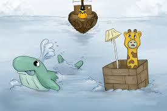

# Elastic Cloud Infrastructure: Containers and Services

## Content

* [Course Intro](#course-intro)
* [Module: Application Infrastruture Services Concepts](#module-application-infrastruture-services-concepts)
    * [Cloud Pub/Sub](#cloud-pubsub)
    * [Benefits of Cloud Pub/Sub](#benefits-of-cloud-pubsub)
    * [Basics of Pub/Sub](#basics-of-pubsub)
    * [Complexity handled by Pub/Sub](#complexity-handled-by-pubsub)
    * [Integrations for publishing or subsribing](#integrations-for-publishing-or-subsribing)
    * [Use cases for Pub/Sub](#use-cases-for-pubsub)
    * [API Management](#api-management)
    * [Cloud Endpoints](#cloud-endpoints)
    * [Apigee](#apigee)
    * [Cloud Functions: Serverless offering](#cloud-functions-serverless-offering)
    * [A microservices architecture responding on triggers](#a-microservices-architecture-responding-on-triggers)
    * [Differences Cloud Functions/Endpoints](#differences-cloud-functionsendpoints)
    * [Demo: Cloud Functions](#demo-cloud-functions)
    * [Cloud Source Repositories](#cloud-source-repositories)
    * [Specialty APIs](#specialty-apis)
* [Module: Application Development Services (i.e. App Engine)](#module-application-development-services-ie-app-engine)
    * [App Engine among other compute services](#app-engine-among-other-compute-services)
    * [Example of App Engine app](#example-of-app-engine-app)
    * [Microservices in App Engine](#microservices-in-app-engine)
    * [Choosing Flexible or Standard environment](#choosing-flexible-or-standard-environment)
* [Module: Containers](#module-containers)
    * [Introduction to Containers.](#introduction-to-containers)
    * [Basics of containerization](#basics-of-containerization)
    * [Kubernetes Engine among other compute services](#kubernetes-engine-among-other-compute-services)
    * [History of containerization](#history-of-containerization)
    * [Benefits of containerization](#benefits-of-containerization)
    * [Google Kubernetes Engine](#google-kubernetes-engine)
    * [K8s clusters:](#k8s-clusters)
    * [K8s master endpoint/node:](#k8s-master-endpointnode)
    * [K8s Pods:](#k8s-pods)
    * [K8s Load Balancing using Labels:](#k8s-load-balancing-using-labels)
    * [K8s Deployment:](#k8s-deployment)
    * [K8s Pods scheduled on nodes:](#k8s-pods-scheduled-on-nodes)
    * [K8s deployed with built-in resilience](#k8s-deployed-with-built-in-resilience)
    * [K8s Rolling update:](#k8s-rolling-update)
    * [K8s support for IAM](#k8s-support-for-iam)
    * [K8s multizone container cluster](#k8s-multizone-container-cluster)
    * [K8s Node Pools: instance groups in the k8s cluster](#k8s-node-pools-instance-groups-in-the-k8s-cluster)
    * [K8s more features](#k8s-more-features)
    * [Google Container Registry](#google-container-registry)
    * [Lab: Kubernetes Load Balancing (Overview and Objectives)](#lab-kubernetes-load-balancing-overview-and-objectives)
* [Container environment comparison: Kubernetes Engine, App Engine, or Containers on Compute Engine?](#container-environment-comparison-kubernetes-engine-app-engine-or-containers-on-compute-engine)
* [Resources/Articles](#resourcesarticles)


## Course Intro

- course site: https://www.coursera.org/learn/gcp-infrastructure-containers-services
- [1-week course intro video](https://www.coursera.org/learn/gcp-infrastructure-containers-services/lecture/sIb77/elastic-cloud-infrastructure-containers-and-services-course-intro): Elastic Cloud Infrastructure: Containers and Services
- [Course overview video](https://www.coursera.org/learn/gcp-infrastructure-containers-services/lecture/OEhAf/module-overview-intro)


**What does "Containers and Services" mean?**

Well, let's start with **containers**. Essentially, containerization is something that Google's been doing for the last 12 years. It's essentially that hybrid between virtual machines and pure Platform as a Service. Now, you can deploy your code in a very nice little package with its dependencies. But the great thing is, it's portable. It can run on-premise, it can run in other cloud providers. Especially, it runs really well in Google Cloud Platform.

So, with containerization in general, we're going to introduce something we call **Kubernetes**, which is essentially **an outsourced version of** the internal system we call **Borg**. Borg essentially finds a home for your containers to live. Kubernetes helps you to automate and orchestrate where your containers live. If you want to take it even further, you can install Kubernetes, you can go to kubernetes.io. It's an open-source project. You can install that on-prem, or other individual cloud providers as well.

We have **a managed service version of that**, and that's called **Google Kubernetes Engine**. So now, we've automated a lot of that infrastructure process, but we've added some additional enhancements. Since Kubernetes has to run anywhere, it can't really integrate as well with native cloud provider features. Now, if you took some of our other courses, you may have learned about autoscaling, our firewall rules, load balancers, et cetera. Google Kubernetes Engine integrates into all those, and so it takes advantage of our global network. It can set up the firewall rules for you, load balancing, autoscaling rules, and you're also doing this with containers. So you really get a huge benefit running on Google Container Engine.

Now, then, **what about our services?** What are they? Well, first of all, they could be the application infrastructure.

- This could be our **Platform as a Service**. These are where you're deploying your own code Java, Python, Go, PHP, you name it.
- Perhaps you want to take advantage of **micro services** so you have **cloud functions**. We also have **Cloud Endpoints**, in which you can publish your APIs. And plus, there's a number of other managed services. Google Cloud Pub/Sub for messaging services between your applications, and thousands of individual APIs that are available to you and your applications, such as Google Maps API, Google Analytics, being able to pull calendar events from Google Calendar and, of course, a number of different cloud APIs, from machine learning APIs, vision APIs, sound, et cetera. You can go ahead and use our API Explorer to find out more, but there's going to be a great deal covered inside of this individual course.


## Module: Application Infrastruture Services Concepts

- [module review video](https://www.coursera.org/learn/gcp-infrastructure-containers-services/lecture/L778e/module-1-review-outro)

In this module, you will learn about Cloud Pub/Sub, API Management, Cloud Functions, Cloud Source Repositories, and Specialty APIs.

This module covers **"Application Infrastruture Services Concepts"**:

* Cloud Pub/Sub
* API Management
* Cloud Functions
* Cloud Source Repositories
* Specialty APIs

### Cloud Pub/Sub

[video](https://www.coursera.org/learn/gcp-infrastructure-containers-services/lecture/oiW44/cloud-pub-sub)


#### Benefits of Cloud Pub/Sub


#### Basics of Pub/Sub


#### Complexity handled by Pub/Sub 


#### Integrations for publishing or subsribing


#### Use cases for Pub/Sub


### API Management
 
[video](https://www.coursera.org/learn/gcp-infrastructure-containers-services/lecture/SA2Uc/api-management)

#### Cloud Endpoints


Example: 


#### Apigee


### Cloud Functions: Serverless offering

#### A microservices architecture responding on triggers


#### Differences Cloud Functions/Endpoints

1. Endpoint(s)
    - Cloud Enpoints exposes an array of endpoints or API functions.
    - Cloud Functions exposes a **single** endpoint
2. Backend
- Cloud Endpoint backend is an AppEngine backend. So you have a **long running programming environment** with full access to complex data, and storage services
- In Cloud Functions, you have one single piece of code that accepts a limited input, executes **rapidly, produces some output, and then exits**.


#### Demo: Cloud Functions

[demo video](https://www.coursera.org/learn/gcp-infrastructure-containers-services/lecture/IR61q/demo-cloud-functions)

1. In CloudShell:

- `npm install --save @google-cloud/storage`
- `mkdir ~/gcf_hello_world`

2. Create `index.js`:

```javascript
exports.helloGET = (req, res) => {
    res.send("Hello World");
}
```

3. Deploy it

`gcloud beta functions deploy helloGET --trigger-http`

4. Use the generated https URL to trigger the function


### Cloud Source Repositories

[video](https://www.coursera.org/learn/gcp-infrastructure-containers-services/lecture/vvqmA/cloud-source-repositories)


     
### Specialty APIs


Example: Cloud ML


## Module: Application Development Services (i.e. App Engine)

- [Module overivew video](https://www.coursera.org/learn/gcp-infrastructure-containers-services/lecture/m1Ra7/module-overview-intro)
- [module review video](https://www.coursera.org/learn/gcp-infrastructure-containers-services/lecture/HXCRy/module-2-review-outro)


In this module, we will discuss Google App Engine. App Engine handles all the front end and back end scaling transparently. So all you need to do is focus on the application code.


### App Engine among other compute services

[video](https://www.coursera.org/learn/gcp-infrastructure-containers-services/lecture/GNPSc/app-engine)


### Example of App Engine app


### Microservices in App Engine


###  Choosing Flexible or Standard environment


## Module: Containers

In this module, you'll be introduced to the concept of containers and you will learn about Google Kubernetes Engine, Google Container Registry, and complete a hands-on lab.

- [module overview video](https://www.coursera.org/learn/gcp-infrastructure-containers-services/lecture/WRIMr/module-overview-intro)
- [module review video](https://www.coursera.org/learn/gcp-infrastructure-containers-services/lecture/gLy3G/module-3-review)

<a href="https://www.youtube.com/watch?v=4ht22ReBjno" title="The Illustrated Children's Guide to Kubernetes"></a>


<a href="https://www.youtube.com/watch?v=O1pv70lPlNc" title="Phippy Goes to the Zoo: A Kubernetes Story - Matt Butcher & Karen Chu"></a>


### Introduction to Containers.

[video](https://www.coursera.org/learn/gcp-infrastructure-containers-services/lecture/fsoIK/containers)


### Basics of containerization

Google Kubernetes Engine is actually a managed version of Kubernetes,


#### Kubernetes Engine among other compute services


#### History of containerization


#### Benefits of containerization


### Google Kubernetes Engine

[video](https://www.coursera.org/learn/gcp-infrastructure-containers-services/lecture/jZm1v/kubernetes-engine)


#### K8s clusters:


#### K8s master endpoint/node:


#### K8s Pods:


#### K8s Load Balancing using Labels:


#### K8s Deployment: 


#### K8s Pods scheduled on nodes:


#### K8s deployed with built-in resilience


#### K8s Rolling update:


#### K8s support for IAM


#### K8s multizone container cluster


#### K8s Node Pools: instance groups in the k8s cluster


#### K8s more features


### Google Container Registry

[video](https://www.coursera.org/learn/gcp-infrastructure-containers-services/lecture/IhJnj/container-registry)

Google Container Registry is an open-source Container Management System.


### Lab: Kubernetes Load Balancing (Overview and Objectives)

- [lab overview video](https://www.coursera.org/learn/gcp-infrastructure-containers-services/lecture/xblOd/lab-kubernetes-load-balancing-overview-and-objectives)
- [lab notes: Lab Kubernetes Load Balancing](../labs/Lab_Kubernetes_Load_Balancing.md)
- [lab review video](https://www.coursera.org/learn/gcp-infrastructure-containers-services/lecture/tD9bL/lab-kubernetes-load-balancing-review)


In this lab:

- you deployed a container application using Kubernetes and Google Kubernetes Engine.
- Then you tested the configuration of your application.
- You then undeployed it and redeployed it behind a Google Compute Engine HTTP(S) Load Balancer using the Ingress extension to Kubernetes. 


## Container environment comparison: Kubernetes Engine, App Engine, or Containers on Compute Engine?

[video](https://www.coursera.org/learn/gcp-infrastructure-containers-services/lecture/xgKRV/kubernetes-engine-app-engine-or-containers-on-compute-engine)


