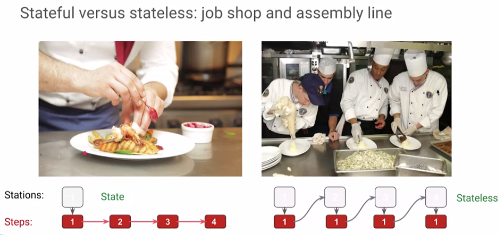
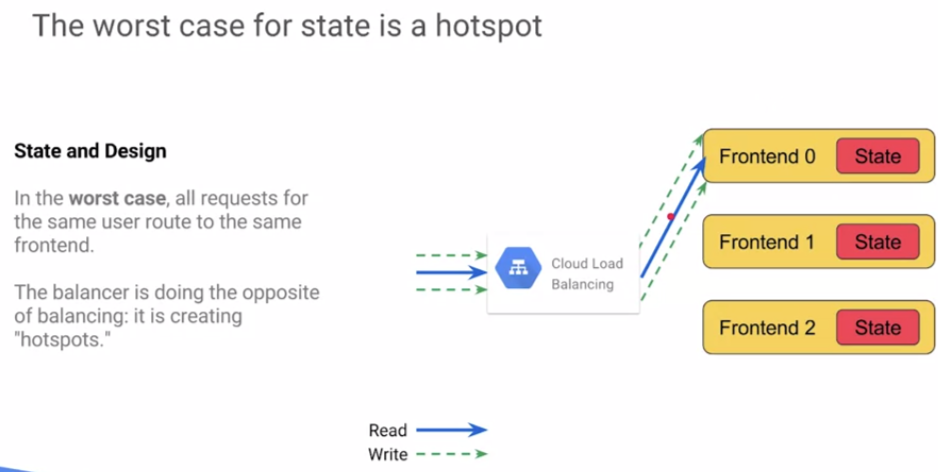
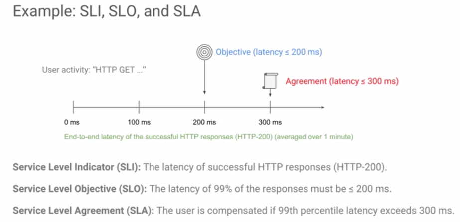
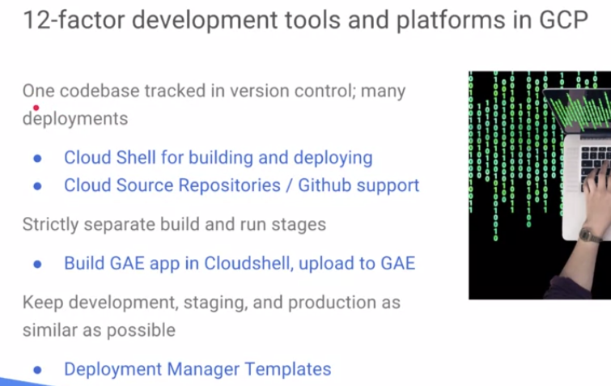
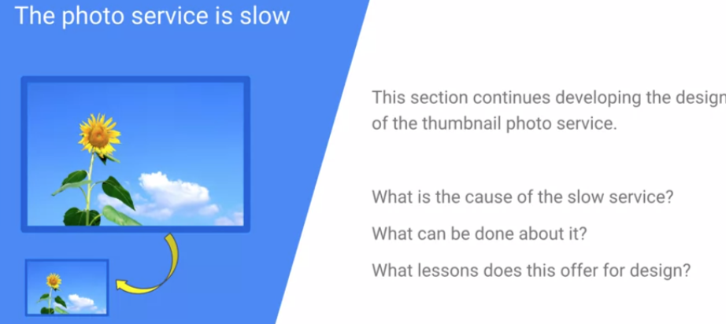

# Reliable Cloud Infrastructure: Design and Process

## Content

* [Course Intro](#course-intro)
* [Objectives](#objectives)
* [Modules covered](#modules-covered)
    * [4 parts of this class](#4-parts-of-this-class)
* [Defining the Service](#defining-the-service)
    * [Layered and iterative approach to design used in this training](#layered-and-iterative-approach-to-design-used-in-this-training)
    * [Defining the Service: State and Solution](#defining-the-service-state-and-solution)
        * [Google's common design](#googles-common-design)
    * [Defining the Service: Measurement](#defining-the-service-measurement)
        * [Service Level Indicators (SLI)](#service-level-indicators-sli)
        * [Service Level Objectives (SLO)](#service-level-objectives-slo)
        * [Service Level Agreements (SLA)](#service-level-agreements-sla)
    * [User Persona](#user-persona)
    * [Defining the Service: Gathering Requirements](#defining-the-service-gathering-requirements)
        * [Just ask questions: who, what...](#just-ask-questions-who-what)
        * [Specify constraints: time, data , users](#specify-constraints-time-data--users)
        * [Scaling requirements: backend, frontend](#scaling-requirements-backend-frontend)
        * [Size requirements](#size-requirements)
* [Application: Introducing an example Photo Application service](#application-introducing-an-example-photo-application-service)
    * [Gather requirements](#gather-requirements)
    * [Business logic](#business-logic)
    * [From logic, define Services Levels (SLIs, SLOs)](#from-logic-define-services-levels-slis-slos)
    * [Process: test before &amp; during launch](#process-test-before--during-launch)
* [Lab: use Deployment Manager to create a VM](#lab-use-deployment-manager-to-create-a-vm)
* [Business-logic Layer design](#business-logic-layer-design)
    * [Business-logic Layer: Design Overview](#business-logic-layer-design-overview)
    * [Business-logic Layer: Microservice Architecture](#business-logic-layer-microservice-architecture)
    * [Benefits of microservives](#benefits-of-microservives)
    * [How microservices complicate business logic?](#how-microservices-complicate-business-logic)
    * [When using microservices make sense?](#when-using-microservices-make-sense)
    * [Google's offering for microservices](#googles-offering-for-microservices)
        * [Cloud Functions](#cloud-functions)
        * [Cloud Functions example: translate text in an image](#cloud-functions-example-translate-text-in-an-image)
        * [Cloud Functions example: implementation on GAE &amp; limitations](#cloud-functions-example-implementation-on-gae--limitations)
    * [GCP 12-factor support](#gcp-12-factor-support)
        * [GCP development tools matching 12-factor methodology](#gcp-development-tools-matching-12-factor-methodology)
    * [Mapping computing needs to platform products](#mapping-computing-needs-to-platform-products)
    * [Compute System Provisioning](#compute-system-provisioning)
        * [Prefer &amp; plan for horizontal scaling](#prefer--plan-for-horizontal-scaling)
        * [Pros/Cons of horizontal scaling](#proscons-of-horizontal-scaling)
        * [Horizontal scaling design](#horizontal-scaling-design)
        * [Horizontal scaling tradeoffs: latency, capacity, scalability, cost](#horizontal-scaling-tradeoffs-latency-capacity-scalability-cost)
        * [Design first, dimension later](#design-first-dimension-later)
* [Resources/Articles](#resourcesarticles)

## Course Intro

- course site: https://www.coursera.org/learn/cloud-infrastructure-design-process
- [2-weeks course intro video](https://www.coursera.org/learn/cloud-infrastructure-design-process/lecture/Gdkgd): Architecting with Google Cloud Platform Design and Process class
- [Course overview video](https://www.coursera.org/learn/cloud-infrastructure-design-process/lecture/Cp9Nv/course-overview)

While researching the materials for this class, we learned that expert cloud architects often use complex assemblies in their solutions. The assembly changes many aspects of the design at once, and it's very hard to learn design skills from these complex examples.

**A good analogy is an expert chef**.

The chef is preparing a dish and adds a bowl of something, you ask what it is and the chef responds, "Well, that's just a half dozen herbs and spices I like to use." You can't duplicate the recipe if you don't know what the ingredients are in their proportions. So in this class, we've broken down the process of the experts into clear understandable steps. We've tried to show all the ingredients.

The class uses a **tiered design model to organize the learning**. And along the way, you'll have the opportunity to apply what you learned to example designs. 

Speaking of examples, the example solutions in the class exercises are intended to get you thinking about **design**. There are adequate solutions but not perfect solutions, you'll probably think of ways to improve on these solutions and come up with your own designs that are better and that's exactly what we want you to do, to learn to develop your own designs.

## Objectives

[video](https://www.coursera.org/learn/cloud-infrastructure-design-process/lecture/Cp9Nv/course-overview)

- GCP design skills
- Process knowledge and skills
- Prepare you to continue learning by exposing you to concepts and models (differents SRE & best practices)
- Introduce Deployment Manager as a Cloud Architect tool (template & design)

Learned in the labs:

## Modules covered

1. **Defining the service** (What is that exact process?)
2. **Business logic layer design** (This can also be done on paper before deploying resources)
3. **Data layer design** (identify the data layer, help identify which services we may utilize)
4. **Presentation layer design** (identify the presentation layer, help identify which services we may utilize)
5. **Design for resiliency, scalability and Disaster recovery (DR)** (Build it stronger)
6. **Design for security** (Build it stronger)
7. **Capacity planning and cost optimization** (How much will this design cost? Help design an acceptable budget)
8. **Deployment, monitoring and alerting, and incident response** (Key if you have/want an automated deployment, to understand how we respond to incidences)

### 4 parts of this class

[video](https://www.coursera.org/learn/cloud-infrastructure-design-process/lecture/SIBjx/modules-in-this-course)

1. Introduction to **architecting concepts and principles**.
   * Defining the Service

2. The application of those principles to a **real world design**.
   
   You'll begin with an application on a single virtual machine, and through the modules, you'll evolve the design into a sophisticated scalable, resilient, stable, secure solution.
3. A **related application problem**.

   You'll be presented with the problem and challenge to come up with your own design, to think through the design challenge on your own, after, you can compare your design to a standard solution. 
4. Hands on labs with **Google Deployment Manager**.

   Deployment Manager is a template-based infrastructure tool. It enables you to produce identical environments for development, test in production, and it's useful for documenting and testing variations in your designs. So you'll be learning deployment manager as a cloud architect tool.

## Defining the Service

- [video course overview](https://www.coursera.org/learn/cloud-infrastructure-design-process/lecture/hRsj7/defining-the-service-course-overview)

A step-by-step process so you can learn how to think about cloud design.

### Layered and iterative approach to design used in this training

- [video "Define the Service" process](https://www.coursera.org/learn/cloud-infrastructure-design-process/lecture/VGUfp/defining-the-service-module-overview)

Each module expands on the previous design, exploring it from a new perspective, evolving it into a scalable, reliable, stable, secure design

After introducing a layered model, the module discusses three concepts that are critical to design and to cloud architecture. These are:

- state,
- measurement,
- and requirements.

1. **Design the service... roughly** (we will iterate on it) and involve the team going through that design process.
2. then continue with a **more structured design approach**... iterate!

   - is it handling different scenarios?
   - do we have the proper budget?
   - ...
3. Define measurable
   
   - define measurable instruments that will allow us to define
   - are we succeeding the goals that we've set out?
   - What are exactly our service level objectives?
   - and how do we create service level indicators to measure those?
4. Then we move to our **three-tier architecture**:

    - Presentation layer (Networking)
    - Business logic layer (Compute)
    - Data layer (Storage)

    

5. Resiliency, scalability and disaster recovery

    

6. Security

    

7. Budget, Capacity planning and cost optimization

    

8. Deployment, monitoring, alerting and incident response

    

**Recency bias**

(always remember to try new instead of re-using old)

### Defining the Service: State and Solution

[video](https://www.coursera.org/learn/cloud-infrastructure-design-process/lecture/6aTsE/defining-the-service-state-and-solution) 

State refers to **any action in the system that depends on the memory of a preceding action**. And the data that must be remembered is called state information.

For example, compare two sets of directions:

1. The first one says, walk south for one block and take the first right.
2. The second one says, turn right one block after you've passed the market.

The second instruction requires you to remember that you've passed the market, so it's **stateful**. Whereas the first one does not require you to remember anything, so it's **stateless**. Whether a system is stateful or stateless has a lot of influence on design. And in particular, you have to decide where to store state information, how to retrieve it, and what to do if it's lost.

Analogy with kitchen:

- you could build everything yourself (the protein, the vegetables, make the sauce, ...). That gives you **more control** by centralizing everything and allow you to forsee the problem before it gets to the end state. **Problem is scaling**.
- in a stateless approach, it's easier to handle scaling and distribution.

So what are your states? What kind of information should be stored? Where can we store them? How can we manage them?

Best state is **NO states**. 

How do dal with states?

**Avoid hotspots**. Instead, push them to a backend.

You could use **cache**, but that might become overloaded, so to overcome that,  distribute the states onto several backend with load-balancing.

##### Google's common design

This solution is a design process and fits many solutions:

Frontend:

- Cloud DNS
- HTTPS Load balancer before pre-emptible machines and store states in the backend.

Backend:
- backend also stateless, also made of pre-emptible machines, pushing data to "a static **stateful** cluster". This stateful cluster is charted, replicated.

### Defining the Service: Measurement

[video](https://www.coursera.org/learn/cloud-infrastructure-design-process/lecture/qhave/defining-the-service-measurement)

Measurement is the key to creating a stable and manageable system.

The Cloud Architect doesn't just design and implement a solution. There are usually required to stick around for some time after the implementation to stabilize the system and make sure it can be operated and maintained. If you design from the beginning, identifying **indicators to be measured** and **objectives to compare them against**, you'll have the information needed for the stabilization processes that surround the system. 

How you should measure your service and discuss the terms we use to describe those measurements?

As the designer of your service, it's up to you to define **how your service should look and feel to your users**. It's equally important **to establish metrics that tell your users what they can expect from your service in terms of reliability and performance**. We'll call this the service level

To define a service level, you need to identify what the users care about.

1. **Service Level Indicators (SLI)**: Our first step is to identify the Service Level Indicators or SLIs.
    For example, the availability of a web page or how fast the system responds when a user clicks a button.
2. **Service Level Objectives (SLO)**: Next, we determined the threshold of pain for each of these SLIs. Meaning at what point the users will decide that the service is working properly.
    We'll call this the Service Level Objective or SLO.
3. **Service Level Agreements (SLA)**: Finally, some services are so critical that a formal business agreement will exist between the provider and the users to guarantee a specific behavior and to compensate the users if the service fails to meet this expectation.

Chances are that you've seen terms like Service Level Agreement or SLA. Perhaps you've even wonder how these figures are determined or more importantly, how they're monitored. Service levels define how a given service or product should behave. There are a number of factors that go into service levels ranging from availability specifications such as 99.99 percent up time or performance specification such as a minimum response time of one second. Service levels helps set the user's expectation and help keep their expectations in line with the design of the service.

##### Service Level Indicators (SLI)

 SLIs should be directly observable and measurable by the users. SLIs should not be internal system metrics such as server, CPU utilization or the number of server failures. This is done for two reasons:
 1. the user can't directly measure those internal factors because they are on the outside of the system.
 2. utilization isn't really an effective measure of the the usability of a system. Instead, utilization is a metric best used by auto-scalars to maintain a consistent user experience

Example SLI:
- users know the service **functions well** because they do not receive errors
- they know it **performs well** because the latency between services is very quick
- they have no idea of the load of CPUs, and they don't care!

 To provide an accurate measurement of the latency a user would experience, we need to monitor additional systems. In this case, we need to know the true latency of our application. We must account for the latency of a load balancer and of the data server. Note that in this case, we don't have visibility to the user's Internet connection. So, our SLI will be the end-to-end latency from the front-end web load balancer through our service and then back to the data server

##### Service Level Objectives (SLO)

Once we've identified what the users care about, we need to quantify those thresholds of pain. This is represented as the Service Level Objective or SLO. The SLO is a threshold value for an SLI, and the result should be set at the lowest or poorest level of service, where the users will still consider the service to be in good working order. That's to say, the SLO represents the point at which the user would consider opening a support ticket because the service failed to meet his or her expectation.

Determining an SLO:

When designing your SLOs, it's important to **put reality above utopia**. While we'd love to have a service that is up 100 percent of the time, that also means that the service can never be updated. Google has adopted an error budget methodology. Instead of assuming that every service will run perfectly, services are given error budgets for the SLOs that operates a bit like spending money. Each service starts with a set amount of errors that are considered normal and expected. Any errors in excess of this budget are considered outages. So, the goal is to perform all the system maintenance and updates within this budget. As the days go by each month, the error budget is replenished, giving the development and operations team the breathing room needed to implement changes and apply updates.

 it's important to ensure that all SLOs are based on the user experience, rather than an internal system metric. For example, if a service becomes unavailable at 03:00 AM, but no one notices, perhaps the SLO shouldn't be based on a 24-hour day. 

##### Service Level Agreements (SLA)

Going one step further, we have SLAs. As previously mentioned, some services are so critical that the loss of the service could represent loss of money for the customer or even loss of life in extreme situations such as, autonomous cars or air traffic control. These contracts define an even more restrictive level of service that is lower or poorer than what is defined in the SLO. The key difference here is that the SLO is a soft target used by the owner of the service to set expectations. The SLA is a business contract that grants a user compensation if the service falls below a certain threshold. Therefore, developers and operations team strive to maintain the SLO, which inherently meets the SLA figures.

An SLA is not the minimum point at which a services is considered usable. There are some services that are so mission-critical, that the service provider must provide a written guarantee, that the service will perform above a certain specification. That specification is the SLA, and breaking the SLA grants compensation from the provider to the users. Keep in mind, not all services have SLAs, but all services should have an SLO. It's also possible that providers might not publicly disclose their SLOs for fear that users might incorrectly associate the SLO with an SLA.

#### User Persona

If you don't know your user, how can you establish what they find important and acceptable? The answer comes from marketing concept used when developing user interfaces. The user persona. A user persona is an abstract representation of how a certain set of users will use your service. For instance, the power user, the casual user, the road where you are in, the inpatient user. User personas can help you determine the SLIs and the SLOs for your service by understanding how each group will actually use your service.

### Defining the Service: Gathering Requirements

[video](https://www.coursera.org/learn/cloud-infrastructure-design-process/lecture/iHvCE/defining-the-service-gathering-requirements)

Requirements or items that are important to the business, business goals. Requirements are related to measurement. For example; one requirement might be that the service is responsive to users. That requirement is embodied in an objective, such as; no more than half second latency in responding to customer request. And the objective is supported by a measurable indicator, such as; measuring round trip time between user request and delivery of a result. This lesson covers gathering requirements and things to consider and discuss that will help identify requirements. 

##### Just ask questions: who, what...
> 
> * Who's the main character?
> * What do they do?
> * What do they look like?
> * Are they old?
> * Do they have problems?
> * ... 

##### Specify constraints: time, data , users
     

##### Scaling requirements: backend, frontend

##### Size requirements

This can limit your choice in the type of tools, implementation you will have to build.

## Application: Introducing an example Photo Application service

[video](https://www.coursera.org/learn/cloud-infrastructure-design-process/lecture/YvgUm/introducing-an-example-photo-application-service)

This lesson introduces the Thumbnail photo service, an example application, that will evolve and design throughout the class. This lesson focuses on applying the principles that were learned in the previous lessons in this module. In this case, we're going to introduce a very basic photo service.

### Gather requirements

* users
* speed
* resources
* scale
* size
* availability

### Business logic

### From logic, define Services Levels (SLIs, SLOs)

### Process: test before & during launch

Pre-production tests:

* unit tests
* integration tests
* system tests
* stress test

Production tests:

* Rollout (staged) with user
* acceptance, A/B testing

## Lab: use Deployment Manager to create a VM

- [video](https://www.coursera.org/learn/cloud-infrastructure-design-process/lecture/XjMe5/lab-intro-deployment-manager)

- understand YAML templates syntax
- deploy a single appserver with Deployment Manager

## Business-logic Layer design

### Business-logic Layer: Design Overview

[video](https://www.coursera.org/learn/cloud-infrastructure-design-process/lecture/tVAxY/business-logic-layer-design-overview)

**What is business logic?**

In computer science, it's **the code that implements business rules that determines what happens to data**. In other words, **processing**. I think of business logic in this way.

Consider the transaction of buying an airline ticket. I could buy the ticket at the counter. I could buy the ticket through a travel agent. I could buy the ticket from a kiosk machine at the airport. I could buy the ticket online using a web browser, or I could buy the ticket using an app on my phone. All of these are different front ends or interfaces, but the transaction itself, of purchasing the ticket, remains the same no matter what interface is used. And that, to me, is the business logic. By definition, business logic operates on data. And that means executing code, processing. So for this reason, the business logic layer is also the part of the design process where you'll consider cloud processing options and determine what service the business logic code will use when it needs to run.

**Microservices** are **a specific kind of Service Oriented Architecture**, or **SOA**, that leverages small, stateless processing for improved scalability and resiliency.

Microservices design is a popular approach to applications, and this lesson explores how microservices work and support on the Google Cloud platform for microservices.

In computer software, business logic or domain logic is part of the program that encodes the real-world business rules that determine how data can be created, stored, and changed. 

In this module, we're going to cover:

* **microservice architecture**,
* **how GCP supports 12-factor**,
* **mapping computing needs to platform products**,
* **compute system provisioning**.

We're also going to explore our photo service. We're going to have our first issue. The photo service is slow, so we're going to have to identify what the cause is, and then understand exactly how we're going to redesign for this. We're also going to have a new design challenge, and this is going to have to do with our log aggregation which you're going to see as a result of our photo service. This will be followed up by another lab. This will be our GCP lab deployment manager in package and deploy.

So now we're going to **package**:

* learn how to package our applications
* and deploy those versus just simply deploying applications in their source.

### Business-logic Layer: Microservice Architecture

[video](https://www.coursera.org/learn/cloud-infrastructure-design-process/lecture/mLIMB/business-logic-layer-microservice-architecture)

Microservices are a specific kind of service-oriented architecture or SOA that leverages small, stateless processing from proof scalability and resiliency.

Microservices design is a popular approach to applications and this lesson explores how microservices work and support on the Google Cloud Platform for microservices.

#### Benefits of microservives

#### How microservices complicate business logic?

#### When using microservices make sense?

#### Google's offering for microservices

##### Cloud Functions

##### Cloud Functions example: translate text in an image

##### Cloud Functions example: implementation on GAE & limitations

#### GCP 12-factor support

https://12factor.net/

##### GCP development tools matching 12-factor methodology

Storing states in your environment

#### Mapping computing needs to platform products

Think of **App Engine** first, then **K8s** if you need more control on the scaling, or **Compute Engine** as a last resort.

#### Compute System Provisioning

##### Prefer & plan for horizontal scaling

##### Pros/Cons of horizontal scaling

##### Horizontal scaling design

##### Horizontal scaling tradeoffs: latency, capacity, scalability, cost

##### Design first, dimension later

## Application: The photo service is slow!!!

[video](https://www.coursera.org/learn/cloud-infrastructure-design-process/lecture/rb6kW/the-photo-service-is-slow)

### Business problem

- the service has been slowing down
- what's te cause of this slow service?
- What can be done about it?
- What opportunities does this offer for improving the design?

### Systematic logical troubleshooting

### Collaboration & communication

### Break down business logic on the photo service

### Identify the attributes of the different services?

### Segregate services for better performance and scalability

### What about our Service Level Objectives (SLOs) and Indicators (SLIs)

## Design challenge #1: Log aggregation

This lesson introduces a related independent design problem, the **log files**.

On the original single virtual machine solution, all of the log files were stored on the instance. As the design changes, new complications are introduced into the design of a log system. To meet troubleshooting requirements, the separate logs will need to be aggregated onto a single system. Watch the lesson that describes the problem and then come up with your own solution. When you're ready, continue the lesson to see a sample solution. Remember that the sample solution is not the best possible solution, it's just an example, your design might be better

What that means is, we have two different log entries now, one for the web and one for the application. They do share a common session ID fields so we need to have a process that will join those together for troubleshooting.

 we have logs on two servers, we're going to aggregate them into a single log. So, the solution here is to design a logging server. This server will accept logs, perhaps we're just using sys log fluid d or something else like that, maybe even Kafka. So, in this case we're going to create, let's call this a Python script. We're just going to whip something together, we're going to have a daily cron job that's going to take all these log files and it's going to aggregate them. So, it's purpose is to ingest that data to open the log files together, so it pushes them together. Then we need to transform them. So, even though they're all in one file, we're going to transform them and join them on that session ID. Then we're going to output that data and now we have aggregate log files. Then the daily cron job will go ahead and repeat itself. So, every 24 hours, we will have combined logs. 

**New business logic:**

## Resources/Articles

- https://cloud.google.com/compute/docs/reference/rest/v1/instances