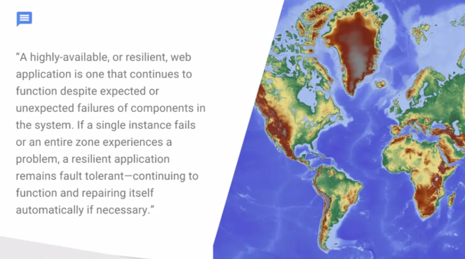
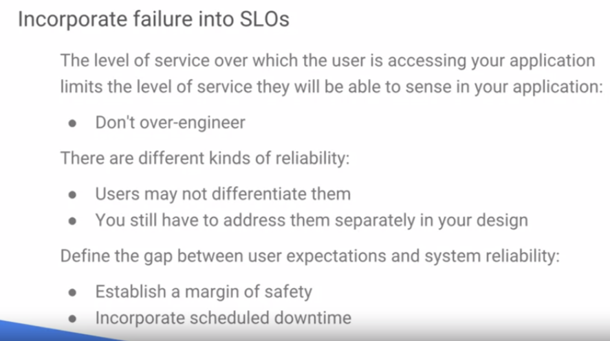
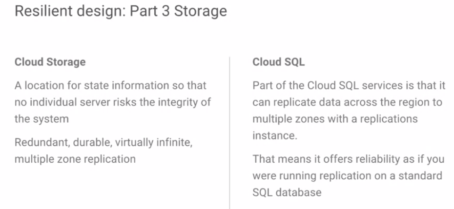
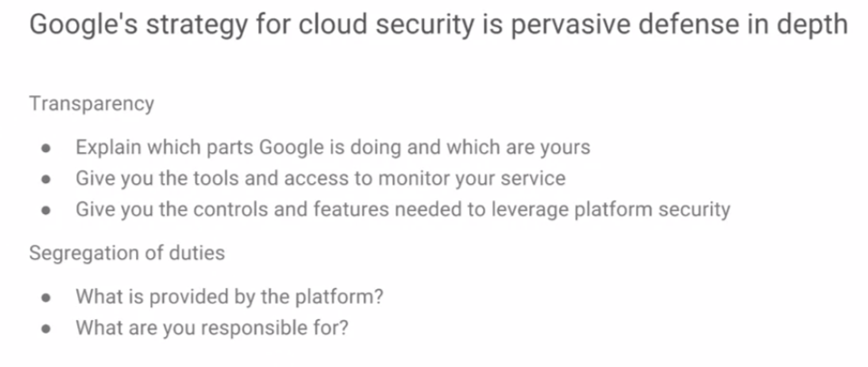

# Design for Resiliency, Scalability, Disaster Recovery & Security

- **Resiliency, Scalability, Disaster Recovery**: Implement technologies and processes that assure business continuity in the event of a disaster.
- **Security**: Implement policies that minimize security risks, such as auditing, separation of duties and least privilege.
- **Capacity Planning & Cost Optimization**: Identify ways to optimize resources and minimize cost.
- **Deployment, Monitoring and Alerting, and Incident Response**

## Content

* [Detailled Content](#detailled-content)
* [Design for Resiliency, Scalability, and Disaster Recovery](#design-for-resiliency-scalability-and-disaster-recovery)
   * [Overview](#overview)
   * [Failure Due to Loss](#failure-due-to-loss)
   * [Failure Due to Overload](#failure-due-to-overload)
   * [Coping with Failure](#coping-with-failure)
   * [Business Continuity &amp; Disaster Recovery](#business-continuity--disaster-recovery)
   * [Scalable &amp; Resilient Design](#scalable--resilient-design)
   * [Application: Out of Service!](#application-out-of-service)
   * [Design Challenge #4: Redesign for Time](#design-challenge-4-redesign-for-time)
* [Design for Security](#design-for-security)
   * [Overview](#overview-1)
   * [Cloud Security](#cloud-security)
   * [Network Access Control &amp; Firewalls](#network-access-control--firewalls)
   * [Protections Against Denial of Service](#protections-against-denial-of-service)
   * [Resource Sharing &amp; Isolation](#resource-sharing--isolation)
   * [Data Encryption &amp; Key Management](#data-encryption--key-management)
   * [Design for Security: Identity Access &amp; Auditing](#design-for-security-identity-access--auditing)
   * [Application: Photo Service - Intentional Attack](#application-photo-service---intentional-attack)
   * [Design Challenge #5: Defense in Depth](#design-challenge-5-defense-in-depth)
* [Capacity Planning &amp; Cost Optimization](#capacity-planning--cost-optimization)
   * [Overview](#overview-2)
   * [Capacity Planning](#capacity-planning)
   * [Pricing](#pricing)
   * [Application: Photo Service - Cost &amp; Capacity](#application-photo-service---cost--capacity)
   * [Design Challenge #6: Dimensioning](#design-challenge-6-dimensioning)
* [Deployment, Monitoring and Alerting, and Incident Response](#deployment-monitoring-and-alerting-and-incident-response)
   * [Learning Objectives](#learning-objectives)
   * [Overview](#overview-3)
   * [Deployment](#deployment)
   * [Monitoring &amp; Alerting](#monitoring--alerting)
   * [Incident Response](#incident-response)
   * [Application: Stabilization &amp; Operation](#application-stabilization--operation)
   * [Design Challenge #7: Monitoring &amp; Alerting](#design-challenge-7-monitoring--alerting)
   * [Lab: Deployment Manager - Full Production](#lab-deployment-manager---full-production)
* [Resources/Articles](#resourcesarticles)

## Detailled Content

* [Design for Resiliency, Scalability, and Disaster Recovery](#design-for-resiliency-scalability-and-disaster-recovery)
   * [Overview](#overview)
   * [Failure Due to Loss](#failure-due-to-loss)
   * [Failure Due to Overload](#failure-due-to-overload)
   * [Coping with Failure](#coping-with-failure)
   * [Business Continuity &amp; Disaster Recovery](#business-continuity--disaster-recovery)
   * [Scalable &amp; Resilient Design](#scalable--resilient-design)
   * [Application: Out of Service!](#application-out-of-service)
   * [Design Challenge #4: Redesign for Time](#design-challenge-4-redesign-for-time)
* [Design for Security](#design-for-security)
   * [Overview](#overview-1)
   * [Cloud Security](#cloud-security)
   * [Network Access Control &amp; Firewalls](#network-access-control--firewalls)
   * [Protections Against Denial of Service](#protections-against-denial-of-service)
   * [Resource Sharing &amp; Isolation](#resource-sharing--isolation)
   * [Data Encryption &amp; Key Management](#data-encryption--key-management)
   * [Design for Security: Identity Access &amp; Auditing](#design-for-security-identity-access--auditing)
   * [Application: Photo Service - Intentional Attack](#application-photo-service---intentional-attack)
   * [Design Challenge #5: Defense in Depth](#design-challenge-5-defense-in-depth)
* [Capacity Planning &amp; Cost Optimization](#capacity-planning--cost-optimization)
   * [Overview](#overview-2)
   * [Capacity Planning](#capacity-planning)
   * [Pricing](#pricing)
   * [Application: Photo Service - Cost &amp; Capacity](#application-photo-service---cost--capacity)
   * [Design Challenge #6: Dimensioning](#design-challenge-6-dimensioning)
* [Deployment, Monitoring and Alerting, and Incident Response](#deployment-monitoring-and-alerting-and-incident-response)
   * [Learning Objectives](#learning-objectives)
   * [Overview](#overview-3)
   * [Deployment](#deployment)
   * [Monitoring &amp; Alerting](#monitoring--alerting)
   * [Incident Response](#incident-response)
   * [Application: Stabilization &amp; Operation](#application-stabilization--operation)
   * [Design Challenge #7: Monitoring &amp; Alerting](#design-challenge-7-monitoring--alerting)
   * [Lab: Deployment Manager - Full Production](#lab-deployment-manager---full-production)
* [Resources/Articles](#resourcesarticles)

## Design for Resiliency, Scalability, and Disaster Recovery

Implement technologies and processes that assure business continuity in the event of a disaster.

[video](https://www.coursera.org/learn/cloud-infrastructure-design-process/lecture/pWlcV/design-for-resiliency-scalability-and-disaster-recovery-overview)

### Overview

This module deals with resiliency. The ability of a system to stay available and to bounce back from problems. But what is a resilient or available design? Is resiliency something you can add? Is it a feature you can turn on? Not really. Resiliency is the quality of a design that accounts for and handles failure. One principle of design is that sometimes a quality you want in the system isn't something you can really do anything about. To get the quality you want you have to look 180 degrees in the opposite direction. In this case, to get availability you have to look at and deal with the potential causes and sources of failure.

This module is designed for:

- **resiliency**,
- **scalability** and,
- **disaster recovery**.

we're gonna be covering failure; in general, failure due to a loss, failure due to overload. How do we cope with failure? Here, go through to a psychiatrist on that one. What about business continuity? How do we continue if there is a failure and disaster recovery? If there's something major, how do we recover completely from this? Then we will finally talk about scalable and resilient design, which is supposedly supposed to offset all of these bad things from happening or at least dealing with them at least. So then we're going to have an out-of-service issue with our photo service, and then we're going to have to redesign our logging system. 

### Failure Due to Loss

[video](https://www.coursera.org/learn/cloud-infrastructure-design-process/lecture/1RhEP/design-for-resiliency-scalability-and-disaster-recovery-failure-due-to-loss)

#### Failure is mandatory

For a period of time in the 1960s, a research team was trying to develop a perfect conductor. The theory was that if they could grow a perfect crystal and metal wire, there would be no signal loss and, therefore, no errors in communication. And they succeeded in creating the perfect wire. However, when they tested it, sometimes there were still errors. Do you know why? It's because we live in a quantum mechanical universe, and the location of electrons moving down a conductor is probabilistic. So, occasionally, an electron will appear outside of the wire and get lost. Errors are going to happen. Loss is going to happen.

> So the challenge isn't to avoid it, but to accept it and deal with it.

In this lesson, you'll learn about designing systems to handle failure caused by loss of resources.

#### Single Point of failure

#### Design to avoid Single Point of failure: N+2 (a spare spare)

#### Correlated failures

#### Design to avoid correlated failures

### Failure Due to Overload

[video](https://www.coursera.org/learn/cloud-infrastructure-design-process/lecture/LbKLf/design-for-resiliency-scalability-and-disaster-recovery-failure-due-to-overload)

When a system is overloaded at some point the system crosses over into nonlinear behavior. It can crash, thrash, stop responding or break adjacent resources at the service depends on. There's a very specific relationship between failure due to loss and failure due to overload. Imagine for example that a resource is lost and you queue up the work for that resource. All the work that comes in gets backlogged. When the resource is restored, there's this tremendous backlog of work to get done before any new work can be handled and if there's enough of it, nothing new ever gets done. So then the system goes from being totally unavailable due to resource loss, to totally unavailable due to overload. In this lesson you'll learn about the common causes of overload failure and how to plan for them and deal with them. When it comes to overload, prevention is really the best solution so design is critical.

#### Failover design for reliability

#### Cascading failures

#### Design to avoid Cascading failures

Example:

#### Queries-of-Death overload failure

#### Positive feedback cycle overload failure

#### Detect overload early: Early warning systems (_canaries_)

### Coping with Failure

[video](https://www.coursera.org/learn/cloud-infrastructure-design-process/lecture/jm9LV/design-for-resiliency-scalability-and-disaster-recovery-coping-with-failure)

The time to prepare for an emergency is before it happens. Moreover, the way to prepare for failure is to embrace it, except that sooner or later, it's inevitable. By making the processes and behaviors you want part of the normal routine operations, you avoid the surprise.

For example, if you know that a zone outage is possible, consider establishing rotating outages as part of the routine operations. Here's another idea, if you know that the users expect 99.95 percent availability, and your service is operating at 99.99 percent availability, consider using that 0.04 percent gap to exercise your resiliency and recovery designs. Finally, don't underestimate the importance of meetings. Circumstances are going to change, if you surround the technical processes with the right human processes, the team will catch the issues before they become emergencies.

#### Forest fires or Controlled burns

#### Prepare the team

#### Incorporate failure into SLOs

#### Monthly meetings to build processes

#### Strategies for dealing with failure

### Business Continuity & Disaster Recovery

[video](https://www.coursera.org/learn/cloud-infrastructure-design-process/lecture/FYikQ/design-for-resiliency-scalability-and-disaster-recovery-business-continuity-and)

The overall strategy for business continuity can be summed up in this motto;

> No surprises.

Whatever's happening or could happen, you want to find out about it early and you want to give yourself plenty of recovery options in the design of your system. Now that's a balance.

How much resource and energy do you want to spend on insurance? You might have great recovery systems built into your design, but how do you know they're working, and how do you know that something hasn't changed and those systems haven't quietly stopped working? You need to understand what level of testing and exercise of the recovery systems gives you confidence. That will help you decide what to include in the design elements and also help shape the human processes that operate and maintain the system. 

#### Cloud DNS: 100% availability

#### Data Integrity

#### Reliable recovery with Lazy Deletion

#### backup, archive, RESTORE!

#### Tiered backup for resiliency

##### Cloud Storage features for backup and DR

#### Prepare the team for disasters

### Scalable & Resilient Design

[video](https://www.coursera.org/learn/cloud-infrastructure-design-process/lecture/E9vLK/design-for-resiliency-scalability-and-disaster-recovery-scalable-and-resilient) 

Vertical scaling makes components bigger, but it leaves them as a single point of failure. For example, swapping out a single VM for VM with larger capacity, still means that VM can fail and potentially crash your service. Horizontal scaling make services bigger through multiplicity. It leaves a unit capacity the same, but increases the pool of units. For example, instead of growing a larger VM, you could move to a design with a pool consisting of multiple smaller VMs. That not only makes it scalable, but resilient, because if one VM is lost, the others can pick up the workload until replacement is added. There are several steps you can take to make your design resilient, and they're covered in this lesson

1. **Health checks to monitor instances**

2. **Automatically replace instances**

3. Resilient Storage: Cloud Storage, Cloud SQL

4. Resilient Network

#### Design pattern: General design for scalable & resilient apps

* Handles **loss of instance**

* Handles **loss of zone**

* Handles **loss of database**

* Handles **full disaster recovery**

#### Microservices design for scalable & resilient streaming

#### 12-factor system & application design in GCP

#### Processes for simple, iterative, aligned development

This module covered several related design goals, including:

* reliability,
* scalability,
* and disaster recovery.

The first subject was availability and reliability. A key concept is that planning for failure and dealing with failure in your design leads to improved reliability. Failure can occur due to the loss of a resource or it can occur due to overload. You must be careful when making adjustments to a system, that you don't accidentally create the potential for an overload failure when you're trying to improve resiliency to a loss failure. The second subject was disaster recovery. You learned that planning for disaster and preparing for recovery is key. The third was scalable and resilient design. That brings together many of the design principles you've seen in the previous modules, and shows how they all fit together into a general resilient solution.

### Application: Out of Service!

[video](https://www.coursera.org/learn/cloud-infrastructure-design-process/lecture/SeWZH/out-of-service) 

#### Business problem

It's a **Design problem**, we lost an entire zone!!!

The popular and growing photo services suddenly crashed:

* How do you handle a major outage?
* What could the cause be? What changes can you make the design so this problem doesn't take down the entire service again in the future?

**Have a plan for dealing with a major outage**

#### Systematic logical troubleshooting

**Service loss due to zone outage**

#### Collaboration & communication: Report, Document, build policy

So you want to **move these servers to multiple zones.**

#### Break down business logic on the photo service

#### What about our Service Level Objectives (SLOs) and Indicators (SLIs)

SLOs didn't change again. We just added more redundancy, making the service span multiple zones.

### Design Challenge #4: Redesign for Time

**Need to scale frontend server**

**Prevent overload: MAke load testing real**

**Scaling requires breaking state out of the upload server**

What does that look like?

**Need to make Frontend servers stateless**

**Update on SLOs and SLIs**

You see what it is that you can measure and then quantify it.

#### Design Challenge: Log aggregation delayed troubleshooting

[video](https://www.coursera.org/learn/cloud-infrastructure-design-process/lecture/9EsdO/design-challenge-4-redesign-for-time)

When the photo service crashed, it became evident that troubleshooting was taking too long. The reason for the delay was tracked to log aggregation. The aggregated logs needed for troubleshooting were delayed. Worse, the more problems that are occurring in the system, the more log entries are generated and the longer it takes for the aggregated logs to become available for troubleshooting. Can you redesign the log system to eliminate the bottlenecks? Watch the lesson that describes the problem, then come up with your own solution. When you're ready, continue the lesson to see a sample solution.

If you remember the **12-factor design**, it says to **treat log events as streams** so that should be a clue. The business issue is servant's service resiliency. It's just taking too long to troubleshoot service issues, batch processing of the logs, just simply does not support live service troubleshooting. It's causing delays, we can't meet our service level objectives, we can't identify and respond to incidents in times. So here's the design challenge. Replace the cron batch processing with stream processing and here's our hint. Try to consider a microservices design.

#### Troubleshooting & solution

Instead of having a cronjob, we have not converted it to Stream Processing with Cloud Pub/Sub.

## Design for Security

[video](https://www.coursera.org/learn/cloud-infrastructure-design-process/lecture/bNzDv/design-for-security-overview)

Implement policies that minimize security risks, such as auditing, separation of duties and least privilege.

### Overview

There are **3 kinds of security services** built into the Google Cloud platform: 
1. services that are **transparent and automatic**, such as encryption of data that occurs automatically when data's transported and when it's at rest.
2. services that have **defaults but that offer methods for customizations**, such as using your own encryption keys rather than those provided.
3. services that can be used as part of your security design, but only contribute to security if you choose to use them in your design.

### Cloud Security

[video](https://www.coursera.org/learn/cloud-infrastructure-design-process/lecture/wMJ6H/design-for-security-cloud-security)

When you migrate an application to the cloud or develop an application in the cloud, there are security benefits that the application inherits simply because of the host environment. Google already has to protect its applications, and many of the benefits of that security effort are built into the infrastructure itself. You need to know about them so you don't accidentally spend effort duplicating them. You also need to know where those services end and your security design begins so that you don't accidentally leave gaps in your security strategy.

#### Google's strategy for cloud security: "Pervasive efense in depth"

#### Cloud Networking Security: Defense in Depth

"So the least that we can actually expose to the Internet, all the better"

### Network Access Control & Firewalls

[video](https://www.coursera.org/learn/cloud-infrastructure-design-process/lecture/tx88k/design-for-security-network-access-control-and-firewalls)

The first level of security where your design can have a significant impact is on network level access control. For example, if you remove the external IP from an instance in a bastion hosts design, you'll eliminate one target that could be attacked. Locking down network access to only what's required is one way to reduce the potential attack surface. 

#### Firewall configuration: 1st line of defense for access

#### Design for securely accessing VMs

#### API access control with Cloud Endpoints

### Protections Against Denial of Service

[video](https://www.coursera.org/learn/cloud-infrastructure-design-process/lecture/9I9iK/design-for-security-protections-against-denial-of-service)

Part of the protections against denial of service attacks are built into the cloud infrastructure. The network, for example, uses software defined networking or SDN. Since there are no physical routers and no physical load balancers, there are no actual hardware interfaces that could be overloaded. There are also services that adapt to demand in intelligent ways, and you can use these in your design to afford further protection against overload attacks

#### Edge protections agaisnt DDoS

### Resource Sharing & Isolation... a compromise

[video](https://www.coursera.org/learn/cloud-infrastructure-design-process/lecture/vUZeS/design-for-security-resource-sharing-and-isolation)

Google Cloud Platform provides a rich array of network topology features, that provide different blends of separation isolation, and communication, and sharing. The least secure design is where everything is in a single failure domain, and all the parts communicate and depend directly on one another. There are many ways of separating those parts and providing more private, or tolerant communication channels between them, creating multiple failure domains and therefore better isolation. In submarine design, the parts of the submarine are divided into compartments that can be sealed off from one another. This helps with reliability, because one compartment can flood and be sealed off from the rest. But it also helps with security, because if an attacker gains entry to one compartment, it can be sealed off to limit the damage.

#### VPC isolation through public IPs

#### IP address isolation using VPN tunneling

#### Cross-project VPC network peering

#### Cross-organization VPC network peering

#### Shared VPC

#### Isolation through multiple network interface

#### Access GCP services over internal IP

### Data Encryption & Key Management

[video](https://www.coursera.org/learn/cloud-infrastructure-design-process/lecture/m1739/design-for-security-data-encryption-and-key-management)

You probably already know that Google automatically encrypts data in motion and data at rest, but that description generalizes some of the details that will help you make design decisions. For example, you can use Google's built-in key management, or you can provide your own keys. Also for particularly sensitive data, you can add your own encryption methods in addition to those provided

#### Server-side encryption

#### Customer manager encryption keys (CMEK)

#### Customer Supplied encryption keys (CSEK)

#### Persistent Disk Encrytion with CSEK

#### Moore control over encryption

### Design for Security: Identity Access & Auditing

[video](https://www.coursera.org/learn/cloud-infrastructure-design-process/lecture/k0FDO/design-for-security-identity-access-and-auditing)

Authorization, access to resources is controlled by Google's Identity and Access Management or IAM system. You're already using this service to control authorized access. By using the auditing tools available, you can also check for unwanted actions like attempts at unauthorized access. That can tell you where the attackers interest is focused. So you can add security measures in those areas. 

#### Identity Access Management

#### Service Accounts

#### GCP security auditing with Forseti-security (Open Source)

#### Cloud Audit Logging

#### External audits & GCP Standards Compliance

This module covered security from several perspectives, including identity and access management, data encryption and key management, resource sharing and isolation for compartmentalization, protections against denial of service attacks, network access control, and the automatic protections built into the platform and services. You learn that there are some security that's inherited from the environment. Some is configured with default options that you might want to change, and some security features are optional and can be included in your design, if it makes sense with your security strategy.

### Application: Photo Service - Intentional Attack

[video](https://www.coursera.org/learn/cloud-infrastructure-design-process/lecture/dwTwf/photo-service-intentional-attack)

There's evidence that hackers are trying to compromise the private information of system users, and maybe try to bring down the service.

That brings up 2 important issues:
1. How does the system keep users data private?
2. How does the system protect against a denial-of-service attack?

Identify the protections already in place that are provided by the platform by default, then consider additional design changes that could provide additional protections.

#### Business problem

#### Break down business logic on the photo service

**Lock down the frontend**

1. use Cloud CDN to cache our thumbnails accross the world
2. use Cloud DNS 
3. Implement auto-scaling (instance group)

**Can we protect the backend?**

#### Security checklist

### Design Challenge #5: Defense in Depth

[video](https://www.coursera.org/learn/cloud-infrastructure-design-process/lecture/vVI8A/design-challenge-5-defense-in-depth)

The security measures you're considering implementing in the photo service will make the system much more secure. But wait a moment, the user information and event information may be contained in the logs. If the log system isn't secure, none of the rest of the system is secure. Watch the lesson that describes the problem, then come up with your own solution. When you're ready, continue the lesson to see a sample solution, and remember that the sample solution is not the best possible solution. It's just an example.

**Problem**

**Possible solution**

## Capacity Planning & Cost Optimization

[video](https://www.coursera.org/learn/cloud-infrastructure-design-process/lecture/SsEgy/capacity-planning-and-cost-optimization-overview)

Identify ways to optimize resources and minimize cost.

### Overview

Both forecasting for future demand on a system, and planning the resources for a system, depend on non-abstract large-scale design sometimes called dimensioning.

When you optimize for one factor by changing a resource, there may be other consequences. For example, if you change the VM size to optimize CPU capacity, it's possible that network throughput memory and disk capacity could change as a consequence. So, you really need to think through all the dimensions that are affected by your design and perform the calculations to ensure there's sufficient capacity for your purposes.

A common mistake is to optimize away resiliency. Remember that overcapacity is sometimes included by design to handle bursty periods, growth, or intentional attacks. Failing to recognize the purpose of excess capacity, and then reducing it to save money, can create opportunities for cascade failures.

### Capacity Planning

[video](https://www.coursera.org/learn/cloud-infrastructure-design-process/lecture/0h7MF/capacity-planning-and-cost-optimization-capacity-planning)

Capacity planning is **an ongoing cyclical process**.

There are various common measures such as:

* VM instance capacity,
* disk performance,
* network throughput,
* and workload estimations.

Ultimately, you need to be able to answer the question, **is there sufficient resource with reasonable certainty?** One of the key design principles in this course is to allow other factors to influence your design first, and then come back and dimension the design later. You might have to change some of the design for capacity or for better pricing, but at least, you'll make these adjustments knowing what benefits you're trading for reduced cost or better capacity management.

**Capacity planning cycle:**

#### 1. Forecast

##### Forecast estimation

##### Instance overhead estimation

How to NOT overestimate:

##### Persistent disks estimation

##### Network capacity estimation

##### Workload estimation

[**Perfkit Benchmarker**](https://github.com/GoogleCloudPlatform/PerfKitBenchmarker) (Open source tool by Google)

#### Allocate

Example with rough estimation:

Opportunity for optimization before allocating more resources?

#### Approve

#### Deploy

First: Test, test, test...

### Pricing

[video](https://www.coursera.org/learn/cloud-infrastructure-design-process/lecture/cwllj/capacity-planning-and-cost-optimization-pricing)

Pricing is commonly used in:

* **cost optimization**,
* **reducing cost**, 
* and also for **budgeting**.

One feature of Google Cloud Platform is that bulk use discounting is built in an automatic for many services. In this lesson, you'll learn about how design choices can influence price.

For example, you may have distributed an element of your solution over multiple regions to improve reliability. However, that distribution design might result in additional network charges for egress traffic. Is the cost of the reliability worthy additional network charges? Pricing estimation, and pricing that follows capacity planning can help you decide.

#### Optimize VMs cost

#### Optimize Disks cost

#### Optimize Network cost

VM to VM in the same zone:

In this module, you learned about capacity planning, including the planning cycle, and you learned about pricing. The two of them together, capacity and pricing, provide another perspective on design options. You can modify the design for cost optimization or to limit resource usage. One important point is to apply dimensioning to your design after you've considered other functional aspects of the design.

### Application: Photo Service - Cost & Capacity

[video](https://www.coursera.org/learn/cloud-infrastructure-design-process/lecture/E42DE/photo-service-cost-and-capacity)

Capacity planning for the coming year's completed.

As a final step, you'll look at the VM options and perform non-abstract **cost optimization analysis**.

Given the growing capacity requirements, what makes sense financially to choose for the most cost-effective?:

* a **bigger capacity VM**, 
* or is **sticking with the current size VM**

Can we offer the same service with less money?

#### Business problem

Reviewing the current architecture:

We want to make a recommendation: **Should we move to higher cores CPUs?**.7

We first need to **check cost effectiveness**.

### Design Challenge #6: Dimensioning

## Deployment, Monitoring and Alerting, and Incident Response

### Learning Objectives

* Implement processes that minimize downtime, such as monitoring and alarming, unit and integration testing, production resilience testing, and incident post-mortem analysis.
* Launch a cloud service from a collection of templates.
* Configure basic black box monitoring of an application.
* Create an uptime check to recognize a loss of service.
* Establish an alerting policy to trigger incident response procedures.
* Create and configure a dashboard with dynamically update charts.
* Test the monitoring and alerting regimen by applying a load to the service.
* Test the monitoring and alerting regimen by simulating a service outage.

### Overview

### Deployment

### Monitoring & Alerting

### Incident Response

### Application: Stabilization & Operation

### Design Challenge #7: Monitoring & Alerting

### Lab: Deployment Manager - Full Production

## Resources/Articles

- [**Perfkit Benchmarker**](https://github.com/GoogleCloudPlatform/PerfKitBenchmarker): PerfKit Benchmarker is an open effort to define a canonical set of benchmarks to measure and compare cloud offerings.
- **Price calculator**: [cloud.google.com/products/calculator/](https://cloud.google.com/products/calculator/)