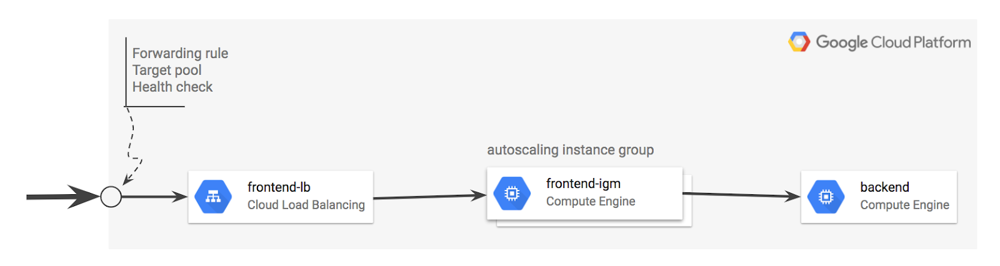
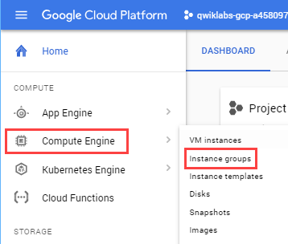
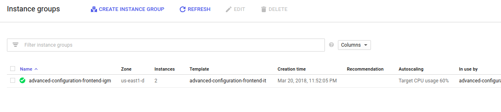
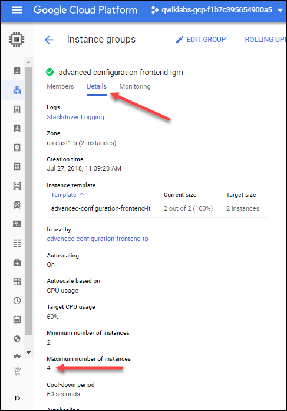
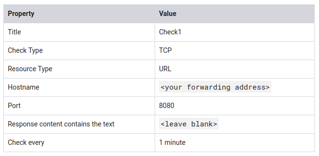
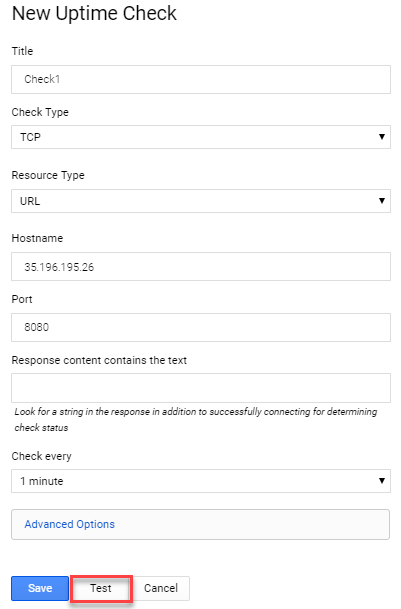
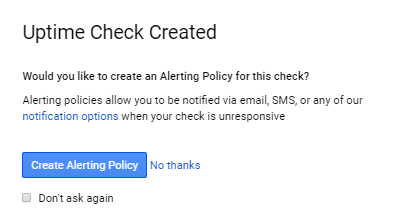
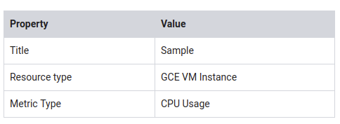
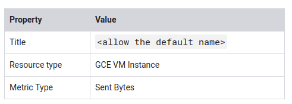
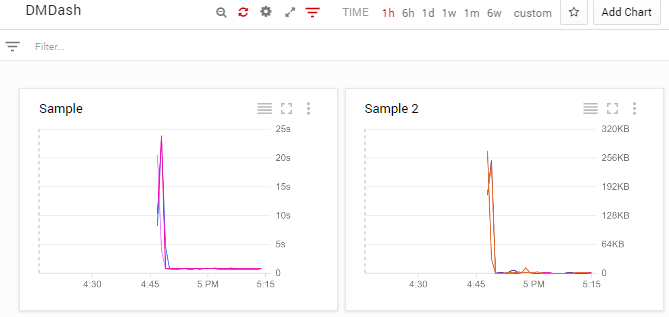

# Deployment Manager - Full Production

https://google.qwiklabs.com/focuses/981?parent=catalog

In this lab you will launch a service using Deployment Manager, and monitor it using Stackdriver. You will set up basic black box monitoring with Stackdriver Dashboard and establish uptime check alert notification to trigger incident response.

~ 1 hour 30 minutes


## Content


## Overview

In this lab, you will launch a service using an infrastructure orchestration tool called Deployment Manager and monitor the service using Stackdriver. In Stackdriver, you will set up basic black box monitoring with a Stackdriver dashboard and establish an Uptime Check (alert notification) to trigger incident response.

More specifically, you will:

1. Install and configure an advanced deployment using Deployment Manager sample templates.
2. Enable Stackdriver monitoring.
3. Configure Stackdriver Uptime Checks and notifications.
4. Configure a Stackdriver dashboard with two charts, one showing CPU usage and the other ingress traffic.
5. Perform a load test and simulate a service outage.


Stackdriver Monitoring provides visibility into the performance, uptime, and overall health of cloud-powered applications. Stackdriver collects metrics, events, and metadata from Google Cloud Platform, Amazon Web Services, hosted uptime probes, application instrumentation, and a variety of common application components including Cassandra, Nginx, Apache Web Server, Elasticsearch, and many others. Stackdriver ingests that data and generates insights via dashboards, charts, and alerts. Stackdriver alerting helps you collaborate by integrating with Slack, PagerDuty, HipChat, Campfire, and more.

## Objectives

In this lab, you will learn to:

* Launch a cloud service from a collection of templates.
* Configure basic black box monitoring of an application.
* Create an uptime check to recognize a loss of service.
* Establish an alerting policy to trigger incident response procedures.
* Create and configure a dashboard with dynamically updated charts.
* Test the monitoring and alerting regimen by applying a load to the service.
* Test the monitoring and alerting regimen by simulating a service outage.


## Setup and Requirements


### The Google Cloud Shell

Activate Google Cloud Shell


You can list the active account name with this command:

`gcloud auth list`

Output:

```shell
Credentialed accounts:
 - <myaccount>@<mydomain>.com (active)

```

**Example output:**

```shell
Credentialed accounts:
 - google1623327_student@qwiklabs.net

```

You can list the project ID with this command:

`gcloud config list project`

Output:

```shell
[core]
project = <project_ID>
```

**Example output:**

```shell
[core]
project = qwiklabs-gcp-44776a13dea667a6

```

> Full documentation of gcloud is available on [Google Cloud gcloud Overview](https://cloud.google.com/sdk/gcloud).

## Clone the Deployment Manager Sample Templates

Google provides a robust set of sample Deployment Manager templates that you can learn from and build upon.

To clone the repository, enter the following commands in Cloud Shell Command Line to create a directory to hold the Deployment Manager sample templates.

`mkdir ~/dmsamples`

Go to that directory.

`cd ~/dmsamples`

Clone the repository to the directory you just made.

`git clone https://github.com/GoogleCloudPlatform/deploymentmanager-samples.git`

**Example Output:**

```shell
remote: Counting objects: 1917, done.
remote: Compressing objects: 100% (31/31), done.
remote: Total 1917 (delta 11), reused 29 (delta 7), pack-reused 1874
Receiving objects: 100% (1917/1917), 426.86 KiB | 0 bytes/s, done.
Resolving deltas: 100% (1060/1060), done.

```

## Explore the Sample Files

We just downloaded a collection of sample templates to our directory, let's dive in and explore some of them.

### List the example templates

Run the following commands to navigate to and list the version2 examples:

`cd ~/dmsamples/deploymentmanager-samples/examples/v2`

`ls`

You should see something like this:

```
access_context_manager  cloud_functions  common               folder_creation  iam_custom_role  internal_lb_haproxy  quick_start   ssl                 vm_with_disks
access_control          cloudkms         container_igm        gke              igm-updater      metadata_from_file   regional_igm  step_by_step_guide  vpn_auto_subnet
bigtable                cloud_router     container_vm         ha-service       image_based_igm  nodejs               saltstack     template_modules    waiter
build_configuration     cloudsql         custom_machine_type  htcondor         instance_pool    nodejs_l7            single_vm     vlan_attachment
cloudbuild              cloudsql_import  dataproc             iam              internal_lb      project_creation     sqladmin      vm_startup_script

```


Not all of the subdirectories are independent projects. For example, the directory named common contains templates that are used by several of the other projects. If you are studying independently later, use the README files as a guides.

The nodejs directory contains everything you'll need to build this lab. Note that there is a nodejs directory and a nodejs_l7directory. Use nodejs.

### List and examine the Nodejs deployment

Navigate to and list the version2 examples:

`cd nodejs/python`

`ls`

**Example Output:**

`frontend.py  frontend.py.schema  nodejs.py  nodejs.py.schema  nodejs.yaml`


The main deployment manager configuration file is nodejs.yaml. It makes use of templates to generate infrastructure. The rest of the files are templates. Templates use variables defined in the nodejs.yaml configuration file to produce customized results.



### `frontend.py`

`frontend.py` includes `frontend.py.schema`, which creates an instance template based on `container_instance_template.py`.

This template is used to create a managed instance group and an autoscaler. The template also creates a network load balancer that has a forwarding rule with a single public IP address. It will also create:

* A target pool that refers to the managed instance group.
* A health check attached to the target pool.

### `nodejs.py`

`nodejs.py` includes `nodejs.py.schema`, which brings the frontend and backend templates together.

* Note that the frontend is `frontend.py`.
* The backend is `/common/python/container_vm.py`.
* This is a VM running a Docker container with MySQL, so it doesn't require a custom template.

### Other files

* `/common/python/container_instance_template.py`
* `/common/python/container_vm.py`
* `/common/python/container_helper.py`

## Customize the Deployment

Now that you've downloaded and reviewed the nodejs Deployment Manager template, let's start customizing the deployment.

### Specify the zone

The `nodejs.yaml` file requires a zone, and you'll now add one to the file.

1. Enter the following command to open the list of zones:

   `gcloud compute zones list`

   Copy the name of a zone for the configuration file to use.

2. Open `nodejs.yaml` in nano so you can edit the zone value:

   `nano nodejs.yaml`

   The `nodejs.yaml` file contents:

    ```
    resources:
    - name: nodejs
    type: nodejs.py
    properties:
        zone: ZONE_TO_RUN


    ```


3. Replace ZONE_TO_RUN with a zone name that's near you, then exit nano and save the file.

   This example shows ZONE_TO_RUN set to us-east1-d

    ```
    resources:
    - name: nodejs
    type: nodejs.py
    properties:
        zone: us-east1-d


    ```


### Modify the maximum number of instances in the instance group

Edit the nodejs.py file.

1. Enter this command to open nodejs.py in nano:

    `nano nodejs.py`

2. Verify current scaling limit for frontend in `nodejs.py`

```yaml
{
     'name': frontend,
     'type': 'frontend.py',
     'properties': {
         'zone': context.properties['zone'],
         'dockerImage': 'gcr.io/deployment-manager-examples/nodejsservice',
         'port': application_port,
         # Define the variables that are exposed to container as env variables.
         'dockerEnv': {
             'SEVEN_SERVICE_MYSQL_PORT': mysql_port,
             'SEVEN_SERVICE_PROXY_HOST': '$(ref.' + backend
                                         + '.networkInterfaces[0].networkIP)'
         },
         # If left out will default to 1
         'size': 2,
         # If left out will default to 1
         'maxSize': 20
     }
 },

```
Current scaling limit is 20 (refer maxSize).

3. Modify the `maxSize` and set it to 4:

```yaml
{
     'name': frontend,
     'type': 'frontend.py',
     'properties': {
         'zone': context.properties['zone'],
         'dockerImage': 'gcr.io/deployment-manager-examples/nodejsservice',
         'port': application_port,
         # Define the variables that are exposed to container as env variables.
         'dockerEnv': {
             'SEVEN_SERVICE_MYSQL_PORT': mysql_port,
             'SEVEN_SERVICE_PROXY_HOST': '$(ref.' + backend
                                         + '.networkInterfaces[0].networkIP)'
         },
         # If left out will default to 1
         'size': 2,
         # If left out will default to 1
         'maxSize': 4
     }
 },

```
Save the file and exit nano when you're done.

## Run the Application

Now you'll use Deployment Manager to deploy the application and make it operational. This builds the infrastructure, but it won't allow traffic. After Deployment Manager sets up the infrastructure, you can apply service labels.

### Deploy the application

Enter this command to name the application advanced-configuration and pass Deployment Manager the configuration file (nodejs.yaml).

`gcloud deployment-manager deployments create advanced-configuration --config nodejs.yaml`

Output:

```shell
The fingerprint of the deployment is PiYc6OsIFkWzQpCDklHvaA==
Waiting for create [operation-1529913842103-56f72d31872d9-90070017-aec5761d]...done.
Create operation operation-1529913842103-56f72d31872d9-90070017-aec5761d completed successfully.
NAME                                   TYPE                             STATE      ERRORS  INTENT
advanced-configuration-application-fw  compute.v1.firewall              COMPLETED  []
advanced-configuration-backend         compute.v1.instance              COMPLETED  []
advanced-configuration-frontend-as     compute.v1.autoscaler            COMPLETED  []
advanced-configuration-frontend-hc     compute.v1.httpHealthCheck       COMPLETED  []
advanced-configuration-frontend-igm    compute.v1.instanceGroupManager  COMPLETED  []
advanced-configuration-frontend-it     compute.v1.instanceTemplate      COMPLETED  []
advanced-configuration-frontend-lb     compute.v1.forwardingRule        COMPLETED  []
advanced-configuration-frontend-tp     compute.v1.targetPool            COMPLETED  []

```


1. Go to **Compute Engine** > **Instance groups**.



2. Click on advanced-configuration-frontend-igm.



3. Click on the Details tab, then verify the maximum number of instances. 



You'll see it has been set to 4.

## Verify that the application is operational

The application takes a few minutes to start. You can view it in the Deployment Manager part of Cloud Console (**Navigation menu** > **Deployment Manager**), or you can see the instances in the Compute Engine part of Console (**Navigation menu** > **Compute Engine** > **VM**).

To verify that the application is running, you will open a browser to access `port 8080` and view the service. Since the IP address was established dynamically when the Deployment Manager implemented the global forwarding rule (specified in the template), you'll need to find that address to test the application.

### Find the global load balancer forwarding rule IP address

1. Enter the following command in the Cloud Command Line to find your forwarding IP address.

`gcloud compute forwarding-rules list`

Your forwarding IP address is the IP_ADDRESS listed in your output. Be sure to record it; you'll use it a few times in this lab.

2. Open a new window in your browser. In the address field, enter the following URL, replacing <your IP address> with your forwarding IP address:

`http://<your IP address>:8080`

You will see a blank page, similar to below, with your own IP address.


It may take several minutes for the service to become operational. If you get an error, such as a 404, wait about two minutes and try again.

3. Now enter log information by entering a log message in your browser address line.

`http://<your forwarding IP address>:8080/?msg=<enter_a_message>`

Replace `enter_a_message` with any kind of message.

These are log message examples - yours will have a different IP address:

`http://35.196.56.153:8080/?msg=my dog has spots`


After you enter the log, the browser returns added.


View the log by going to http://<your IP address>:8080. For example:
7ce7917b8519c96d.png

Go ahead and create more logs and see them at `http://<your IP address>:8080`.

## Create Stackdriver workspace

In the **Navigation menu**, click on **Monitoring**.

Your workspace will be ready when you see the Stackdriver dashboard.

## Configure an uptime check and alert policy in Stackdriver

Now that Stackdriver is running, you'll set up alerts and a dashboard.

### Configure an uptime check

1. In the Stackdriver tab, click on **Uptime Checks** > **Uptime Checks Overview**. Click **Add Uptime Check**.
2. Specify the following:



3. Click Test to test the check:



> If the test fails, make sure that the service is still working. Also check to see that the firewall rule exists and is correct.

4. After the test succeeds, click Save.


After the Uptime Check is saved, Stackdriver offers to create an alerting policy.



## Configure an alerting policy and notification

1. Click on Create Alerting Policy.
2. Name your policy, then click Save.
3. In Notifications select "email" and add your personal email.

In a later step, you will trigger an event that will notify you via email.

4. Name the policy.

5. Click Save.


## Configure a Dashboard with a Couple of Useful Charts

### Configure a dashboard

1. On the Stackdriver window or tab, click on Dashboards > Create Dashboard

2. Click on Untitled Dashboard and rename it to DMDash.

3. Click on the Auto Refresh icon so changes are automatically displayed.

4. Click on Add Chart.


Configure the chart as follows:



6. Click Save.
7. Click on Add Chart to add another chart to the dashboard with the following 



8. Click Save DMDash should look like this:



## Create a test VM with ApacheBench

Now that you've configured monitoring for traffic in a specified region, see if it works. You'll install and use ApacheBench to apply 3 levels of load to the service and then view the Stackdriver Dashboard you've set up.

### Create a VM

1. In the Cloud Console, click Compute Engine > VM instances.
2. Click Create instance, use all the default settings in the Create an instance dialog.
3. Click Create.

## Install ApacheBench

1. Still in the VM Instances window, click the instance-1 SSH button to SSH into the VM you just created.

2. Enter the following commands to install the latest ApacheBench:

`sudo apt-get update`

`sudo apt-get -y install apache2-utils`


### Apply and monitor load

Now you'll use ApacheBench to apply load to the service. Watch the DMDash dashboard in Stackdriver to monitor the CPU usage and the Network Inbound Traffic. You'll also be able to track the number of instances in Stackdriver by mousing over the lines, or by viewing the instances in the Cloud Console (**Navigation menu** > **Compute Engine** > **VM**).

In the SSH window, enter this command for ApacheBench to apply load to the service. Replace your forwarding IP for Your_IP. Run the following command two or three times to create traffic.

`ab -n 1000 -c 100 http://<Your_IP>:8080/`

**Sample output:**

```
This is ApacheBench, Version 2.3 <$Revision: 1757674 $>
Copyright 1996 Adam Twiss, Zeus Technology Ltd, http://www.zeustech.net/
Licensed to The Apache Software Foundation, http://www.apache.org/

Benchmarking 35.196.195.26 (be patient)
Completed 100 requests
Completed 200 requests
Completed 300 requests
Completed 400 requests
Completed 500 requests
Completed 600 requests
Completed 700 requests
Completed 800 requests
Completed 900 requests
Completed 1000 requests
Finished 1000 requests

Server Software:
Server Hostname:        35.196.195.26
Server Port:            8080

Document Path:          /
Document Length:        40 bytes

Concurrency Level:      100
Time taken for tests:   0.824 seconds
Complete requests:      1000
Failed requests:        0
Total transferred:      140000 bytes
HTML transferred:       40000 bytes
Requests per second:    1213.57 [#/sec] (mean)
Time per request:       82.402 [ms] (mean)
Time per request:       0.824 [ms] (mean, across all concurrent requests)
Transfer rate:          165.92 [Kbytes/sec] received

Connection Times (ms)
              min  mean[+/-sd] median   max
Connect:       36   37   0.5     37      40
Processing:    36   43   8.7     38      73
Waiting:       36   43   8.7     38      73
Total:         73   80   9.1     75     112

Percentage of the requests served within a certain time (ms)
  50%     75
  66%     78
  75%     81
  80%     84
  90%     95
  95%    101
  98%    106
  99%    110
 100%    112 (longest request)

```


Wait a few minutes, then increase the load to 5000.

2. Run this command two or three times to create traffic:

`ab -n 5000 -c 100 http://<Your_IP>:8080/`

Wait a few minutes, then increase the load to 10000.

3. Run this command two or three times to create traffic:

`ab -n 10000 -c 100 http://<Your_IP>:8080/`

Now see what happens when you lower the CPU usage per instance.

1. In the cloud console, click Navigation menu > Compute Engine > Instance groups.
2. Click on the name of your instance group, then "Edit Group".
3. Change the Target CPU usage to 20.
4. Click Save.

> The target CPU usage is the total value of the CPU usage for all VMs in the instance group. This controls when autoscaling occurs. In production you would usually have this set to at least 60%. For this exercise you will set it temporarily to 20% to make it quicker to examine autoscaling.

Run this command two or three times to create traffic:

`ab -n 10000 -c 100 http://<Your_IP>:8080/`

**Expected behavior:** The load consumed more than 20% of the cumulative CPU in the group, triggering autoscaling. A new instance was started.

Now see what happens when you turn autoscaling off.

1. Go to **Compute Engine** > **Instance groups**.
2. Click the name of your instance group, then **Edit Group**.
3. Change **Autoscaling** to **Off**.
4. Click **Save**.

Wait a few minutes, then run this command two or three times to create traffic:

`ab -n 10000 -c 100 http://<Your_IP>:8080/`

**Expected behavior:** With autoscaling off, no new instances are created, cumulative CPU usage increases.

### Results

There will be a lag time of around 5 minutes before you see changes in the Stackdriver Dashboard.

## Simulate a Service Outage

To simulate an outage, remove the firewall.

1. Click Navigation menu > VPC Networks > Firewall rules.
2. Check the box next to allow-8080 firewall rule, then click Delete at the top of the page.
3. You will receive a notification email in 15 to 30 minutes.


**Congratulations!**


## Finish your Quest

This self-paced lab is part of the [Deployment Manager](https://google.qwiklabs.com/quests/30), [Cloud Architecture](https://google.qwiklabs.com/quests/24), and [Cloud Engineering](https://google.qwiklabs.com/quests/66) Quests. A Quest is a series of related labs that form a learning path. Completing this Quest earns you the badge above, to recognize your achievement. You can make your badge public and link to them in your online resume or social media account. Enroll in a Quest and get immediate completion credit if you've taken this lab. See [other available Qwiklabs Quests](https://google.qwiklabs.com/catalog).


## Next steps / learn more

Check out how Stackdriver can be used, see [Stackdriver Documentation](https://cloud.google.com/stackdriver/docs/).
Learn more about Deployment Manager, see [Deployment Manager Fundamentals](https://cloud.google.com/deployment-manager/docs/fundamentals).
How about our tutorials? There are several step-by-step tutorials in the documentation. This lab is based on one of those tutorials, but includes additional content. The Deployment Manager template used in this lab generates an advanced HTTP(S) Load Balanced deployment for a Logbook sample application. [Sample templates](https://cloud.google.com/deployment-manager/docs/create-advanced-http-load-balanced-deployment) are available in both Jinja and Python. This lab used the Python version.
