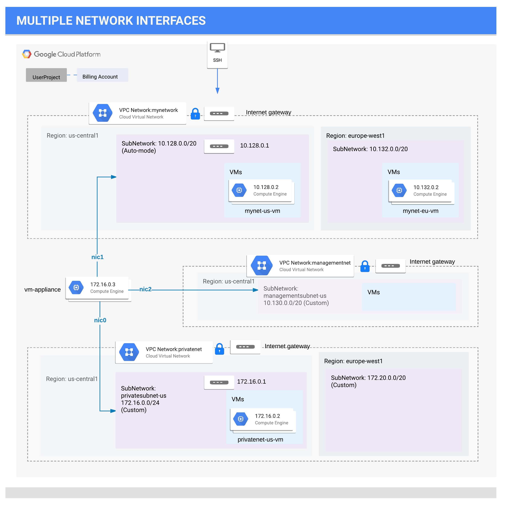
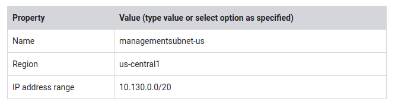
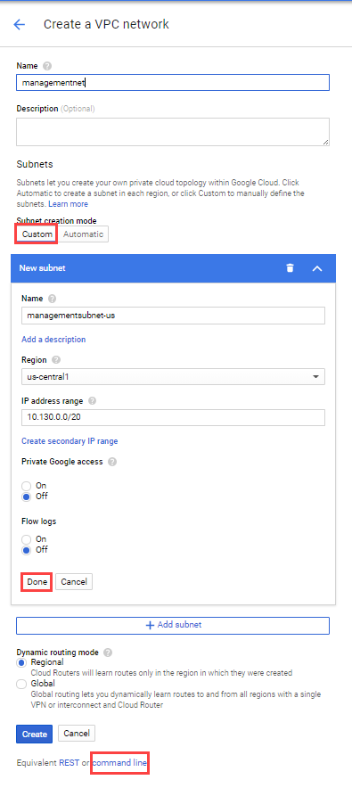
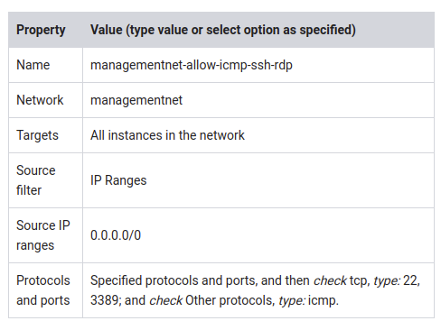
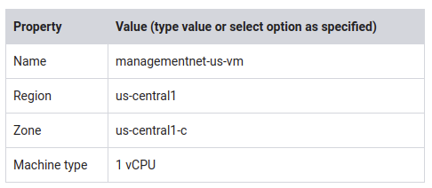
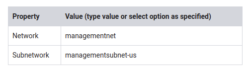
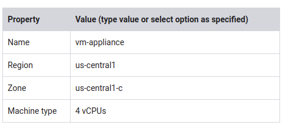
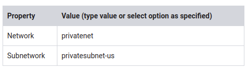
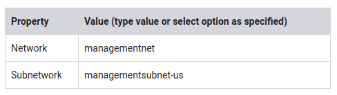
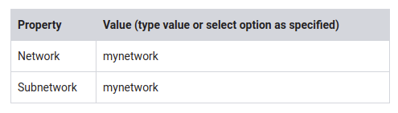

# Multiple VPC Networks

[URL](https://google.qwiklabs.com/focuses/1230?parent=catalog) 

## Overview

In this lab, you create several VPC networks and VM instances and test connectivity across networks. Specifically, you create two custom mode networks (**managementnet** and **privatenet**) with firewall rules and VM instances as shown in this network diagram:




The **mynetwork** network with its firewall rules and two VM instances (**mynet-eu-vm** and **mynet-us-vm**) have already been created for you in this Qwiklabs project.

### Objectives

In this lab, you will learn how to perform the following tasks:

* Create custom mode VPC networks with firewall rules
* Create VM instances using Compute Engine
* Explore the connectivity for VM instances across VPC networks
* Create a VM instance with multiple network interfaces

## Setup and Requirements


**gcloud** is the command-line tool for Google Cloud Platform. It comes pre-installed on Cloud Shell and supports tab-completion.

You can list the active account name with this command:

`gcloud auth list`

You can list the project ID with this command:

`gcloud config list project`


## Create custom mode VPC networks with firewall rules

Create two custom networks **managementnet** and **privatenet**, along with firewall rules to allow **SSH**, **ICMP**, and **RDP** ingress traffic.

### Create the managementnet network

Create the **managementnet** network using the GCP Console.

1. In the Console, navigate to **Navigation menu** > **VPC network** > **VPC networks**.

2. Notice the **default** and **mynetwork** networks with their subnets. Each GCP project starts with the default network. In addition, the mynetwork network has been premade as part of your network diagram.

3. Click Create VPC Network.

4. Set the Name to managementnet.

5. For Subnet creation mode, click Custom.

6. Set the following values, leave all other values at their defaults:



7. Click Done.

8. Click command line.



These commands illustrate that networks and subnets can be created using the Cloud Shell command line. You will create the **privatenet** network using these commands with similar parameters.

9. Click Close.

10. Click Create.


## Create the **privatenet** network

Create the privatenet network using the Cloud Shell command line.

1. Run the following command, to create the privatenet network:

`gcloud compute networks create privatenet --subnet-mode=custom`

2. Run the following command, to create the privatesubnet-us subnet:

`gcloud compute networks subnets create privatesubnet-us --network=privatenet --region=us-central1 --range=172.16.0.0/24`

3. Run the following command, to create the privatesubnet-eu subnet:

`gcloud compute networks subnets create privatesubnet-eu --network=privatenet --region=europe-west1 --range=172.20.0.0/20`

4. Run the following command, to list the available VPC networks:

`gcloud compute networks list`

The output should look like this (do not copy; this is example output):

```
NAME           SUBNET_MODE  BGP_ROUTING_MODE  IPV4_RANGE  GATEWAY_IPV4
default        AUTO         REGIONAL
managementnet  CUSTOM       REGIONAL
mynetwork      AUTO         REGIONAL
privatenet     CUSTOM       REGIONAL

```

> **default** and **mynetwork** are auto mode networks, whereas, **managementnet** and **privatenet** are custom mode networks. Auto mode networks create subnets in each region automatically, while custom mode networks start with no subnets, giving you full control over subnet creation

5. Run the following command, to list the available VPC subnets (sorted by VPC network):

`gcloud compute networks subnets list --sort-by=NETWORK`

```shell
The output should look like this (do not copy; this is example output):

NAME                REGION                   NETWORK        RANGE
default             asia-northeast1          default        10.146.0.0/20
default             us-west1                 default        10.138.0.0/20
default             southamerica-east1       default        10.158.0.0/20
default             europe-west4             default        10.164.0.0/20
default             asia-east1               default        10.140.0.0/20
default             europe-north1            default        10.166.0.0/20
default             asia-southeast1          default        10.148.0.0/20
default             us-east4                 default        10.150.0.0/20
default             europe-west1             default        10.132.0.0/20
default             europe-west2             default        10.154.0.0/20
default             europe-west3             default        10.156.0.0/20
default             australia-southeast1     default        10.152.0.0/20
default             asia-south1              default        10.160.0.0/20
default             us-east1                 default        10.142.0.0/20
default             us-central1              default        10.128.0.0/20
default             northamerica-northeast1  default        10.162.0.0/20
managementsubnet-us us-central1              managementnet  10.130.0.0/20
mynetwork           asia-northeast1          mynetwork      10.146.0.0/20
mynetwork           us-west1                 mynetwork      10.138.0.0/20
mynetwork           southamerica-east1       mynetwork      10.158.0.0/20
mynetwork           europe-west4             mynetwork      10.164.0.0/20
mynetwork           asia-east1               mynetwork      10.140.0.0/20
mynetwork           europe-north1            mynetwork      10.166.0.0/20
mynetwork           asia-southeast1          mynetwork      10.148.0.0/20
mynetwork           us-east4                 mynetwork      10.150.0.0/20
mynetwork           europe-west1             mynetwork      10.132.0.0/20
mynetwork           europe-west2             mynetwork      10.154.0.0/20
mynetwork           europe-west3             mynetwork      10.156.0.0/20
mynetwork           australia-southeast1     mynetwork      10.152.0.0/20
mynetwork           asia-south1              mynetwork      10.160.0.0/20
mynetwork           us-east1                 mynetwork      10.142.0.0/20
mynetwork           us-central1              mynetwork      10.128.0.0/20
mynetwork           northamerica-northeast1  mynetwork      10.162.0.0/20
privatesubnet-eu    europe-west1             privatenet     172.20.0.0/20
privatesubnet-us    us-central1              privatenet     172.16.0.0/24
```

> As expected, the default and mynetwork networks have subnets in each region as they are auto mode networks. The managementnet and privatenet networks only have the subnets that you created as they are custom mode networks.

6. In the Console, navigate to Navigation menu > VPC network > VPC networks.

7. You see that the same networks and subnets are listed in the Console.

### Create the firewall rules for managementnet

Create firewall rules to allow **SSH**, **ICMP**, and **RDP** ingress traffic to VM instances on the **managementnet** network.

1. In the Console, navigate to **Navigation menu** > **VPC network** > **Firewall rules**.

2. Click + **Create Firewall Rule**.

3. Set the following values, leave all other values at their defaults:

   


> Make sure to include the /0 in the Source IP ranges to specify all networks.

4. Click command line.

   These commands illustrate that firewall rules can also be created using the Cloud Shell command line. You will create the privatenet's firewall rules using these commands with similar parameters.

5. Click Close.

6. Click Create.


### Create the firewall rules for privatenet

Create the firewall rules for **privatenet** network using the Cloud Shell command line.

1. In Cloud Shell, run the following command to create the **privatenet-allow-icmp-ssh-rdp** firewall rule:

`gcloud compute firewall-rules create privatenet-allow-icmp-ssh-rdp --direction=INGRESS --priority=1000 --network=privatenet --action=ALLOW --rules=icmp,tcp:22,tcp:3389 --source-ranges=0.0.0.0/0`

The output should look like this (do not copy; this is example output):


```
NAME                           NETWORK     DIRECTION  PRIORITY  ALLOW                 DENY
privatenet-allow-icmp-ssh-rdp  privatenet  INGRESS    1000      icmp,tcp:22,tcp:3389

```


2. Run the following command, to list all the firewall rules (sorted by VPC network):

`gcloud compute firewall-rules list --sort-by=NETWORK`

The output should look like this (do not copy; this is example output):

```
NAME                              NETWORK        DIRECTION  PRIORITY  ALLOW                         DENY
default-allow-icmp                default        INGRESS    65534     icmp
default-allow-internal            default        INGRESS    65534     tcp:0-65535,udp:0-65535,icmp
default-allow-rdp                 default        INGRESS    65534     tcp:3389
default-allow-ssh                 default        INGRESS    65534     tcp:22
managementnet-allow-icmp-ssh-rdp  managementnet  INGRESS    1000      icmp,tcp:22,tcp:3389
mynetwork-allow-icmp              mynetwork      INGRESS    1000      icmp
mynetwork-allow-rdp               mynetwork      INGRESS    1000      tcp:3389
mynetwork-allow-ssh               mynetwork      INGRESS    1000      tcp:22
privatenet-allow-icmp-ssh-rdp     privatenet     INGRESS    1000      icmp,tcp:22,tcp:3389
```

The firewall rules for **mynetwork** network have been created for you. You can define multiple protocols and ports in one firewall rule (**privatenet** and **managementnet**), or spread them across multiple rules (**default** and **mynetwork**).

3. In the Console, navigate to** Navigation menu** > **VPC network** > **Firewall rules**.

4. You see that the same firewall rules are listed in the Console.

## Create VM instances

Create two VM instances:

* **managementnet-us-vm** in **managementsubnet-us**
* **privatenet-us-vm** in **privatesubnet-us**

### Create the managementnet-us-vm instance

Create the managementnet-us-vm instance using the GCP Console.

1. In the Console, navigate to **Navigation menu** > **Compute Engine** > **VM instances**.

   The **mynet-eu-vm **and** mynet-us-vm** has been created for you, as part of your network diagram.

2. Click Create instance.

3. Set the following values, leave all other values at their defaults:




4. Click Management, disks, networking, SSH keys.

5. Click Networking.

6. For Network interfaces, click the pencil icon to edit.

7. Set the following values, leave all other values at their defaults:

   


8. Click Done.

9. Click command line.

   This illustrate that VM instances can also be created using the Cloud Shell command line. You will create the **privatenet-us-vm** instance using these commands with similar parameters.

10. Click Close.

11. Click Create.

### Create the privatenet-us-vm instance

Create the **privatenet-us-vm** instance using the Cloud Shell command line.

1. In Cloud Shell, run the following command to create the privatenet-us-vm instance:

`gcloud compute instances create privatenet-us-vm --zone=us-central1-c --machine-type=n1-standard-1 --subnet=privatesubnet-us`

   The output should look like this (do not copy; this is example output):

```
NAME              ZONE           MACHINE_TYPE   PREEMPTIBLE  INTERNAL_IP  EXTERNAL_IP    STATUS
privatenet-us-vm  us-central1-c  n1-standard-1               172.16.0.2   35.184.221.40  RUNNING
```

2. Run the following command, to list all the VM instances (sorted by zone):

`gcloud compute instances list --sort-by=ZONE`

The output should look like this (do not copy; this is example output):

```
NAME                 ZONE            MACHINE_TYPE   PREEMPTIBLE  INTERNAL_IP  EXTERNAL_IP     STATUS
mynet-eu-vm          europe-west1-c  n1-standard-1               10.132.0.2   35.205.124.164  RUNNING
managementnet-us-vm  us-central1-c   n1-standard-1               10.130.0.2   35.226.20.87    RUNNING
mynet-us-vm          us-central1-c   n1-standard-1               10.128.0.2   35.232.252.86   RUNNING
privatenet-us-vm     us-central1-c   n1-standard-1               172.16.0.2   35.184.221.40   RUNNING
```


3. In the Console, navigate to **Navigation menu** > **Compute Engine** > **VM instances**.

4. You see that the VM instances are listed in the Console.

5. Click on **Columns**, then select **Network**.

   There are three instances in **us-central1-c** and one instance in **europe-west1-c**. However, these instances are spread across three VPC networks (**managementnet**, **mynetwork** and **privatenet**), with no instance in the same zone and network as another. In the next section, you explore the effect this has on internal connectivity.

## Explore the connectivity between VM instances

Explore the connectivity between the VM instances. Specifically, determine the effect of having VM instances in the same zone versus having instances in the same VPC network.

### Ping the external IP addresses

Ping the external IP addresses of the VM instances to determine if you can reach the instances from the public internet.

1. In the Console, navigate to Navigation menu > Compute Engine > VM instances.

2. Note the external IP addressees for mynet-eu-vm, managementnet-us-vm, and privatenet-us-vm.

3. For mynet-us-vm, click SSH to launch a terminal and connect.

4. To test connectivity to mynet-eu-vm's external IP, run the following command, replacing mynet-eu-vm's external IP:

`ping -c 3 <Enter mynet-eu-vm's external IP here>`

This should work!

5. To test connectivity to managementnet-us-vm's external IP, run the following command, replacing managementnet-us-vm's external IP:

`ping -c 3 <Enter managementnet-us-vm's external IP here>`

This should work!

6. To test connectivity to privatenet-us-vm's external IP, run the following command, replacing privatenet-us-vm's external IP:

`ping -c 3 <Enter privatenet-us-vm's external IP here>`

This should work!

> You are able to ping the external IP address of all VM instances, even though they are either in a different zone or VPC network. This confirms public access to those instances is only controlled by the **ICMP** firewall rules that you established earlier.

### Ping the internal IP addresses

Ping the internal IP addresses of the VM instances to determine if you can reach the instances from within a VPC network.

> Which instance(s) should you be able to ping from mynet-us-vm using internal IP addresses?
> 
> * privatenet-us-vm?
> * mynet-eu-vm?
> * managementnet-us-vm?

1. In the Console, navigate to Navigation menu > Compute Engine > VM instances.

2. Note the internal IP addressees for mynet-eu-vm, managementnet-us-vm, and privatenet-us-vm.

3. Return to the SSH terminal for mynet-us-vm.

4. To test connectivity to mynet-eu-vm's internal IP, run the following command, replacing mynet-eu-vm's internal IP:

`ping -c 3 <Enter mynet-eu-vm's internal IP here>`

> You are able to ping the internal IP address of mynet-eu-vm because it is on the same VPC network as the source of the ping (mynet-us-vm), even though both VM instances are in separate zones, regions and continents!

5. To test connectivity to managementnet-us-vm's internal IP, run the following command, replacing managementnet-us-vm's internal IP:

`ping -c 3 <Enter managementnet-us-vm's internal IP here>`

   > This should not work as indicated by a 100% packet loss!

6. To test connectivity to privatenet-us-vm's internal IP, run the following command, replacing privatenet-us-vm's internal IP:

`ping -c 3 <Enter privatenet-us-vm's internal IP here>`

   > This should not work either as indicated by a 100% packet loss! You are unable to ping the internal IP address of managementnet-us-vm and privatenet-us-vm because they are in separate VPC networks from the source of the ping (mynet-us-vm), even though they are all in the same zone us-central1.


VPC networks are by default isolated private networking domains. However, no internal IP address communication is allowed between networks, unless you set up mechanisms such as VPC peering or VPN.

## Create a VM instance with multiple network interfaces

Every instance in a VPC network has a default network interface. You can create additional network interfaces attached to your VMs. Multiple network interfaces enable you to create configurations in which an instance connects directly to several VPC networks (up to 8 interfaces, depending on the instance's type).

### Create the VM instance with multiple network interfaces

Create the **vm-appliance** instance with network interfaces in **privatesubnet-us**, **managementsubnet-us** and **mynetwork**. The CIDR ranges of these subnets do not overlap, which is a requirement for creating a VM with multiple network interface controllers (NICs).

1. In the Console, navigate to Navigation menu > Compute Engine > VM instances.

2. Click Create instance.

3. Set the following values, leave all other values at their defaults:




   > The number of interfaces allowed in an instance is dependent on the instance's machine type and the number of vCPUs. The n1-standard-4 allows up to 4 network interfaces. Refer here for more information.

4. Click Management, disks, networking, SSH keys.

5. Click Networking.

6. For Network interfaces, click the pencil icon to edit.

7. Set the following values, leave all other values at their defaults:

   

8. Click Done.

9. Click Add network interface.

10. Set the following values, leave all other values at their defaults:

   

11. Click Done.

12. Click Add network interface.

13. Set the following values, leave all other values at their defaults:

   

14. Click Done.

15. Click Create.

### Explore the network interface details

Explore the network interface details of **vm-appliance** within the Console and within the VM's terminal.

1. In the Console, navigate to **Navigation menu** > **Compute Engine** > **VM instances**.
2. Click **nic0** within the Internal IP address of **vm-appliance** to open the **Network interface details** page.
3. Verify that **nic0** is attached to **privatesubnet-us**, is assigned an internal IP address within that subnet (172.16.0.0/24), and has applicable firewall rules.
4. Click **nic0** and select **nic1**.
5. Verify that **nic1** is attached to **managementsubnet-us**, is assigned an internal IP address within that subnet (10.130.0.0/20), and has applicable firewall rules.
6. Click **nic1** and select **nic2**.
7. Verify that **nic2** is attached to **mynetwork**, is assigned an internal IP address within that subnet (10.128.0.0/20), and has applicable firewall rules.
   > Each network interface has its own internal IP address so that the VM instance can communicate with those networks.
8. In the Console, navigate to Navigation menu > Compute Engine > VM instances.

9. For vm-appliance, click SSH to launch a terminal and connect.

10. Run the following, to list the network interfaces within the VM instance:

`sudo ifconfig`

   The output should look like this (do not copy; this is example output):

```
eth0: flags=4163<UP,BROADCAST,RUNNING,MULTICAST>  mtu 1460
        inet 172.16.0.3  netmask 255.255.255.255  broadcast 172.16.0.3
        inet6 fe80::4001:acff:fe10:3  prefixlen 64  scopeid 0x20<link>
        ether 42:01:ac:10:00:03  txqueuelen 1000  (Ethernet)
        RX packets 626  bytes 171556 (167.5 KiB)
        RX errors 0  dropped 0  overruns 0  frame 0
        TX packets 568  bytes 62294 (60.8 KiB)
        TX errors 0  dropped 0 overruns 0  carrier 0  collisions 0
eth1: flags=4163<UP,BROADCAST,RUNNING,MULTICAST>  mtu 1460
        inet 10.130.0.3  netmask 255.255.255.255  broadcast 10.130.0.3
        inet6 fe80::4001:aff:fe82:3  prefixlen 64  scopeid 0x20<link>
        ether 42:01:0a:82:00:03  txqueuelen 1000  (Ethernet)
        RX packets 7  bytes 1222 (1.1 KiB)
        RX errors 0  dropped 0  overruns 0  frame 0
        TX packets 17  bytes 1842 (1.7 KiB)
        TX errors 0  dropped 0 overruns 0  carrier 0  collisions 0
eth2: flags=4163<UP,BROADCAST,RUNNING,MULTICAST>  mtu 1460
        inet 10.128.0.3  netmask 255.255.255.255  broadcast 10.128.0.3
        inet6 fe80::4001:aff:fe80:3  prefixlen 64  scopeid 0x20<link>
        ether 42:01:0a:80:00:03  txqueuelen 1000  (Ethernet)
        RX packets 17  bytes 2014 (1.9 KiB)
        RX errors 0  dropped 0  overruns 0  frame 0
        TX packets 17  bytes 1862 (1.8 KiB)
        TX errors 0  dropped 0 overruns 0  carrier 0  collisions 0

```

> The sudo ifconfig command lists a Linux VM's network interfaces along with the internal IP addresses for each interface.


### Explore the network interface connectivity

Demonstrate that the **vm-appliance** instance is connected to **privatesubnet-us**, **managementsubnet-us** and **mynetwork** by pinging VM instances on those subnets.

1. In the Console, navigate to **Navigation menu** > **Compute Engine** > **VM instances**.

2. Note the internal IP addressees for privatenet-us-vm, managementnet-us-vm, mynet-us-vm, and mynet-eu-vm.

3. Return to the SSH terminal for vm-appliance.

4. To test connectivity to privatenet-us-vm's internal IP, run the following command, replacing privatenet-us-vm's internal IP:

   `ping -c 3 <Enter privatenet-us-vm's internal IP here>`

   This works!

5. Repeat the same test by running the following:

   `ping -c 3 privatenet-us-vm`

   > You are able to ping privatenet-us-vm by its name because VPC networks have an internal DNS service that allows you to address instances by their DNS names rather than their internal IP addresses. When an internal DNS query is made with the instance hostname, it resolves to the primary interface (nic0) of the instance. Therefore, this only works for privatenet-us-vm in this case.

6. To test connectivity to managementnet-us-vm's internal IP, run the following command, replacing managementnet-us-vm's internal IP:

    `ping -c 3 <Enter managementnet-us-vm's internal IP here>`

    This works!

7. To test connectivity to mynet-us-vm's internal IP, run the following command, replacing mynet-us-vm's internal IP:

    `ping -c 3 <Enter mynet-us-vm's internal IP here>`

    This works!

8. To test connectivity to mynet-eu-vm's internal IP, run the following command, replacing mynet-eu-vm's internal IP:

   `ping -c 3 <Enter mynet-eu-vm's internal IP here>`

   > This does not work! In a multiple interface instance, every interface gets a route for the subnet that it is in. In addition, the instance gets a single default route that is associated with the primary interface eth0. Unless manually configured otherwise, any traffic leaving an instance for any destination other than a directly connected subnet will leave the instance via the default route on eth0.

9. To list the routes for vm-appliance instance, run the following command:

`ip route`

The output should look like this (do not copy; this is example output):

```
default via 172.16.0.1 dev eth0
10.128.0.0/20 via 10.128.0.1 dev eth2
10.128.0.1 dev eth2 scope link
10.130.0.0/20 via 10.130.0.1 dev eth1
10.130.0.1 dev eth1 scope link
172.16.0.0/24 via 172.16.0.1 dev eth0
172.16.0.1 dev eth0 scope link
```

> The primary interface eth0 gets the default route (default via 172.16.0.1 dev eth0), and all three interfaces eth0, eth1 and eth2 get routes for their respective subnets. Since, the subnet of **mynet-eu-vm (10.132.0.0/20)** is not included in this routing table, the ping to that instance leaves **vm-appliance** on eth0 (which is on a different VPC network). You could change this behavior by configuring policy routing as documented [here](https://cloud.google.com/vpc/docs/create-use-multiple-interfaces#configuring_policy_routing).

## Congratulations!

In this lab, you created several custom mode VPC networks, firewall rules and VM instances using the Console and the Cloud Shell command line. Then, you tested the connectivity across VPC networks which worked when pinging external IP addresses but not when pinging internal IP addresses. Thus, you created a VM instance with three network interfaces and verified internal connectivity for VM instances that are on the subnets that are attached to the multiple interface VM.

You also explored the default network along with its subnets, routes, and firewall rules. You deleted the default network and determined that you cannot create any VM instances without a VPC network. Thus, you created a new auto mode VPC network with subnets, routes, firewall rules and two VM instances. Then, you tested the connectivity for the VM instances and explored the effects of the firewall rules on connectivity.


### Finish your Quest

This self-paced lab is part of the Qwiklabs [Networking in the Google Cloud](https://google.qwiklabs.com/quests/31), [Cloud Architecture](https://google.qwiklabs.com/quests/24) and [Cloud Engineering](https://google.qwiklabs.com/quests/66) Quests. A Quest is a series of related labs that form a learning path. Completing this Quest earns you the badge above to recognize your achievement. You can make your badge (or badges) public and link to them in your online resume or social media account. [Enroll in this Quest](https://google.qwiklabs.com/learning_paths/31/enroll) and get immediate completion credit if you've taken this lab. [See other available Qwiklabs Quests: **Networking in the Google Cloud**](https://google.qwiklabs.com/catalog).

### Take your next lab

Continue your Quest with [VPC Networks - Controlling Access](https://google.qwiklabs.com/catalog_lab/1032), or check out these suggestions:

* [Customize Network Topology with Subnetworks](https://google.qwiklabs.com/catalog_lab/483)
* [Creating Cross-region Load Balancing](https://google.qwiklabs.com/catalog_lab/805)

### Next Steps / Learn More

Learn more about VPC networking: [Using VPC Networks](https://cloud.google.com/vpc/docs/using-vpc).

