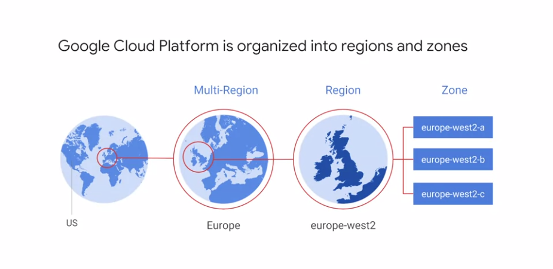
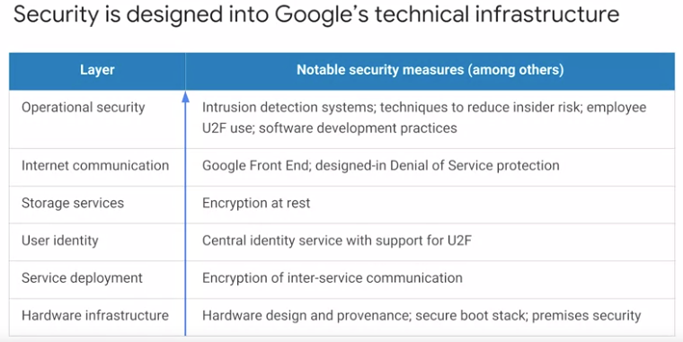
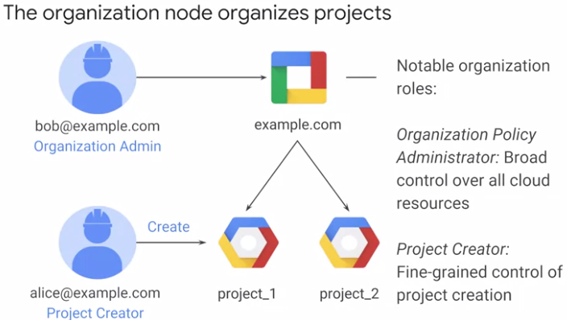
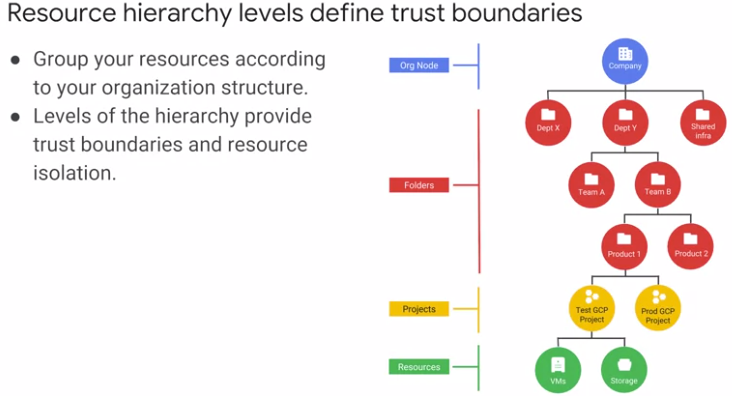
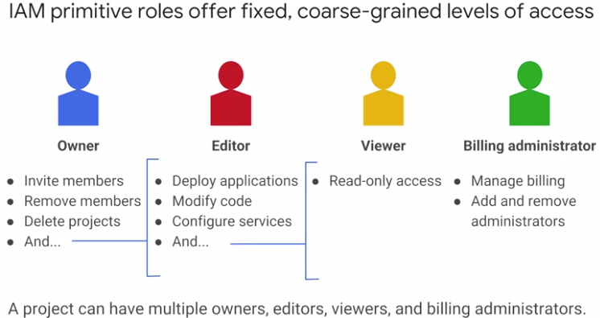
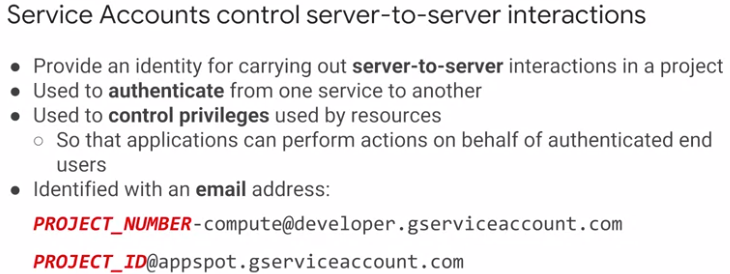

# GCP Fundamentals: Core Infrastructure

|  **** | **** | **Open-Source** | **GCP** | **AWS** | **...** |
| --- | --- | --- | --- | --- | --- |
|  **Compute** | IaaS |  |  |  |  |
|  **** | PaaS |  |  |  |  |
|  **** | Containers |  |  |  |  |
|  **** | Containers without infrastructure |  |  |  |  |
|  **** | FaaS |  |  |  |  |
|  **** | Managed Batch Computing |  |  |  |  |
|  **Network** | Virtual Networks |  |  |  |  |
|  **** | Load Balancer |  |  |  |  |
|  **** | Dedicated Interconnect |  |  |  |  |
|  **** | Domains and DNS |  |  |  |  |
|  **** | CDN |  |  |  |  |
|  **Storage** | Object Storage |  |  |  |  |
|  **** | Block Storage |  |  |  |  |
|  **** | Reduced-availability Storage |  |  |  |  |
|  **** | Archival Storage |  |  |  |  |
|  **** | File Storage |  |  |  |  |
|  **Database** | RDBMS |  |  |  |  |
|  **** | NoSQL: Key-value |  |  |  |  |
|  **** | NoSQL: Indexed |  |  |  |  |
|  **Big Data & Analytics** | Batch Data Processing |  |  |  |  |
|  **** | Stream Data Processing |  |  |  |  |
|  **** | Stream Data Ingest |  |  |  |  |
|  **** | Analytics |  |  |  |  |
|  **** | Workflow Orchestration |  |  |  |  |
|  **Application Services** | Messaging |  |  |  |  |
|  **Management Services** | Monitoring |  |  |  |  |
|  **** | Logging |  |  |  |  |
|  **** | Deployment |  |  |  |  |
|  **Machine Learning** | Speech |  |  |  |  |
|   | Vision |  |  |  |  |
|  **** | Natural Language Processing |  |  |  |  |
|  **** | Translation |  |  |  |  |
|  **** | Conversational Interface |  |  |  |  |
|  **** | Video Intelligence |  |  |  |  |
|  **** | Auto-generated Models |  |  |  |  |
|  **** | Fully Managed ML |  |  |  |  |
|  **** |  |  |  |  |  |
|  **Infrastructure Deployment Tools** | infrastructure-as-code |  |  |  |  |
|  **Mobile** | Authentication |  |  |  |  |
|  **** | Database |  |  |  |  |
|  **** | Data Storage/CDN |  |  |  |  |
|  **** | Serverless routines |  |  |  |  |
|  **** | Notifications |  |  |  |  |
|  **** | Client application services |  |  |  |  |

source: https://docs.google.com/spreadsheets/d/1Ibo41Cs_XNdCFSqmNiXEQ16h-ZU6ATb6CZrMdKsLsZI/edit?usp=sharing

## What is Cloud Computing

The US National Institute of Standards and Technology created a definition
It has 5 equally important traits:

1. **computing resources on-demand and self-service**. All you have to do is use a simple interface and you get the processing power, storage, and network you need, with no need for human intervention. 
1. **access these resources over the net from anywhere you want**. The provider of those resources has a big pool of them and allocates them to customers out of that pool. That allows the provider to get economies of scale by buying in bulk and pass the savings on to the customers. Customers don't have to know or care about the exact physical location of those resources.
1. **the resources are elastic**. If you need more resources you can get more, rapidly. If you need less, you can scale back.
1. the **customers pay only for what they use** or reserve as they go. If they stop using resources, they stop paying.

## IaaS vs PaaS vs SaaS

Virtualized data centers brought you Infrastructure as a Service, IaaS, and Platform as a Service, PaaS offerings.

- IaaS offerings provide raw compute, storage, and network organized in ways that are familiar from data centers.
- PaaS offerings, on the other hand, bind application code you write to libraries that give access to the infrastructure your application needs. That way, you can just focus on your application logic.

In the IaaS model, you pay for what you allocate.

In the PaaS model, you pay for what you use.

Both sure beat the old way where you bought everything in advance based on lots of risky forecasting. As Cloud Computing has evolved, the momentum has shifted towards managed infrastructure and managed services. GCP offers many services in which you need not worry about any resource provisioning at all. We'll discuss many in this course. They're easy to build into your applications and you pay per use.

What about SaaS? Of course, Google's popular applications like, Google Search, Gmail, Google Docs and Google Drive are Software as a Service applications in that they're consumed directly over the internet by end users (e.g. GSuite).

## GCP Multi-regions, Regions & Zones

- in several zones of the same regions **for fault tolerance**,
- in several regions around the world **for better performance**.

## Pricing innovations

- **Per second billing**: Google was the first major Cloud provider to bill by the second rather than rounding up to bigger units of time for its virtual machines as a service offering.  This may not sound like a big deal, but charges for rounding can really add up for customers who are creating and running lots of virtual machines. 
Per second billing is offered for a virtual machine use through Compute Engine and for several other services too which we'll also look at in this course. Kubernetes engine which is Container Infrastructure as a Service, Cloud Dataproc which is the open source big data system Hadoop as a Service, and App Engine's Flexible Environment, which is a Platform as a Service.
- **Discounts for sustained use**: Compute Engine offers automatically applied sustained use discounts which are automatic discounts that you get for running a virtual machine for a significant portion of the billing month. When you run an instance for more than 25 percent of a month, Compute Engine automatically gives you a discount for every incremental minute you use it. Here's one more way Compute Engine saves money. Later in this course, you'll learn about how virtual machines are configured. Among other things, you specify how much memory and how many virtual CPUs they should have. 
- **Custom virtual machine types**: Normally, you pick a virtual machine type from a standard set of these values, but Compute Engine also offers custom virtual machine types, so that you can fine-tune the sizes of the virtual machines you use. That way, you can tailor your pricing for your workloads.

## Multi-layered security approach

[video](https://www.coursera.org/learn/gcp-fundamentals/lecture/2K73n/multi-layered-security-approach)

## Starting with Google Cloud

your **workloads in GCP**:
- you use **projects** to organize them.
- You use **Google Cloud Identity**, and **Access Management**, also called IM, or IAM to control who can do what.
- you use your choice of several interfaces to connect.

### Projects

Projects are the main way you organize the resources you use in GCP. Use them to group together related resources, usually because they have a common business objective.

### IAM

The principle of least privilege is very important in managing any kind of compute infrastructure, whether it's in the Cloud or on-premises. This principle says that each user should have only those privileges needed to do their jobs. In a least-privilege environment, people are protected from an entire class of errors.
GCP customers use IM to implement least privilege, and it makes everybody happier. There are four ways to interact with GCP's management layer:
- through the **web-based console**,
- through the **SDK** and its command-line tools,
- through the **APIs**,
- and through a **mobile app**.

When you build an application on your on-premises infrastructure, you're responsible for the entire stack security. From the physical security of the hardware, and the premises in which they're housed, through the encryption of the data on disk, the integrity of your network, all the way up to securing the content stored in those applications. When you move an application to Google Cloud Platform, Google handles many of the lower layers of security. Because of its scale, Google can deliver a higher level of security at these layers than most of its customers could afford to do on their own. The upper layers of the security stack remain the customers' responsibility. Google provides tools such as IAM to help customers implement the policies they choose at these layers.

## GCP resource hierarchy

[video #1](https://www.coursera.org/learn/gcp-fundamentals/lecture/K85Wf/the-google-cloud-platform-resource-hierarchy)

[video #2](https://www.coursera.org/learn/gcp-fundamentals/lecture/K85Wf/the-google-cloud-platform-resource-hierarchy)

<table >
	<tbody>
		<tr>
			<td>
            </td>
			<td>
            </td>
		</tr>
	</tbody>
</table>

     

Policies are inherated downwards in the hierarchy.

## Identity and Access Management (IAM)

[video](https://www.coursera.org/learn/gcp-fundamentals/lecture/1zsAc/identity-and-access-management-iam)

### Who (Account/Identity)/Doing what (Roles)/On which resources?

IAM lets administrators authorize who can take action on specific resources. An IAM policy has:
- a **"who" part**: The "who" part names the user or users you're talking about. The "who" part of an IAM policy can be defined either by:
  - a Google account,
  - a Google group,
  - a Service account,
  - an entire G Suite, 
  - or a Cloud Identity domain. 
- a **"can do what" part**: The "can do what" part is defined by an IAM role. An IAM role is a collection of permissions. Most of the time, to do any meaningful operations, you need more than one permission. For example, to manage instances in a project, you need to create, delete, start, stop, and change an instance. So the permissions are **grouped together into a role** that makes them easier to manage. 
- and an **"on which resource" part**: 

**3 kinds of roles in Cloud IAM**

- **Primitive roles** are broad. You apply them to a GCP project and they affect all resources in that project. These are the **owner**, **editor**, and **viewer roles**. If you're **a viewer on a given resource**, you can examine it but not change its state. If you're **an editor**, you can do everything a viewer can do, plus change its state. And if you are an owner, you can do everything an editor can do, plus manage rolls and permissions on the resource.
- **The owner role** on a project also lets you do one more thing: set up billing. - - Often, companies want someone to be able to control the billing for a project without the right to change the resources in the project. And that's why you can grant someone the **billing administrator role**.

**Predefined roles**
Be careful, if you have several people working together on a project that contains sensitive data, primitive roles are probably too coarse. 
Fortunately, GCP IAM provides a finer grained types of roles. GCP services offer their own sets of predefined roles and they define where those roles can be applied. For example, later in this course, we'll talk about Compute Engine, which offers virtual machines as a service. Compute Engine offers a set of predefined roles, and you can apply them to Compute Engine resources in a given project, a given folder, or in an entire organization. Another example. Consider Cloud Bigtable, which is a managed database service. Cloud Bigtable offers roles that can apply across an entire organization to a particular project or even to individual Bigtable database instances.

***IAM more fine-grained predefined roles** on particular services ([video](https://www.coursera.org/learn/gcp-fundamentals/lecture/CiocS/iam-roles)).

> A lot of companies have a least-privileged model in which each person in your organization has the minimum amount of privilege needed to do his or her job.

### Services Accounts

[mid of video](https://www.coursera.org/learn/gcp-fundamentals/lecture/CiocS/iam-roles)

What if you want to give permissions to a Compute Engine virtual machine, rather than to a person? Then you would use a service account.

## Interacting with GCP

[video](https://www.coursera.org/learn/gcp-fundamentals/lecture/hIpvL/interacting-with-google-cloud-platform)

## Resources/Articles

- [GCP vs AWS platforms](https://cloud.google.com/docs/compare/aws/#resource_management_interfaces)
- Blog post on [Professional Cloud Architect Certification](https://medium.com/google-cloud/professional-cloud-architect-certification-6a6dfa5c6ff5) by a Googler
- [Cloud Run VS Cloud Functions: What’s the lowest cost?](https://medium.com/google-cloud/cloud-run-vs-cloud-functions-whats-the-lowest-cost-728d59345a2e)
- https://linuxacademy.com/