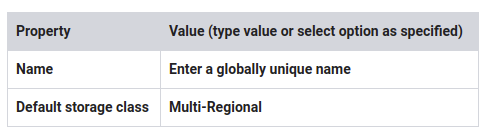
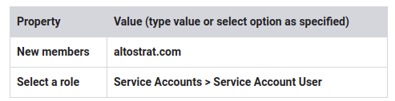
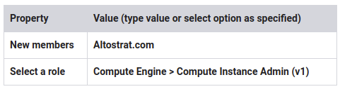
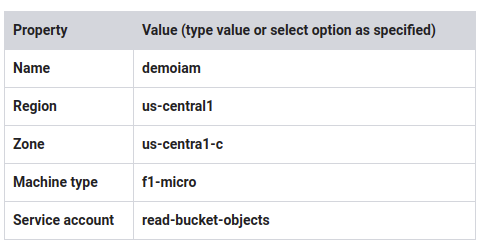

# Lab: Cloud IAM

## Overview

In this lab, you learn how to use the Service Account User role and how to grant roles.

### Objectives

In this lab, you learn how to perform the following tasks:

* Use Cloud IAM to implement access control
* Restrict access to specific features or resources
* Use the Service Account User role
* Before you click the Start Lab button
* Read these instructions. Labs are timed and you cannot pause them. The timer, which starts when you click Start Lab, shows how long Cloud resources will be made available to you.

## Task 1: Setup for two users

### Sign in to the GCP Console as the first user

1. For this lab, Qwiklabs has provisioned you with two user names available in the Connection Details dialog. Sign in to the GCP Console in an Incognito window as usual with the Username 1 provided in Qwiklabs. Note that both user names use the same single password.

### Sign in to the GCP Console as the second user

1. Open another tab in your incognito window.
2. Browse to console.cloud.google.com.
3. Click on the user icon in the top-right corner of the screen, and then click Add account.
4. Sign in to the GCP Console with the Username 2 provided in Qwiklabs.

> Note: At some points in this lab, if you sign out of the Username 1 account, the Username 2 account is deleted by Qwiklabs. So remain signed in to Username 1 until you are done using Username 2.

## Task 2: Explore the IAM console

Make sure you are on the Username 1 GCP Console tab.

###  Navigate to the IAM console and explore roles

1. On the Navigation menu, click IAM & admin > IAM.
2. Click Add and explore the roles in the drop-down menu. Note the various roles associated with each resource by navigating the Roles menu.
3. Click Cancel.
4. Switch to the Username 2 GCP Console tab.
5. On the Navigation menu, click IAM & admin > IAM. Browse the list for the lines with the names associated with Username 1 and Username 2 in the Qwiklabs Connection Details dialog.

> Username 2 currently has access to the project, but does not have the Project Owner role, so it cannot edit any of the roles. Hover over the pencil icon for Username 2 to verify this.

6. Switch back to the Username 1 GCP Console tab.
7. In the IAM console, for Username 2, click on the pencil icon. Username 2 currently has the Project Viewer role. Do not change the Project Role.
8. Click Cancel.

## Task 3: Prepare a resource for access testing

### Create a bucket and upload a sample file

1. Switch to the Username 1 GCP Console tab if you aren't already there.
2. On the Navigation menu, click Storage > Browser.
3. Click Create bucket.
4. Specify the following, and leave the remaining settings as their defaults:



> Note the bucket name: it will be used in a later step and referred to as [YOUR_BUCKET_NAME]

5. Click Create.
6. Click Upload files.
7. Upload any sample file from your local machine.
8. After the upload completes, click Close on the upload window.
9. When the file has been uploaded, click on the three dots at the end of the line containing the file, and click Rename.
10. Rename the file to sample.txt, and click Rename.
   Click Check my progress to verify the objective. Create a bucket and upload a sample file

### Verify project viewer access

1. Switch to the Username 2 GCP Console tab.
2. In the Console, navigate to Navigation menu > Storage > Browser.
3. Verify that Username 2 can see the bucket.

## Task 4: Remove project access

### Remove Project Viewer role for Username 2

1. Switch to the Username 1 GCP console tab.
2. On the Navigation menu, click IAM & admin > IAM.
3. For Username 2, click the Remove icon.
4. Confirm by clicking Confirm button.

> Notice that the user has disappeared from the list! The user has no access now.

Click Check my progress to verify the objective.
Remove project access

### Verify that Username 2 has lost access

1. Switch to the Username 2 GCP Console tab.

2. On the Navigation menu, click Home.

3. On the Navigation menu, click Storage > Browser. An error will be displayed. If not, refresh the page. Username 2 still has a GCP account, but has no access to the project.

## Task 5: Add storage access

### Add storage permissions

1. Copy the value of Username 2 from the Qwiklabs Connection Details dialog.
2. Switch to the Username 1 GCP Console tab.
3. On the Navigation menu, click IAM & admin > IAM.
4. Click Add to add the user.
5. For New members, paste the Username 2 value you copied from the Qwiklabs Connection Details dialog.
6. For Select a role, select Storage > Storage Object Viewer.
7. Click Save.
Click Check my progress to verify the objective.
Add storage permissions

### Verify that Username 2 has storage access

1. Switch to the Username 2 GCP Console tab.

> Username 2 doesn't have Project Viewer roles, so that user can't see the project or any of its resources in the Console. However, the user has specific access to Cloud Storage.

2. To start Cloud Shell, click Activate Cloud Shell. If prompted, click START CLOUD SHELL.

3. To view the contents of the bucket you created earlier, run the following command, replacing [YOUR_BUCKET_NAME] with the unique name of the Cloud Storage bucket you created:

`gsutil ls gs://[YOUR_BUCKET_NAME]`

As you can see, Username 2 has limited access to Cloud Storage.

4. Close the Username 2 GCP Console tab. The rest of the lab is performed on the Username 1 GCP Console tab.

5. Switch to the Username 1 GCP Console tab.

## Task 6: Set up the Service Account User

In this part of the lab, you assign narrow permissions to service accounts and learn how to use the Service Account User role.

### Create a service account

1. On the Navigation menu, click IAM & admin > Service accounts.

2. Click Create service account.

3. Specify the Service account name as read-bucket-objects .

4. Click Create.

5. Specify the Role as Storage > Storage Object Viewer .

6. Click Continue.

7. Click Done.

### Add the user to the service account

1. Select the read-bucket-objects service account.
2. Click Add member in the Permissions panel. If you do not see the Permission panel, click on Show Info panel.

> You will grant the user the role of Service Account User, which allows that person to use a service account on a VM, if they have access to the VM.
> 
> You could perform this activity for a specific user, group, or domain.
> 
> For training purposes, you will grant the Service Account User role to everyone at a company called Altostrat.com. Altostrat.com is a fake company used for demonstration and training.

3. Specify the following, and leave the remaining settings as their defaults:



4. Click Save.

### Grant Compute Engine access

You now give the entire organization at Altostrat the Compute Engine Admin role.

1. On the Navigation menu, click IAM & admin > IAM.
2. Click Add.
3. Specify the following, and leave the remaining settings as their defaults:



4. Click Save.

> This step is a rehearsal of the activity you would perform for a specific user.
> 
> This action gives the user limited abilities with a VM instance. The user will be able to connect via SSH to a VM and perform some administration tasks.

### Create a VM with the Service Account User

1. On the Navigation menu, click Compute Engine > VM instances.
2. Click Create.
3. Specify the following, and leave the remaining settings as their defaults:



4. Click Create.
   Click Check my progress to verify the objective.
Set up the Service Account User and create a VM

## Task 7: Explore the Service Account User role

At this point, you might have the user test access by connecting via SSH to the VM and performing the next actions. As the owner of the project, you already possess the Service Account User role. So you can simulate what the user would experience by just using SSH to access the VM from the GCP Console.

The actions you perform and results will be the same as if you were the target user.

### Use the Service Account User

1. For demoiam, click SSH to launch a terminal and connect.

1. Run the following command:

`gcloud compute instances list`

Result (do not copy; this is example output):

```shell
ERROR: (gcloud.compute.instances.list) Some requests did not succeed:
 - Required 'compute.zones.list' permission for 'projects/qwiklabs-gcp'
```

What happened? Why?

3. Copy the sample.txt file from the bucket you created earlier. Note that the trailing period is part of the command below. It means copy to "this location":

`gsutil cp gs://[YOUR_BUCKET_NAME]/sample.txt .`

Result (do not copy; this is example output):

```shell
Copying gs://train-test-iam/sample.txt...
/ [1 files][   28.0 B/   28.0 B]
Operation completed over 1 objects/28.0 B.
```

4. To rename the file you copied, run the following command:

`mv sample.txt sample2.txt`

5. To copy the renamed file back to the bucket, run the following command:

`gsutil cp sample2.txt gs://[YOUR_BUCKET_NAME]`

Result (do not copy; this is example output):

```shell
AccessDeniedException: 403 Caller does not have storage.objects.create access to bucket train-test-iam.
```

> What happened?
> 
> Because you connected via SSH to the instance, you can "act as the service account," essentially assuming the same permissions.The service account the instance was started with had the Storage Viewer role, which permits downloading objects from GCS buckets in the project.To list instances in a project, you need to grant the compute.instance.list permission. Because the service account did not have this permission, you could not list instances running in the project. Because the service account did have permission to download objects, it could download an object from the bucket. It did not have permission to write objects, so you got a "403 access denied" message.

## Task 8: Review

In this lab you exercised granting and revoking Cloud IAM roles, first to a user, Username 2, and then to a Service Account User. You could allocate Service Account User credentials and "bake" them into a VM to create specific-purpose authorized bastion hosts.

