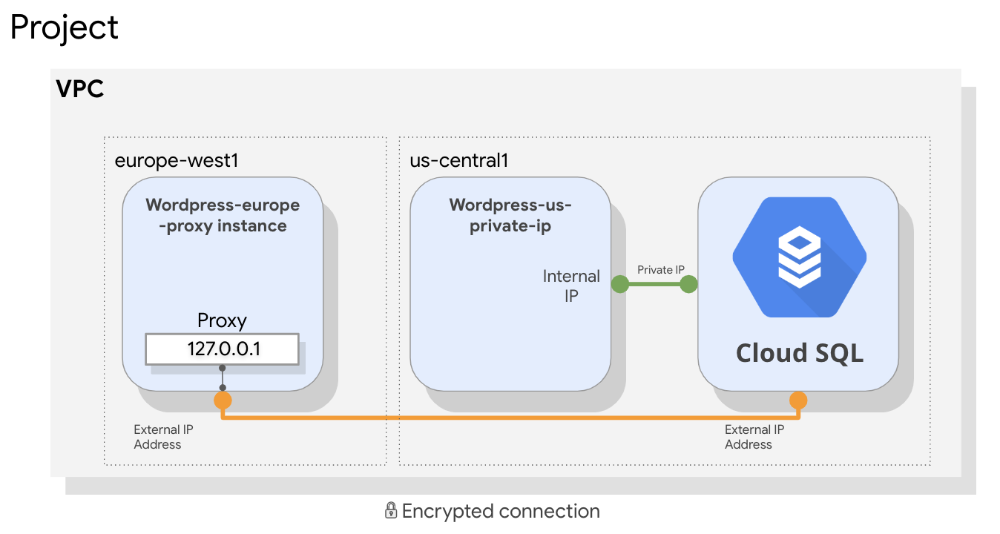
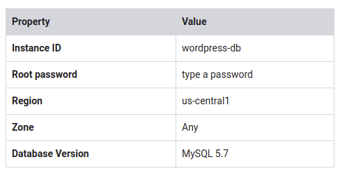
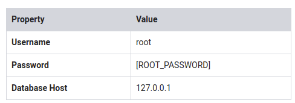
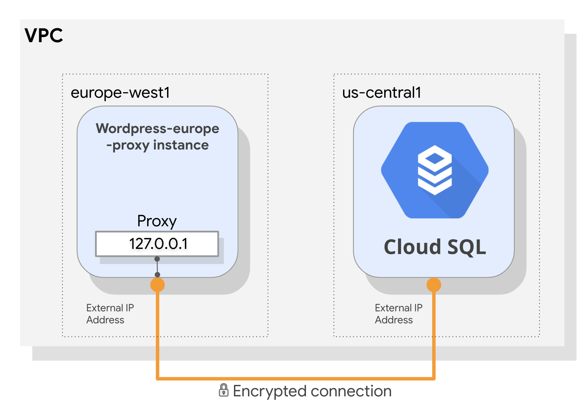
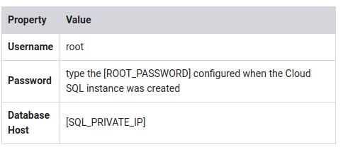
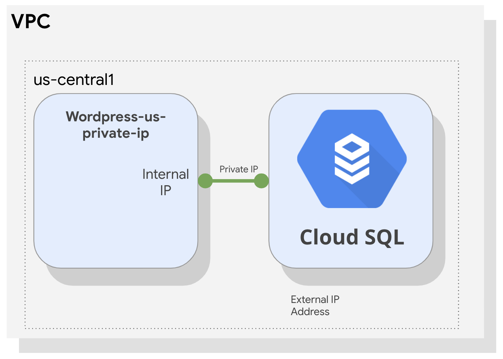

# Implementing Cloud SQL

~ 1 hour 30 minutes

## Overview

In this lab, you configure a Cloud SQL server and learn how to connect an application to it via a proxy over an external connection. You also configure a connection over a Private IP link that offers performance and security benefits. The app we chose to demonstrate in this lab is Wordpress, but the information and best practices are applicable to any application that needs SQL Server.

By the end of this lab, you will have 2 working instances of the Wordpress frontend connected over 2 different connection types to their SQL instance backend, as shown in this diagram:

SQL Lab Diagram




## Objectives

In this lab, you learn how to perform the following tasks:

* Create a Cloud SQL database
* Configure a virtual machine to run a proxy
* Create a connection between an application and Cloud SQL
* Connect an application to Cloud SQL using Private IP address

## Task 1: Create a Cloud SQL database

In this task, you configure a SQL server according to GCP best practices and create a Private IP connection.

1. On the Navigation menu (Navigation menu), click SQL.
2. Click Create instance.
3. Click Choose MySQL.
4. Specify the following, and leave the remaining settings as their defaults:



> **Note** the root password; it will be used in a later step and referred to as [ROOT_PASSWORD].
5. Expand Show configuration options.

6. Expand the Set connectivity section.

7. Select Private IP.

8. In the dialog box, click Enable API, click Allocate and connect, and then click Close. This enables [Private Services Access](https://cloud.google.com/vpc/docs/configure-private-services-access) and attaches a Private IP address to your Cloud SQL server.

> Private IP is an internal connection, unlike external IP, which egresses to the internet.

9. Expand the Configure machine type and storage section.

10. Provision the right amount of vCPU and memory. To choose a Machine Type, click Change, and then explore your options.

> A few points to consider:
> 
> * Shared-core machines are good for prototyping, and are not covered by Cloud SLA.
> * Each vCPU is subject to a 250 MB/s network throughput cap for peak performance. > > Each additional core increases the network cap, up to a theoretical maximum of 2000 MB/s.
> * For performance-sensitive workloads such as online transaction processing (OLTP). a general guideline is to ensure that your instance has enough memory to contain the entire working set and accommodate the number of active connections.

11. For this lab, select db-n1-standard-1, and then click Select.

12. Next, choose Storage type and Storage capacity.

> A few points to consider:
> 
> * SSD (solid-state drive) is the best choice for most use cases. HDD (hard-disk drive) offers lower performance, but storage costs are significantly reduced, so HDD may be preferable for storing data that is infrequently accessed and does not require very low latency.
> * There is a direct relationship between the storage capacity and its throughput.

13. Add a few zeros to the storage capacity to see how it affects the throughput. Reset the slider to 10GB.

> Setting your storage capacity too low without enabling an automatic storage increase can cause your instance to lose its SLA.

14. Click Close.
15. Click Create at the bottom of the page to create the database instance.

> You might have to wait for the Private IP changes to propagate before the Create button becomes clickable.

Click Check my progress to verify the objective.

Create a Cloud SQL instance

## Task 2: Configure a proxy on a virtual machine

When your application does not reside in the same VPC connected network and region as your Cloud SQL instance, use a proxy to secure its external connection.

In order to configure the proxy, you need the Cloud SQL instance connection name.

> The lab comes with 2 virtual machines preconfigured with Wordpress and its dependencies. You can view the startup script and service account access by clicking on a virtual machine name. Notice that we used the principle of least privilege and only allow SQL access for that VM. There's also a network tag and a firewall preconfigured to allow port 80 from any host.

1. On the Navigation menu (Navigation menu) click Compute Engine.

2. Click SSH next to wordpress-europe-proxy.

3. Download the Cloud SQL Proxy and make it executable:

```shell
wget https://dl.google.com/cloudsql/cloud_sql_proxy.linux.amd64 -O cloud_sql_proxy && chmod +x cloud_sql_proxy
```

In order to start the proxy, you need the connection name of the Cloud SQL instance. Keep your SSH window open and return to the GCP console.

4. On the Navigation menu (Navigation menu), click SQL.

5. Click on the wordpress-db instance and wait for a green checkmark next to its name, which indicates that it is operational (this could take a couple of minutes).

6. Note the Instance connection name; it will be used later and referred to as [SQL_CONNECTION_NAME].

7. In addition, for the application to work, you need to create a table. Click Databases.

8. Click Create database, type wordpress, which is the name the application expects, and then click Create.

9. Return to the SSH window and save the connection name in an environment variable, replacing [SQL_CONNECTION_NAME] with the unique name you copied in a previous step.

`export SQL_CONNECTION=[SQL_CONNECTION_NAME]`

10. To verify that the environment variable is set, run:

`echo $SQL_CONNECTION`

The connection name should be printed out.

11. To activate the proxy connection to your Cloud SQL database and send the process to the background, run the following command:

`./cloud_sql_proxy -instances=$SQL_CONNECTION=tcp:3306 &`

The expected output is

```shell
Listening on 127.0.0.1:3306 for [SQL_CONNECTION_NAME]
Ready for new connections
```

12. Press ENTER.

> The proxy will listen on 127.0.0.1:3306 (localhost) and proxy that connects securely to your Cloud SQL over a secure tunnel using the machine's external IP address.

Click Check my progress to verify the objective.

Create a database and configure a proxy on a Virtual Machine

## Task 3: Connect an application to the Cloud SQL instance

In this task, you will connect a sample application to the Cloud SQL instance.

1. Configure the Wordpress application. To find the external IP address of your virtual machine, query its metadata:

```shell
curl -H "Metadata-Flavor: Google" http://169.254.169.254/computeMetadata/v1/instance/network-interfaces/0/access-configs/0/external-ip && echo
```

2. Go to the wordpress-europe-proxy external IP address in your browser and configure the Wordpress application.
3. Click Let's Go.
4. Specify the following, replacing [ROOT_PASSWORD] with the password you configured upon machine creation, and leave the remaining settings as their defaults:




> You are using 127.0.0.1, localhost as the Database IP because the proxy you initiated listens on this address and redirects that traffic to your SQL server securely.

SQL Proxy



5. Click Submit.

6. When a connection has been made, click Run the installation to instantiate Wordpress and its database in your Cloud SQL. This might take a few moments to complete.

7. Populate your demo site's information with random information and click Install Wordpress. You won't have to remember or use these details.

> Installing Wordpress might take up to 3 minutes, because it propagates all its data to your SQL Server.

8. When a 'Success!' window appears, remove the text after the IP address in your web browser's address bar and press ENTER. You'll be presented with a working Wordpress Blog!

Wordpress Site

## Task 4: Connect to Cloud SQL via internal IP

If you can host your application in the same region and VPC connected network as your Cloud SQL, you can leverage a more secure and performant configuration using Private IP.

By using Private IP, you will increase performance by reducing latency and minimize the attack surface of your Cloud SQL instance because you can communicate with it exclusively over internal IPs.

1. In the GCP Console, on the Navigation menu (Navigation menu), click SQL.
2. Click wordpress-db.
3. Note the Private IP address of the Cloud SQL server; it will be referred to as [SQL_PRIVATE_IP].
4. On the Navigation menu, click Compute Engine.

> Notice that wordpress-us-private-ip is located at us-central1, where your Cloud SQL is located, which enables you to leverage a more secure connection.

5. Copy the external IP address of wordpress-us-private-ip, paste it in a browser window, and press ENTER.

6. Click Let's Go.

7. Specify the following, and leave the remaining settings as their defaults:




8. Click Submit.

> Notice that this time you are creating a direct connection to a Private IP, instead of configuring a proxy. That connection is private, which means that it doesn't egress to the internet and therefore benefits from better performance and security.
9. Click Run the installation. An 'Already Installed!' window is displayed, which means that your application is connected to the Cloud SQL server over private IP.

10. In your web browser's address bar, remove the text after the IP address and press ENTER. You'll be presented with a working Wordpress Blog!

SQL Proxy




## Task 5: Review

In this lab, you created a Cloud SQL database and configured it to use both an external connection over a secure proxy and a Private IP address, which is more secure and performant. Remember that you can only connect via Private IP if the application and the Cloud SQL server are collocated in the same region and are part of the same VPC network. If your application is hosted in another region, VPC, or even project, use a proxy to secure its connection over the external connection. 


SQL Lab Diagram

