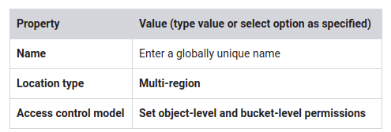
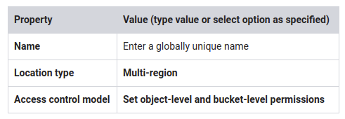
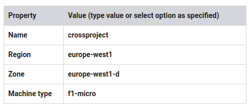

# lab: Cloud Storage

~ 1 hour 15 minutes

## Overview

Cloud Storage is a fundamental resource in GCP, with many advanced features. In this lab, you exercise many Cloud Storage features that could be useful in your designs. You explore Cloud Storage using both the console and the gsutil tool.

### Objectives

In this lab, you learn how to perform the following tasks:

* Create and use buckets
* Set access control lists to restrict access
* Use your own encryption keys
* Implement version controls
* Use directory synchronization
* Share a bucket across projects using IAM


## Task 1: Preparation

### Create a Cloud Storage bucket

1. On the Navigation menu, click Storage > Browser.

> A bucket must have a globally unique name. You could use part of your PROJECT_ID_1 in the name to help make it unique. For example, if the PROJECT_ID_1 is "myproj-154920," your bucket name might be "storecore154920."

2. Click Create bucket.
3. Specify the following, and leave the remaining settings as their defaults:




4. Make a note of the bucket name. It will be used later in this lab and referred to as [BUCKET_NAME_1].
5. Click Create.
   Click Check my progress to verify the objective.
   Create a Cloud Storage bucket

### Download a sample file using CURL and make two copies

1. In the GCP Console, click Activate Cloud Shell (Cloud Shell).

2. If prompted, click Start Cloud Shell.

3. Store [BUCKET_NAME_1] in an environment variable:

`export BUCKET_NAME_1=<enter bucket name 1 here>`

4. Verify it with echo:

`echo $BUCKET_NAME_1`

5. Run the following command to download a sample file (this sample file is a publicly available Hadoop documentation HTML file):

```shell
curl \
http://hadoop.apache.org/docs/current/\
hadoop-project-dist/hadoop-common/\
ClusterSetup.html > setup.html
```

6. To make copies of the file, run the following commands:

```shell
cp setup.html setup2.html
cp setup.html setup3.html
```

## Task 2: Access control lists (ACLs)

### Copy the file to the bucket and configure the access control list

1. Run the following command to copy the first file to the bucket:

`gsutil cp setup.html gs://$BUCKET_NAME_1/`

2. To get the default access list that's been assigned to setup.html, run the following command:

```shell
gsutil acl get gs://$BUCKET_NAME_1/setup.html  > acl.txt
cat acl.txt
```

3. To set the access list to private and verify the results, run the following commands:

```shell
gsutil acl set private gs://$BUCKET_NAME_1/setup.html
gsutil acl get gs://$BUCKET_NAME_1/setup.html  > acl2.txt
cat acl2.txt
```

4. To update the access list to make the file publicly readable, run the following commands:

```shell
gsutil acl ch -u AllUsers:R gs://$BUCKET_NAME_1/setup.html
gsutil acl get gs://$BUCKET_NAME_1/setup.html  > acl3.txt
cat acl3.txt
```

Click Check my progress to verify the objective.
Make file publicly readable

### Examine the file in the GCP Console

1. In the GCP Console, on the Navigation menu, click Storage > Browser.

2. Click [BUCKET_NAME_1].

3. Verify that for file setup.html, Public access has a Public link available.

### Delete the local file and copy back from Cloud Storage

1. Return to Cloud Shell. If necessary, click Activate Cloud Shell (Cloud Shell).

2. Run the following command to delete the setup file:

`rm setup.html`

3. To verify that the file has been deleted, run the following command:

`ls`

4. To copy the file from the bucket again, run the following command:

`gsutil cp gs://$BUCKET_NAME_1/setup.html setup.html`

## Task 3: Customer-supplied encryption keys (CSEK)

### Generate a CSEK key

For the next step, you need an AES-256 base-64 key.

1. Run the following command to create a key:

`python -c 'import base64; import os; print(base64.encodestring(os.urandom(32)))'`

Result (do not copy; this is example output):

`python -c 'import base64; import os; print(base64.encodestring(os.urandom(32)))'
tmxElCaabWvJqR7uXEWQF39DhWTcDvChzuCmpHe6sb0=`

2. Copy the value of the key.

### Modify the boto file

The encryption controls are contained in a gsutil configuration file named .boto.

1. To view and open the boto file, run the following commands:

`ls -al`

`nano .boto`

> If the `.boto` file is empty, close the nano editor with Ctrl+X and generate a new `.boto` file using the `gsutil config -n` command. Then, try opening the file again with the above commands.
> 
> If the `.boto` file is still empty, you might have to locate it using the `gsutil version -l` command.

2. Locate the line with "`#encryption_key=`"
3. Uncomment the line by removing the # character, and paste the key you generated earlier at the end.

Example (do not copy; this is an example):

```shell
Before:
# encryption_key=

After:
encryption_key=tmxElCaabWvJqR7uXEWQF39DhWTcDvChzuCmpHe6sb0=
```

4. Press Ctrl+O, ENTER to save the boto file, and then press Ctrl+X to exit nano.

### Upload the remaining setup files (encrypted) and verify in the GCP Console

1. To upload the remaining setup.html files, run the following commands:

```shell
gsutil cp setup2.html gs://$BUCKET_NAME_1/
gsutil cp setup3.html gs://$BUCKET_NAME_1/
```

2. Return to the GCP Console.
3. Click [BUCKET_NAME_1]. Both setup2.html and setup3.html files show that they are customer-encrypted.
   Click Check my progress to verify the objective.
   Customer-supplied encryption keys (CSEK)

### Delete local files, copy new files, and verify encryption

1. To delete your local files, run the following command in Cloud Shell:

`rm setup*`

2. To copy the files from the bucket again, run the following command:

`gsutil cp gs://$BUCKET_NAME_1/setup* ./`

3. To cat the encrypted files to see whether they made it back, run the following commands:

```shell
cat setup.html
cat setup2.html
cat setup3.html
```

## Task 4: Rotate CSEK keys

### Move the current CSEK encrypt key to decrypt key

1. Run the following command to open the .boto file:

`nano .boto`

2. Comment out the current encryption_key line by adding the # character to the beginning of the line.
3. Uncomment decryption_key1 by removing the # character, and copy the current key from the encryption_key line to the decryption_key1 line.

Result (do not copy; this is example output):

```shell
Before:
encryption_key=2dFWQGnKhjOcz4h0CudPdVHLG2g+OoxP8FQOIKKTzsg=

# decryption_key1=

After:
# encryption_key=2dFWQGnKhjOcz4h0CudPdVHLG2g+OoxP8FQOIKKTzsg=

decryption_key1=2dFWQGnKhjOcz4h0CudPdVHLG2g+OoxP8FQOIKKTzsg=
```

4. Press Ctrl+O, ENTER to save the boto file, and then press Ctrl+X to exit nano.

> Note: In practice, you would delete the old CSEK key from the encryption_key line.

### Generate another CSEK key and add to the boto file

1. Run the following command to generate a new key:

`python -c 'import base64; import os; print(base64.encodestring(os.urandom(32)))'`

2. Copy the value of the generated key.

3. To open the boto file, run the following command:

`nano .boto`

4. Add a new line with encryption_key= and paste the new key value.

Result (do not copy; this is example output):

```shell
Before:
# encryption_key=2dFWQGnKhjOcz4h0CudPdVHLG2g+OoxP8FQOIKKTzsg=

After:
encryption_key=HbFK4I8CaStcvKKIx6aNpdTse0kTsfZNUjFpM+YUEjY=
```

5. Press Ctrl+O, ENTER to save the boto file, and then press Ctrl+X to exit nano.

### Rewrite the key for file 1 and comment out the old decrypt key

When a file is encrypted, rewriting the file decrypts it using the decryption_key1 that you previously set, and encrypts the file with the new encryption_key.

You are rewriting the key for setup2.html, but not for setup3.html, so that you can see what happens if you don't rotate the keys properly.

1. Run the following command:

`gsutil rewrite -k gs://$BUCKET_NAME_1/setup2.html`

2. To open the boto file, run the following command:

`nano .boto`

3. Comment out the current decryption_key1 line by adding the # character back in.

Result (do not copy; this is example output):

```shell
Before:
decryption_key1=2dFWQGnKhjOcz4h0CudPdVHLG2g+OoxP8FQOIKKTzsg=

After:
# decryption_key1=2dFWQGnKhjOcz4h0CudPdVHLG2g+OoxP8FQOIKKTzsg=
```

4. Press Ctrl+O, ENTER to save the boto file, and then press Ctrl+X to exit nano.

> Note: In practice, you would delete the old CSEK key from the decryption_key1 line.

### Download setup 2 and setup3

1. To download setup2.html, run the following command:

`gsutil cp  gs://$BUCKET_NAME_1/setup2.html recover2.html`

2. To download setup3.html, run the following command:

`gsutil cp  gs://$BUCKET_NAME_1/setup3.html recover3.html`

> What happened? setup3.html was not rewritten with the new key, so it can no longer be decrypted, and the copy will fail.
> 
> You have successfully rotated the CSEK keys.

## Task 5: Enable lifecycle management

### View the current lifecycle policy for the bucket

Run the following command to view the current lifecycle policy:

`gsutil lifecycle get gs://$BUCKET_NAME_1`

> There is no lifecycle configuration. You create one in the next steps.

### Create a JSON lifecycle policy file

To create a file named life.json, run the following command:

`nano life.json`

2. Paste the following value into the life.json file:

```json
{
  "rule":
  [
    {
      "action": {"type": "Delete"},
      "condition": {"age": 31}
    }
  ]
}
```

> These instructions tell Cloud Storage to delete the object after 31 days.

3. Press Ctrl+O, ENTER to save the file, and then press Ctrl+X to exit nano.

### Set the policy and verify

1. To set the policy, run the following command:

`gsutil lifecycle set life.json gs://$BUCKET_NAME_1`

2. To verify the policy, run the following command:

`gsutil lifecycle get gs://$BUCKET_NAME_1`

Click Check my progress to verify the objective.

Enable lifecycle management

## Task 6: Enable versioning

### View the versioning status for the bucket and enable versioning

1. Run the following command to view the current versioning status for the bucket:

`gsutil versioning get gs://$BUCKET_NAME_1`

> The Suspended policy means that it is not enabled.

2. To enable versioning, run the following command:

`gsutil versioning set on gs://$BUCKET_NAME_1`

3. To verify that versioning was enabled, run the following command:

`gsutil versioning get gs://$BUCKET_NAME_1`

Click Check my progress to verify the objective.

Enable versioning

### Create several versions of the sample file in the bucket

1. Check the size of the sample file:

`ls -al setup.html`

2. Open the setup.html file:

`nano setup.html`

3. Delete any 5 lines from setup.html to change the size of the file.

4. Press Ctrl+O, ENTER to save the file, and then press Ctrl+X to exit nano.

5. Copy the file to the bucket with the -v versioning option:

`gsutil cp -v setup.html gs://$BUCKET_NAME_1`

6. Open the setup.html file:

`nano setup.html`

7. Delete another 5 lines from setup.html to change the size of the file.

8. Press Ctrl+O, ENTER to save the file, and then press Ctrl+X to exit nano.

9. Copy the file to the bucket with the -v versioning option:

`gsutil cp -v setup.html gs://$BUCKET_NAME_1`

### List all versions of the file

1. To list all versions of the file, run the following command:

`gsutil ls -a gs://$BUCKET_NAME_1/setup.html`

2. Highlight and copy the name of the oldest version of the file (the first listed), referred to as [VERSION_NAME] in the next step.

3. Store the version value in the environment variable [VERSION_NAME].

`export VERSION_NAME=<Enter VERSION name here>`

Verify it with echo:

`echo $VERSION_NAME`

### Download the oldest, original version of the file and verify recovery

1. Download the original version of the file:

`gsutil cp $VERSION_NAME recovered.txt`

2. To verify recovery, run the following commands:

`ls -al setup.html`

`ls -al recovered.txt`

> You have recovered the original file from the backup version. Notice that the original is bigger than the current version because you deleted lines.

## Task 7: Synchronize a directory to a bucket

### Make a nested directory and sync with a bucket

Make a nested directory structure so that you can examine what happens when it is recursively copied to a bucket.

1. Run the following commands:

```shell
mkdir firstlevel
mkdir ./firstlevel/secondlevel
cp setup.html firstlevel
cp setup.html firstlevel/secondlevel
```

2. To sync the firstlevel directory on the VM with your bucket, run the following command:

`gsutil rsync -r ./firstlevel gs://$BUCKET_NAME_1/firstlevel`

3. To verify that versioning was enabled, run the following command in Cloud Shell:

`gsutil versioning get gs://$BUCKET_NAME_1`

### Examine the results

1. In the GCP Console, on the Navigation menu, click Storage > Browser.

2. Click [BUCKET_NAME_1]. Notice the subfolders in the bucket.

3. Click on /firstlevel and then on /secondlevel.

4. Compare what you see in the GCP Console with the results of the following command:

`gsutil ls -r gs://$BUCKET_NAME_1/firstlevel`

5. Exit Cloud Shell:

`exit`

## Task 8: Cross-project sharing

### Switch to the second project

1. Open a new incognito tab.

2. Navigate to console.cloud.google.com.

3. Click the project selector dropdown in the title bar.

4. Click All, and then click the second project provided for you in the Qwiklabs Connection Details dialog. Remember that the Project ID is a unique name across all Google Cloud projects. The second project ID will be referred to as [PROJECT_ID_2].

### Prepare the bucket

1. In the GCP Console, on the Navigation menu, click Storage > Browser.
2. Click Create bucket.
3. Specify the following, and leave the remaining settings as their defaults:




4. Note the bucket name. It will be referred to as [BUCKET_NAME_2] in the following steps.

5. Click Create.

### Upload a text file to the bucket

1. Upload a file to [BUCKET_NAME_2]. Any small example file or text file will do.

2. Note the file name (referred to as [FILE_NAME]); you will use it later.

### Create an IAM Service Account

1. In the GCP Console, on the Navigation menu, click IAM & admin > Service accounts.
2. Click Create service account.
3. On Service account details page, specify the Service account name as cross-project-storage.
4. Click Create.
5. On the Service account permissions page, specify the role as Storage > Storage Object Viewer.
6. Click Continue.
7. Click Create Key.
8. Select JSON as the key type.
9. Click Create. A JSON key file will be downloaded. You will need to find this key file and upload it in into the VM in a later step.
10. Click Close.
11. Click Done.
12. On your hard drive, rename the JSON key file to credentials.json.
13. In the upper pane, switch back to [PROJECT_ID_1].
   Click Check my progress to verify the objective.
   Create the resources in the second project

### Create a VM

1. On the Navigation menu, click Compute Engine > VM instances.
2. Click Create.
3. Specify the following, and leave the remaining settings as their defaults:




4. Click Create.

### SSH to the VM

1. For crossproject, click SSH to launch a terminal and connect.

2. Store [BUCKET_NAME_2] in an environment variable:

`export BUCKET_NAME_2=<enter bucket name 2 here>`

3. Verify it with echo:

`echo $BUCKET_NAME_2`

4. Store [FILE_NAME] in an environment variable:

`export FILE_NAME=<enter FILE_NAME here>`

5. Verify it with echo:

`echo $FILE_NAME`

6. List the files in [PROJECT_ID_2]:

`gsutil ls gs://$BUCKET_NAME_2/`

Result (do not copy; this is example output):

```shell
AccessDeniedException: 403 Caller does not have storage.objects.list access to bucket [BUCKET_NAME_2].
```

### Authorize the VM

1. To upload credentials.json through the SSH VM terminal, click on the gear icon in the upper-right corner, and then click Upload file.

2. Select credentials.json and upload it.

3. Click Close in the File Transfer window.

4. Verify that the JSON file has been uploaded to the VM:

`ls`

Result (do not copy; this is example output):

`credentials.json`

5. Enter the following command in the terminal to authorize the VM to use the Google Cloud API:

`gcloud auth activate-service-account --key-file credentials.json`

> The image you are using has the Google Cloud SDK pre-installed; therefore, you don't need to initialize the Google Cloud SDK. If you are attempting this lab in a different environment, make sure you have followed these procedures regarding installing the Google Cloud SDK:

https://cloud.google.com/sdk/downloads

### Verify access

1. Retry this command:

`gsutil ls gs://$BUCKET_NAME_2/`

2. Retry this command:

`gsutil cat gs://$BUCKET_NAME_2/$FILE_NAME`

3. Try to copy the credentials file to the bucket:

`gsutil cp credentials.json gs://$BUCKET_NAME_2/`

Result (do not copy; this is example output):

```shell
Copying file://credentials.json [Content-Type=application/json]...
AccessDeniedException: 403 Caller does not have storage.objects.create access to bucket [BUCKET_NAME_2].
```

### Modify role

1. In the upper pane, switch back to [PROJECT_ID_2].
2. In the GCP Console, on the Navigation menu, click IAM & admin > IAM.
3. Click the pencil icon for the cross-project-storage service account (You might have to scroll to the right to see this icon).
4. Click on the Storage Object Viewer role, and then click Storage > Storage Object Admin.
5. Click Save. If you don't click Save, the change will not be made.
   Click Check my progress to verify the objective.
   Create and verify the resources in the first project

### Verify changed access

1. Return to the SSH terminal for crossproject.

2. Copy the credentials file to the bucket:

`gsutil cp credentials.json gs://$BUCKET_NAME_2/`

Result (do not copy; this is example output):

```shell
Copying file://credentials.json [Content-Type=application/json]...
- [1 files][  2.3 KiB/  2.3 KiB]
Operation completed over 1 objects/2.3 KiB.
```

> In this example the VM in PROJECT_ID_1 can now upload files to Cloud Storage in a bucket that was created in another project.
> 
> Note that the project where the bucket was created is the billing project for this activity. That means if the VM uploads a ton of files, it will not be billed to PROJECT_ID_1, but instead to PROJECT_ID_2.

## Task 9: Review

In this lab you learned to create and work with buckets and objects, and you learned about the following features for Cloud Storage:

* CSEK: Customer-supplied encryption key
* Use your own encryption keys
* Rotate keys
* ACL: Access control list
* Set an ACL for private, and modify to public
* Lifecycle management
* Set policy to delete objects after 31 days
* Versioning
* Create a version and restore a previous version
* Directory synchronization
* Recursively synchronize a VM directory with a bucket
* Cross-project resource sharing using IAM
* Use IAM to enable access to resources across projects
