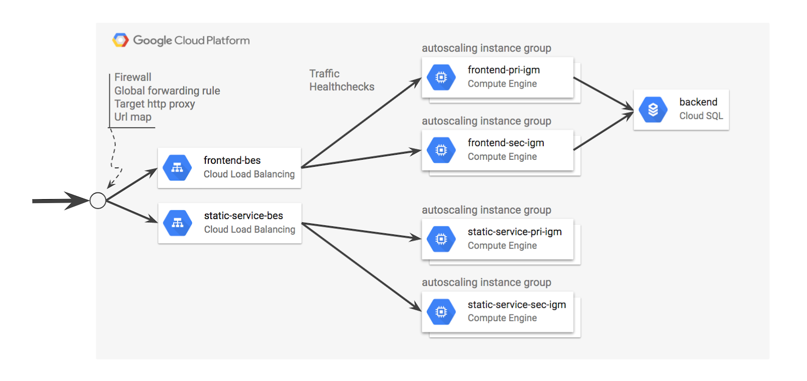
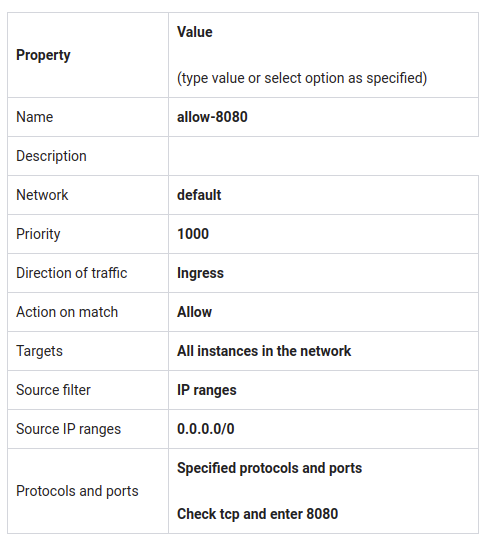
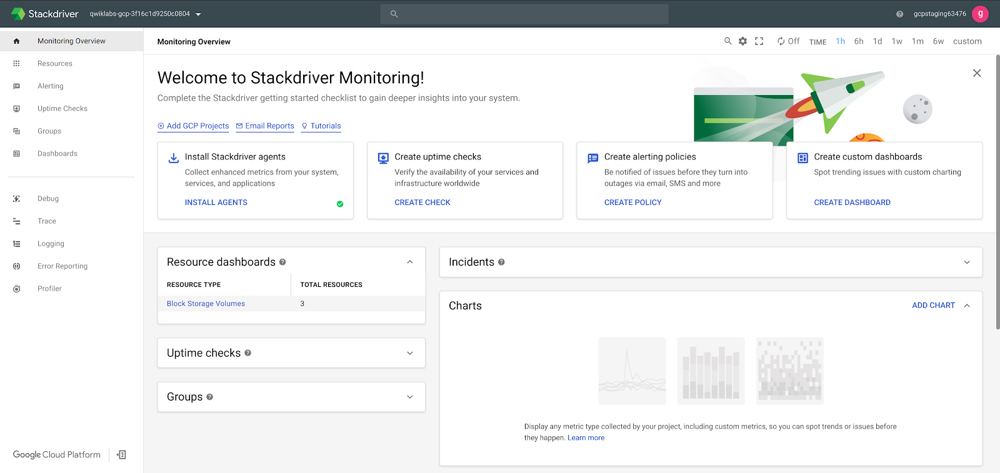
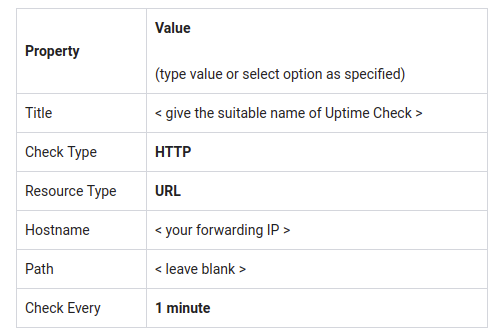
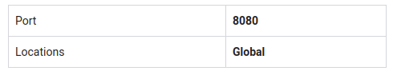
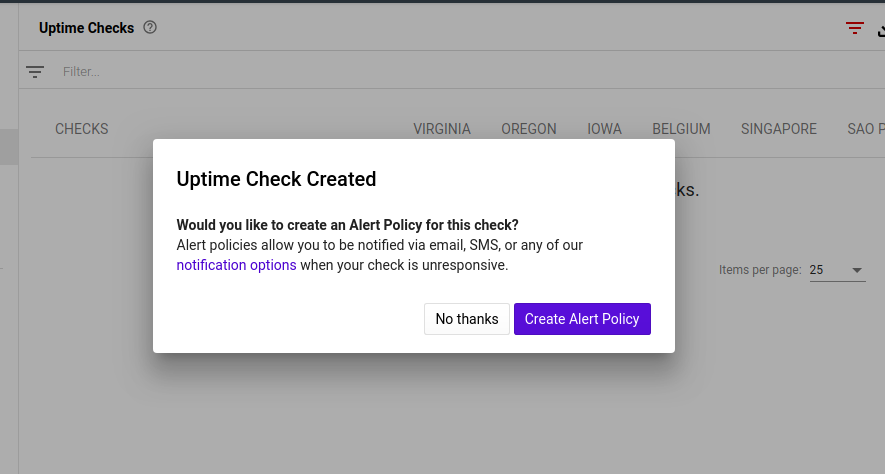
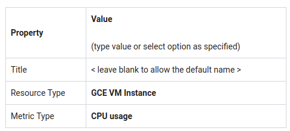
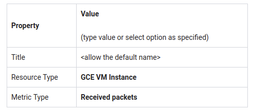
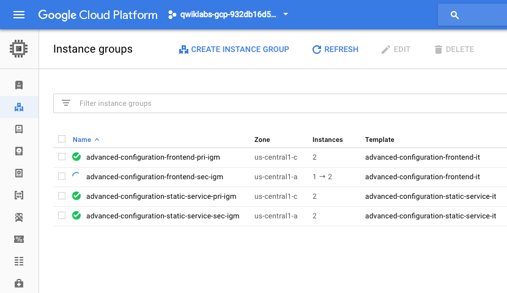
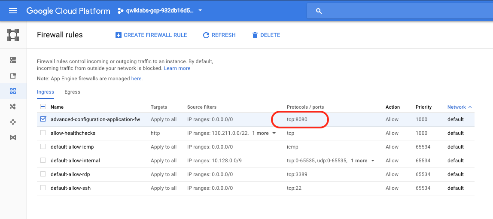

# (Ultimate) lab on Deployment Manager: Full Production + (Stackdriver)

~1 hour 30 minutes

## Overview

In this lab you will...

1. Install an advanced deployment using Deployment Manager sample templates.
2. Enable Stackdriver monitoring.
3. Configure Stackdriver Uptime Checks and Notifications.
4. Configure a Stackdriver Dashboard with two charts, showing CPU and ingress traffic.
5. Perform a load test and simulate a service outage.

## Content

* [Overview](#overview)
* [Objectives](#objectives)
* [Full Production](#full-production)
* [Clone the Deployment Manager sample templates](#clone-the-deployment-manager-sample-templates)
   * [Clone the repo.](#clone-the-repo)
   * [About the tutorials](#about-the-tutorials)
* [Explore the sample files](#explore-the-sample-files)
   * [List the example templates.](#list-the-example-templates)
* [Customize the deployment](#customize-the-deployment)
   * [Specify the zone and secondary zone.](#specify-the-zone-and-secondary-zone)
* [Run the application](#run-the-application)
   * [Deploy the application](#deploy-the-application)
   * [Verify that the application is open for traffic](#verify-that-the-application-is-open-for-traffic)
* [Verify that the application is operational](#verify-that-the-application-is-operational)
   * [Find the global load balancer forwarding rule IP address](#find-the-global-load-balancer-forwarding-rule-ip-address)
* [Enable monitoring for the project](#enable-monitoring-for-the-project)
   * [Configure Stackdriver services for your GCP project](#configure-stackdriver-services-for-your-gcp-project)
* [Configure an uptime check and alert policy for the application.](#configure-an-uptime-check-and-alert-policy-for-the-application)
   * [Configure an Uptime Check](#configure-an-uptime-check)
   * [Configure an Alerting Policy and Notification](#configure-an-alerting-policy-and-notification)
   * [Configure notifications and finish the alerting policy](#configure-notifications-and-finish-the-alerting-policy)
* [Configure a dashboard with a couple of useful charts.](#configure-a-dashboard-with-a-couple-of-useful-charts)
   * [Configure a Dashboard](#configure-a-dashboard)
* [Place a test load on the application.](#place-a-test-load-on-the-application)
   * [Create a test application in Cloud Shell.](#create-a-test-application-in-cloud-shell)
* [Create a test VM with Apache Bench](#create-a-test-vm-with-apache-bench)
   * [Install Apache Bench on Cloud Shell](#install-apache-bench-on-cloud-shell)
* [Simulate a service outage.](#simulate-a-service-outage)
   * [Remove the firewall to simulate an outage.](#remove-the-firewall-to-simulate-an-outage)
* [Full Production](#full-production-1)


## Objectives

In this lab, you will learn to:

* Launch a cloud service from a collection of templates.
* Configure basic black box monitoring of an application.
* Create an uptime check to recognize a loss of service.
* Establish an alerting policy to trigger incident response procedures.
* Create and configure a dashboard with dynamically update charts.
* Test the monitoring and alerting regimen by applying a load to the service.
* Test the monitoring and alerting regimen by simulating a service outage.

## Full Production

Mechanically, the actions you will perform in this lab are almost identical to the previous lab, with a few differences. But look at the deployment you are launching:




This deployment and the sample templates employ many of the best practices you have learned about throughout this class. It doesn't build just a single load balancer, but two of them. One for static content and another for dynamic content. Separating the workloads in this way allows the static and dynamic content to scale independently, making for a more cost optimized solution.

Both the dynamic and the static content are served by TWO managed instance groups so that if one group is lost, the other can resume. So this is a highly reliable and resilient design.

Finally, the system state information is pushed into a back-end Cloud SQL server. Do you know why there isn't a separate Cloud SQL server in a different zone performing replication?

Because the number of servers you are starting will reach the 8-server quota limit established in the Qwiklabs lab accounts!

Oh -- and this is a Logbook application.

## Clone the Deployment Manager sample templates

Google provides a robust set of sample Deployment Manager templates that you can learn from and build upon.

### Clone the repo.

In the GCP Console, to open Cloud Shell, click Activate Cloud Shell ( 54fc287f71fa86e5.png). If prompted, click Start Cloud Shell.


Open the Cloud Shell Code Editor. You will be using it to create and edit the template file, and the other tab to interrogate the environment for values you'll need to specify in the template. The controls you need to open the editor may be off screen to the right. You will need to close the Navigation menu to see the controls.

The control looks like a pencil. This is how you launch the Cloud Shell Code Editor.

In Cloud Shell Command Line, create a directory to hold the Deployment Manager sample templates and change into that directory.

```shell
mkdir ~/dmsamples
cd ~/dmsamples
```

Clone the repository.

`git clone https://github.com/GoogleCloudPlatform/deploymentmanager-samples.git`

### About the tutorials

There are several step-by-step tutorials in the documentation. They are located here:

https://cloud.google.com/deployment-manager/docs/tutorials

This lab is based on one of those tutorials, but includes additional content. The Deployment Manager template you will use generates an advanced HTTP(S) Load Balanced deployment for a Logbook sample application. The samples are available in both Jinja and Python. This lab uses the Python version of the templates.

https://cloud.google.com/deployment-manager/docs/create-advanced-http-load-balanced-deployment

## Explore the sample files

There are many sample templates in the directory.

### List the example templates.

Locate the version 2 examples and list them.

```shell
cd ~/dmsamples/deploymentmanager-samples/examples/v2
ls
```

You should see something like this:

**Example (don't copy)**

```shell
bigtable cloud_router container_vm htcondor image_based_igm internal_lb_haproxy nodejs_l7 regional_igm ssl vm_startup_script waiter build_configuration common gke iam instance_pool metadata_from_file project_creation saltstack step_by_step_guide vm_with_disks cloud_functions container_igm ha-service igm-updater internal_lb nodejs quick_start single_vm template_modules vpn_auto_subnet
```

Not all of the subdirectories are independent projects. For example, the directory named common contains templates that are used by several of the other projects. If you are studying independently later, use the README files as a guide.

The application you will build in this lab is contained in the nodejs_l7 directory. Note that there is a nodejs directory and a nodejs_l7 directory, you will use the one with L7.

L7 means network layer 7 load balancing.

https://cloud.google.com/deployment-manager/docs/create-advanced-http-load-balanced-deployment

https://cloud.google.com/deployment-manager/images/http-load-balanced-diagram.svg

List and examine the NodeJS_l7 deployment.
Locate the version 2 examples and list them.

```shell
cd nodejs_l7/python
ls
```

You should see something like this:

**Example (don't copy)**

```shell
application.py application.py.schema application.yaml autoscaled_group.py autoscaled_group.py.schema service.py service.py.schema
```

* `application.py`
* `application.py.schema`
* Unifies the frontend and backend and defines additional resources.
* A static service with primary and secondary managed instance groups that serves a static webpage.
* A URL Map resource that maps different URLs to their correct paths, default or static.
* A global forwarding rule that provides a single external IP address.
* A firewall rule that allows traffic through port 8080.
* `service.py`
* `service.py.schema`
* Creates the application frontend.
* Creates two managed instance groups, one primary and one secondary, using the `autoscaled_group.py` template
* Creates the backend service including health checker.
* `autoscaled_group.py`
* `autoscaled_group.py.schema`
* Creates an autoscaled managed instance group using the common `container_instance_template.py`

The above application-specific templates make use of several common templates that are used with other deployments.

* `/common/python/container_instance_template.py`
* `/common/python/container_vm.py`
* `/common/python/container_helper.py`

## Customize the deployment

Google provides a robust set of sample Deployment Manager templates that you can learn from and build upon.

### Specify the zone and secondary zone.

The application.yaml file requires a primary zone and a secondary zone.

You can find the list of zones in Cloud Shell Command Line by entering:

`gcloud compute zones list`

Use Cloud Shell Code Editor to edit `application.yaml` in `~/dmsamples/deploymentmanager-samples/examples/v2/nodejs_l7/python`

and replace ZONE_TO_RUN and SECOND_ZONE_TO_RUN with zones of your choosing.

**application.yaml**


```yaml
resources:
- name: nodejs
  type: application.py
  properties:
    primaryZone: ZONE_TO_RUN
    secondaryZone: SECOND_ZONE_TO_RUN
    backendImage: gcr.io/deployment-manager-examples/mysql
    frontendImage: gcr.io/deployment-manager-examples/nodejsservice
    staticImage: gcr.io/deployment-manager-examples/nodejsservicestatic
```

## Run the application

The application will not be operational until several steps are completed. First, you will use Deployment Manager to deploy the application. That will build the infrastructure but it won't initially allow traffic to begin. After the infrastructure is setup, you will apply service labels.

### Deploy the application

1. Name the application and pass Deployment Manager the configuration file.

`gcloud deployment-manager deployments create advanced-configuration --config application.yaml`

### Verify that the application is open for traffic

* On the Navigation menu, click VPC Network > Firewall rules.
* The Deployment Manager template should have already created a firewall rule to allow traffic from TCP 8080.

**If you don't have already created firewall rule to allow traffic from tcp:8080 then create a firewall rule by using following instructions:**

* Create a firewall rule that opens tcp:8080 for the service.
* On the Navigation menu, click VPC Network > Firewall rules
* Click on Create Firewall Rule and specify the following:





Click Create.

## Verify that the application is operational

The application takes a few minutes to start. You can view it in the Deployment Manager part of Console or you can see the instances in the Compute Engine part of Console. The application is accessible on port 8080 at a global IP address. Unfortunately, The IP address was established dynamically when the global forwarding rule was implemented by the Deployment Manager templates, so you don't know the application's IP address. And you will need that address to test the application.

### Find the global load balancer forwarding rule IP address

Find the Forwarding IP address.

`gcloud compute forwarding-rules list`

Open a browser and view port 8080

`http://<your forwarding IP>:8080`

It may take several minutes for the service to become operational. If you get an error, such as a 404, wait about two minutes and try again. When you get a blank page, you may proceed to enter log information and view it.

Create several log entries by calling this repeatedly with different messages.

`http://<your forwarding IP>:8080/?msg=enter-a-message`

View the log entries:

`http://<your forwarding IP>:8080/`

## Enable monitoring for the project

Now that the application is running, you will setup Stackdriver Alerts and some Stackdriver dashboards.

### Configure Stackdriver services for your GCP project

1. In the GCP console window, navigate to the Monitoring screen (**Navigation menu** > **Stackdriver** > **Monitoring**).
2. Click Log in with Google.
3. If asked, select your Qwiklabs account.
   > **Note:** If you are prompted with **Create workspace**, skip to Configure Stackdriver services for your GCP project and follow the steps.
   > 
   > 1. In the Create your free Workspace screen, click the **Create workspace** button. This will create a new Stackdriver monitoring workspace. A single Stackdriver workspace can contain multiple GCP project and provide a "single pane of glass" to monitor all resources.
   > 1. On the Add Google Cloud Platform projects to monitor screen, click the **Continue** button.
   > 1. Click the **Skip AWS Setup** button. We will not setup AWS monitoring, but there are Stackdriver monitor agents available for AWS as well.
   > 1. On the Install the Stackdriver Agents screen, click **Continue**.
   > 1. On the Get Reports by Email page, select **No reports**, and then click **Continue**.
   > 1. Click **Launch monitoring**.


The Stackdriver will create a new workspace for your project and will collect data for your workspace. You might have to wait for 2 to 3 minutes to see Stackdriver Monitoring welcome page. You should now see the Stackdriver Monitoring console. The information on the console varies depending on the resources you are monitoring.




## Configure an uptime check and alert policy for the application.

Now that the application is running, you will setup Stackdriver Alerts and some Stackdriver dashboards.

### Configure an Uptime Check

1. On the Stackdriver window or tab, click on Uptime Checks menu, click Uptime Checks Overview. Click on Add Uptime Check.
2. Specify the following:



3. Click Advanced Options and specify the following, leaving the remaining settings at the default values.

    

4. Click Test. If the test fails, make sure that the service is still working. Also check to see that the firewall rule exists and is correct. If the test succeeds, click Save.
5. After the Uptime Check is saved, Stackdriver will offer to create an alerting policy.

### Configure an Alerting Policy and Notification

6. Click Create Alert Policy.



7. Go to Metric tab, give a display name in the Untitled Condition.

8. Click Save.

### Configure notifications and finish the alerting policy

9. In Notifications, click the dropdown next to the Notifications Channel Type.
10. Select Email as the notification channel, and enter a valid email address.
11. Click Add notification Channel.
12. Skip the Documentation step.
13. For Name this policy, type a name for the policy.
   **Note:** Policy names are used as subjects in notification emails, so use that to your advantage.

14. Click Save.

## Configure a dashboard with a couple of useful charts.

### Configure a Dashboard

* On the Stackdriver window or tab, click on Dashboards > Create Dashboard.
* Click on the Untitled Dashboard and give it a name like ArchDP Dash.
* Click Add Chart.




* Click Save.
* Click Add Chart and add another chart to the dashboard with the following properties:



* Click Save.

## Place a test load on the application.

### Create a test application in Cloud Shell.

In Console, return to Cloud shell or open Cloud Shell if necessary.

Using the Cloud Shell Code Editor, create the `test-monitor1.sh` file in `~/dmsamples/deploymentmanager-samples/examples/v2/nodejs_l7/python`

Replace <your forwarding IP> with the forwarding IP address of the application and save the file.

`test-monitor1.sh`

```shell
#!/bin/bash
for ((c=1; c<=250; c++))
do
   echo "$c"
   curl -s "http://<your forwarding IP>:8080/"
done
```

Using the Cloud Shell, make the script executable.

`chmod +x test-monitor1.sh`

Using the Cloud Shell, run the script several times.

`./test-monitor1.sh`

View the results on the Dashboard in Stackdriver.

The minimum dashboard timeline is 1 hour. You should see the Received packets graph trend upwards after a few minutes.

This bash script running on Cloud Shell is not sufficient to drive autoscaling. A load testing application will be required.

## Create a test VM with Apache Bench

With the number of VMs launched, you have probably reached the Qwiklabs quota limit. Instead of installing Apache Bench on a VM, as you would normally do in a production environment, just install and use it from the Cloud Shell Command Line

### Install Apache Bench on Cloud Shell

1. Open Cloud Shell

```shell
cd
sudo apt-get update
sudo apt-get -y install apache2-utils
```

2. Use Apache Bench to apply load to the service.

`ab -n 10000 -c 100 http://<your forwarding IP>:8080/`

> Note: You must include the trailing slash after your forwarding IP address. Otherwise you will get an error such as: "ab: invalid URL" when you run the above command.

3. Run the above command two or three times.
4. View the results on the Dashboard in Stackdriver.
5. You can also view the instance groups in Console to see if autoscaling has been triggered. On the Navigation menu, click Compute Engine > Instance groups. Your results may look similar to the image below:




## Simulate a service outage.

### Remove the firewall to simulate an outage.

1. On the Navigation menu, click VPC Network > Firewall rules.
2. As shown in the image below, select the firewall rule that is allowing TCP 8080 traffic, and click Delete.



3. After some time, you should receive a notification email. The notification latency setting determines how long after a policy is triggered before a notification is sent.
   After you receive the notification you can proceed.

## Full Production

You just built a full-featured full-size highly available, reliable, scalable, and resilient service. And it probably didn't feel significantly different from the much smaller services you built in the previous two labs. That's the magic of Deployment Manager!!

