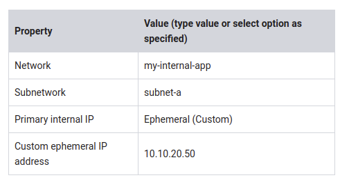

# Configuring an Internal Load Balancer

~1 hour 30 minutes

## Overview

GCP offers Internal Load Balancing for your TCP/UDP-based traffic. Internal Load Balancing enables you to run and scale your services behind a private load balancing IP address that is accessible only to your internal virtual machine instances.

In this lab, you create two managed instance groups in the same region. Then you configure and test an internal load balancer with the instances groups as the backends, as shown in this network diagram:


### Objectives

In this lab, you learn how to perform the following tasks:

* Create HTTP and health check firewall rules
* Configure two instance templates
* Create two managed instance groups
* Configure and test an internal load balancer

## Task 1. Configure HTTP and health check firewall rules

Configure firewall rules to allow HTTP traffic to the backends and TCP traffic from the GCP health checker.

### Explore the my-internal-app network

The network my-internal-app with subnet-a and subnet-b and firewall rules for RDP, SSH, and ICMP traffic have been configured for you.

* In the GCP Console, on the Navigation menu (Navigation menu), click VPC network > VPC networks. Notice the my-internal-app network with its subnets: subnet-a and subnet-b.

   Each GCP project starts with the default network. In addition, the my-internal-app network has been created for you as part of your network diagram.
   
   You will create the managed instance groups in subnet-a and subnet-b. Both subnets are in the us-central1 region because an internal load balancer is a regional service. The managed instance groups will be in different zones, making your service immune to zonal failures.

###  Create the HTTP firewall rule

Create a firewall rule to allow HTTP traffic to the backends from the load balancer and the internet (to install Apache on the backends).

1. On the Navigation menu (Navigation menu), click VPC network > Firewall rules. Notice the app-allow-icmp and app-allow-ssh-rdp firewall rules.

   These firewall rules have been created for you.

2. Click Create Firewall Rule.

3. Specify the following, and leave the remaining settings as their defaults:


4. For tcp, specify port 80.

   > Make sure to include the /0 in the Source IP ranges to specify all networks.

5. Click Create.

### Create the health check firewall rules

Health checks determine which instances of a load balancer can receive new connections. For Internal Load Balancing, the health check probes to your load-balanced instances come from addresses in the ranges _130.211.0.0/22_ and _35.191.0.0/16_. Your firewall rules must allow these connections.

1. Return to the Firewall rules page.

2. Click Create Firewall Rule.

3. Specify the following, and leave the remaining settings as their defaults:


4. Check tcp to specify all ports.

   > Make sure to enter the two Source IP ranges individually and press SPACE between them.

5. Click Create.


## Task 2. Configure instance templates and create instance groups

A managed instance group uses an instance template to create a group of identical instances. Use these to create the backends of the internal load balancer.

### Configure the instance templates

An instance template is an API resource that you can use to create VM instances and managed instance groups. Instance templates define the machine type, boot disk image, subnet, labels, and other instance properties. Create an instance template for both subnets of the my-internal-app network.

1. On the Navigation menu (Navigation menu), click Compute Engine > Instance templates.

2. Click Create instance template.

3. For Name, type instance-template-1

4. Click Management, security, disks, networking, sole tenancy.

5. Click Management.

6. Under Metadata, specify the following:


   > The startup-script-url specifies a script that is executed when instances are started. This script installs Apache and changes the welcome page to include the client IP and the name, region, and zone of the VM instance. You can explore this script [here](https://storage.googleapis.com/cloud-training/gcpnet/ilb/startup.sh).

    ```shell
    #! /bin/bash

    apt-get update 
    apt-get install -y apache2 php
    cd /var/www/html
    rm index.html -f
    rm index.php -f
    wget https://storage.googleapis.com/cloud-training/gcpnet/ilb/index.php
    META_REGION_STRING=$(curl "http://metadata.google.internal/computeMetadata/v1/instance/zone" -H "Metadata-Flavor: Google")
    REGION=`echo "$META_REGION_STRING" | awk -F/ '{print $4}'`
    sed -i "s|region-here|$REGION|" index.php
    ```

7. Click Networking.

8. For Network interfaces, specify the following, and leave the remaining settings as their defaults:


   > The network tag lb-backend ensures that the HTTP and Health Check firewall rules apply to these instances.

9. Click Create. Wait for the instance template to be created.

   Create another instance template for subnet-b by copying instance-template-1:

10. Select the instance-template-1 and click Copy.

11. Click Management, security, disks, networking, sole tenancy.

12. Click Networking.

13. For Network interfaces, select subnet-b as the Subnetwork.

14. Click Create.

### Create the managed instance groups

Create a managed instance group in subnet-a (us-central1-a) and subnet-b (us-central1-b).

1. On the Navigation menu (Navigation menu), click Compute Engine > Instance groups.

2. Click Create Instance group.

3. Specify the following, and leave the remaining settings as their defaults:


   > Managed instance groups offer autoscaling capabilities that allow you to automatically add or remove instances from a managed instance group based on increases or decreases in load. Autoscaling helps your applications gracefully handle increases in traffic and reduces cost when the need for resources is lower. Just define the autoscaling policy, and the autoscaler performs automatic scaling based on the measured load.

4. Click Create.

   Repeat the same procedure for instance-group-2 in us-central1-b:

5. Click Create Instance group.

6. Specify the following, and leave the remaining settings as their defaults:


7. Click Create.

### Verify the backends

Verify that VM instances are being created in both subnets and create a utility VM to access the backends' HTTP sites.

1. On the Navigation menu, click Compute Engine > VM instances. Notice two instances that start with instance-group-1 and instance-group-2.

   These instances are in separate zones, and their internal IP addresses are part of the subnet-a and subnet-b CIDR blocks.

2. Click Create Instance.

3. Specify the following, and leave the remaining settings as their defaults:


4. Click Management, security, disks, networking, sole tenancy.

5. Click Networking.

6. For Network interfaces, click the pencil icon to edit.

7. Specify the following, and leave the remaining settings as their defaults:



8. Click Done.

9. Click Create.

10. Note that the internal IP addresses for the backends are _10.10.20.2_ and _10.10.30.2_.

   > If these IP addresses are different, replace them in the two curl commands below.


11. For utility-vm, click SSH to launch a terminal and connect.

12. To verify the welcome page for instance-group-1-xxxx, run the following command:

`curl 10.10.20.2`

The output should look like this (do not copy; this is example output):

```html
<h1>Internal Load Balancing Lab</h1><h2>Client IP</h2>Your IP address : 10.10.20.50<h2>Hostname</h2>Server Hostname:
 instance-group-1-1zn8<h2>Server Location</h2>Region and Zone: us-central1-a
````

13. To verify the welcome page for instance-group-2-xxxx, run the following command:

`curl 10.10.30.2`

The output should look like this (do not copy; this is example output):

```html
<h1>Internal Load Balancing Lab</h1><h2>Client IP</h2>Your IP address : 10.10.20.50<h2>Hostname</h2>Server Hostname:
 instance-group-2-q5wp<h2>Server Location</h2>Region and Zone: us-central1-b
```

Which of these fields identify the location of the backend?

Client IP, Server Location or Server Hostname?

   > This will be useful when verifying that the internal load balancer sends traffic to both backends.

14. Close the SSH terminal to utility-vm:

`exit`

## Task 3. Configure the internal load balancer

Configure the internal load balancer to balance traffic between the two backends (instance-group-1 in us-central1-a and instance-group-2 in us-central1-b), as illustrated in the network diagram:


### Start the configuration

1. In the GCP Console, on the Navigation menu (Navigation menu), click Network Services > Load balancing.
2. Click Create load balancer.
3. Under TCP Load Balancing, click Start configuration.
4. For Internet facing or internal only, select Only between my VMs.

   > Choosing Only between my VMs makes this load balancer internal. This choice requires the backends to be in a single region (us-central1) and does not allow offloading TCP processing to the load balancer.

5. Click Continue.

6. For Name, type my-ilb.

### Configure the regional backend service

The backend service monitors instance groups and prevents them from exceeding configured usage.

1. Click Backend configuration.

2. Specify the following, and leave the remaining settings as their defaults:


3. Click Done.

4. Click Add backend.

5. For Instance group, select instance-group-2 (us-central1-b).

6. Click Done.

7. For Health Check, select Create a health check.

8. Specify the following, and leave the remaining settings as their defaults:


   > Health checks determine which instances can receive new connections. This HTTP health check polls instances every 5 seconds, waits up to 5 seconds for a response, and treats 2 successful or 2 failed attempts as healthy or unhealthy, respectively.

9. Click Save and Continue.

10. Verify that there is a blue check mark next to Backend configuration in the GCP Console. If there isn't, double-check that you have completed all the steps above.

### Configure the frontend

1. The frontend forwards traffic to the backend.

2. Click Frontend configuration.

3. Specify the following, and leave the remaining settings as their defaults:


3. Specify the following, and leave the remaining settings as their defaults:


5. For Ports, type 80.

6. Click Done.

### Review and create the internal load balancer

1. Click Review and finalize.
2. Review the Backend and Frontend.
3. Click Create. Wait for the load balancer to be created before moving to the next task.

## Task 4. Test the internal load balancer

Verify that the my-ilb IP address forwards traffic to instance-group-1 in us-central1-a and instance-group-2 in us-central1-b.

### Access the internal load balancer

1. On the Navigation menu, click Compute Engine > VM instances.

2. For utility-vm, click SSH to launch a terminal and connect.

3. To verify that the internal load balancer forwards traffic, run the following command:

`curl 10.10.30.5`

The output should look like this (do not copy; this is example output):

```html
<h1>Internal Load Balancing Lab</h1><h2>Client IP</h2>Your IP address : 10.10.20.50<h2>Hostname</h2>Server Hostname:
 instance-group-1-1zn8<h2>Server Location</h2>Region and Zone: us-central1-a
```

   > As expected, traffic is forwarded from the internal load balancer (10.10.30.5) to the backend.

4. Run the same command a couple of times:

```shell
curl 10.10.30.5
curl 10.10.30.5
curl 10.10.30.5
curl 10.10.30.5
curl 10.10.30.5
curl 10.10.30.5
curl 10.10.30.5
curl 10.10.30.5
curl 10.10.30.5
curl 10.10.30.5
```

You should be able to see responses from instance-group-1 in us-central1-a and instance-group-2 in us-central1-b. If not, run the command again.

## Task 5. Review

In this lab, you created two managed instance groups in the us-central1 region and firewall rules to allow HTTP traffic to those instances and TCP traffic from the GCP health checker. Then you configured and tested an internal load balancer for those instance groups.

