# Configuring an HTTP Load Balancer with Autoscaling

[lab url](https://googlecoursera.qwiklabs.com/focuses/37338#)

~ 2 hours

## Overview

GCP HTTP(S) load balancing is implemented at the edge of Google's network in Google's points of presence (POP) around the world. User traffic directed to an HTTP(S) load balancer enters the POP closest to the user and is then load-balanced over Google's global network to the closest backend that has sufficient available capacity.

In this lab, you configure an HTTP load balancer as shown in the diagram below. Then, you stress test the load balancer to demonstrate global load balancing and autoscaling.

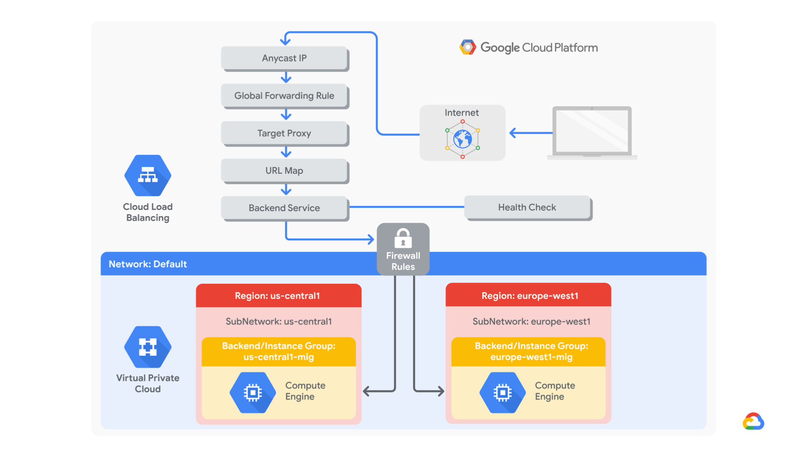


### Objectives

In this lab, you learn how to perform the following tasks:

1. Create HTTP and health check firewall rules
2. Create a custom image for a web server
3. Create an instance template based on the custom image
4. Create two managed instance groups
5. Configure an HTTP load balancer with IPv4 and IPv6
6. Stress test an HTTP load balancer


## Task 1. Configure HTTP and health check firewall rules

Configure firewall rules to allow HTTP traffic to the backends and TCP traffic from the GCP health checker.

### Create the HTTP firewall rule

Create a firewall rule to allow HTTP traffic to the backends.

1. In the GCP Console, on the Navigation menu (Navigation menu), click VPC network > Firewall rules. Notice the existing ICMP, internal, RDP, and SSH firewall rules.

2. Each GCP project starts with the default network and these firewall rules.

3. Click Create Firewall Rule.

4. Specify the following, and leave the remaining settings as their defaults:


> Make sure to include the /0 in the Source IP ranges to specify all networks.

4. For tcp, specify port 80.

5. Click Create.

### Create the health check firewall rules

Health checks determine which instances of a load balancer can receive new connections. For HTTP load balancing, the health check probes to your load-balanced instances come from addresses in the ranges 130.211.0.0/22 and 35.191.0.0/16. Your firewall rules must allow these connections.

1. Return to the Firewall rules page.

2. Click Create Firewall Rule.

3. Specify the following, and leave the remaining settings as their defaults:

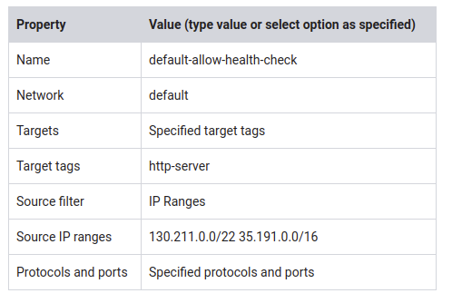

> Make sure to enter the two Source IP ranges individually and press SPACE between them.

4. Check tcp, to specify all ports.
5. Click Create.


## Task 2: Create a custom image for a web server

Create a custom web server image for the backend of the load balancer.

### Create a VM

1. In the GCP Console, on the Navigation menu (Navigation menu), click Compute Engine > VM instances.

2. Click Create.

3. Specify the following, and leave the remaining settings as their defaults:

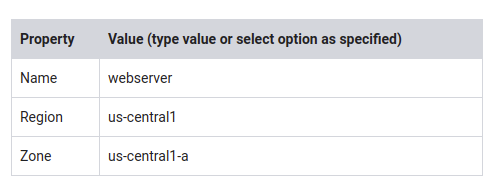

4. Click Management, security, disks, networking, sole tenancy.

5. Click Disks, and clear Delete boot disk when instance is deleted.

6. Click Networking.

7. Specify the following, and leave the remaining settings as their defaults:

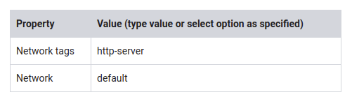

> The network tag http-server ensures that the HTTP and Health Check firewall rules apply to this instance.

8. Click Create.

### Customize the VM

1. For webserver, click SSH to launch a terminal and connect.

2. To install Apache2, run the following commands:

```shell
sudo apt-get update
sudo apt-get install -y apache2
```

3. To start the Apache server, run the following command:

```shell
sudo service apache2 start
```

4. In the GCP Console, for webserver, click the External IP address.

The default page for the Apache2 server should be displayed.

### Set the Apache service to start at boot

The software installation was successful. However, when a new VM is created using this image, the freshly booted VM does not have the Apache web server running. Use the following command to set the Apache service to automatically start on boot. Then test it to make sure it works.

1. In the webserver SSH terminal, set the service to start on boot:

`sudo update-rc.d apache2 enable`

2. In the GCP Console, select webserver, and then click Reset.
3. In the confirmation dialog, click Reset.

> Reset will stop and reboot the machine. It keeps the same IPs and the same persistent boot disk, but memory is wiped. Therefore, if the Apache service is available after the reset, the update-rc command was successful.

4. For webserver, click the External IP address of the instance to verify that the Apache service is available. You should see the default page.

5. You can also check the server by connecting via SSH to the VM and entering the following command:

`sudo service apache2 status`

6. The result should show Started The Apache HTTP Server.

### Prepare the disk to create a custom image

1. Verify that the boot disk will not be deleted when the instance is deleted.

2. On the VM instances page, click webserver to view the VM instance details.

3. Under Boot disk, verify that When deleting instance is set to Keep disk.

4. Return to the VM instances page, click webserver, and click Delete.

5. In the confirmation dialog, click Delete.

6. In the left pane, click Disks and verify that the webserver disk exists.

### Create the custom image

1. In the left pane, click Images.

2. Click Create image.

3. Specify the following, and leave the remaining settings as their defaults:

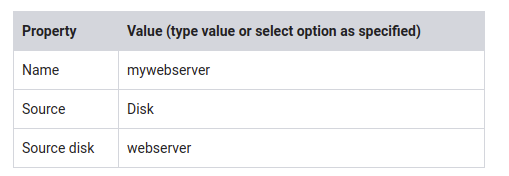

4. Click Create.

> You have created a custom image that multiple identical webservers can be started from. At this point, you could delete the webserver disk.

The next step is to use that image to define an instance template that can be used in the managed instance groups.


## Task 3. Configure an instance template and create instance groups

A managed instance group uses an instance template to create a group of identical instances. Use these to create the backends of the HTTP load balancer.

### Configure the instance template
An instance template is an API resource that you can use to create VM instances and managed instance groups. Instance templates define the machine type, boot disk image, subnet, labels, and other instance properties. Create one instance template for us-central1 and one for europe-west1.

1. In the GCP Console, on the Navigation menu (Navigation menu), click Compute Engine > Instance templates.

2. Click Create instance template.

3. For Name, type mywebserver-template.

4. For Machine type, select f1-micro (1 vCPU).

5. For Boot disk, click Change.

6. Click Custom images.

7. Select mywebserver.

8. Click Select.

9. Click Management, security, disks, networking, sole tenancy.

10. Click Networking.

11. Specify the following, and leave the remaining settings as their defaults:

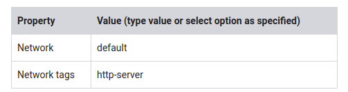


12. Click Create.

### Create the managed instance groups

Create a managed instance group in us-central1 and one in europe-west1.

1. On the Navigation menu, click Compute Engine > Instance groups.

2. Click Create Instance group.

3. Specify the following, and leave the remaining settings as their defaults:

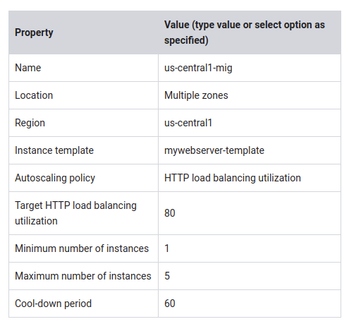

> Managed instance groups offer autoscaling capabilities that allow you to automatically add or remove instances from a managed instance group based on increases or decreases in load. Autoscaling helps your applications gracefully handle increases in traffic and reduces cost when the need for resources is lower. You just define the autoscaling policy, and the autoscaler performs automatic scaling based on the measured load.

4. For Health check, select Create a health check.

5. Specify the following, and leave the remaining settings as their defaults:

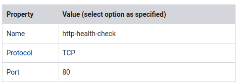

> Health checks determine which instances can receive new connections. This HTTP health check polls instances every 5 seconds and waits up to 5 seconds for a response. The health check treats 2 successful attempts as healthy and 2 failed attempts as unhealthy.

6. Click Save and continue.

7. For Initial delay, type 60. This is how long the Instance Group waits after initializing the boot-up of a VM before it tries a health check. You don't want to wait 5 minutes for this during the lab, so you set it to 1 minute.

8. Click Create.

> NOTE: If a warning window will appear stating that There is no backend service attached to the instance group. Ignore this; you will configure the load balancer with a backend service in the next section of the lab.

9. Click OK.

Repeat the same procedure for europe-west1-mig in europe-west1:

10. Click Create Instance group.

11. Specify the following, and leave the remaining settings as their defaults:

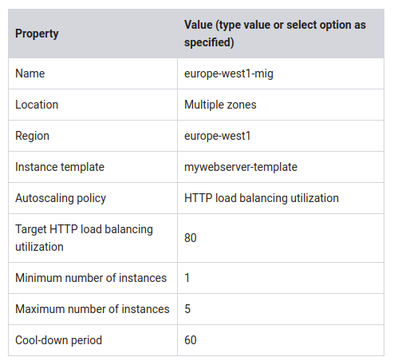

12. For Health check, select http-health-check (TCP).

13. For Initial delay, type 60.

14. Click Create.

15. Click OK in the dialog window.


### Verify the backends

Verify that VM instances are being created in both regions, and access their HTTP sites.

1. On the Navigation menu, click Compute Engine > VM instances. Notice the instances that start with us-central1-mig and europe-west1-mig. These instances are part of the managed instance groups.

2. Click on the External IP of an instance of us-central1-mig.

   The default page for the Apache2 server should be displayed.

3. Click on the External IP of an instance of europe-west1-mig.

   The default page for the Apache2 server should be displayed.

## Task 4. Configure the HTTP load balancer

Configure the HTTP load balancer to balance traffic between the two backends (us-central1-mig in us-central1 and europe-west1-mig in europe-west1) as illustrated in the network diagram:

   

### Start the configuration

1. On the Navigation menu, click Network Services > Load balancing.

2. Click Create load balancer.

3. Under HTTP(S) Load Balancing, click Start configuration.

4. Select From Internet to my VMs, then click Continue.

5. For Name, type http-lb.

### Configure the backend

Backend services direct incoming traffic to one or more attached backends. Each backend is composed of an instance group and additional serving capacity metadata.

1. Click Backend configuration.

2. For Backend services & backend buckets, click Create or select backend services & backend buckets > Backend services > Create a backend service.

3. Specify the following, and leave the remaining settings as their defaults:


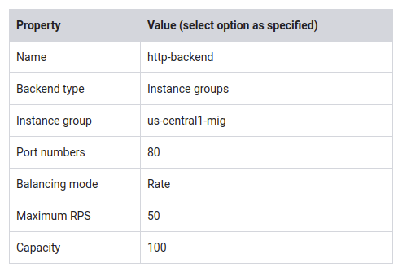

> This configuration means that the load balancer attempts to keep each instance of us-central1-mig at or below 50 requests per second (RPS).

4. Click Done.

5. Click Add backend.

6. Specify the following, and leave the remaining settings as their defaults:

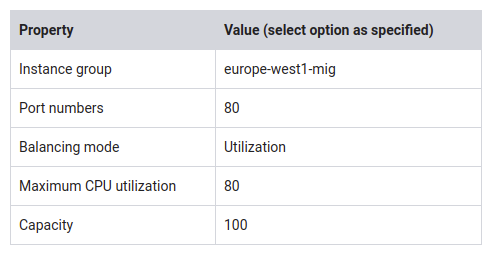

> This configuration means that the load balancer attempts to keep each instance of europe-west1-mig at or below 80% CPU utilization.

7. Click Done.

8. For Health Check, select http-health-check (TCP).

9. Expand Advanced configurations (Session affinity, connection draining timeout, security policies) option and check the Enable logging checkbox.

10. Specify Sample rate as 1.

11. Click Create.

### Configure the frontend

The host and path rules determine how your traffic will be directed. For example, you could direct video traffic to one backend and direct static traffic to another backend. However, you are not configuring the host and path rules in this lab.

1. Click Frontend configuration.

2. Specify the following, and leave the remaining settings as their defaults:

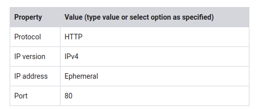

3. Click Done.

4. Click Add Frontend IP and port.

5. Specify the following, and leave the remaining settings as their defaults:

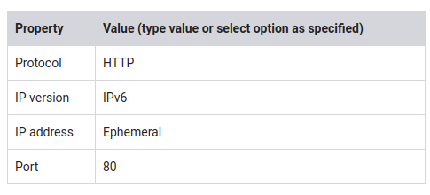

6. Click Done.

> HTTP(S) load balancing supports both IPv4 and IPv6 addresses for client traffic. Client IPv6 requests are terminated at the global load balancing layer and then proxied over IPv4 to your backends.

### Review and create the HTTP load balancer

1. Click Review and finalize.
2. Review the Backend services and Frontend.
3. Click Create. Wait for the load balancer to be created.
4. Click on the name of the load balancer (http-lb).
5. Note the IPv4 and IPv6 addresses of the load balancer for the next task. They will be referred to as [LB_IP_v4] and [LB_IP_v6], respectively.

> The IPv6 address is the one in hexadecimal format.


## Task 5. Stress test the HTTP load balancer

Now that you have created the HTTP load balancer for your backends, it is time to verify that traffic is forwarded to the backend service.

The HTTP load balancer should forward traffic to the region that is closest to you. (TRUE) 

### Access the HTTP load balancer

1. Open a new tab in your browser and navigate to http://[LB_IP_v4]. Make sure to replace [LB_IP_v4] with the IPv4 address of the load balancer.

   > Accessing the HTTP load balancer might take a couple of minutes. In the meantime, you might get a 404 or 502 error. Keep trying until you see the page of one of the backends.

### Stress test the HTTP load balancer

Create a new VM to simulate a load on the HTTP load balancer. Then determine whether traffic is balanced across both backends when the load is high.

1. In the GCP Console, on the Navigation menu (Navigation menu), click Compute Engine > VM instances.

2. Click Create instance.

3. Specify the following, and leave the remaining settings as their defaults:

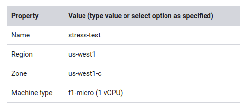

> Because us-west1 is closer to us-central1 than to europe-west1, traffic should be forwarded only to us-central1-mig (unless the load is too high).

4. For Boot Disk, click Change.

5. Click Custom images.

6. Select mywebserver.

7. Click Select.

8. Click Create. Wait for the stress-test instance to be created.

9. For stress-test, click SSH to launch a terminal and connect.

10. To create an environment variable for your load balancer IP address, run the following command:

`export LB_IP=<Enter [YOUR_LB_IP] here>`

11. Verify it with echo:

`echo $LB_IP`

12. To place a load on the load balancer, run the following command:

`ab -n 500000 -c 1000 http://$LB_IP/`


13. In the GCP Console, on the Navigation menu (Navigation menu), click Network Services > Load balancing.
14. Click Backends.
15. Click http-backend.
16. Monitor the Frontend Location (Total inbound traffic) between North America and the two backends for a couple of minutes.

   > At first, traffic should just be directed to us-central1-mig, but as the RPS increases, traffic is also directed to europe-west1-mig. This demonstrates that by default traffic is forwarded to the closest backend, but if the load is very high, traffic can be distributed across the backends.

17. In the GCP Console, on the Navigation menu (Navigation menu), click Compute Engine > Instance groups.
18. Click on us-central1-mig to open the instance group page.
19. Click Monitoring to monitor the number of instances and LB capacity.
20. Repeat the same for the europe-west1-mig instance group.

   > Depending on the load, you might see the backends scale to accommodate the load.

## Task 6. Review

In this lab, you configured an HTTP load balancer with backends in us-central1 and europe-west1. Then you stress-tested the load balancer with a VM to demonstrate global load balancing and autoscaling.

