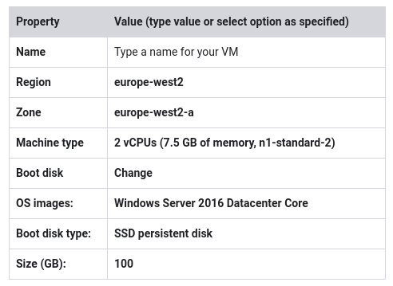
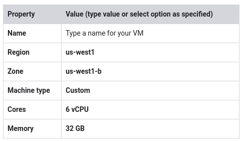

# Creating Virtual Machines v1.5

~ 1 hour

## Overview

In this lab, you will explore the Virtual Machine instance options and create several VMs with different characteristics.

## Objectives

In this lab, you explore the available options for VMs and see the differences between locations.

In this lab, you learn how to perform the following tasks:

* Create several standard VMs
* Create advanced VMs

## Task 1: Create a utility virtual machine

### Create a VM

1. In the GCP Console, on the Navigation menu, click Compute Engine > VM instances.
2. Click Create.
3. For Name, type a name for your instance. Hover over the question mark icon for advice about what constitutes a properly formed name.
4. For Region and Zone select us-central1 and us-central1-c respectively.
5. For Machine type, examine the options.

> Notice that the menu lists the number of vCPUs, the amount of memory, and a symbolic name such as n1-standard-1. The symbolic name is the parameter you would use to select the machine type if you were creating a VM using the gcloud command. Notice to the right of the zone and machine type that there is a per-month estimated cost.

6. Click Details to the right of the Machine type list to see the breakdown of estimated costs.
7. For Machine type, click 4 vCPUs (n1-standard-4). How did the cost change?
8. For Machine type, click micro (1 shared vCPU). The micro type is a shared tenant VM that is inexpensive.
9. Leave the remaining settings as their defaults, and click Create. Wait until the new VM is created.

Click Check my progress to verify the objective.

Create a utility virtual machine

### Explore the VM details

1. On the VM instances page, click on the name of your VM.
2. Locate CPU platform and note the value. Click Edit.

> Notice that you can't change the machine type, the CPU platform, or the zone.
> 
> You can add network tags and allow specific network traffic from the internet through firewalls.
> 
> Some properties of a VM are integral to the VM, are established when the VM is created, and cannot be changed. Other properties can be edited. You can add additional disks and you can also determine whether the boot disk is deleted when the instance is deleted. Normally the boot disk defaults to being deleted automatically when the instance is deleted. But sometimes you will want to override this behavior. This feature is very important because you cannot create an image from a boot disk when it is attached to a running instance. So you would need to disable Delete boot disk when instance is deleted to enable creating a system image from the boot disk.

3. Examine Availability policies.

> You can't convert a non-preemptible instance into a preemptible one. This choice must be made at VM creation. A preemptible instance can be interrupted at any time and is available at a lower cost.
> 
> If a VM is stopped for any reason, (for example an outage or a hardware failure) the automatic restart feature will start it back up. Is this the behavior you want? Are your applications idempotent (written to handle a second startup properly)?
> 
> During host maintenance, the VM is set for live migration. However, you can have the VM terminated instead of migrated.
> 
> If you make changes, they can sometimes take several minutes to be implemented, especially if they involve networking changes like adding firewalls or changing the external IP.

4. Click Cancel.

### Explore the VM logs

1. On the VM instance details page for your VM, click Stackdriver Logging.

> Notice that you have now navigated to the Stackdriver Logging page.
> 
> This is a structured log view. At the top you can filter by using the pull-down menus, and there is a search box for searching based on labels or text.

2. Click the small triangle to the left of one of the lines to see the kind of information it contains.

3. On the far right, click View Options > Expand All.

## Task 2: Create a Windows virtual machine

### Create a VM

1. On the Navigation menu, click Compute Engine > VM instances.
2. Click Create instance.
3. Specify the following, and leave the remaining settings as their defaults:

4. Click Select.
5. For Firewall, enable Allow HTTP traffic and Allow HTTPS traffic.
6. Click Create.

Click Check my progress to verify the objective.

Create a Windows virtual machine

> When the VM is running, notice that the connection option in the far right column is RDP, not SSH. RDP is the Remote Desktop Protocol. You would need the RDP client installed on your local machine to connect to the Windows desktop.
> 
> Note: Installing an RDP client on your local machine is outside the scope of this lab and of the class. For this reason, you will not be connecting to the Windows VM during this lab. However, you will step through the usual procedures up to the point of requiring the RDP client.
> 
> Instructions for connecting to Windows VMs are here:
> 
> https://cloud.google.com/compute/docs/instances/windows/connecting-to-windows-instance

### Set the password for the VM

1. Click on the name of your Windows VM to access the VM instance details.
2. You don't have a valid password for this Windows VM: you cannot log in to the Windows VM without a password. Click Set Windows password.
3. Click Set.
4. Copy the provided password, and click CLOSE.

> You will not connect to the Windows VM during this lab. However, the process would look something like the following (depending on the RDP client you installed). The RDP client shown can be installed for Chrome here:
> 
> https://chrome.google.com/webstore/detail/chrome-rdp-for-google-clo/mpbbnannobiobpnfblimoapbephgifkm?hl=en-US
> 
> On the VM instances page, you would click RDP for your Windows VM and connect with the password copied earlier.

## Task 3: Create a custom virtual machine

### Create a VM

1. On the Navigation menu (7a91d354499ac9f1.png), click Compute Engine > VM instances.
2. Click Create instance.
3. Specify the following, and leave the remaining settings as their defaults:

4. Click Create.

Click Check my progress to verify the objective.

Create a custom virtual machine

### Connect via SSH to your custom VM

1. For the custom VM you just created, click SSH.
2. To see information about unused and used memory and swap space on your custom VM, run the following command:

`free`

3. To see details about the RAM installed on your VM, run the following command:

`sudo dmidecode -t 17`

4. To verify the number of processors, run the following command:

`nproc`

5. To see details about the CPUs installed on your VM, run the following command:

`lscpu`

6. To exit the SSH terminal, run the following command:

`exit`

## Task 4: Review

In this lab, you created several virtual machine instances of different types with different characteristics. One was a small utility VM for administration purposes. You also created a standard VM and a custom VM. You launched both Windows and Linux VMs and deleted VMs.

