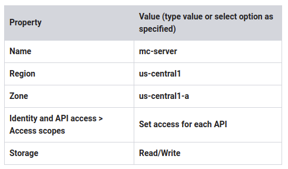
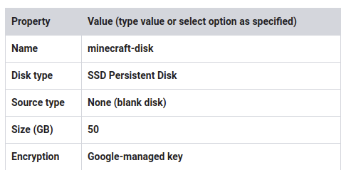
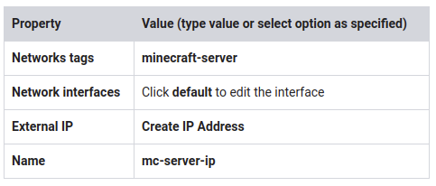
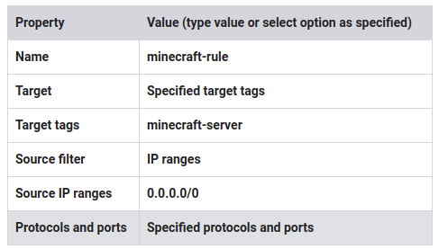

# Working with Virtual Machines v1.5

~1 hour 30 minutes

## Overview

In this lab, you set up a game application—a Minecraft server.

The Minecraft server software will run on a Compute Engine instance.

You use an n1-standard-1 machine type that includes a 10 GB boot disk, 1 virtual CPU (vCPU), and 3.75 GB of RAM. This machine type runs Debian Linux by default.

To make sure there is plenty of room for the Minecraft server's world data, you also attach a high-performance 50-GB persistent solid-state drive (SSD) to the instance. This dedicated Minecraft server can support up to 50 players.

## Objectives

In this lab, you learn how to perform the following tasks:

* Customize an application server
* Install and configure necessary software
* Configure network access
* Schedule regular backups

## Task 1: Create the VM

### Define a VM using advanced options

1. In the GCP Console, on the Navigation menu, click Compute Engine > VM instances.
2. Click Create. Don't click the final Create until you have set the SCOPES.
3. Specify the following, and leave the remaining settings as their defaults:




4. Click Management, security, disks, networking, sole tenancy.
5. Click Disks. You will add a disk to be used for game storage.
6. Click Add new disk.
7. Specify the following, and leave the remaining settings as their defaults:



8. Click Done. This creates the disk and automatically attaches it to the VM when the VM is created.

### Create an External static IP

1. Click Networking.
2. Specify the following, and leave the remaining settings as their defaults:



3. Click Reserve.
4. Click Done.
5. Click Create.

## Task 2: Prepare the data disk

### Create a directory and format and mount the disk

The disk is attached to the instance, but it is not yet mounted or formatted.

1. For mc-server, click SSH to open a terminal and connect.
2. To create a directory that serves as the mount point for the data disk, run the following command:

`sudo mkdir -p /home/minecraft`

3. To format the disk, run the following command:

```shell
sudo mkfs.ext4 -F -E lazy_itable_init=0,\
lazy_journal_init=0,discard \
/dev/disk/by-id/google-minecraft-disk
```

4. Result (do not copy; this is example output):

```shell
mke2fs 1.42.12 (29-Aug-2014)
Discarding device blocks: done
Creating filesystem with 13107200 4k blocks and 3276800 inodes
Filesystem UUID: 3d5b0563-f29e-4107-ad1a-ba7bf11dcf7c
Superblock backups stored on blocks:
        32768, 98304, 163840, 229376, 294912, 819200, 884736, 1605632, 2654208,
        4096000, 7962624, 11239424
Allocating group tables: done
Writing inode tables: done
Creating journal (32768 blocks): done
Writing superblocks and filesystem accounting information: done
```

4. To mount the disk, run the following command:

```shell
sudo mount -o discard,defaults /dev/disk/by-id/google-minecraft-disk /home/minecraft
```

No output is displayed after the disk is mounted.

Click Check my progress to verify the objective.

Create the VM and prepare the data disk

## Task 3: Install and run the application

The Minecraft server runs on top of the Java Virtual Machine (JVM), so it requires the Java Runtime Environment (JRE) to run. Because the server doesn't need a graphical user interface, you use the headless version of the JRE. This reduces the JRE's resource usage on the machine, which helps ensure that the Minecraft server has enough room to expand its own resource usage if needed.

### Install the Java Runtime Environment (JRE) and the Minecraft server

1. In the SSH terminal for mc-server, to update the Debian repositories on the VM, run the following command:

`sudo apt-get update`

2. After the repositories are updated, to install the headless JRE, run the following command:

`sudo apt-get install -y default-jre-headless`

3. To navigate to the directory where the persistent disk is mounted, run the following command:

`cd /home/minecraft`

4. To download the current Minecraft server JAR file (1.11.2 JAR), run the following command:

`sudo wget https://s3.amazonaws.com/Minecraft.Download/versions/1.11.2/minecraft_server.1.11.2.jar`

### Initialize the Minecraft server

1. To initialize the Minecraft server, run the following command:

`sudo java -Xms1G -Xmx7G -d64 -jar minecraft_server.1.11.2.jar nogui`

Result (do not copy; this is example output):

```shell
00:28:34] [Server thread/INFO]: Starting minecraft server version 1.11.2
[00:28:34] [Server thread/INFO]: Loading properties
[00:28:34] [Server thread/WARN]: server.properties does not exist
[00:28:34] [Server thread/INFO]: Generating new properties file
[00:28:34] [Server thread/WARN]: Failed to load eula.txt
[00:28:34] [Server thread/INFO]: You need to agree to the EULA in order to run the server. Go to eula.txt for more
info.
[00:28:34] [Server thread/INFO]: Stopping server
```

>The Minecraft server won't run unless you accept the terms of the End User Licensing Agreement (EULA).


Click Check my progress to verify the objective.

Install the Java Runtime Environment (JRE) and the Minecraft server

2. To see the files that were created in the first initialization of the Minecraft server, run the following command:

`sudo ls -l`

> You could edit the server.properties file to change the default behavior of the Minecraft server.

3. To edit the EULA, run the following command:

`sudo nano eula.txt`

4. Change the last line of the file from eula=false to eula=true
5. Press Ctrl+O, ENTER to save the file, and then press Ctrl+X to exit nano.

> Don't try to restart the Minecraft server yet. You use a different technique in the next procedure.

### Create a virtual terminal screen to start the Minecraft server

If you start the Minecraft server again at this point, it is tied to the life of your SSH session: that is, if you close your SSH terminal, the server is also terminated. To get around this issue, you can use screen, an application that allows you to create a virtual terminal that can be "detached," becoming a background process, or "reattached," becoming a foreground process. When a virtual terminal is detached to the background, it will run whether you are logged in or not.

1. To install screen, run the following command:

`sudo apt-get install -y screen`

2. To start your Minecraft server in a screen virtual terminal, run the following command: (Use the -S flag to name your terminal mcs)

`sudo screen -S mcs java -Xms1G -Xmx7G -d64 -jar /home/minecraft/minecraft_server.1.11.2.jar nogui`

Result (do not copy; this is example output):

```shell
[14:52:12] [Server thread/INFO]: Preparing level "world"
[14:52:14] [Server thread/INFO]: Preparing start region for level 0
[14:52:15] [Server thread/INFO]: Preparing spawn area: 6%
[14:52:16] [Server thread/INFO]: Preparing spawn area: 10%
[14:52:17] [Server thread/INFO]: Preparing spawn area: 15%
[14:52:18] [Server thread/INFO]: Preparing spawn area: 21%
[14:52:19] [Server thread/INFO]: Preparing spawn area: 26%
[14:52:20] [Server thread/INFO]: Preparing spawn area: 32%
[14:52:21] [Server thread/INFO]: Preparing spawn area: 39%
[14:52:22] [Server thread/INFO]: Preparing spawn area: 46%
[14:52:23] [Server thread/INFO]: Preparing spawn area: 53%
[14:52:24] [Server thread/INFO]: Preparing spawn area: 58%
[14:52:25] [Server thread/INFO]: Preparing spawn area: 66%
[14:52:26] [Server thread/INFO]: Preparing spawn area: 74%
[14:52:27] [Server thread/INFO]: Preparing spawn area: 81%
[14:52:28] [Server thread/INFO]: Preparing spawn area: 89%
[14:52:29] [Server thread/INFO]: Preparing spawn area: 99%
[14:52:29] [Server thread/INFO]: Done (16.831s)! For help, type "help" or "?"
```

### Detach from the screen and close your SSH session

1. To detach the screen terminal, press Ctrl+A, D. The terminal continues to run in the background. To reattach the terminal, run the following command:

`sudo screen -r mcs`

2. If necessary, exit the screen terminal by pressing Ctrl+A, D.

3. To exit the SSH terminal, run the following command:

`exit`


> Congratulations! You set up and customized a VM and installed and configured application software—a Minecraft server!

## Task 4: Allow client traffic

Up to this point, the server has an external static IP address, but it can receive no traffic because there is no firewall rule in place. Minecraft server uses TCP port 25565 by default. So you need to configure a firewall rule to allow these connections.

### Create a firewall rule

1. In the GCP Console, on the Navigation menu ( 7a91d354499ac9f1.png), click VPC network > Firewall rules.
2. Click Create firewall rule.
3. Specify the following, and leave the remaining settings as their defaults:




4. For tcp, specify port 25565.
5. Click Create. Users can now access your server from their Minecraft clients.

### Verify server availability

1. In the left pane, click External IP addresses.
2. Locate and copy the External IP address for the mc-server VM.
3. Use the following website to test your Minecraft server: https://dinnerbone.com/minecraft/tools/status/

> If the above website is not working, feel free to use a different site or the Chrome extension:
> 
> * https://mcsrvstat.us/
> * Server Status Minecraft extension (Chrome)

Click Check my progress to verify the objective.

Allow client traffic

## Task 5: Schedule regular backups

A common activity is to back up your application data. In this case, you configure the system to back up Minecraft world data to Cloud Storage.

### Create a Cloud Storage bucket

1. On the Navigation menu, click Compute Engine > VM instances.
2. For mc-server, click SSH.
3. Create a globally unique bucket name and store it in the environment variable YOUR_BUCKET_NAME. To make it unique, you can use your Project ID. Run the following command:

`export YOUR_BUCKET_NAME=<Enter your bucket name here>`

4. To create the bucket using the gsutil tool, part of the Cloud SDK, run the following command:

`gsutil mb gs://$YOUR_BUCKET_NAME-minecraft-backup`

> If this command failed, you might not have created a unique bucket name. If so, choose another bucket name, update your environment variable, and try to create the bucket again.

### Create a backup script

1. In the mc-server SSH terminal, navigate to your home directory:

`cd /home/minecraft`

2. To create the script, run the following command:

`sudo nano /home/minecraft/backup.sh`

3. Copy and paste the following script into the file:

```shell
#!/bin/bash
screen -r mcs -X stuff '/save-all\n/save-off\n'
/usr/bin/gsutil cp -R ${BASH_SOURCE%/*}/world gs://${YOUR_BUCKET_NAME}-minecraft-backup/$(date "+%Y%m%d-%H%M%S")-world
screen -r mcs -X stuff '/save-on\n'
```

4. Press Ctrl+O, ENTER to save the file, and press Ctrl+X to exit nano.

> The script saves the current state of the server's world data and pauses the server's auto-save functionality. Next, it backs up the server's world data directory (world), placing its contents in a timestamped directory (<timestamp>-world) in the Cloud Storage bucket. After the script finishes backing up the data, it resumes auto-saving on the Minecraft server.

5. To make the script executable, run the following command:

`sudo chmod 755 /home/minecraft/backup.sh`

### Test the backup script and schedule a cron job

1. In the mc-server SSH terminal, run the backup script:

`. /home/minecraft/backup.sh`

2. After the script finishes, return to the GCP Console.

3. To verify that the backup file was written, on the Navigation menu, click Storage > Browser.
4. Click on the backup bucket name. You should see a folder with a date-time stamp name. Now that you've verified that the backups are working, you can schedule a cron job to automate the task.
5. In the mc-server SSH terminal, open the cron table for editing:

`sudo crontab -e`

6. When you are prompted to select an editor, type the number corresponding to nano, and press ENTER.

7. At the bottom of the cron table, paste the following line:

`0 */4 * * * /home/minecraft/backup.sh`

> That line instructs cron to run backups every 4 hours.

8. Press Ctrl+O, ENTER to save the cron table, and press Ctrl+X to exit nano.

> This creates about 300 backups a month in Cloud Storage. So you will want to regularly delete them to avoid charges. In the Cloud Storage lab later in the class you will learn how to setup Lifecycle Management to automate this process.

Click Check my progress to verify the objective.

Schedule regular backups

## Task 6: Server maintenance

To perform server maintenance, you need to shut down the server.

### Connect via SSH to the server, stop it, and shut down the VM

1. In the mc-server SSH terminal, run the following command:

`sudo screen -r -X stuff '/stop\n'`

2. In the GCP Console, on the Navigation menu ( 7a91d354499ac9f1.png), click Compute Engine > VM instances.
3. Click mc-server.
4 Click Stop.
5. In the confirmation dialog, click Stop to confirm. You will be logged out of your SSH session.

> To start up your instance again, visit the instance page and then click Start. To start the Minecraft server again, you can establish an SSH connection with the instance, remount your persistent disk, and start your Minecraft server in a new screen terminal, just as you did previously.

### Automate server maintenance with startup and shutdown scripts

Instead of going through the manual process to mount the persistent disk and launch the server application in a screen, you can use metadata scripts to create a startup script and a shutdown script to do this for you.

1. Click mc-server.
2. Click Edit.
3. For Custom metadata, add a new key/value:
    * For Key, type startup-script
    * For Value, paste the following:

```shell
#!/bin/bash
mount /dev/disk/by-id/google-minecraft-disk /home/minecraft
(crontab -l ; echo "0 */4 * * * /home/minecraft/backup.sh")| crontab -
cd /home/minecraft
screen -d -m -S mcs java -Xms1G -Xmx7G -d64 -jar minecraft_server.1.11.2.jar nogui
```

4. Click Add item to add another key/value:
    * For Key, type shutdown-script
    * For Value, paste the following:

```shell
#!/bin/bash
sudo screen -r -X stuff '/stop\n'
```

These scripts run automatically when you start or stop your instance.

5. Click Save.

> When you restart your instance, the startup script automatically mounts the Minecraft disk to the appropriate directory, reinstalls your cron job, starts your Minecraft server in a screen session, and detaches the session. When you stop the instance, the shutdown script shuts down your Minecraft server before the instance shuts down.

6. Start the VM and use the test site to verify that the startup script worked.

Click Check my progress to verify the objective.

Server Maintenance

## Task 7: Review

In this lab you created a customized virtual machine instance by installing base software (a headless JRE) and application software (a Minecraft game server). You customized the VM by attaching and preparing a high-speed SSD data disk, and you reserved a static external IP so the address would remain consistent. Then you verified availability of the gaming server online. You set up a backup system to back up the server's data to a Cloud Storage bucket, and you tested the backup system. Then you automated backups using cron. Finally, you set up maintenance scripts using metadata for graceful startup and shutdown of the server.

