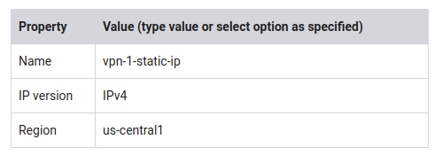
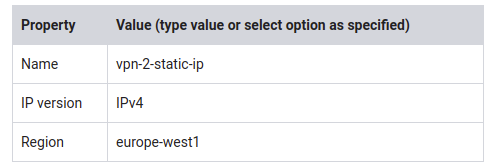
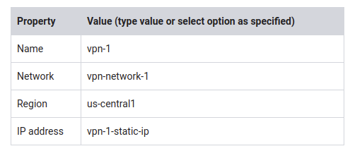
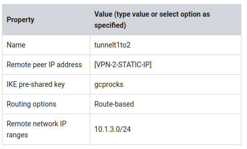
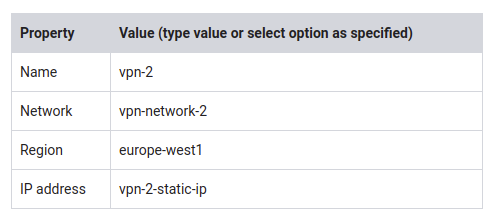
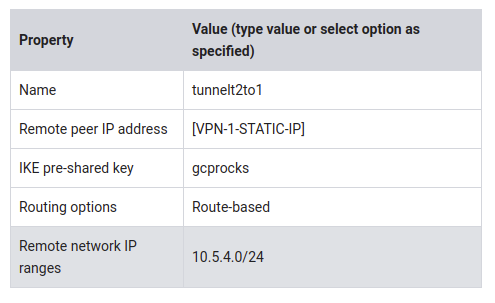

# Virtual Private Networks (VPN)

[Lab Review video: Virtual Private Networks (VPN)](https://www.coursera.org/learn/gcp-infrastructure-scaling-automation/lecture/nTXif/lab-review-virtual-private-networks-vpn)

~ 1 hour 30 minutes

## Overview

In this lab, you establish VPN tunnels between two networks in separate regions such that a VM in one network can ping a VM in the other network over its internal IP address.

### Objectives

In this lab, you learn how to perform the following tasks:

* Create VPN gateways in each network
* Create VPN tunnels between the gateways
* Verify VPN connectivity

## Task 1: Explore the networks and instances

Two custom networks with VM instances have been configured for you. For the purposes of the lab, both networks are VPC networks within a GCP project. However, in a real-world application, one of these networks might be in a different GCP project, on-premises, or in a different cloud.

### Explore the networks

Verify that vpn-network-1 and vpn-network-2 have been created with subnets in separate regions.

1. In the GCP Console, on the Navigation menu (Navigation menu), click VPC network > VPC networks.
   * Note the vpn-network-1 network and its subnet-a in us-central1.
   * Note the vpn-network-2 network and its subnet-b in europe-west1.

### Explore the firewall rules

1. In the navigation pane, click Firewall rules.
   * Note the network-1-allow-ssh and network-1-allow-icmp rules for vpn-network-1.
   * Note the network-2-allow-ssh and network-2-allow-icmp rules for vpn-network-2.

   These firewall rules allow SSH and ICMP traffic from anywhere.

### Explore the instances and their connectivity

Currently, the VPN connection between the two networks is not established. Explore the connectivity options between the instances in the networks.

1. In the GCP Console, on the Navigation menu (Navigation menu), click Compute Engine > VM instances.

2. Click Columns, and select Network.

   From server-1, you should be able to ping the following IP addresses of server-2: External IP address? or Internal IP address?

3. Note the external and internal IP addresses for server-2.

4. For server-1, click SSH to launch a terminal and connect.

5. To test connectivity to server-2's external IP address, run the following command, replacing server-2's external IP address with the value noted earlier:

`ping -c 3 <Enter server-2's external IP address here>`

> This works because the VM instances can communicate over the internet.

6. To test connectivity to server-2's internal IP address, run the following command, replacing server-2's internal IP address with the value noted earlier:

`ping -c 3 <Enter server-2's internal IP address here>`

> You should see 100% packet loss when pinging the internal IP address because you don't have VPN connectivity yet.

7. Exit the SSH terminal.

   Let's try the same from server-2.

8. Note the external and internal IP addresses for server-1.

9. For server-2, click SSH to launch a terminal and connect.

10. To test connectivity to server-1's external IP address, run the following command, replacing server-1's external IP address with the value noted earlier:

`ping -c 3 <Enter server-1's external IP address here>`

11. To test connectivity to server-1's internal IP address, run the following command, replacing server-1's internal IP address with the value noted earlier:

`ping -c 3 <Enter server-1's internal IP address here>`

> You should see similar results.

12. Exit the SSH terminal.
   > Why are we testing both server-1 to server-2 and server-2 to server-1?
   > 
   > For the purposes of this lab, the path from subnet-a to subnet-b is not the same as the path from subnet-b to subnet-a. You are using one tunnel to pass traffic in each direction. And if both tunnels are not established, you won't be able to ping the remote server on its internal IP address. The ping might reach the remote server, but the response can't be returned.
   > 
   > This makes it much easier to debug the lab during class. In practice, a single tunnel could be used with symmetric configuration. However, it is more common to have multiple tunnels or multiple gateways and VPNs for production work, because a single tunnel could be a single point of failure.

## Task 2: Create the VPN gateways and tunnels

Establish private communication between the two VM instances by creating VPN gateways and tunnels between the two networks.

### Reserve two static IP addresses

Reserve one static IP address for each VPN gateway.

1. In the GCP Console, on the Navigation menu (Navigation menu), click VPC network > External IP addresses.

2. Click Reserve static address.

3. Specify the following, and leave the remaining settings as their defaults:

4. Click Reserve.

   Repeat the same for vpn-2-static-ip.

5. Click Reserve static address.

6. Specify the following, and leave the remaining settings as their defaults:

7. Click Reserve.

   Note both IP addresses for the next step. They will be referred to us [VPN-1-STATIC-IP] and [VPN-2-STATIC-IP].

### Create the vpn-1 gateway and tunnel1to2

1. In the GCP Console, on the Navigation menu (Navigation menu), click Hybrid Connectivity > VPN.

2. Click Create VPN Connection.

3. If asked, select Classic VPN, and then click Continue.

4. Specify the following in the VPN gateway section, and leave the remaining settings as their defaults:

5. Specify the following in the Tunnels section, and leave the remaining settings as their defaults:

   Make sure to replace [VPN-2-STATIC-IP] with your reserved IP address for europe-west1.

6. Click command line.

   > The gcloud command line window shows the gcloud commands to create the VPN gateway and VPN tunnels and it illustrates that three forwarding rules are also created.

7. Click Close.
8. Click Create.

### Create the vpn-2 gateway and tunnel2to1

1. Click VPN setup wizard.

2. If asked, select Classic VPN, and then click Continue.

3. Specify the following in the VPN gateway section, and leave the remaining settings as their defaults:

4. Specify the following in the Tunnels section, and leave the remaining settings as their defaults:

   Make sure to replace [VPN-1-STATIC-IP] with your reserved IP address for us-central1.

5. Click Create.
6. Click Cloud VPN Tunnels.

   Wait for the VPN tunnels status to change to Established for both tunnels before continuing.

## Task 3: Verify VPN connectivity

From server-1, you should be able to ping the following IP addresses of server-2: **Internal IP address** or **External IP address**?

### Verify server-1 to server-2 connectivity

1. In the GCP Console, on the Navigation menu, click Compute Engine > VM instances.

2. For server-1, click SSH to launch a terminal and connect.

3. To test connectivity to server-2's internal IP address, run the following command:

`ping -c 3 <insert server-2's internal IP address here>`

4. Exit the server-1 SSH terminal.

5. For server-2, click SSH to launch a terminal and connect.

6. To test connectivity to server-1's internal IP address, run the following command:

`ping -c 3 <insert server-1's internal IP address here>`

## Task 4: Review

In this lab, you configured a VPN connection between two networks with subnets in different regions. Then you verified the VPN connection by pinging VMs in different networks using their internal IP addresses.

You configured the VPN gateways and tunnels using the GCP Console. However, this approach obfuscated the creation of forwarding rules, which you explored with the command line button in the Console. This can help in troubleshooting a configuration.

