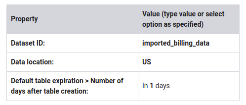
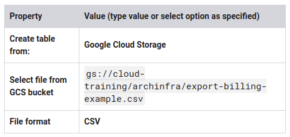
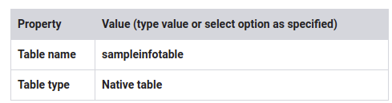
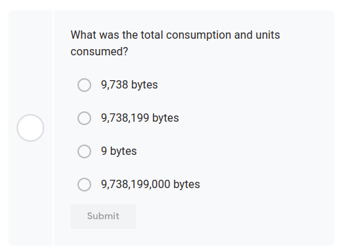
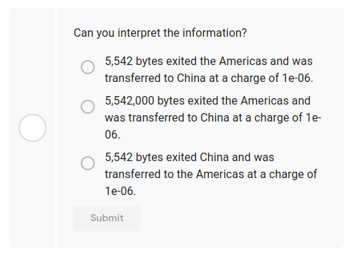
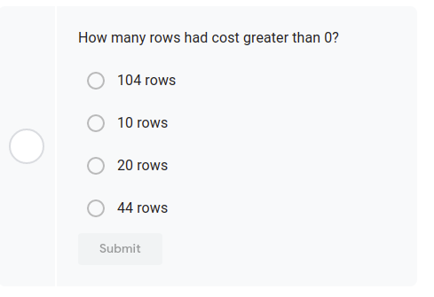
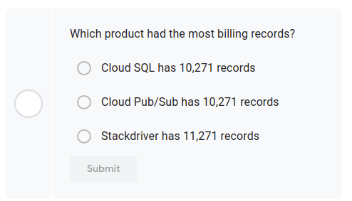
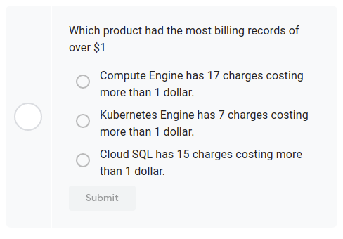
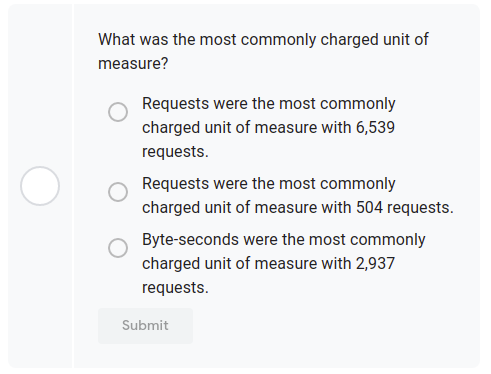
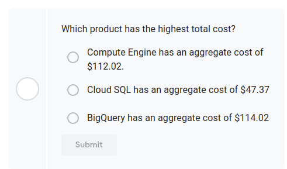

# Examining Billing data with BigQuery

~1 hour 30 minutes

- [video Lab Intro: Examining **Billing Data** with **BigQuery**](https://www.coursera.org/learn/gcp-infrastructure-core-services/lecture/Nz755/lab-intro-examining-billing-data-with-bigquery)
- [Lab Review: Examining Billing Data with BigQuery](https://www.coursera.org/learn/gcp-infrastructure-core-services/lecture/As3u1/lab-review-examining-billing-data-with-bigquery)

## Overview

In this lab, you learn how to use BigQuery to analyze billing data.

### Objectives

In this lab, you learn how to perform the following tasks:

* Sign in to BigQuery from the GCP Console
* Create a dataset
* Create a table
* Import data from a billing CSV file stored in a bucket
* Run complex queries on a larger dataset

## Task 1: Use BigQuery to import data

1. Sign in to BigQuery and create a dataset
2. In the GCP Console, on the Navigation menu ( 7a91d354499ac9f1.png), click BigQuery.
3. If prompted, click Done.
4. click on to your Project ID (starts with qwiklabs-gcp) and click Create Dataset.

> You can export billing data directly to BigQuery as outlined [here](https://cloud.google.com/billing/docs/how-to/export-data-bigquery). However, for the purposes of this lab, a sample CSV billing file has been prepared for you. It is located in a Cloud Storage bucket where it is accessible to your student account. You will import this billing information into a BigQuery table and examine it.

4. Specify the following:



5. Click Create Dataset. You should see imported_billing_data in the left pane.

### Create a table and import

1. Point to imported_billing_data, and then click Create Table to create a new table.
2. For Source, specify the following, and leave the remaining settings as their defaults:




3. For Destination, specify the following, and leave the remaining settings as their defaults:


        
4. Under Schema for Auto detect click Schema and input parameters .
5. Open Advanced options
6. Under Header rows to skip specify 1
7. Click Create Table. After the job is completed, the table appears below the dataset in the left pane.

Click Check my progress to verify the objective.

Use BigQuery to import data

## Task 2: Examine the table

1. Click sampleinfotable.

> This displays the schema that BigQuery automatically created based on the data it found in the imported CSV file. Notice that there are strings, integers, timestamps, and floating values.

2. Click Details. As you can see in Number of Rows, this is a relatively small table with 44 rows.
3. Click Preview.
4. Locate the row that has the Description: Network Internet Ingress from EMEA to Americas.

```sql
SELECT *
FROM `imported_billing_data.sampleinfotable`
WHERE Description = "Network Internet Ingress from EMEA to Americas";
```


> What was the total consumption and units consumed?



5. Scroll to the Cost column.

> The cost was 0.0, so with an ingress of 9.7 Mbytes, traffic from EMEA to the Americas had no charge.

6. Locate the row that has the Description: Network Internet Egress from Americas to China.

```sql
SELECT *
FROM `imported_billing_data.sampleinfotable`
WHERE Description = "Network Internet Egress from Americas to China";
```

Can you interpret the information?




## Task 3: Compose a simple query

When you reference a table in a query, both the dataset ID and table ID must be specified; the project ID is optional.

> If the project ID is not specified, BigQuery will default to the current project.

All the information you need is available in the BigQuery interface. In the column on the left, you see the dataset ID (imported_billing_data) and table ID (sampleinfotable).

Recall that clicking on the table name brings up the Schema with all of the field names.

Now construct a simple query based on the Cost field.

1. click Compose New Query.

2. Paste the following in Query Editor:

```sql
    SELECT * FROM `imported_billing_data.sampleinfotable`
    WHERE Cost > 0
```

3. Click Run.

How many rows had cost greater than 0?



> How many rows involved non-zero charges?
> 
> The table shows 20 rows and they all have non-zero charges.

Click Check my progress to verify the objective.

Compose a simple query

## Task 4: Analyze a large billing dataset with SQL

In the next activity, you use BigQuery to analyze a sample dataset with 22,537 lines of billing data.

1. For New Query, paste the following in Query Editor:

```sql
SELECT
  product,
  resource_type,
  start_time,
  end_time,
  cost,
  project_id,
  project_name,
  project_labels_key,
  currency,
  currency_conversion_rate,
  usage_amount,
  usage_unit
FROM
  `cloud-training-prod-bucket.arch_infra.billing_data`
```


2. Click Run. Verify that the resulting table has 22,537 lines of billing data.
3. To find the latest 100 records where there were charges (cost > 0), for New Query, paste the following in Query Editor:

```sql
SELECT
  product,
  resource_type,
  start_time,
  end_time,
  cost,
  project_id,
  project_name,
  project_labels_key,
  currency,
  currency_conversion_rate,
  usage_amount,
  usage_unit
FROM
  `cloud-training-prod-bucket.arch_infra.billing_data`
WHERE
  Cost > 0
ORDER BY end_time DESC
LIMIT
  100
```

4. Click Run.
5. To find all charges that were more than 3 dollars, for Compose New Query, paste the following in Query Editor:

```sql
SELECT
  product,
  resource_type,
  start_time,
  end_time,
  cost,
  project_id,
  project_name,
  project_labels_key,
  currency,
  currency_conversion_rate,
  usage_amount,
  usage_unit
FROM
  `cloud-training-prod-bucket.arch_infra.billing_data`
WHERE
  cost > 3
```

6. Click Run.
7. To find the product with the most records in the billing data, for New Query, paste the following in Query Editor:

```sql
SELECT
  product,
  COUNT(*) AS billing_records
FROM
  `cloud-training-prod-bucket.arch_infra.billing_data`
GROUP BY
  product
ORDER BY billing_records DESC
```

8. Click Run.

Which product had the most billing records?




9. To find the most frequently used product costing more than 1 dollar, for New Query, paste the following in Query Editor:

```sql
SELECT
  product,
  COUNT(*) AS billing_records
FROM
  `cloud-training-prod-bucket.arch_infra.billing_data`
WHERE
  cost > 1
GROUP BY
  product
ORDER BY
  billing_records DESC
```

10. Click Run.

Which product had the most billing records of over $1



11. To find the most commonly charged unit of measure, for Compose New Query, paste the following in Query Editor:

```sql
SELECT
  usage_unit,
  COUNT(*) AS billing_records
FROM
  `cloud-training-prod-bucket.arch_infra.billing_data`
WHERE cost > 0
GROUP BY
  usage_unit
ORDER BY
  billing_records DESC
```

12. Click Run.

What was the most commonly charged unit of measure?



13. To find the product with the highest aggregate cost, for New Query, paste the following in Query Editor:

```sql
SELECT
  product,
  ROUND(SUM(cost),2) AS total_cost
FROM
  `cloud-training-prod-bucket.arch_infra.billing_data`
GROUP BY
  product
ORDER BY
  total_cost DESC
```

14. Click Run.

Which product has the highest total cost?





## Task 5: Review

In this lab, you imported billing data into BigQuery that had been generated as a CSV file. You ran a simple query on the file. Then you accessed a shared dataset containing more than 22,000 records of billing information. You ran a variety of queries on that data to explore how you can use BigQuery to ask and answer questions by running queries.

