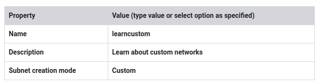

# Virtual Networking v1.5

~ 1 hour 30 minutes

## Overview

In this lab you build and explore a complex GCP network structure. In most labs you choose the regions and zones where objects are located; however, this lab is prescriptive about the network layout. The lab systematically highlights the differences between placing instances in a variety of network locations and depending on the instances relative location, how you establish communications between virtual machines.

## Objectives

In this lab, you learn how to perform the following tasks:

- Create an auto-mode network, a custom-mode network, and associated subnetworks
- Compare connectivity in the various types of networks
- Create routes and firewall rules using IP addresses and tags to enable connectivity
- Convert an auto-mode network to a custom-mode network
- Create, expand, and delete subnetworks
- Here is a preview of the lab activities and the networks you will create:

### Task 1: Create the network topology


### Task 2: Create the VM instances


### Task 3: Work with routes and firewall rules


The scoping and connectivity relationships between zones, regions, networks, and subnets are different from networking in other public clouds.

You have been provided with a project in Qwiklabs. The project ID is a unique name across all Google Cloud projects. It is referred to later in this lab as PROJECT_ID.

Note: In most labs in this class, you choose any region and any zone for the purposes of the lab. In this lab, you are given specific regions and zones because you will construct and explore very specific networking relationships.

Before you click the Start Lab button

Read these instructions. Labs are timed and you cannot pause them. The timer, which starts when you click Start Lab, shows how long Cloud resources will be made available to you.

This Qwiklabs hands-on lab lets you do the lab activities yourself in a real cloud environment, not in a simulation or demo environment. It does so by giving you new, temporary credentials that you use to sign in and access the Google Cloud Platform for the duration of the lab.


## Task 1: Create the network topology

Explore the default network

The default network is created automatically for you with each new project. The default network layout is not ideal for managing resources. The main benefit is that it is a fast way to get a project set up and running. The default network is great for prototyping solutions and for training purposes.

In the Google Cloud Platform (GCP) Console, on the Navigation menu (7a91d354499ac9f1.png), click VPC network > VPC networks.
Notice the default network. It was created automatically for you with a subnetwork in each region.

Example:

```shell
asia-east1 | default | 10.140.0.0/20 | 10.140.0.1
```

For more information, see:

IP Addresses: https://cloud.google.com/compute/docs/ip-addresses/

Subnets and CIDR ranges: https://cloud.google.com/compute/docs/alias-ip/#subnets_and_cidr_ranges

In the left pane, click Routes.

Notice that a route was created for each subnetwork, and one global route was created to enable traffic to the internet.

- Create an auto-mode network and subnets
- In the left pane, click VPC networks.
- Click Create VPC network.
- Specify the following:


When you click Automatic, the list of subnetworks to be created is automatically displayed.

- For Firewall rules, select all listed firewall rules.
- At the bottom of the page are two links labeled Equivalent REST or command line. Click REST to see POST commands for API programming automation of this process.
- Click Close.
- Click command line to see commands you could use for automation of this process. You could use these commands to create the network by clicking RUN IN CLOUD SHELL—but don't do it.

Note: These commands tend to include options that are not required. They may not work in a bash script without being altered. Don't rely on them. You should consider these more of a suggestion. If you need to automate with scripts, plan to craft your own commands from examples in the documentation.

- Click Close.

- Click Create.

- Click REFRESH occasionally until the networks are created and appear in the list.

### Explore the auto-mode network

1. In the left pane, click Routes.

> Notice that a route has been created for each subnetwork, and one route was created to enable traffic from anywhere, including the internet. Traffic is delivered via the most specific matching route: traffic intended for any of the listed subnets gets delivered via virtual network to the host. These routes take precedence over the route that matches all traffic.

2. Click Destination IP ranges to sort the list of routes.

> Notice that there is an identical subnetwork and route in the learnauto network as there is in the default network. It is possible to have VMs with duplicate Internal IP addresses in the two networks.

3. In the left pane, click Firewall rules.

> Verify that firewall rules were created for the learnauto network and its subnetworks.

If you delete your default network, you can always recreate it as an auto network using the name "Default."

### Create a custom-mode network
In this subtask, you create a custom-mode network named learncustom with three subnetworks:

* (subnet-1a) 192.168.5.0/24
* (subnet-1b) 192.168.3.0/24, in the same region
* (subnet-2) 192.168.7.0/24 in a different region


1. In the left pane, click VPC networks.
2. Click Create VPC network.
3. Specify the following:




Use the dialog to add three subnets as follows.

4. For the first subnet, specify the following:


Click Add subnet.
For the second subnet, specify the following:
Property	Value (type value or select option as specified)
Name	subnet-1b
Region	us-central1
IP address range	192.168.3.0/24
Click Add subnet.
For the third subnet, specify the following:
Property	Value (type value or select option as specified)
Name	subnet-2
Region	us-west1
IP address range	192.168.7.0/24
Click Create.

Explore the routes and firewall rules
Did creating the custom network automatically create routes?

In the left pane, click Routes.
Click Network in the table header to sort by network name. Routes should be displayed for each subnetwork.
Did creating the custom network automatically create firewall rules?

In the left pane, click Firewall rules.

Click Network in the table header to sort by network name. No default firewall rules were created for the custom network. You will have to manually add default rules in the next step.

Create firewall rules for the learncustom network
Notice that for the other networks, the default network and the learnauto network, GCP automatically created default firewall rules allowing SSH traffic (tcp:22), icmp traffic, and rdp (tcp:3389) traffic for Windows VMs. Add a firewall rule to provide the same access for the learncustom network.

Click Create firewall rule.
Specify the following, and leave the remaining settings as their defaults:
Property	Value (type value or select option as specified)
Name	allow-ssh-icmp-rdp-learncustom
Network	learncustom
Target tags	allow-defaults
Source IP ranges	0.0.0.0/0
Protocols and ports	Specified protocols and ports
For tcp, specify ports 22 and 3389.

Specify the icmp protocol.

Make sure that the source filter address includes the final "/0". If you specify 0.0.0.0 instead of 0.0.0.0/0, the filter defaults to 0.0.0.0/32, which is an exact host address that doesn't exist.

Click Create.
Click Check my progress to verify the objective.
Create the network topology

Create an overlapping subnet
In this subtask, you attempt to modify the network by adding a subnet with an overlapping address range but in a different region. What do you predict will happen?

In the left pane, click VPC networks.
Click learncustom.
Click Add subnet.
Specify the following, leaving all other values with their defaults:
Property	Value (type value or select option as specified)
Name	subnet-3
Region	europe-west1
IP address range	192.168.5.0/24
The IP address range label is displayed in red with the following error message: "This IP address range overlaps with a subnet you already added. Enter an address range that doesn't overlap."

Click CANCEL.

## Task 2: Create the VM instances

To explore the Cloud Virtual Network, you create five micro VMs in different locations in the network. You will not install any additional software on them. They will not run any applications. You will just use them to explore the connectivity across the topologies in the network.

e4e8f0bf4ac565ca.png

Name	Network	Region	Zone
learn-1	default	us-west1	us-west1-a
learn-2	learnauto	us-west1	us-west1-a
learn-3	learncustom	us-central1	us-central1-a
learn-4	learncustom	us-central1	us-central1-b
learn-5	learncustom	us-west1	us-west1-a
Create the learn-1 VM
On the Navigation menu (7a91d354499ac9f1.png), click Compute Engine > VM instances.
Click Create.
Specify the following, and leave the remaining settings as their defaults:
Property	Value (type value or select option as specified)
Name	learn-1
Region	us-west1
Zone	us-west1-a
Machine type	micro (1 shared vCPU)
Click Management, security, disks, networking, sole tenancy to access the advanced options.

Click Networking. The default network interface should already be selected.

Click Create.

Create the learn-2 VM
Click Create instance.
Specify the following, and leave the remaining settings as their defaults:
Property	Value (type value or select option as specified)
Name	learn-2
Region	us-west1
Zone	us-west1-a
Machine type	micro (1 shared vCPU)
Click Management, security, disks, networking, sole tenancy to access the advanced options.
Click Networking.
Click the pencil icon to edit Network interfaces.
Specify the following, and leave the remaining settings as their defaults:
Property	Value (type value or select option as specified)
Network	learnauto
Subnetwork	learnauto
Click Done.

Click Create.

Create the learn-3 VM
Click Create instance.
Specify the following, and leave the remaining settings as their defaults:
Property	Value (type value or select option as specified)
Name	learn-3
Region	us-central1
Zone	us-central1-a
Machine type	micro (1 shared vCPU)
Click Management, security, disks, networking, sole tenancy to access the advanced options.
Click Networking.
Click the pencil icon to edit Network interfaces.
Specify the following, and leave the remaining settings as their defaults:
Property	Value (type value or select option as specified)
Network	learncustom
Subnetwork	subnet-1a
Click Done.

Click Create.

Create the learn-4 VM
Click Create instance.
Specify the following, and leave the remaining settings as their defaults:
Property	Value (type value or select option as specified)
Name	learn-4
Region	us-central1
Zone	us-central1-b
Machine type	micro (1 shared vCPU)
Click Management, security, disks, networking, sole tenancy to access the advanced options.
Click Networking.
Click the pencil icon to edit Network interfaces.
Specify the following, and leave the remaining settings as their defaults:
Property	Value (type value or select option as specified)
Network	learncustom
Subnetwork	subnet-1b
Click Done.

Click Create.

Create the learn-5 VM
Click Create instance.
Specify the following, and leave the remaining settings as their defaults:
Property	Value (type value or select option as specified)
Name	learn-5
Region	us-west1
Zone	us-west1-a
Machine type	micro (1 shared vCPU)
Click Management, security, disks, networking, sole tenancy to access the advanced options.
Click Networking.
Click the pencil icon to edit Network interfaces.
Specify the following, and leave the remaining settings as their defaults:
Property	Value (type value or select option as specified)
Network	learncustom
Subnetwork	subnet-2
Click Done.

Click Create.

Verify that all the test VMs are running
On the VM instances page, verify that all 5 instances are running.
Click Check my progress to verify the objective.
Create the VM instances

## Task 3: Work with routes and firewall rules

In this task, you connect via SSH to the VMs and use ping to test connectivity between VMs. This helps you understand how the Cloud Virtual Network topology behaves.

Google Cloud Platform (GCP) Virtual Private Cloud (VPC) networks have an internal DNS service that allows you to use instance names instead of instance IP addresses to refer to Compute Engine virtual machine (VM) instances.

Each instance has a metadata server that also acts as a DNS resolver for that instance. DNS lookups are performed for instance names. The metadata server itself stores all DNS information for the local network and queries Google's public DNS servers for any addresses outside of the local network.

An instance is not aware of any external IP address assigned to it. Instead, the network stores a lookup table that matches external IP addresses with the internal IP addresses of the relevant instances.

To break out of the ping command at any time, press Ctrl+C.

ping from learn-1 and learn-2
On the VM instances page, for learn-1, click SSH.

Run the following command:

ping learn-1

Notice how DNS translates for you. This should execute and display no packet loss.

Now try to reach learn-2:

ping learn-2

Can you explain why this fails?

It is because DNS is scoped to network. The VM learn-2 is not in the default network where learn-1 is located. So the symbolic name can't be translated.

Locate the internal IP address and the external IP address for learn-2.

Try to ping learn-2's internal IP address:

ping <learn-2's internal IP>

Did this work?

In a few cases you may try to ping the internal IP of the other machine and it succeeds! Do you know why this would be the case?

Because ... the internal IP of the machine you are using could be the same as the internal IP of the VM in the other network. In this case, the ping would succeed because you are actually pinging your own local VM's interface, not the one on the other VM in the other network. You can't ping an internal IP address that exists in a separate network than your own.

When you create a new auto-mode network, the IP ranges will be identical to the ranges in the default network. The first address in the range is always reserved for the gateway address. So it is actually likely that the first VM in a zone will have the same address as the first VM in the corresponding zone in another network.

If it didn't work... learn-1 is in the default network and learn-2 is in the learnauto network. Even though both VMs are located in the same region, us-west1, and in the same zone, us-west1-a, they cannot communicate over internal IP.

Try to ping learn-2's external IP address:

ping <learn-2's external IP>

This works.

traceroute from learn-1
From the learn-1 SSH terminal, install traceroute:

sudo apt-get install traceroute

Verify that traceroute is working by tracing the route to a public website:

sudo traceroute google.com -I

Did it work? Yes.

Now use traceroute to find the path to learn-2's external IP:

sudo traceroute <learn-2's external IP> -I

ping to learn-3
You already know that learn-3 is in a different network from learn-1, so the internal IP for learn-3 will not be reachable.

Try to ping learn-3's external IP address:

ping <learn-3's external IP>

Press Ctrl+C to stop the command.
Why didn't this work? You were able to reach learn-2's external IP; why not learn-3's?

Recall that learn-2 is in an auto-mode network, so firewall rules were automatically created that enabled ingress traffic to reach its external IP. However, learn-3 is in a custom-mode network, and no firewall rules were established. You created a firewall rule to permit access.

Take another look at that firewall rule.

In the GCP Console, on the Navigation menu (7a91d354499ac9f1.png), click VPC network > Firewall rules.
Notice that the default firewall rules were established to apply to all targets. You created the firewall rule with tighter security. It will only permit traffic to VMs that have the Target tag allow-defaults.

On the Navigation menu (7a91d354499ac9f1.png), click Compute Engine > VM instances.

Click learn-3 to access details about the VM.

Click edit.

For Network tags, type allow-defaults.

Click Save.

Return to the SSH terminal for learn-1 (or reconnect if needed).

Try again to ping learn-3's external IP address:

ping <learn-3's external IP>

The firewall rule and network tags can take time to take effect; if the last step didn't work, wait a few minutes and try again.

Edit the firewall rule
You already know that learn-3 is in a different network from learn-1, so the internal IP for learn-3 will not be reachable.

Open an SSH terminal to learn-3.

Try the following:

ping learn-4
ping learn-5
sudo apt-get install traceroute
sudo traceroute learn-5 -I

Can you explain all the behaviors?

DNS translation works for both learn-4 and learn-5 because all of these VMs are in the same network as learn-3, the learncustom network. Pinging the IP addresses will work after the firewall rules have been added.

In the GCP Console, in the left pane, click VM instances.
Try to connect via SSH to learn-4.
The firewall rule for the learncustom network only delivers traffic to VMs with the target tag allow-defaults.

In the GCP Console, on the Navigation menu (7a91d354499ac9f1.png), click VPC network > Firewall rules.

Click allow-ssh-icmp-rdp-learncustom to access the firewall rule details.

Click Edit.

For Targets, click All instances in the network.

Click Save.

Try the commands again:

ping learn-4
ping learn-5
sudo apt-get install traceroute
sudo traceroute learn-5 -I

Everything should work this time.

Verify that you can now connect via SSH to learn-4.

Convert an auto-mode network to a custom-mode network
In this section, you convert an auto-mode network to a custom-mode network to gain more fine-grained control over the subnetworks.

A new policy for network learnauto will be implemented. There will no longer be assets in us-central1 region. New projects instead shift planned assets from us-central1 to a new subnetwork in us-west1 region named new-uswest.

To implement the policy, you delete the learnauto us-central1 subnetwork and create the new subnetwork in us-west1 to allow for the work that was originally planned for the us-central1 region.

In the GCP Console, in the left pane, click VPC networks.
Click learnauto to view network details.
Notice that there is no option to select the subnets. You can only delete the entire network.

You can't delete the subnetwork because this network is an auto-mode network. You will have to convert it to a custom-mode network to gain the ability to delete the subnetwork.

Return to the VPC networks page.

For learnauto, in the Mode column, switch from Auto to Custom.

In the confirmation dialog, click OK.

Delete the learnauto subnet and create a new subnet
Click learnauto to view network details.
Click learnauto for the us-central1 subnet.
Click Delete subnet.
In the confirmation dialog, click Delete.
Reflecting the new tighter policies, the new subnetwork is CIDR /26. How many VMs can that support?/26 = 64 addresses, minus broadcast, subnet, and gateway = 61 VMs.

Return to the VPC networks page and click learnauto to return to the network details.
Click Add subnet.
Specify the following, and leave the remaining settings as their defaults:
Property	Value (type value or select option as specified)
Name	new-uswest
Region	us-west1
IP address range	10.133.5.0/26
Click Add.
Click Check my progress to verify the objective.
Convert an auto-mode network to a custom-mode network and create a new subnet

Expand a subnet
The projects in the new-uswest subnet have been a success; however, the original range of /26 was too restrictive. Expand the subnet to support at least 500 VMs.

In the left pane, click VPC networks.

Click learnauto to view network details.

On the Google Cloud Platform menu, click Activate Cloud Shell (d587b8a4aba3880f.png)to open Cloud Shell. If prompted, click Start Cloud Shell.

To increase the address range, run the following command:

gcloud compute networks subnets \
expand-ip-range new-uswest  \
--prefix-length 23 \
--region us-west1

When prompted, type Y to continue.

There is no refresh button on the VPC network details page to see the result; in the left pane, click VPC networks.

Click Refresh until you see that the range has expanded.

Delete resources that are no longer needed
If you end the lab now, the lab infrastructure will clean up and delete all the resources. However, in this section, you delete objects so that you can explore the dependent relationship in deleting. Objects must be deleted in a specific order. Before you can delete networks and subnets, you must delete all VMs and firewall rules.

On the Navigation menu (7a91d354499ac9f1.png), click Compute Engine > VM instances.
Select all the VMs, and then click Delete.
In the confirmation dialog, click Delete.
On the Navigation menu (7a91d354499ac9f1.png), click VPC network > Firewall rules.
Delete all firewall rules that are part of the learnauto and learncustom networks.
In the left pane, click VPC networks.
Click learncustom to view network details.
Click Delete VPC network.
In the confirmation dialog, click Delete.
Repeat steps 7–9 for the learnauto network.
Do not delete the Default network.

Review the delete project procedure
You do not have the IAM role necessary to delete the project. The following steps illustrate what the activity would look like if you could perform it.

However, if you were to delete the project, the process would look like this:

In the Console, navigate to Navigation menu > IAM & admin > Settings.

Click Delete Project.

To shut down the project, you would need to type in the Project ID and click Shut down.

## Task 4: Review

In this lab you created networks and subnetworks of many different varieties, started VMs in each location, and then explored the network relationship between them.

