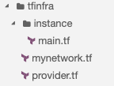
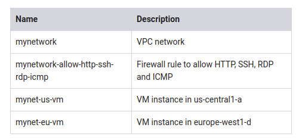

# Automating the Deployment of Infrastructure Using Terraform

~1 hour

- [overview video](https://www.coursera.org/learn/gcp-infrastructure-scaling-automation/lecture/lqJj0/lab-intro-automating-the-infrastructure-of-networks-using-deployment-manager-or)
- [lab review video](https://www.coursera.org/learn/gcp-infrastructure-scaling-automation/lecture/z1lV3/lab-review-automating-the-infrastructure-of-networks-using-terraform)


## Overview

Terraform enables you to safely and predictably create, change, and improve infrastructure. It is an open-source tool that codifies APIs into declarative configuration files that can be shared among team members, treated as code, edited, reviewed, and versioned.

In this lab, you create a Terraform configuration with a module to automate the deployment of GCP infrastructure. Specifically, you deploy one auto mode network with a firewall rule and two VM instances, as shown in this diagram:


### Objectives

In this lab, you learn how to perform the following tasks:

* Create a configuration for an auto mode network
* Create a configuration for a firewall rule
* Create a module for VM instances
* Create and deploy a configuration
* Verify the deployment of a configuration

## Task 1. Set up Terraform and Cloud Shell

Configure your Cloud Shell environment to use Terraform.

### Install Terraform

Terraform is now integrated into Cloud Shell. Verify which version is installed.

1. In the GCP Console, click Activate Cloud Shell (Cloud Shell).

2. If prompted, click Start Cloud Shell.

3. To confirm that Terraform is installed, run the following command:

`terraform --version`

The output should look like this (do not copy; this is example output):

`Terraform v0.12.2`

> Don't worry if you get a warning that the version of Terraform is out of date, because the lab instructions will work with Terraform v0.12.2 and later. The available downloads for the latest version of Terraform are on the Terraform website. Terraform is distributed as a binary package for all supported platforms and architectures, and Cloud Shell uses Linux 64-bit.

4. To create a directory for your Terraform configuration, run the following command:

`mkdir tfinfra`

5. In Cloud Shell, click Launch code editor (Cloud Shell Editor).

6. In the left pane of the code editor, expand the tfinfra folder.

### Initialize Terraform

Terraform uses a plugin-based architecture to support the numerous infrastructure and service providers available. Each "provider" is its own encapsulated binary distributed separately from Terraform itself. Initialize Terraform by setting Google as the provider.

1. To create a new file, click File > New File.

2. Name the new file provider.tf, and then open it.

3. Copy the code into provider.tf:

`provider "google" {}`

4. To initialize Terraform, run the following command:

```shell
cd tfinfra
terraform init
```

The output should look like this (do not copy; this is example output):

```shell
* provider.google: version = "~> 2.10"
Terraform has been successfully initialized!
```

You are now ready to work with Terraform in Cloud Shell.

## Task 2. Create mynetwork and its resources

Create the auto mode network mynetwork along with its firewall rule and two VM instances (mynet_us_vm and mynet_eu_vm).

### Configure mynetwork

Create a new configuration, and define mynetwork.

1. To create a new file, click File > New File.

2. Name the new file mynetwork.tf, and then open it.

3. Copy the following base code into mynetwork.tf:

```json
# Create the mynetwork network
resource [RESOURCE_TYPE] "mynetwork" {
name = [RESOURCE_NAME]
#RESOURCE properties go here
}
```

This base template is a great starting point for any GCP resource. The name field allows you to name the resource, and the type field allows you to specify the GCP resource that you want to create. You can also define properties, but these are optional for some resources.

4. In mynetwork.tf, replace [RESOURCE_TYPE] with "google_compute_network" (with the quotes).

> The google_compute_network resource is a VPC network. Available resources are in the [Google Cloud Platform provider documentation](https://www.terraform.io/docs/providers/google/index.html). For more information about this specific resource, see the [Terraform documentation](https://www.terraform.io/docs/providers/google/r/compute_network.html).

5. In mynetwork.tf, replace [RESOURCE_NAME] with "mynetwork" (with the quotes).

6. Add the following property to mynetwork.tf:

`auto_create_subnetworks = "true"`

By definition, an auto mode network automatically creates a subnetwork in each region. Therefore, you are setting auto_create_subnetworks to true.

7. Verify that mynetwork.tf looks like this:


```json
# Create the mynetwork network
resource "google_compute_network" "mynetwork" {
name                    = "mynetwork"
auto_create_subnetworks = true
}
```

8. To save mynetwork.tf, click File > Save.

### Configure the firewall rule

Define a firewall rule to allow HTTP, SSH, RDP, and ICMP traffic on mynetwork.

1. Add the following base code to mynetwork.tf:

```json
# Add a firewall rule to allow HTTP, SSH, RDP and ICMP traffic on mynetwork
resource [RESOURCE_TYPE] "mynetwork-allow-http-ssh-rdp-icmp" {
name = [RESOURCE_NAME]
#RESOURCE properties go here
}
```

2. In mynetwork.tf, replace [RESOURCE_TYPE] with "google_compute_firewall" (with the quotes).

> The google_compute_firewall resource is a firewall rule. For more information about this specific resource, see theTerraform documentation.

3. In mynetwork.tf, replace [RESOURCE_NAME] with "mynetwork-allow-http-ssh-rdp-icmp" (with the quotes).

4. Add the following property to mynetwork.tf:

`network = google_compute_network.mynetwork.self_link`

> Because this firewall rule depends on its network, you are using the google_compute_network.mynetwork.self_link reference to instruct Terraform to resolve these resources in a dependent order. In this case, the network is created before the firewall rule.

5. Add the following properties to mynetwork.tf:

```json
allow {
    protocol = "tcp"
    ports    = ["22", "80", "3389"]
    }
allow {
    protocol = "icmp"
    }
```

The list of allow rules specifies which protocols and ports are permitted.

6. Verify that your additions to mynetwork.tf look like this:

```json
# Add a firewall rule to allow HTTP, SSH, RDP, and ICMP traffic on mynetwork
resource "google_compute_firewall" "mynetwork-allow-http-ssh-rdp-icmp" {
name = "mynetwork-allow-http-ssh-rdp-icmp"
network = google_compute_network.mynetwork.self_link
allow {
    protocol = "tcp"
    ports    = ["22", "80", "3389"]
    }
allow {
    protocol = "icmp"
    }
}
```

7. To save mynetwork.tf, click File > Save.

### Configure the VM instance

Define the VM instances by creating a VM instance module. A module is a reusable configuration inside a folder. You will use this module for both VM instances of this lab.

1. To create a new folder inside tfinfra, select the tfinfra folder, and then click File > New Folder.
2. Name the new folder instance.
3. To create a new file inside instance, select the instance folder, and then click File > New File.
4. Name the new file main.tf, and then open it.

You should have the following folder structure in Cloud Shell:



5. Copy the following base code into main.tf:

```json
resource [RESOURCE_TYPE] "vm_instance" {
  name = [RESOURCE_NAME]
  #RESOURCE properties go here
}
```

6. In main.tf, replace [RESOURCE_TYPE] with "google_compute_instance" (with the quotes).

> The google_compute_instance resource is a Compute Engine instance. For more information about this specific resource, see the [Terraform documentation](https://www.terraform.io/docs/providers/google/r/compute_instance.html).

7. In main.tf, replace [RESOURCE_NAME] with "${var.instance_name}" (with the quotes).
Because you will be using this module for both VM instances, you are defining the instance name as an input variable. This allows you to control the name of the variable from mynetwork.tf. For more information about input variables, see [this guide](https://learn.hashicorp.com/terraform/getting-started/variables.html).

8. Add the following properties to main.tf:

```json
  zone         = "${var.instance_zone}"
  machine_type = "${var.instance_type}"
```

These properties define the zone and machine type of the instance as input variables.

10. Add the following properties to main.tf:

```json
  boot_disk {
    initialize_params {
      image = "debian-cloud/debian-9"
      }
  }
```

This property defines the boot disk to use the Debian 9 OS image. Because both VM instances will use the same image, you can hard-code this property in the module.

Add the following properties to main.tf:

```json
  network_interface {
    subnetwork = "${var.instance_subnetwork}"
    access_config {
      # Allocate a one-to-one NAT IP to the instance
    }
  }
```

This property defines the network interface by providing the subnetwork name as an input variable and the access configuration. Leaving the access configuration empty results in an ephemeral external IP address. For more information, see the [Terraform documentation](https://www.terraform.io/docs/providers/google/r/compute_instance.html).

11. Define the 4 input variables at the top of main.tf, and verify that main.tf looks like this, including brackets {}:

```json
variable "instance_name" {}
variable "instance_zone" {}
variable "instance_type" {
  default = "n1-standard-1"
  }
variable "instance_subnetwork" {}

...
```

By giving instance_type a default value, you make the variable optional. The instance_name, instance_zone, and instance_subnetwork are required, and you will define them in mynetwork.tf.

12. To save main.tf, click File > Save.

13. Add the following VM instances to mynetwork.tf:

```json
# Create the mynet-us-vm instance
module "mynet-us-vm" {
  source           = "./instance"
  instance_name    = "mynet-us-vm"
  instance_zone    = "us-central1-a"
  instance_subnetwork = google_compute_network.mynetwork.self_link
}

# Create the mynet-eu-vm" instance
module "mynet-eu-vm" {
  source           = "./instance"
  instance_name    = "mynet-eu-vm"
  instance_zone    = "europe-west1-d"
  instance_subnetwork = google_compute_network.mynetwork.self_link
}
```

These resources are leveraging the module in the instance folder and provide the name, zone, and network as inputs. Because these instances depend on a VPC network, you are using the google_compute_network.mynetwork.self_link reference to instruct Terraform to resolve these resources in a dependent order. In this case, the subnet is created before the instance.

> The benefit of writing a Terraform module is that it can be reused across many configurations. Instead of writing your own module, you can also leverage existing modules from the [Terraform Module registry](https://registry.terraform.io/browse?provider=google&verified=true).

14. To save mynetwork.tf, click File > Save.

### Create mynetwork and its resources

It's time to apply the mynetwork configuration.

1. To rewrite the Terraform configuration files to a canonical format and style, run the following command:

`terraform fmt`

The output should look like this (do not copy; this is example output):

`mynetwork.tf`

> If you get an error, revisit the previous steps to ensure that your configuration matches the lab instructions. If you cannot troubleshoot the issue of your configuration, look at these finished configurations:

> * [mynetwork.tf](https://storage.googleapis.com/cloud-training/archinfra/tfinfra/mynetwork.tf)
> * https://storage.googleapis.com/cloud-training/archinfra/tfinfra/instance/main.tf
> 
> * [provider.tf](https://storage.googleapis.com/cloud-training/archinfra/tfinfra/provider.tf)

2. To initialize Terraform, run the following command:

`terraform init`

The output should look like this (do not copy; this is example output):

```shell
Initializing modules...
- mynet-eu-vm in instance
- mynet-us-vm in instance
...
* provider.google: version = "~> 2.10"

Terraform has been successfully initialized!
```

> If you get an error, revisit the previous steps to ensure that you have the correct folder/file structure. If you cannot troubleshoot the issue of your configuration, refer to the finished configurations linked above. When you have corrected the issue, re-run the previous command.

3. To create an execution plan, run the following command:

`terraform plan`

The output should look like this (do not copy; this is example output):

```shell
...
Plan: 4 to add, 0 to change, 0 to destroy.
...
```

Terraform determined that the following 4 resources need to be added:



4. To apply the desired changes, run the following command:

`terraform apply`

5. To confirm the planned actions, type:

`yes`

The output should look like this (do not copy; this is example output):

```shekk
...
Apply complete! Resources: 4 added, 0 changed, 0 destroyed.
```

> If you get an error during the execution, revisit the previous steps to ensure that you have the correct folder/file structure. If you cannot troubleshoot the issue of your configuration, refer to the finished configurations linked above. When you have corrected the issue, re-run the previous command.

## Task 3. Verify your deployment

In the GCP Console, verify that the resources were created.

### Verify your network in the GCP Console

1. In the GCP Console, on the Navigation menu (Navigation menu), click VPC network > VPC networks.

2. View the mynetwork VPC network with a subnetwork in every region.

3. On the Navigation menu, click VPC network > Firewall Rules.

4. Sort the firewall rules by Network.

5. View the mynetwork-allow-http-ssh-rdp-icmp firewall rule for mynetwork.

### Verify your VM instances in the GCP Console

1. On the Navigation menu (Navigation menu), click Compute Engine > VM instances.

2. View the mynet-us-vm and mynet-eu-vm instances.

3. Note the internal IP address for mynet-eu-vm.

4. For mynet-us-vm, click SSH to launch a terminal and connect.

5. To test connectivity to mynet-eu-vm's internal IP address, run the following command in the SSH terminal (replacing mynet-eu-vm's internal IP address with the value noted earlier):

`ping -c 3 <Enter mynet-eu-vm's internal IP here>`

> This should work because both VM instances are on the same network, and the firewall rule allows ICMP traffic!

## Task 4. Review

In this lab, you created a Terraform configuration with a module to automate the deployment of GCP infrastructure. As your configuration changes, Terraform can create incremental execution plans, which allows you to build your overall configuration step by step.

The instance module allowed you to re-use the same resource configuration for multiple resources while providing properties as input variables. You can leverage the configuration and module that you created as a starting point for future deployments.