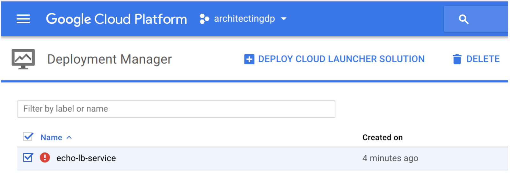

# Deployment Manager: Adding load balancing

~ 1 hour 30 minutes


## Overview

In this lab, you will...

1. Use a pre-written Python application called "Echo" and existing Deployment Manager templates written in Jinja2.
2. Create a deployment package suitable for Deployment Manager using the python package manager, pip.
3. Stage your package in a Cloud Storage bucket.
4. Manually test the application to ensure that it is working properly.
5. Use Deployment Manager to deploy the Echo LB service.
6. Test the new service.

## Objectives

In this lab, you will learn how to perform the following tasks:

* Develop and deploy a service.
* Configure a Deployment Manager template.
* Create a deployable package using pip.
* Follow best practices for testing an application manually prior to deploying it.
* Investigate and gather information necessary to configure health checks.
* Enable and verify that health check are functioning.

## The story so far...

The application development team is working on the Photo application, however they are behind schedule. Even a test version is not yet available. This is putting pressure on you as the time you were supposed to have available to create and implement the architecture is shrinking.

You decide to decouple development and implementation of the system architecture from the application development schedule. There is no good reason for you to wait for the application team to deliver the program before you create and test the architecture.

So you will construct an autoscaling load balanced infrastructure for the Photo application.

You will host the Echo application in the infrastructure so that you can test the design and validate that it works.

You plan to replace the Echo application with the Photo application as soon as it is delivered by the application development team. Doing this work in advance means that you have reduced the risk of the overall project slipping past its delivery date.

> Here are the new files you will be adding to the templates you have already created.
> 
> * http-lb-service.jinja
> * http-lb-service.jinja.schema
> * http-lb.yaml
> * install-ab.sh

## Download and unarchive the lab code

The lab code is in a .tar file with gzip compression hosted in the cloud-training bucket.

Open Cloudshell

The control looks like a pencil. This is how you launch the Cloud Shell Code Editor.


### Download the file

> The completed Echo lab is available in an archive file. You will use this as a base on which to build a more complex and flexible infrastructure.

In Cloud Shell Command Line create a directory to contain the first echo lab.

```shell
mkdir ~/archdp
cd ~/archdp
```

Download the lab tar file to the directory.

`gsutil cp gs://cloud-training/archdp/archdp-echo.tar.gz .`

### Expand the archive

Unarchive the lab.

`tar -xzvf archdp-echo.tar.gz`

In the Cloud Shell editor, click File > Refresh and you will see the archdp directory you created.

## Adding Load Balancing for Resiliency

The expanded archive is the solution from the previous lab. You are going to add additional Deployment Manager template files to the existing template to configure load balancing for the Echo service.

`http-lb.yaml` is a new configuration file. It replaces the `config.yaml` file. When you deploy the service using this file, it does everything to set up a load balancer.

`http-lb-service.jinja` and `http-lb-service.jinja.schema` build the load balancer.

`install-ab.sh` installs the Apache Bench open source load testing software, so you can stress-test the load balancer.

## Create the configuration file

After the experiences you have had with Deployment Manager in the previous labs, this file should look very familiar and should be easy to understand.

To create a new file in the Cloud Shell Code Editor, right-click on a folder, then select New > File as shown in the image below:

Using the Cloud Shell Code Editor, create the `http-lb.yaml` file in `~/archdp/deployment-manager-examples/`

### `http-lb.yaml`

```yaml
imports:
  - path: http-lb-service.jinja
  - path: install-echo.sh
    name: startup-script
resources:
  - name: echo
    type: http-lb-service.jinja
    properties:
      zone: [ZONE]
      tags:
        - http
      metadata:
        - key: echo
          value: https://storage.googleapis.com/[BUCKET]/echo-0.0.1.tar.gz
```

Notice that the configuration file requires [ZONE] and [BUCKET]. You do not need to change these yet. After you have completed more steps you will have this information available, and at that time you will edit the configuration file.

## Create the schema and jinja files.

You are creating the schema file first this time, because you know that defines the interface between your YAML configuration file and the template. You really only need to look at the JINJA file if you are curious how the underlying properties work

Using the Cloud Shell Code Editor, create the `http-lb-service.jinja.schema` file in `~/archdp/deployment-manager-examples/`

### `http-lb-service.jinja.schema`

```yaml
info:
  title: http service template
  author: cloud-training@google.com
  description: |
    Creates a http load balanced service
  version: 0.1
imports:
  - path: http-lb-service.jinja
required:
  - zone
properties:
  zone:
    type: string
    description: i.e. us-east1-d

  network:
    type: string
    description: Network URL i.e. projects/project/global/networks/network
    default: global/networks/default
  subnet:
    type: string
    description: Subnet URL i.e regions/region/subnetworks/subnetwork
  sourceImage:
    type: string
    description: Image uri
    default: projects/ubuntu-os-cloud/global/images/family/ubuntu-1404-lts

  machineType:
    type: string
    default: n1-standard-1

  serviceAccount:
    type: string
    description: Service account with permissions to label resources i.e. Project editor.
    default: default
  tags:
    type: array
    description: Array of tags
    items:
      type: string
  metadata:
    type: array
    description: Array of metadata key pairs
    items:
      type: object
      required:
        - key
        - value
      properties:
        key:
          type: string
        value:
          type: string
  maxReplicas:
    type: integer
    description: Max number of instance for backend service
    default: 3
    minimum: 3
    maximum: 10
  port:
    type: integer
    description: Service port
    default: 80
```

Using the Cloud Shell Code Editor, create the `http-lb-service.jinja` file in `~/archdp/deployment-manager-examples/`

### `http-lb-service.jinja`

```yaml

resources:
- name: {{ id }}-it
  type: compute.v1.instanceTemplate
  properties:
    properties:
      machineType: {{ properties['machineType'] }}
      metadata:
        items:
          - key: deployment
            value: {{ id }}
          
          - key: startup-script
            value: |
              {{ imports['startup-script']|indent(14) }}
          
          
          - {{ i }}
          
      disks:
        - deviceName: boot
          boot: true
          autoDelete: true
          initializeParams:
            diskSizeGb: 10
            sourceImage: {{ properties['sourceImage'] }}
      networkInterfaces:
        - name: {{ id }}-eth0
          network: {{ properties['network'] }}
          
            subnetwork: {{ properties['subnet'] }}
          
          accessConfigs:
            - name: eth0
              type: ONE_TO_ONE_NAT
      serviceAccounts:
        - email: {{ properties['serviceAccount'] }}
          scopes:
            - 'https://www.googleapis.com/auth/cloud-platform'
      
      tags:
        items:
          
          - {{ i }}
          
      

- name: {{ id }}-igm
  type: compute.v1.instanceGroupManager
  properties:
    targetSize: {{ properties["maxReplicas"] }}
    zone: {{ properties['zone'] }}
    baseInstanceName: {{ id }}-instance
    instanceTemplate: $(ref.{{ id }}-it.selfLink)

- name: {{ id }}-as
  type: compute.v1.autoscaler
  properties:
    zone: {{ properties["zone"] }}
    target: $(ref.{{ id }}-igm.selfLink)
    autoscalingPolicy:
      maxNumReplicas: {{ properties["maxReplicas"] }}
      cpuUtilization:
        utilizationTarget: 0.8
      coolDownPeriodSec: 90

- name: {{ id }}-hc
  type: compute.v1.httpHealthCheck
  properties:
    port: {{ properties["port"] }}
    requestPath: /

- name: {{ id }}-bes
  type: compute.v1.backendService
  properties:
    port: {{ properties["port"] }}
    portName: {{ env["name"] }}
    backends:
      - name: {{ id }}-{{ properties["service"] }}
        group: $(ref.{{ id }}-igm.instanceGroup)
    healthChecks:
      - $(ref.{{ id }}-hc.selfLink)

- name: {{ id }}-urlmap
  type: compute.v1.urlMap
  properties:
    defaultService: $(ref.{{ id }}-bes.selfLink)

- name: {{ id }}-targetproxy
  type: compute.v1.targetHttpProxy
  properties:
    urlMap: $(ref.{{ id }}-urlmap.selfLink)

- name: {{ id }}-l7lb
  type: compute.v1.globalForwardingRule
  properties:
    IPProtocol: TCP
    portRange: {{ properties["port"] }}
    target: $(ref.{{ id }}-targetproxy.selfLink)

outputs:
  - name: url
    value: http://$(ref.{{ id }}-l7lb.IPAddress)
```

The first part of this template looks like it is creating an instance. The properties are the same as the ones you used in the previous labs. However, a closer look reveals that the resource being built is an instance template: **compute.v1.instanceTemplate**.

You can follow the -name: elements and read the type: elements below them to identify all the resources that are being constructed.

Here is a quick way to dump them:

The configuration story is told in the type: statements.

**Example (don't copy)**

```shell
$ cat http-lb-service.jinja | grep type:

  type: compute.v1.instanceTemplate
              type: ONE_TO_ONE_NAT
  type: compute.v1.instanceGroupManager
  type: compute.v1.autoscaler
  type: compute.v1.httpHealthCheck
  type: compute.v1.backendService
  type: compute.v1.urlMap
  type: compute.v1.targetHttpProxy
  type: compute.v1.globalForwardingRule
```

* **compute.v1.instanceGroupManager** - an Instance Group Manager
* **compute.v1.autoscaler** - an Autoscaler
* **compute.v1.httpHealthCheck** - HTTP Health Check
* **compute.v1.backendService** - Back-end (scalable) service.
* **compute.v1.urlMap** - a URL Map for directing the traffic
* **compute.v1.targetHttpProxy** - HTTP Proxy
* **compute.v1.globalForwardingRule** - A global forwarding rule and Global IP

## Verify the Apache Bench installation script

Look for the `install-ab.sh` file in `~/archdp/deployment-manager-examples/`

You should see the file.

### `install-ab.sh`

```shell
#!/bin/bash -e

apt-get update
apt-get -y install apache2-utils
```


This script is not actually used in the deployment. It is the startup script necessary to install Apache Bench when creating another instance. The idea here is to add another resource to the template to create the load testing server automatically. Later in the lab you will create a load testing server manually. But you can see how easy it would be to automate this process.

## Create the package

Use the Python package manager to create a distribution package that will be used by Deployment Manager to upload the application to instances.

### Examine the setup instructions

View the contents of setup.py in `~/archdp/echo/`

The setup is going to create a package called 'Echo' that will include some dependencies. One is a microframework called 'Flask' ( http://flask.pocoo.org/) and another is a python HTTP Web Server Gateway Interface (WSGI) called gunicorn ( http://gunicorn.org/).

Create the package
Perform the following activities in Cloud Shell Command Line.

* Create the python source distribution package.
* Use the ls command to find your current path
* You need to be in the directory with setup.py.

```shell
cd ~/archdp/echo
python setup.py sdist
cd dist
ls
```

## Host the distribution package in a bucket

Deployment Manager will load the application file from a bucket.

Switch tabs in the browser to Console.

### Create a bucket

Create a uniquely named multiregional bucket in Console at an appropriate location.

On the Navigation menu, click Storage > Browser, and click Create Bucket.

### Upload the file to the bucket

Use the following gsutil command to upload the file to the bucket. It will make specific tags and settings necessary for the application to work with Deployment Manager.

It sets access control to 'public-read'.
It sets header information to identify the file as a gzip archive.
It sets the cache control to private.
In Cloud Shell Command Line enter the following using your bucket name.

```shell
MY_BUCKET=<bucket>

gsutil -h 'Content-Type: application/gzip' -h 'Cache-Control:private' cp -a public-read echo-0.0.1.tar.gz gs://$MY_BUCKET
```

> Note: Best Practice
> 
> Setting cache control to private in the header is a development best practice. It declares that the item can be cached for a single user, in a browser for example, but that it is not to be publicly cached as in a Content Delivery Network (CDN).
> 
> This would have no effect if your development environment was not using CDN. However, if the application was deployed to a production environment that was using CDN, and you tried to push out an upgrade to the application, it might not update. The servers would still fetch the cached version of the application. This is very frustrating and difficult to troubleshoot. So it is best to always specify Cache-Control:private so you never are in this circumstance.
> 
> For an interesting review of development caching best practices, see this article: https://developers.google.com/web/fundamentals/performance/optimizing-content-efficiency/http-caching

You can verify access control and header information in Console or using the following gsutil command:

Verify the object properties.

Enter the following command into Cloud Shell Command Line.

`gsutil ls -L gs://$MY_BUCKET/echo-0.0.1.tar.gz`

**Example Output (don't copy)**


## Configure the template

Before you can deploy the service with Deployment Manager, you will have to make some configuration changes in the http-lb.yaml file.

### Tailor the configuration file

Using the Cloud Shell Code Editor, edit `http-lb.yaml` in `~/archdp/deployment-manager-examples/` and replace [ZONE] with a zone of your choosing. You can find the list of zones in Cloud Shell by entering:

`gcloud compute zones list`

Replace [BUCKET] with your bucket name using Cloud Shell Code Editor.

#### `http-lb.yaml`

```yaml
imports:
  - path: http-lb-service.jinja
resources:
  - name: echo
    type: http-lb-service.jinja
    properties:
      zone: [ZONE]
      tags:
        - http
      metadata:
        - key: echo
          value: https://storage.googleapis.com/[BUCKET]/echo-0.0.1.tar.gz
```

## Deploy the service

You are ready to deploy the newly updated autoscaling load-balancing Echo service.

In Cloud Shell Command Line move to the deployment-manager-examples directory

```shell
cd ~/archdp/deployment-manager-examples
ls
```

Enter the following:

`gcloud deployment-manager deployments create echo-lb-service --config http-lb.yaml`

You should see a message that the deployment was successfully completed.

> As in previous labs, if the deployment does not complete properly, you will need to navigate in Console to Deployment Manager and delete the failed deployment to remove the artifacts that were created. Instructions are below.

> The infrastructure is built, but the service is not yet operational. There are a few more steps you will need to perform.

Verify that the deployment completed successfully. It should look something like this:

**Example**


Switch to the Console browser tab. Navigate to Navigation menu > Deployment Manager.

It should look something like this:

**Example**


If the deployment fails, it will generate an error message:

**Example**


Before you can attempt to launch the deployment again, you will need to navigate in Console to Navigation menu > Deployment Manager and select the failed deployment and delete it. Deployment Manager keeps the artifacts until you explicitly delete it, in case you need to investigate the cause of the failure.



## Enable the Health Checks

You will need to do some investigation of the load balancer, instances, and firewall rules to enable health checks.

### View the load balancer health check

* Return to the Console tab.
* On the Navigation menu, click Network services > Load balancing
* Click on echo-lb-service-urlmap
* Notice under the word Protocol that this is an HTTP load balancer.
* In the page find the numbers under Healthy - see the example below for the location.

Here is an example:


From the point of view of the load balancer, the health checks are failing and there are no healthy instances.

Note, until the backend servers are fully deployed, the Healthy column may indicate a status of 0/0 instead of 0/2. This may take several minutes. Refresh the page to see the updated status.

### View the echo lb instance

* On the Navigation menu, click Compute engine> VM instances
* Click one of the instances: echo-lb-service-instance-xxxx
* Toward the bottom of the page, find Network tags, which should have a tag of http

Here is an example:


From the point of view of the servers, they are just fine. And the servers are ready to receive traffic if a firewall rule targeted at the tag http permits the health check from the load balancer to forward traffic to the instances.

### View the firewall rules

* On the Navigation menu, click VPC Networks > Firewall rules
There is no firewall rule to allow health checks from the load balancer to the instances.

When a health check is used with Network load balancing, the health check probes come from a different range of addresses than for HTTP(S) (see reference). When a health check is used with HTTP(S), SSL proxy, TCP proxy, or Internal load balancing, the health check probes come from addresses in the ranges 130.211.0.0/22 and 35.191.0.0/16.

https://cloud.google.com/compute/docs/load-balancing/health-checks

Since this is an HTTP(S) load balancer, you will need to enable TCP traffic from 130.211.0.0/22 and 35.191.0.0/16 to instances with the tag http.

### Allow traffic to the server

1. Create a firewall rule to allow TCP traffic to the test server.
2. On the Navigation menu, click VPC Networks > Firewall rules
3. Click on Create Firewall Rule and specify the following:


Here is an example:


Click Create.

### Verify the load balancer health check

* On the Navigation menu, click Network services > Load balancing
* Click on echo-lb-service-urlmap
* Healthy should now be 2/2. The firewall rule will take several minutes to activate and for the health checks to pass. Press refresh to see the changes


## Test the Echo LB service

### Find the global load balancer forwarding rule IP address

Return to the Cloud Shell tab.

Find the Forwarding IP address by entering the following into Cloud Shell Command Line.

`gcloud compute forwarding-rules list`

Open a new browser tab and view the address.

`http://<your forwarding IP>`

Press return or refresh the browser several times. You should see the hostname changing, which demonstrates that the load balancing is working.


## Modify Autoscaling for testing purposes

1. Return to the Console tab.
2. On the Navigation menu, click Compute Engine > Instance groups.
3. Click on echo-lb-service-igm.
4. Click on the Details tab.
5. Examine the autoscaling settings.

   The autoscaler is currently set to scale up from 2 VMs to a maximum of 3 VMS when the collective CPU utilization of the pool grows over 80%. For the purposes of testing autoscaling, you will lower the trigger to 5%

6. Click on EDIT GROUP.
7. In the section called Target CPU usage replace 80 with 5.
8. Click Save.


## Test autoscaling

### Create a VM called ab-test

* Navigation menu > Compute Engine > VM Instances click CREATE INSTANCE
* Make sure that it is in the same zone as the Instance Group VMs.
* Use the setting below.
* Leave other settings at their defaults.


Leave the remaining settings as their defaults, and click Create.

### Install Apache Bench

Using the Console, click on the SSH link to SSH into the VM. (If popups are blocked, change to enable.) Enter the following in the terminal session to the VM.

```shell
sudo apt-get update
sudo apt-get -y install apache2-utils
```

From the VM terminal, use Apache Bench with the IP address to apply load to the service.

`ab -n 1000 -c 100 http://<your forwarding IP>/`

Note: You must include the trailing slash after your forwarding IP address. Otherwise you will get an error such as: "ab: invalid URL" when you run the above command.

Run the above command two or three times.

On the Console tab, go to Navigation menu > Compute Engine > Instance groups and click on the echo-lb-service-igm. Click on the Monitoring tab. Towards the bottom of the page, below the graphs, look for the utilization information.

This is an example of the utilization:


This is not nearly enough traffic to trigger autoscaling at 5% average utilization. Increase the load from 1000 to 10,000 and run the command two or three more times.

**Example**

`ab -n 10000 -c 100 http://<your forwarding IP>/`

### Verify autoscaling.

* On the Navigation menu, click Compute Engine > Instance groups
* Click on echo-lb-service-igm
* Examine the autoscaling settings. You should see that it has scaled up to 3 VMs.

## De-deploy the service

* On the Console tab, navigate in Console to Navigation menu > Deployment Manager and select the deployment you created and delete it. This will de-deploy all the objects that were created by the Deployment Manager template.
* Go to Navigation menu > VPC network > Firewall rules
* The allow-healthchecks rule is still present. You created that manually so de-deploying the service did not remove this firewall rule.

