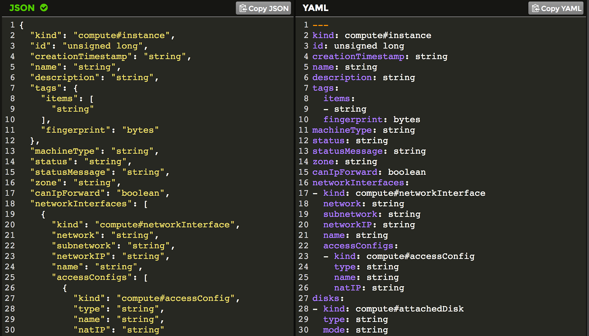
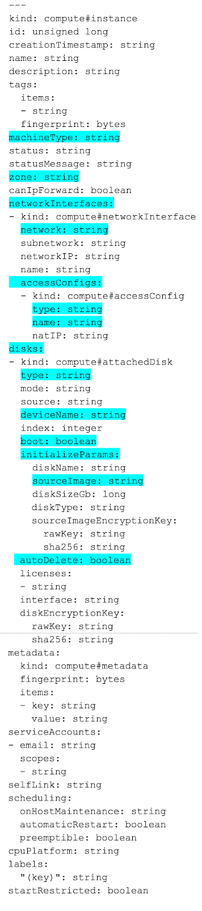

# Deployment Manager: Beginning appserver

~1 hour 30 minutes

## Overview

In this lab, you create a Cloud Deployment Manager template for appserver. Activities include:

1. Create a Deployment Manager template in YAML format.

2. Learn to work with YAML.

3. Relate JSON to YAML, and correct syntax errors in YAML.

4. Create a prototype template from the documentation by converting the reference to YAML.

5. Prune the prototype template to common and required properties.

6. Use gcloud commands to interrogate the GCP environment to find the exact values and URIs required to configure the template.

7. Use Deployment Manager to create multiple environments for different organizations and purposes and then de-deploy them after they have served their purpose.

### Objectives

In this lab, you learn how to perform the following tasks:

* Create a YAML Deployment Manager template from scratch.

* Configure the properties correctly using information gathered from GCP.

* Prune properties to just those you need.

* Identify and resolve YAML syntax issues in a template.

### Overview

In this class, you have been introduced to a photo application ("thumbnail"), and you will develop the infrastructure for it.

The application development team has sent you the following email:

> Greetings!
> 
> We are ready to begin development of the photo application. Please create for us a virtual machine using a deployment manager template. After the machine is available, the application developers will connect to it and customize it for our development purposes.
> 
> Thanks!
> 
> App Dev Team

## About Deployment Manager

> Read the background information first. The hands-on lab activities start after these readings.
> 
> Ignore Copy and Paste until you see "LAB ACTIVITIES START HERE."

You have many options for creating infrastructure in GCP.

* Google Cloud Console
* The gcloud command-line tool, possibly automated in a bash script:

---- in Cloudshell

---- on a computer

---- from a security account authorized VM

* A program that calls the cloud RESTful API using any of the client libraries
* Deployment Manager

Console can interrogate your running environment and customize menus so that you are not faced with the problem of possibly configuring invalid options. And console can perform compound actions that coordinate multiple API calls.

Script and program automation makes infrastructure that is maintainable and documented. And once you create a script that you like, you can reuse it or modify it to make you more productive.

## Deployment Manager use cases

Deployment Manager is particularly useful as an architecting and design tool.

When you deploy a solution, the deployment is visible in console. When you select it and click delete, Deployment Manager de-deploys the solution, making it easy to shut down and clean up after an activity.

The ability to quickly create identical deployments is useful when you need identical environments for development, unit testing, load testing, production, and so forth.

The ability to rapidly change something, launch a variation, use it, and shut it down is useful for design experimentation and for testing system behavior.

Another use of Deployment Manager is in disaster recovery, where the deployment could be redirected to create identical infrastructure in another region.

## How Deployment Manager works?

Deployment Manager uses declarative templates rather than imperative commands. You don't tell Deployment Manager what to do, you tell it what you want. You write templates that declare the infrastructure you want to build. Deployment Manager reads those templates and then makes calls to the Cloud API to get the job done.

That immediately places certain constraints on Deployment Manager.

* Deployment Manager is completely dependent on the API. If there are not options to accomplish what you want in the API, then Deployment Manager can't do it either.
* The APIs for the resources you want to use must be enabled in API Manager.
* That also means every property that is required by the API must also be configured in the template too, or Deployment Manager won't be able to make the API calls.
* Deployment Manager only supports specific resource types. And while that covers most of the products in GCP, it does not cover all of them. The list of supported types is here:

https://cloud.google.com/deployment-manager/docs/configuration/supported-resource-types

## YAML

YAML is a human-readable data sequencing language. It has four main syntactic features.

Keywords in yaml are represented as a word followed by a colon on a line by itself.

`accessConfigs:`

Key value pairs are represented with the key and value on either side of a colon on a line by itself.

`key: value`

Nesting of elements occurs through indentation (like Python) rather than braces or brackets as in other languages, but the number of spaces is not significant.

```yaml
accessConfigs:
   name: samuel
     type: clemens
```

Is the same as

```yaml
accessConfigs:
          name: samuel
                  type: clemens
```

Never use tabs in YAML.

Finally, a list is represented by a dash in the whitespace before the start of the list and is terminated by the end of the in-line indentation.

```yaml
accessConfigs:
       name: samuel
       type: clemens
```

This one produces a sequence: `accessConfigs( name:samuel, type:clemens )`

Notice that each pair is a property.

that is different from

```yaml
accessConfigs:
    -  name: samuel
       type: clemens
```

This one produce a list: `accessConfigs( [ (name:samuel), (type:clemens) ], ... )`

Notice that the collection of pairs is the first property.

This means that when you create a YAML file, if you get a dash out of place or leave it off when it is expected, it will create a syntax error in the call to the underlying API and your deployment will fail.

## Syntax complications

The YAML language you write is used ultimately by Deployment Manager to make API calls. There are syntax complications due to the underlying API. You need to understand these complications to correctly write YAML. Simplified pseudo-code will help explain the syntax requirements.

Imagine that in the API, to create a virtual machine instance you needed to call the function 'make_a_computer( )'. This is a pseudo-code illustration. This is NOT the real function that is in the Cloud API and this is NOT valid YAML. This is just an illustration to help you understand the required syntax.

In our pseudocode language, to create a virtual machine, you would call

`make_a_computer( properties )`

However a virtual machine requires a boot disk, but the boot disk is not actually a component of the instance. It is a separate object. You could create a disk without a virtual machine like this:

`make_a_disk( properties )`

So, since a virtual machine requires a boot disk, and the disk is a separate object, you must use a nested construction to create the virtual machine:

```yaml
make_a_computer( properties,
                 make_a_disk( disk_properties ),
               )
```

### 1) The API and therefore the YAML requires this kind of nested construction.

You cannot create a virtual machine without a disk. Each computer requires at least one disk. So if you were just to use the following construction to create a virtual machine, without the disk specification, it would result in an error:

`make_a_computer ( properties ) <<== ERROR`

### 2) Leaving out a required nested element generates an error.

The next syntax complication concerns the properties. There are a few ways that properties can be identified. Imagine that one required property is the virtual machine's 'name'. One way to specify a property is by position.

In this example, the first property is always the virtual machine's name:

```yaml
make_a_computer( my_name,
                 make_a_disk( disk_properties ),
                 more_properties
               )
```

If you leave the name out, a default name for the computer is used. All you would do is leave the comma in the properties sequence, but don't put a name in that position, and the system knows that you have not given the computer a name and that it should use the default name.

```yaml
make_a_computer(  ,
                 make_a_disk( disk_properties ),
                 more_properties
               )
```

Instead of positional properties, another way to specify properties is a tuple. A tuple is nothing more than a key-value pair. The keyword comes first, then the colon symbol, followed by the value. key:value. So here is how you would specify a name property using a tuple.

```yaml
make_a_computer( name:my_name,
                 make_a_disk( disk_properties ),
                 more_properties
               )
```

One advantage of using a tuple instead of a positional property is that a tuple can appear anywhere in the properties list. It is no longer locked into the first position. So the following example is now a valid way of specifying the computer name. Notice the tuple is now in third position.

```yaml
make_a_computer( properties,
                 make_a_disk( disk_properties ),
                 name:my_name,
                 more_properties
               )
```


If you wanted to use the default name, how would you represent that with tuples? You can't leave the comma as in the previous default name example, because position is no longer significant in the list of properties. The answer is, you simply leave out the property. When the system reaches the end of the properties sequence and has found no tuple for "name:?", it knows to take the default (if there is one). For properties that have no default, the system generates an error.

This example triggers the use of the default name by simply not specifying a name tuple.

```yaml
make_a_computer(
                 make_a_disk( disk_properties ),
               )
```

### 3) The API and YAML use tuple construction for properties.


### 4) You specify defaults, when they exist, by simply omitting the tuple from the list of properties.

There is one final syntax complication. Imagine the disk has the following disk_properties:

`disk_type: { magnetic or solid_state } (required, there is no default)`

`disk_size: { N megabytes; where N is greater than or equal to 10, no default }`

`disk_SKU: { optional suppliers part number } (may appear multiple times)`

The `disk_SKU` is the part number to order a replacement disk. There could be as many of these properties as there are disk manufacturers. One supplier would have disk_SKU:xyz and another disk_SKU:123. It can appear in the properties sequence multiple times.

How can the API developer know how many properties to ingest from the function? The number of properties is no longer fixed.

To get around this problem, the developer might require a single property -- a list object. That list can contain an arbitrary number of tuples.

Instead of this:

`make_a_disk( disk_properties )`

The API might require this:

`make_a_disk( [ list ] )`

In some languages a list is shown within square brackets:

Without a list; a property sequence.

`make_a_disk( disk_size:10, disk_type:magnetic )`

With a list.

`make_a_disk(  [disk_size:10, disk_type:magnetic]  )`

Note that even though the list format was adopted to allow for multiple disk_SKU properties, that because the property is also optional, in the above example it does not appear in the list.

If the API developer has required a list instead of a property sequence, then calling the API with the individual properties rather than with the list construct is a syntax error:

`make_a_disk( disk_size:10, disk_type:magnetic )  <<== ERROR`

### 5) The API uses both property sequences and lists. If a list is required and you specify a property instead of a list, it is a syntax error.

## Create a resource

> LAB ACTIVITIES START HERE.

Open Cloudshell

Open the Cloud Shell Code Editor. You will be using it to create and edit the template file, and the other tab to interrogate the environment for values you'll need to specify in the template.

The controls you need to open the editor may be off screen to the right. You will need to close the Navigation menu to see the controls.

The control looks like a pencil. This is how you launch the Cloud Shell Code Editor.

You now have three interfaces available: (1) The Cloud Shell Code Editor, (2) the Cloud Shell Command Line, and (3) (By clicking on the tab) The Console. You can switch back and forth between Console and Cloud Shell by clicking on the tab.

All directory and file instructions that follow are relative to your home directory: ~/

Create a directory called archdp.

```shell
mkdir ~/archdp
cd ~/archdp
```

Click File > Refresh in the Code Editor to see the directory.


You will be creating an application server. Create a file called ~/archdp/appserver.yaml using Cloud Shell Code Editor. In the file you must declare the resources. To start, you will create a single instance.

Enter the following into ~/archdp/appserver.yaml. Don't worry about the resource type. You will be replacing that with the correct information in the following steps.

```yaml
resources:
- name: appserver
  type: [RESOURCE_TYPE]
```

In Cloud Shell Command Line, find the type for a Compute Engine instance.

`gcloud deployment-manager types list`

That is a long list of resources. Some of the resources are in alpha or beta. Production-ready resources are identified by "v1".

Try the following to find the correct resource type for a v1 instance.

`gcloud deployment-manager types list | grep v1.*instance`

You should see something like this:

```shell
Output (don't copy)
compute.v1.instanceGroupManager
sqladmin.v1beta4.instance
compute.v1.instanceGroup
compute.v1.instanceTemplate
compute.v1.instance
```

compute.v1.instance is the resource type. Enter that in ~/archdp/appserver.yaml using Cloud Shell Code Editor.

```yaml
resources:
- name: appserver
  type: compute.v1.instance
```

You could also have looked at the documentation to find available resource types.

https://cloud.google.com/deployment-manager/docs/configuration/supported-resource-types

## Examine the resource properties

Next, you need to define some properties for the instance.

Add the properties: keyword to `~/archdp/appserver.yaml`

```yaml
resources:
- name: appserver
  type: compute.v1.instance
  properties:
```

But where do you find the Deployment Manager properties for a compute instance?

Well... they are the same properties that are used by the API. And rather than separately documenting them for Deployment Manager, you are to use the API documentation as a guide.

For your convenience, each resource type has a link to the corresponding API documentation, so you don't have to search for it.

Find the properties for an instance resource type.

Looking on this page....

https://cloud.google.com/deployment-manager/docs/configuration/supported-resource-types

...you find the instance API documentation here:

https://cloud.google.com/compute/docs/reference/latest/instances

## Learn about resource properties

1. Unfortunately, the documentation is not in YAML format.

The properties are also not shown in JSON format. They are shown in a pseudo-code documentation format that highlights the variable types of the properties.

> The following activity helps you understand the relationship between the properties as they are shown in the online documentation and how you represent them in YAML format for Deployment Manager templates.

2. Below is a copy of the compute instance properties.

3. Copy and paste these properties into a file called instance-properties.txt in the `~/archdp` directory. You will use the file in a later step.

Create file `~/archdp/instance-properties.txt`

```yaml
{
  "kind": "compute#instance",
  "id": unsigned long,
  "creationTimestamp": string,
  "name": string,
  "description": string,
  "tags": {
    "items": [
      string
    ],
    "fingerprint": bytes
  },
  "machineType": string,
  "status": string,
  "statusMessage": string,
  "zone": string,
  "canIpForward": boolean,
  "networkInterfaces": [
    {
      "kind": "compute#networkInterface",
      "network": string,
      "subnetwork": string,
      "networkIP": string,
      "name": string,
      "accessConfigs": [
        {
          "kind": "compute#accessConfig",
          "type": string,
          "name": string,
          "natIP": string
        }
      ]
    }
  ],
  "disks": [
    {
      "kind": "compute#attachedDisk",
      "type": string,
      "mode": string,
      "source": string,
      "deviceName": string,
      "index": integer,
      "boot": boolean,
      "initializeParams": {
        "diskName": string,
        "sourceImage": string,
        "diskSizeGb": long,
        "diskType": string,
        "sourceImageEncryptionKey": {
          "rawKey": string,
          "sha256": string
        }
      },
      "autoDelete": boolean,
      "licenses": [
        string
      ],
      "interface": string,
      "diskEncryptionKey": {
        "rawKey": string,
        "sha256": string
      }
    }
  ],
  "metadata": {
    "kind": "compute#metadata",
    "fingerprint": bytes,
    "items": [
      {
        "key": string,
        "value": string
      }
    ]
  },
  "serviceAccounts": [
    {
      "email": string,
      "scopes": [
        string
      ]
    }
  ],
  "selfLink": string,
  "scheduling": {
    "onHostMaintenance": string,
    "automaticRestart": boolean,
    "preemptible": boolean
  },
  "cpuPlatform": string,
  "labels": {
    (key): string
  },
  "startRestricted": boolean
}
```

There are a lot of properties listed. The explanation of the properties indicates that some are read-only, some are optional, some have defaults.

If you look carefully in the list of properties, you will see that some of them are contained within square brackets. As you learned in the previous section, these indicate lists, rather than property sequences. And it is an indicator to you that the API developer required a list rather than a property sequence.

Take a look at this tiny excerpt.

**Example (don't copy)**

```shell
  "serviceAccounts": [
    {
      "email": string,
      "scopes": [
        string
      ]
    }
]
```

You can see that serviceAccounts is a nested object inside of the instance.

The square brackets indicate that serviceAccounts requires a list, not a property sequence.

The next step is to prune out many of the properties that are not required for you to deploy a simple VM. All you really need to specify is the type of machine, the OS image, the disk and the network.

This process will be easier to understand if you can see the properties in YAML. In the next activity you will convert the documentation text into YAML.

## Prune the properties

The next steps are not required to create a template in YAML. These steps are to help you learn about the documentation and how to use it to guide you to create templates

You are going to convert the documentation properties into YAML format for learning purposes. Seeing the properties in YAML will make it easier to understand how to use them in the template.

The documentation reference is in a pseudo-JSON format. To turn the documentation into a valid JSON format, the variable type keywords such as boolean and string will have to be placed in quotes. After the documentation is converted to JSON, the JSON can be converted into YAML.

A sed script will accomplish the goal of converting the documentation into valid JSON. Copy this script into a file called **proto2json** in the `~/archdp` directory.

Create `~/archdp/proto2json`

```shell
echo $1
sed -i 's/string/"string"/g' $1
sed -i 's/boolean/"boolean"/g' $1
sed -i 's/integer/"integer"/g' $1
sed -i 's/unsigned long/"unsigned long"/g' $1
sed -i 's/bytes/"bytes"/g' $1
sed -i 's/(key)/"(key)"/g' $1
sed -i 's/float/"float"/g' $1
sed -i 's/etag/"etag"/g' $1
sed -i 's/long,/"long",/g' $1
```

Using the Cloud Shell Command Line, make **proto2json** executable.

`chmod +x proto2json`

If the `~/archdp/instance-properties.txt` file is open in Cloud Shell Code Editor, close it.

Run the sed script on the `instance-properties.txt` file. This transforms the file from documentation format into a valid JSON file.

`./proto2json instance-properties.txt`

1. In Cloud Shell Code Editor open instance-properties.txt.
2. You can now cut-and-paste the JSON file.
3. Open a new browser window and navigate to this website: https://www.json2yaml.com/
4. Select all of the sample JSON text and press delete to get rid of it.
5. Copy and paste the contents from instance-properties.txt into the JSON window of the website. You should immediately see the pretty-print version in the YAML window.

This gives you a YAML prototype, something like this:



The indentation is correct in the YAML version. However, a quick look at the dashes shows they are out of place and do not reflect the correct syntax for lists as required by the API.

Since you understand the bracket notation for lists, you can correct the location of the dashes by referring back to the original documentation reference.

The pruning process is simply to read the documentation for each property, and determine whether it is required for your application. To save time, the pruning process has been done for you. The blue highlights below are properties you will set in the lab. The other properties are not needed for this deployment.



To save time, this reduced set of properties has been prepared for you.

Copy and paste (append) the following to the `~/archdp/appserver.yaml` file.

```yaml
  properties:
    zone: string
    machineType: string
    networkInterfaces:
      network: string
      accessConfigs:
        name: string
        type: string
    disks:
      type: string
      deviceName: string
      boot: boolean
      autoDelete: boolean
      initializeParams:
        sourceImage: string
```

It should look like this:

```yaml
resources:
- name: appserver
  type: compute.v1.instance
  properties:
    zone: string
    machineType: string
    networkInterfaces:
      network: string
      accessConfigs:
        name: string
        type: string
    disks:
      type: string
      deviceName: string
      boot: boolean
      autoDelete: boolean
      initializeParams:
        sourceImage: string
```


Note that the nested objects, the disks and network interfaces, can appear in any order in the properties list, so long as they are specified. You might find it easier for you to specify disks first rather than network interface. That is a matter of style. And you may see different styles used in Deployment Manager examples.

## Dash it all

You need to understand the significance of that YAML dash. If you don't get the dashes in the right places in your template, it will cause syntax errors and your deployment will fail.

The dash is YAML's way of signifying a list.

An example will help.

Here is an excerpt from the properties documentation:

**Example (don't copy)**

```yaml
      "accessConfigs": [
        {
          "kind": "compute#accessConfig",
          "type": string,
          "name": string,
          "natIP": string
        }
      ]
```

The square brackets indicate a list.

This translation into YAML looks right, but it does not account for the list.

**Example (don't copy)**

```yaml
accessConfigs:
   kind: compute#accessConfig
   type: string
   name: string
   natIP: string
```

This one is correct because of the single dash on the second line.

**Example (don't copy)**

```yaml
accessConfigs:
 - kind: compute#accessConfig
   type: string
   name: string
   natIP: string
```

The first one produces: `accessConfigs( kind:a, type:b, name:c, natIP:d )`

It is passing accessConfigs four separate properties in the property sequence. This is a syntax error.

The second one produces: `accessConfigs( [ (kind:a), (type:b), (name:c), (natIP:d) ] )`

It is passing accessConfigs a list. And the list contains an arbitrary number of properties.

Looking at the original reference, you can see where the square brackets indicate lists, and you can put the dashes back in where they belong.

The following require leading dashes:

network

name (beneath network)

type (beneath disks)

The dash must be one space before the start of the keyword. The text must be lined up. If you have the indentation wrong or the dashes missing or in the wrong place, the template will produce an error when deployed.

Using the example below as a guide, make sure that the dashes are correctly located in `~/archdp/appserver.yaml`

Here is the updated YAML template, ready for the properties to be assigned actual values.

**Example**

```yaml
resources:
- name: appserver
  type: compute.v1.instance
  properties:
    zone: string
    machineType: string
    networkInterfaces:
    - network: string
      accessConfigs:
      - name: string
        type: string
    disks:
    - type: string
      deviceName: string
      boot: boolean
      autoDelete: boolean
      initializeParams:
        sourceImage: string
```

## Configure the resource properties

Next, you will work from the top down, replacing the prototype variables like string and boolean with actual values.

The first property is the zone. Use the following command in the Cloud Shell Command Line to identify available zones.

`gcloud compute zones list`

Select your zone.

In `~/archdp/appserver.yaml`, replace zone: string with zone: [YOUR_ZONE].

You need to find out what kind of machine types are available in that zone. Enter the following into the Cloud Shell Command Line interface.

`gcloud compute machine-types list | grep [YOUR_ZONE]`

Looks like the f1-micro is available. Although this is a list of machine types, and the keyword in the templates is machineType:, the value required by the API is different.

You need to get the specific URI required by the API to create that type of machine. Use the following command in Cloud Shell Command Line to find the URI.

`gcloud compute machine-types describe f1-micro --zone [YOUR_ZONE]`

**Example Command (don't copy)**

`gcloud compute machine-types describe f1-micro --zone us-west1-b`

Your results should look something like this:

**Output (don't copy)**

```shell
creationTimestamp: '2015-01-16T09:25:43.316-08:00'
description: 1 vCPU (shared physical core) and 0.6 GB RAM
guestCpus: 1
id: '1000'
isSharedCpu: true
kind: compute#machineType
maximumPersistentDisks: 16
maximumPersistentDisksSizeGb: '3072'
memoryMb: 614
name: f1-micro
selfLink: https://www.googleapis.com/compute/v1/projects/architectingdp/zones/us-west1-b/machineTypes/f1-micro
zone: us-west1-b
```

The line that says "selfLink" is the one you will need.

* Copy the selfLink URI from the Cloud Shell Command Line to the machineType: field in `~/archdp/appserver.yaml` by pasting into the Cloud Shell Code Editor.
* The VM is going to be launched on the **default network**. Another URI is required for the network property. You will need to locate the value of the URI similar to the **machineType** URI.

Enter the following in the Cloud Shell Command Line.

`gcloud compute networks list`

**Output (don't copy)**

```shell
NAME     MODE  IPV4_RANGE  GATEWAY_IPV4
default  auto
```

Enter the following command in Cloud Shell Command Line to describe the default network.

`gcloud compute networks describe default`

The first URI in the list is the selfLink required by the API.

**Output (don't copy)**

```yaml
autoCreateSubnetworks: true
creationTimestamp: '2017-04-20T03:12:08.405-07:00'
description: Default network for the project
id: '1237372757312092055'
kind: compute#network
name: default
selfLink: https://www.googleapis.com/compute/v1/projects/architectingdp/global/networks/default
subnetworks:
- https://www.googleapis.com/compute/v1/projects/architectingdp/regions/us-west1/subnetworks/default
- https://www.googleapis.com/compute/v1/projects/architectingdp/regions/europe-west2/subnetworks/default
- https://www.googleapis.com/compute/v1/projects/architectingdp/regions/europe-west1/subnetworks/default
- https://www.googleapis.com/compute/v1/projects/architectingdp/regions/australia-southeast1/subnetworks/default
- https://www.googleapis.com/compute/v1/projects/architectingdp/regions/europe-west3/subnetworks/default
- https://www.googleapis.com/compute/v1/projects/architectingdp/regions/asia-east1/subnetworks/default
- https://www.googleapis.com/compute/v1/projects/architectingdp/regions/us-east1/subnetworks/default
- https://www.googleapis.com/compute/v1/projects/architectingdp/regions/asia-northeast1/subnetworks/default
- https://www.googleapis.com/compute/v1/projects/architectingdp/regions/us-east4/subnetworks/default
- https://www.googleapis.com/compute/v1/projects/architectingdp/regions/asia-southeast1/subnetworks/default
- https://www.googleapis.com/compute/v1/projects/architectingdp/regions/us-central1/subnetworks/default
x_gcloud_mode: auto
```

The line that says selfLink is the one you need.

1. Copy the URI for selfLink in Cloud Shell Command Line.
2. Paste the result in the network: field in the yaml file in Cloud Shell Code Editor.
3. Examining the YAML file, accessConfig name and type fields must be set.
   Returning to the API reference, you can read about the accessConfig name and type fields.

   https://cloud.google.com/compute/docs/reference/latest/instances

   **name**: "The name of this access configuration. The default and recommended name is **External_NAT** but you can use any arbitrary string you would like. For example, My external IP or Network Access."

   **type**: "The type of configuration. The default and only option is **ONE_TO_ONE_NAT**."

        * Set these fields.
    The template should now look similar to this:

**Example (don't copy)**

```yaml
resources:
- name: appserver
  type: compute.v1.instance
  properties:
    zone: us-west1-b
    machineType: https://www.googleapis.com/compute/v1/projects/[YOUR_PROJECT]/zones/us-west1-b/machineTypes/f1-micro
    networkInterfaces:
    - network: https://www.googleapis.com/compute/v1/projects/[YOUR_PROJECT]/global/networks/default
      accessConfigs:
      - name: External_NAT
        type: ONE_TO_ONE_NAT
    disks:
    - type: string
      deviceName: string
      boot: boolean
      autoDelete: boolean
      initializeParams:
        sourceImage: string
```

        * The next values to be set are properties of the boot disk.

**type**: "Specifies the type of the disk, either SCRATCH or PERSISTENT. If not specified, the default is PERSISTENT." This will be a persistent boot disk. So it should be set to **PERSISTENT**.

**deviceName**:

"Specifies a unique device name of your choice that is reflected into the /dev/disk/by-id/google-* tree of a Linux operating system running within the instance. This name can be used to reference the device for mounting, resizing, and so on, from within the instance. If not specified, the server chooses a default device name to apply to this disk, in the form persistent-disks-x, where x is a number assigned by Google Compute Engine. This field is only applicable for persistent disks."

It is common practice to call the boot disk in an instance **boot**.

**boot**: "Indicates that this is a boot disk. The virtual machine will use the first partition of the disk for its root filesystem." It is a boolean value, so it should be set to **true**.

**autoDelete**: "Specifies whether the disk will be auto-deleted when the instance is deleted (but not when the disk is detached from the instance)." Another boolean value. Should be set to **true**.

    * Set these four values in the disk section of the template. type: **PERSISTENT**, deviceName: **boot**, boot: **true**, autoDelete: **true**.
The template should now look similar to this:


**Example (don't copy)**

```yaml
resources:
- name: appserver
  type: compute.v1.instance
  properties:
    zone: us-west1-b
    machineType: https://www.googleapis.com/compute/v1/projects/architectingdp/zones/us-west1-b/machineTypes/f1-micro
  - networkInterfaces:
      network: https://www.googleapis.com/compute/v1/projects/architectingdp/global/networks/default
      accessConfigs:
      - name: External_NAT
        type: ONE_TO_ONE_NAT
    disks:
    - type: PERSISTENT
      deviceName: boot
      boot: true
      autoDelete: true
      initializeParams:
        sourceImage: string
```

    * There is one value remaining: the source Image that will be used to initialize the disk and boot the OS.

Enter the following command into the Cloud Shell Command Line to discover which OS Images are available?

`gcloud compute images list`

Enter the following into Cloud Shell Command Line to find the latest Debian image:

`gcloud compute images list | grep debian`

The output looks something like this:

**Output (don't copy)**

```shell
debian-8-jessie-v20170918           debian-cloud       debian-8     READY
debian-9-stretch-v20170918           debian-cloud       debian-9     READY
```

But you need the URI of the source image. To find it you need to use the following command in the Cloud Shell Command Line.

What is the latest URI for the image?

`gcloud compute images list --uri | grep debian`

**Output (don't copy)**

```shell
https://www.googleapis.com/compute/v1/projects/debian-cloud/global/images/debian-8-jessie-v20170816
https://www.googleapis.com/compute/v1/projects/debian-cloud/global/images/debian-9-stretch-v20170816
```

You will use the latest version of Debian, which in the example is Debian 9.

    * Copy the debian-9 source image URI from the Cloud Shell Command Line and paste it into the `~/archdp/appserver.yaml` file in Cloud Shell Code Editor.
The ~/archdp/appserver.yaml file should look similar to this:

**Example (don't copy)**

```yaml
resources:
- name: appserver
  type: compute.v1.instance
  properties:
    zone: us-west1-b
    machineType: https://www.googleapis.com/compute/v1/projects/architectingdp/zones/us-west1-b/machineTypes/f1-micro
    networkInterfaces:
    - network: https://www.googleapis.com/compute/v1/projects/architectingdp/global/networks/default
      accessConfigs:
      - name: External_NAT
        type: ONE_TO_ONE_NAT
    disks:
    - type: PERSISTENT
      deviceName: boot
      boot: true
      autoDelete: true
      initializeParams:
        sourceImage: https://www.googleapis.com/compute/v1/projects/debian-cloud/global/images/debian-9-stretch-v20170816
```

## Deploy appserver!

Congratulations! You have made it through creating and configuring your first Deployment Manager template. Time to launch appserver.

Enter the following command in the Cloud Shell Command Line to deploy your template.

`gcloud deployment-manager deployments create appserver --config appserver.yaml`

If it is successful, you will see confirmation in Cloudshell.

Common causes for failure to deploy include the following:

* Verify that you have followed the Cloud Shell Command Line procedures to identify the correct URI for your account. It will include your Project IDs in the URIs. If you have copied the examples in this lab your deployment will fail.
* Verify that the properties: keyword is in line with the name: and type: keyword. One space out of alignment will cause the deployment to fail.
* Verify that the list properties have been identified by a leading dash. For example " - type". If there is no space before the keyword, like this: " -type", the deployment will fail.
* If your template is correctly formed but has an invalid property, Deployment Manager may start to build the infrastructure until it runs into the bad property. It will then receive an error from the underlying API and it will be forced to halt before the launch is completed. The artifacts already created will continue to exist until you manually delete the deployment using Console.

If you have artifacts from a previously failed launch, and you try to launch again without cleaning-up, you will see an error saying that the deployment 'ResponsError: code=409, already exists and cannot be created'.

## Cleaning up from a failed launch

If the deployment had an error, then you will need to delete the deployment. This will cause Deployment Manager to undo and delete all the artifacts it created before running into the API error.

Click on the browser tab for Console.

Go to **Navigation menu** > **Deployment Manager** in Console. Select the deployment and click **delete**.

## Using the power of Deployment Manager

Click on the browser tab for Console.

If your deployment has succeeded you can view the deployment by going to **Navigation menu** > **Deployment Manager** in Console.

You are now ready to leverage the power of Deployment Manager. In the next step you will be making identical deployments of appserver for different groups. You will create a deployment for the development group, the load-testing group, the security group, and the production group.

Return to the Cloud Shell tab in the browser.

Create appserver environments for four organizations: development, load testing, security, and production, using the example below as a guide.

**Example**

```shell
gcloud deployment-manager deployments create development --config appserver.yaml
gcloud deployment-manager deployments create load-testing --config appserver.yaml
gcloud deployment-manager deployments create security --config appserver.yaml
gcloud deployment-manager deployments create production --config appserver.yaml
```

After they are all deployed, in the Console, go to **Navigation menu** > **Compute Engine**.

Note that even though you executed the deployment process five (5) times, you only have one (1) VM instance in the list of Compute Engine instances. This is because in this exercise we hardcoded the instance name in your appserver.yaml file, therefore each deployment referenced the same VM instance.

We now need to clean up the deployments. To illustrate the fact that each deployment references the same VM instance, you will remove all the deployments except one. When you delete any of these deployment, the appserver vm instance will be deleted, even if one deployment remains that had referenced the vm instance. To see this in action, in the Console go to Navigation menu > Deployment Manager and delete all of the deployments except for **production**.

After the deployments have been deleted, in the Console, go to **Navigation menu** > **Compute Engine**.

Note that no vm instances remain, even though we left the **production** deployment remaining. That is because each deployment was responsible for cleaning up what it created. Each deployment was responsible for creating the appserver vm instance, and therefore also responsible for deleting it when the deployment was deleted.

Be careful when hardcoding values into the deployment manager configuration files. In an upcoming exercise you will learn how to customize the instance names to break this dependency between deployments, and enable each deployment to create a unique vm instance.

You have now seen the automation power of Deployment Manager. Imagine if this had been a complicated deployment with dozens of virtual machines and infrastructure components. How long would it have taken you to construct four copies of such a service in Console? How long would it have taken you if you had used gcloud commands to create the infrastructure?

The gcloud commands in a script might have been almost as fast as Deployment Manager.

However, how long would it have taken you to delete each of the four environments using gcloud commands? One benefit of Deployment Manager over working directly with the API or with scripted gcloud commands is that it is able to automatically tear down the infrastructure it has built.

Cleanup
In the Cloud Platform Console, sign out of the Google account.
Close the browser tab.
