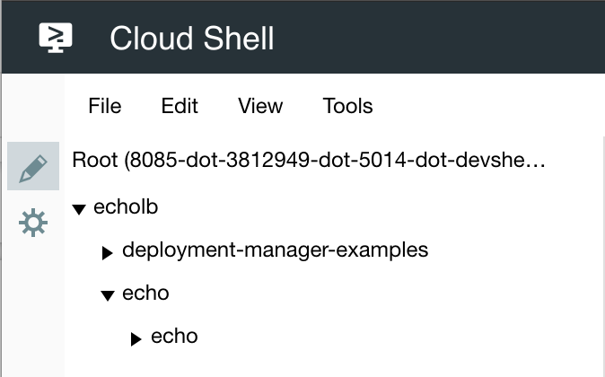
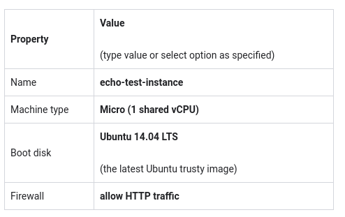
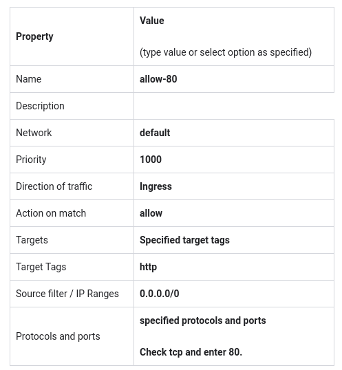

# Deployment Manager: Package and deploy

~1 hour 30 minutes

## Overview

In this lab you will...

1. Develop a service using a pre-written Python application called "Echo" and example Deployment Manager templates written in YAML and JINJA2.

2. Create a deployment package suitable for Deployment Manager using the python package manager, pip.

3. Stage your package in a Cloud Storage bucket.

4. Manually test the application to ensure that it is working properly.

5. Use Deployment Manager to deploy the Echo service.

6. Test the new service.

### Objectives

In the previous lab you created a Deployment Manager template that provided infrastructure consisting of a single virtual machine.

In this lab, you will learn how to perform the following tasks:

* Develop and deploy a service, including the application and not just the infrastructure.

* Learn more advanced Deployment Manager template techniques.

* Create a deployable package using pip.

* Follow best practices for testing an application prior to deploying it and after it is deployed.


## Creating the application infrastructure in Deployment Manager

In this class you have been introduced to a photo application ("thumbnail application"). The application development team has informed you that the application will be written in Python. During a team meeting they have agreed to a specific directory structure. When the application is ready it will be provided in the ~/echolb/echo/echo directory. You will create the deployment manager templates in the `~/echolb/deployment-manager-examples` directory. Here is an image of that structure:




## Create the directory structure for the deployment

In this lab you will create a Deployment Manager template that provides infrastructure to host a Python application.

In Cloudshell, create the directory structure.

```shell
mkdir ~/echolb
mkdir ~/echolb/deployment-manager-examples
mkdir ~/echolb/echo
mkdir ~/echolb/echo/echo
```

## About the photo application

The development team sent the following email:

> Greetings!
> 
> The photo application test/alpha version is behind schedule. Please create the deployment manager template infrastructure using the sample application provided. It is called Echo.
> 
> Requirements:
> 
> The application in development only runs on Ubuntu OS.
> 
> It is tested to work only on Ubuntu 14.04 LTS amd64
> 
> The application requires flask and gunicorn frameworks.
> 
> Please create a sample production server using deployment manager templates. Make sure that it loads and runs the Python application.
> 
> Thanks!
> 
> App Dev Team

Open Cloudshell


## Write the python application

Echo is a simple socket application that receives an HTTP request and replies with the hostname of the server where it is running. You don't actually have to write the application yourself. That has already been done for you. Just create the application files using the code below.

> The echo application consists of the following files:
> 
> * `__init__.py`
> * default.cfg
> * setup.py
> * LICENSE.txt
> * MANIFEST.in


Using the Cloud Shell Code Editor, create the file `__init__.py` in `~/echolb/echo/echo/__init__.py`

Note: This file has a special reserved name. It is "`underbar-underbar-init-underbar-underbar.py`"

### `__init__.py`

```python
#!/usr/bin/env python
import logging
import socket
import os.path
import pkg_resources
from flask import Flask, request
app = Flask(__name__)
try:
    __version__ = pkg_resources.require("echo")[0].version
except pkg_resources.DistributionNotFound:
    __version__ = 'dev'
except:
    raise
# Load Conf
app.config.from_pyfile('default.cfg')
if os.path.isfile('/etc/echo.cfg'):
    app.config.from_pyfile('/etc/echo.cfg')
@app.route('/', methods=['POST', 'PUT'])
def echo():
    """Echo data"""
    return request.get_data() + '\n'
@app.route('/', methods=['GET'])
def whoami():
    """Echo hostname and version"""
    return '''<body style="background: {};">
    hostname: {}
</body>
'''.format(app.config['BACKGROUND'], socket.gethostname())
@app.errorhandler(500)
def server_error(e):
    logging.exception('An error occurred during a request.')
    return """
    An internal error occurred: <pre>{}</pre>
    See logs for full stacktrace.
    """.format(e), 500
if __name__ == '__main__':
    # This is used when running locally. Gunicorn is used to run the
    # application on Google App Engine. See entrypoint in app.yaml.
    app.run(host=app.config['HOST'],
            port=app.config['PORT'],
            debug=True)
# [END app]
```

Examine the python application. In the section with `#Load Conf` it loads default settings from a configuration file in the same directory.

Using the Cloud Shell Code Editor, create the `default.cfg` file in `~/echolb/echo/echo/`

### `default.cfg`

```shell
HOST='0.0.0.0'
PORT=80
BACKGROUND='#F6F6F6'
```

This file starts the service on port 80, HTTP, and gives the server home page a slightly gray background color.

## Prepare files for the Python package manager (PIP)

The Echo application has dependencies. One is a microframework called 'Flask' ( http://flask.pocoo.org/) and another is a python HTTP Web Server Gateway Interface (WSGI) called gunicorn ( http://gunicorn.org/). Create the following files in the ~/echolb/echo directory.

Using the Cloud Shell Code Editor, create setup.py in `~/echolb/echo/setup.py`

### `setup.py`

```python
from setuptools import setup

setup(
    name="echo",
    version="0.0.1",
    author="Google Cloud Training",
    author_email="cloud-training@google.com",

    # Packages
    packages=["echo"],

    # Include additional files into the package
    include_package_data=True,

    # Details
    #url="http://pypi.python.org/pypi/MyApplication_v010/",

    license="LICENSE.txt",
    # description="Useful towel-related stuff.",

    # long_description=open("README.txt").read(),

    # Dependent packages (distributions)
    install_requires=[
        "flask==0.12.2",
        "gunicorn"
    ]
)
```

Notice that the setup file references a license file called `LICENSE.txt` Create that file in the same directory.

Using the Cloud Shell Code Editor, create `LICENSE.txt` in `~/echolb/echo/LICENSE.txt`

### `LICENSE.txt`

```txt
Copyright 2017 Google Inc. All Rights Reserved.

Licensed under the Apache License, Version 2.0 (the "License");
you may not use this file except in compliance with the License.
You may obtain a copy of the License at

    http://www.apache.org/licenses/LICENSE-2.0

Unless required by applicable law or agreed to in writing, software
distributed under the License is distributed on an "AS IS" BASIS,
WITHOUT WARRANTIES OR CONDITIONS OF ANY KIND, either express or implied.
See the License for the specific language governing permissions and
limitations under the License
```

Using the Cloud Shell Code Editor, create `MANIFEST.in` in `~/echolb/echo/`

### `MANIFEST.in`

```shell
recursive-include echo/templates *
include echo/default.cfg
```

## Create the Deployment Manager template

This is a more sophisticated Deployment Manager template than in the previous lab. In that lab everything was contained in the single YAML configuration file. In this lab the template is made up of several files that serve different purposes.

Deployment Manager recursively expands files identified in the imports: section. After the template file has been imported, you can use it in the same way as a resource type. For example, instance.jinja is imported, and then in the resources: section it is given as a type for an entity named instance.

You can learn more about using multiple templates here:

https://cloud.google.com/deployment-manager/docs/step-by-step-guide/using-multiple-templates

Using the Cloud Shell Code Editor, create the `config.yaml` file in `~/echolb/deployment-manager-examples/`

### `config.yaml`

```yaml
imports:
  - path: instance.jinja
  - path: install-echo.sh
    name: startup-script
resources:
  - name: instance
    type: instance.jinja
    properties:
      zone: [ZONE]
      tags:
        - http
      metadata:
        - key: echo
          value: https://storage.googleapis.com/[BUCKET]/echo-0.0.1.tar.gz
```

The zone: property should look familiar. However, the instance has some new properties that you have not used in a template before. tags: - http means that a tag will be applied to the instance so that a firewall rule can be applied to it to allow web traffic.

Your current file structure should look like this:

```shell
google5470003_student@cloudshell:~$ tree echolb/
echolb/
├── deployment-manager-examples
│   └── config.yaml
└── echo
    ├── echo
    │   ├── default.cfg
    │   └── __init__.py
    ├── LICENSE.txt
    ├── MANIFEST.in
    └── setup.py
```

You may recall from the Architecting GCP: Infrastructure class that an instance can receive a startup script during the boot process. The metadata name that tells GCP to load and execute a startup script is startup-script. And it appears the script is called `nstall-echo.sh`.

Another metadata key:value pair is specified, with the key of echo and the value pointed at a bucket. This is where the application is going to go that will be loaded onto the instance during boot. In a subsequent step you will use the Python package manager PIP to generate the `echo-0.0.1.tar.gz` file and you will store it in a bucket that you will create.

Putting all this together: When the instance is started, it will be passed a startup-script called `install-echo.sh`. that script will use the keyword echo to locate the path to the packaged python application stored in a bucket in Cloud Storage, and will download it to the instance.

You will need to edit this file in a later step and customize [ZONE] and [BUCKET].

## Create the startup script

The startup script is a bash script. It installs the latest version of the python-pip package manager. Then it uses pip to install the web server gateway gunicorn. And it tells gunicorn to host an app called echo.

Using the Cloud Shell Code Editor, create the `install-echo.sh` file in `~/echolb/deployment-manager-examples/`

### `install-echo.sh`

```shell
#!/bin/bash -e

ATTR=http://metadata.google.internal/computeMetadata/v1/instance/attributes

apt-get update
apt-get -y install python-pip
python -m pip install --upgrade pip

if pkg=$(curl -sf "${ATTR}/echo" -H "Metadata-Flavor: Google"); then
    python -m pip install $pkg
    gunicorn -b 0.0.0.0:80 -w 4 echo:app
fi
```

## Create the JINJA2 instance template

Immediately looking at this template you can see that it is much more sophisticated than the instance template you created in the previous lab. However, everything in it is also familiar. The type: compute.v1.instance is identical to the one you created. The name, however, is being passed from the environment, and the zone is being inherited from the zone property in the YAML file that imports this file.

Using the Cloud Shell Code Editor, create the `instance.jinja` file in `~/echolb/deployment-manager-examples/`

### `instance.jinja`

```yaml
{#
Copyright 2017 Google Inc.

Licensed under the Apache License, Version 2.0 (the "License");
you may not use this file except in compliance with the License.
You may obtain a copy of the License at

    http://www.apache.org/licenses/LICENSE-2.0

Unless required by applicable law or agreed to in writing, software
distributed under the License is distributed on an "AS IS" BASIS,
WITHOUT WARRANTIES OR CONDITIONS OF ANY KIND, either express or implied.
See the License for the specific language governing permissions and
limitations under the License.
#}

resources:
- name: {{ env['deployment'] }}
  type: compute.v1.instance
  properties:
    zone: {{ properties['zone'] }}
    machineType: zones/{{ properties['zone'] }}/machineTypes/{{ properties['machineType'] }}
    metadata:
      items:
        - key: deployment
          value: {{ env['deployment'] }}
        
        - key: startup-script
          value: |
            {{ imports['startup-script']|indent(12) }}
        
        
        - {{ i }}
        
    disks:
      - deviceName: boot
        boot: true
        autoDelete: true
        initializeParams:
          diskSizeGb: 10
          sourceImage: {{ properties['sourceImage'] }}
    networkInterfaces:
      - name: {{ ID }}-eth0
        network: {{ properties['network'] }}
        
        subnetwork: {{ properties['subnet'] }}
        
        accessConfigs:
          - name: eth0
            type: ONE_TO_ONE_NAT
    serviceAccounts:
      - email: {{ properties['serviceAccount'] }}
        scopes:
          - 'https://www.googleapis.com/auth/cloud-platform'
    
    tags:
      items:
        
        - {{ i }}
        
    

outputs:
  - name: url
    value: http://$(ref.{{ env['deployment'] }}.networkInterfaces[0].accessConfigs[0].natIP)
```

This section uses a JINJA2 conditional to associate the startup-script keyword with the path to the script. It says "if there is a startup script, make the key:value pair" for the server metadata.

**Example (don't copy)**

```shell
 
        - key: startup-script
          value: |
            {{ imports['startup-script']|indent(12) }}
```

And this section uses a JINJA2 loop to iterate over multiple tags, if there were several of them.

**Example (don't copy)**

```yaml
tags:
      items:
        
        - {{ i }}
        
```

You have seen JINJA2 comments illustrated in the license at the top of the file, variables passed from the environment, variables inherited from the calling template, if-endif conditionals, and for-loops. Of course you will want to study JINJA2 in more detail as you develop your own templates, but the basics of the language are illustrated for you in this template.


Your current file structure should look like this:

```shell
google5470003_student@cloudshell:~$ tree echolb/
echolb/
├── deployment-manager-examples
│   ├── config.yaml
│   ├── install-echo.sh
│   └── instance.jinja
└── echo
    ├── echo
    │   ├── default.cfg
    │   └── __init__.py
    ├── LICENSE.txt
    ├── MANIFEST.in
    └── setup.py
```

## Create the schema file

What in the world is a schema file? Well, imagine that you are working in a large IT organization where there are dozens of people working on Deployment Manager templates. You would want to develop a library of reusable templates. For example, the instance.jinja template is quite sophisticated. Why not develop and debug that template once, and then use it whenever an instance is needed. No one would need to write their own instance template.

The main value of the schema is it tells users of your template how they can interact with it. The schema defines a set of rules that the configuration file (the YAML file) must meet if it wants to use the template. And Deployment Manager checks and enforces those rules.

This way the user of a template doesn't have to read through and study all the properties in the template. They just need to read through the schema. So you can think of it as the template's API.

Using the Cloud Shell Code Editor, create the `instance.jinja.schema` file in `~/echolb/deployment-manager-examples/`

### `instance.jinja.schema`

```yaml
info:
  title: Test instance
  author: cloud-training@google.com
  description: |
    Creates a test instance
  version: 0.1
imports:
  - path: instance.jinja
required:
  - zone
properties:
  zone:
    type: string
    description: i.e. us-east1-d

  network:
    type: string
    description: Network URL i.e. projects/project/global/networks/network
    default: global/networks/default
  subnet:
    type: string
    description: Subnet URL i.e regions/region/subnetworks/subnetwork
  sourceImage:
    type: string
    description: Image uri
    default: projects/ubuntu-os-cloud/global/images/family/ubuntu-1404-lts

  machineType:
    type: string
    default: n1-standard-1

  serviceAccount:
    type: string
    description: Service account with permissions to label resources i.e. Project editor.
    default: default
  tags:
    type: array
    description: Array of tags
    items:
      type: string
  metadata:
    type: array
    description: Array of metadata key pairs
    items:
      type: object
      required:
        - key
        - value
      properties:
        key:
          type: string
        value:
          type: string
```


Your current file structure should look like this:

```shell
google5470003_student@cloudshell:~$ tree echolb/
echolb/
├── deployment-manager-examples
│   ├── config.yaml
│   ├── install-echo.sh
│   ├── instance.jinja
│   └── instance.jinja.schema
└── echo
    ├── echo
    │   ├── default.cfg
    │   └── __init__.py
    ├── LICENSE.txt
    ├── MANIFEST.in
    └── setup.py
```


## Create the package

Use the Python package manager to create a distribution package that will be used by Deployment Manager to upload the application to instances.

### Examine the setup instructions

View the contents of setup.py in the `~/echolb/echo` directory

The setup is going to create a package called 'Echo' that will include some dependencies. One is a microframework called 'Flask' ( http://flask.pocoo.org/) and another is a python HTTP Web Server Gateway Interface (WSGI) called gunicorn ( http://gunicorn.org/).

### Create the package

In Cloud Shell Command Line, create the python source distribution package.

```shell
cd ~/echolb/echo
python setup.py sdist
cd dist
ls
```


Your current file structure should look like this:

```shell
google5470003_student@cloudshell:~$ tree echolb/
echolb/
├── deployment-manager-examples
│   ├── config.yaml
│   ├── install-echo.sh
│   ├── instance.jinja
│   └── instance.jinja.schema
└── echo
    ├── dist
    │   └── echo-0.0.1.tar.gz
    ├── echo
    │   ├── default.cfg
    │   └── __init__.py
    ├── echo.egg-info
    │   ├── dependency_links.txt
    │   ├── PKG-INFO
    │   ├── requires.txt
    │   ├── SOURCES.txt
    │   └── top_level.txt
    ├── LICENSE.txt
    ├── MANIFEST.in
    └── setup.py
```

## Host the distribution package in a bucket

In the previous section, you created a Python package. In this section you create the storage bucket you'll use to store that package. Deployment Manager will load the application file from this storage bucket.

### Create a bucket

Create a uniquely named multiregional bucket in Console in a region of your choice.

On the Navigation menu, click Storage > Browser, and click Create Bucket.

### Upload the file to the bucket

The command below will set access control to 'public-read'.

It will set header information to identify the file as a gzip archive.

It will set the cache control to private.

Enter the following command in Cloud Shell Command Line using your bucket name.

```shell
MY_BUCKET=<bucket>

gsutil -h 'Content-Type: application/gzip' -h 'Cache-Control:private' cp -a public-read echo-0.0.1.tar.gz gs://$MY_BUCKET
```

> Note: BEST PRACTICE
> 
> Setting cache control to private in the header is a development best practice. It declares that the item can be cached for a single user, in a browser for example, but that it is not to be publicly cached as in a Content Delivery Network (CDN).
> 
> If you developed the application in a non-cached environment, then deployed it in a cached environment, and tried to update it -- the cache might cause it not to update. Troubleshooting this is very difficult. Therefore it is a best practice to always specify no cache.
> 
> For an interesting review of development caching best practices, see this article: https://developers.google.com/web/fundamentals/performance/optimizing-content-efficiency/http-caching

You can verify access control and header information in Console or using the following gsutil command:

Verify the object properties in Cloud Shell Command Line using your bucket name.

`gsutil ls -L gs://$MY_BUCKET/echo-0.0.1.tar.gz`

**Example Output of Command (don't copy)**

```shell
gs://<bucket>/echo-0.0.1.tar.gz:
    Creation time:          Sun, 20 Aug 2017 13:39:20 GMT
    Update time:            Sun, 20 Aug 2017 13:39:20 GMT
    Storage class:          MULTI_REGIONAL
    Cache-Control:          private
    Content-Length:         1892
    Content-Type:           application/gzip
    Hash (crc32c):          LlzsgA==
    Hash (md5):             76Wbwt1UAT6fjGH+YWeCAA==
    ETag:                   CPONiur35dUCEAE=
    Generation:             1503236360144627
    Metageneration:         1
    ACL:                    [
  {
    "email": "username@mycompany.com",
    "entity": "user-username@google.com",
    "role": "OWNER"
  },
  {
    "entity": "allUsers",
    "role": "READER"
  }
]
```

## Test the Echo application

Before deploying the Echo service to production, you will manually test it on a single instance.

### Start a minimal VM in Compute Engine

Click on the Console tab.

On the Navigation menu, click Compute Engine > VM Instance, and click Create.

> Note: You must use Ubuntu for the test VM or the application will fail.

In the Create an instance page, specify the following:




Leave the remaining settings as their defaults, and click Create.

### Prepare the environment

When the VM is operational, SSH to the instance using the link in Console.

Python package manager may not be installed.

Using the SSH terminal enter the following on the test VM to install pip:

```shell
sudo apt-get update
sudo apt-get -y install python-pip
```

Using the SSH terminal enter the following on the test VM to upgrade pip to the latest version:

```shell
sudo python -m pip install --upgrade pip
```

### Install the package

Using the SSH terminal on the test VM, enter the following command to use the Python package installer to install the application. Use your bucket name. Note the prior use of the environment variable $MY_BUCKET will not yet work here because you are connected to a different VM instance with its own shell environment variables. We therefore need to set the value again within this shell. This illustrates best practices of using environment variables in our commands instead of hardcoding values.

```shell
MY_BUCKET=<bucket>

sudo python -m pip install http://storage.googleapis.com/$MY_BUCKET/echo-0.0.1.tar.gz
```

### Run the application

The dependencies, flask and gunicorn should have been installed. Start the application on port 80.

Enter the following on the test VM from the SSH terminal.

`sudo gunicorn -b 0.0.0.0:80 -w 4 echo:app`

### Verify that the service is working

When you browse to the External IP address of the VM, Echo should respond with a server ID. It should look something like this:

**Example (don't copy)**

`hostname: echo-test-instance`


## Configure the template

You have manually tested the application and verified that it is working. Before you can deploy the service with Deployment Manager, you will have to make some configuration changes in the config.yaml file.

### Tailor the configuration file

You will need to choose a zone for this deployment.

You can find the list of zones from the Cloud Shell Command Line by entering the following:

`gcloud compute zones list`

Use Cloud Shell Code Editor to edit `config.yaml` and replace [ZONE] with a zone of your choosing.

Using Cloud Shell Code Editor, replace [BUCKET] with your bucket name.

#### `config.yaml`

```yaml
imports:
  - path: instance.jinja
  - path: install-echo.sh
    name: startup-script
resources:
  - name: instance
    type: instance.jinja
    properties:
      zone: [ZONE]
      tags:
        - http
      metadata:
        - key: echo
          value: https://storage.googleapis.com/[BUCKET]/echo-0.0.1.tar.gz
```

## Deploy the service

You are ready to deploy the Echo service.

Enter the following commands from the Cloud Shell Command Line.

```shell
cd ~/echolb/deployment-manager-examples

gcloud deployment-manager deployments create echo-service --config config.yaml
```

You should see a message that the deployment was successfully completed.

> Remember that if an Error occurs during the deployment, you may need to use Console to locate the Deployment and delete it. This will clean up any artifacts that were created prior to the error.

### Allow traffic to the service

1. Create a firewall rule to allow tcp:80 traffic to the test server.
2. On the Navigation menu, click VPC Network > Firewall rules
3. Click on Create Firewall Rule and specify the following:





Click Create.

> Alternatively you could have configured this firewall rule to target all instances in the network. However to dynamically control your firewall security, a better practice is to configure the firewall rule to target specific servers using tags, such as is done here using the http tag.
> 
> Another thing to consider is whether you want the firewall rule to be set manually (as is done here) or created by the template. For disaster recovery, maybe you want it to allow traffic as soon as possible. Or perhaps you want to test the service before opening the gates to the users. You decide.

## Verify the launch

The deployment was successfully completed. But you need to test the service to verify that the application is operating.

1. On the Navigation menu, click Compute Engine > VM Instances

2. Get the external IP of the echo-service instance.

3. On the Navigation menu, click VPC Networks > Firewall rules

4. Verify that the allow-80 firewall rule is operational.

5. Enter the external IP of echo-service into a browser. You should see the hostname.

`hostname: echo-service`

> Note: The hostname will be significant in the next lab. In that lab you will make the solution scalable by adding multiple servers behind a load balancer.

## Verify that the echo application is working

Enter the following into the Cloud Shell Command Line, using the External IP of the echo-service VM

`curl -d "Design and Process class ROCKS" -X POST http://[EXTERNAL_IP]/`

> CONGRATULATIONS!
> 
> This lab is a significant accomplishment.
> 
> Using Deployment Manager templates, including JINJA2 templates, you created a virtual machine that loads a python application and dependencies and boots up and configures itself to run a service.

