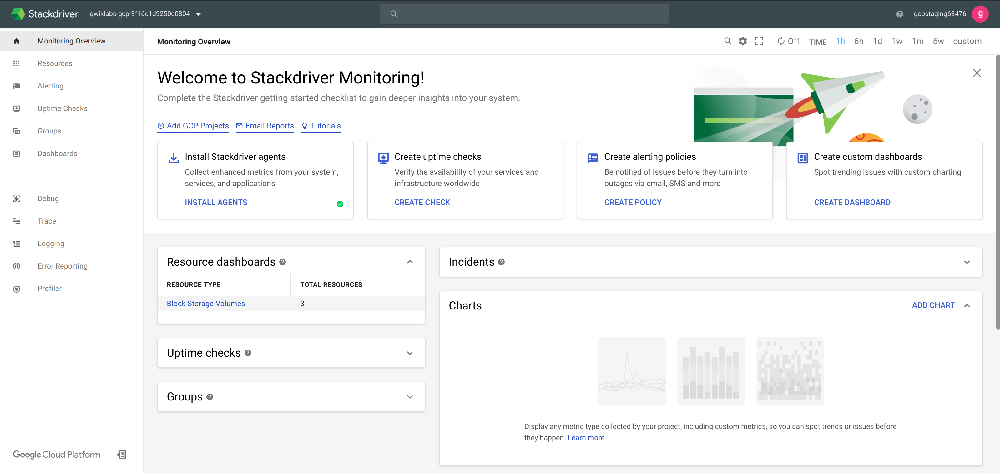
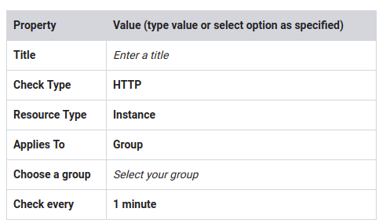

# Resource Monitoring (Stackdriver)

~ 1 hour 30 minutes

## Overview

In this lab, you learn how to use Stackdriver Monitoring to gain insight into applications that run on Google Cloud Platform.

### Objectives

In this lab, you learn how to perform the following tasks:

* Enable Stackdriver Monitoring
* Add charts to dashboards
* Create alerts with multiple conditions
* Create resource groups
* Create uptime checks

## Task 1: Create a Stackdriver account

Verify resources to monitor
Three VM instances have been created for you that you will monitor.

1. In the GCP Console, on the Navigation menu (Navigation menu), click Compute Engine > VM instances. Notice the nginxstack-1, nginxstack-2 and nginxstack-3 instances.

### Launch Stackdriver Monitoring

To use Stackdriver Monitoring with your project, do the following:

1. In the GCP Console, on the Navigation menu (7a91d354499ac9f1.png), click Monitoring.
2. If prompted, click Log in with Google and select the qwiklabs-generated student account to log in.

> Note: If you are prompted to Create workspace, follow these steps:
> 
> 1. Click Create workspace
> 2. Click Continue
> 3. Click Skip AWS Setup
> 4. Click Continue.
> 5. Select No reports, and then click Continue
> 6. Click Launch monitoring
> 7. If prompted, click Continue with the trial

Stackdriver will create a new workspace for your project and will collect data for your workspace. You might have to wait for 2 to 3 minutes to see Stackdriver Monitoring welcome page. The information on this page depends on the resources that you are monitoring.

## Task 2: Custom dashboards

### Create a dashboard

1. In the left pane, click Dashboards > Create Dashboard.

2. Click Untitled Dashboard, type My Dashboard, and press ENTER.

### Add a chart

1. Click Add Chart.
2. For Title, give your chart a name (you can revise this before you save based on the selections you make).
3. For Find resource type and metric, select GCE VM Instance.
4. For Metrics, select a metric to chart for the Instance resource, such as CPU utilization or Network traffic.

> Note: If you are getting a 'loading failed' error message, you might have to refresh the page.

5. Click Filter and explore the various options.

6. Click View Options and explore adding a Threshold or changing the Chart mode.

7. Click Save to add the chart to your dashboard.

### Metrics Explorer

The Metrics Explorer allows you to examine resources and metrics without having to create a chart on a dashboard. Try to recreate the chart you just created using the Metrics Explorer.

1. In the left pane, click Resources > Metrics Explorer.
2. For Find resource type and metric, type a metric or resource name.
3. Explore the various options and try to recreate the chart you created earlier.

> Not all metrics are currently available on the Metrics Explorer, so you might not be able to find the exact metric you used on the previous step.

## Task 3: Alerting policies

### Create an alert and add the first condition

1. In the left pane, click Alerting > Create a Policy.
2. Click Add Condition.
3. For Find resource type and metric, select GCE VM Instance.

> If you cannot locate the GCE VM Instance resource type, you might have to refresh the page.

4. Select a metric you are interested in evaluating, such as CPU usage or CPU Utilization.

5. For Condition, select is above.

6. Specify the threshold value and for how long the metric must cross this set value before the alert is triggered. For example, for THRESHOLD, type 20 and set FOR to 1 minute.

7. Click Save.

### Add a second condition

1. Click Add Condition.

2. Repeat the steps above to specify the second condition for this policy. For example, repeat the condition for a different instance. Click Save.

3. In Policy Triggers, for Trigger when, click All conditions are met.

### Configure notifications and finish the alerting policy

1. In Notifications section, select Email for Notification Channel Type.
2. Enter an email address.
3. Then click Add Notification Channel.
4. Skip the Documentation step.
5. For Name this policy, type a name for the policy.

> Policy names are used as subjects in notification emails, so use that to your advantage.

6. Click Save.

Click Check my progress to verify the objective.

Create alerting policies

## Task 4: Resource groups

1. In the left pane, click Groups > Create Group.

2. Enter a name for the group. For example: VM instances

3. Select Name in the dropdown populated with Name.

4. Type nginx in the filter field next to Contains.

5. Click Save Group.

6. Review the dashboard Stackdriver created for your group.

## Task 5: Uptime monitoring

1. In the Group Dashboard from the previous task, for Uptime Checks, click Uptime Checks Overview to navigate to the Uptime Checks page.
2. Click Add Uptime Check.
3. Specify the following, and leave the remaining settings as their defaults:

4. Click Save.
> If the Save button is grayed out, you might have to refresh the page.

5. Click No thanks.

Click Check my progress to verify the objective.

Create uptime monitoring

## Task 6: Review

In this lab, you learned how to:

* Monitor your projects
* Create a Stackdriver Workspace
* Create alerts with multiple conditions
* Add charts to dashboards
* Create resource groups
* Create uptime checks for your services
